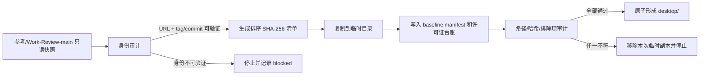

# 冻结 Work Review 来源并建立正式产品源码副本技术方案

> 对应功能：步骤 1：冻结 Work Review 来源并建立正式产品源码副本（dispatch_id=aich8-zhuochong-desktop-pet-rag-27-steps-20260805-task-01）  
> 方案阶段：LOOF phase 1（仅方案设计，不实施）  
> 设计日期：2026-08-05 22:22（Asia/Shanghai）  
> 需求依据：`kaifa/最终需求文档.md` v0.3.1、`kaifa/桌宠助手逐步骤编程实现计划.md` 步骤 1

## 0. 方案设计原则（自检清单）

- 只建立一个正式实现目录 `desktop/`；`参考/Work-Review-main/` 始终是只读输入，后续微信回复和 RAG 均在 `desktop/` 内开发。
- 冻结的对象是“可复核的上游身份 + 本地快照的逐文件哈希”，而不是“当前最新版本”或父仓库提交。
- 当前参考目录没有自己的 `.git`，其 `git rev-parse --show-toplevel` 指向产品根目录；因此产品父仓库的 `700206b…` 不得记为 Work Review 上游 commit。
- 复制保留 Work Review 完整工程、锁文件、CI、测试、文档、许可证和第三方声明；只排除 Git 元数据、构建/依赖缓存、运行时数据和本地敏感配置。
- 本步骤不改 Work Review 业务代码、不接入微信/OCR/RAG、不替换品牌或图标；这些由后续步骤处理。

## 1. 背景与目标

### 1.1 现状与事实

- 正式产品已确认以 Work Review 的 Tauri 2 + Rust + Svelte 工程为唯一底座，不能另建 Python 壳或第二套桌宠运行时。
- 当前输入为 `参考/Work-Review-main/`：`package.json` 与 `src-tauri/tauri.conf.json` 都声明版本 `1.1.0`，目录含 `Cargo.lock`、`package-lock.json`、`.github/`、测试、`LICENSE` 和 `THIRD_PARTY_NOTICES.md`。
- README 指向上游 `https://github.com/wm94i/Work-Review`；但本地参考快照无独立 Git 元数据，所以上游 tag/commit 尚未由本地副本证明。
- `desktop/` 目前不存在；根目录的私有聊天导出和其他 `参考/` 工程均不可复制进正式产品。

### 1.2 可验收目标

1. `desktop/` 成为一份完整且可定位到冻结上游身份的 Work Review 副本，不是新建空壳或只抽取部分模块。
2. `desktop/docs/baselines/work-review-source.json` 中有来源 URL、版本、冻结时间、获取方式、可验证 tag/commit、哈希算法、排除规则和按相对路径排序的文件清单；每项含 SHA-256。
3. 复制后的受控文件集与 manifest 逐项路径、大小和 SHA-256 一致；保留 `Cargo.lock`、`package-lock.json`、`.github/workflows/`、`src/`、`src-tauri/`、`crates/`、测试、文档和许可文件。
4. `desktop/` 中不存在 `.git`、`node_modules`、`target`、`dist`、`.env*`、私有聊天目录、人物参考、`参考/` 嵌套目录、VPet 程序集（`.dll`）或其他参考工程。
5. MIT 文本和现有 BongoCat 第三方声明随副本保留；资产和第三方义务有可继续维护的台账。

## 2. 核心业务流程与边界

### 2.1 冻结与复制流程



### 2.2 正常流程

1. 实施者确认工作区状态，且 `desktop/` 不存在；若已存在，不覆盖、不合并，转异常流程。
2. 以 README 已声明的上游 URL 为候选，查询上游 tag 与 commit；将版本 `1.1.0`、选定 tag、40 位 commit、抓取时间和查询方式写入审计记录。tag 必须解析到同一 commit；无法证明时不得进入复制。
3. 在只读参考目录上生成 snapshot manifest：遍历普通文件，使用 POSIX 相对路径字典序排序，计算字节数和 SHA-256；清单生成前应用固定排除规则。
4. 用临时同级目录复制受控文件集，再在其中创建 `docs/baselines/`；不得对 `参考/` 执行格式化、迁移、安装、构建或发布命令。
5. 写入来源 manifest、补丁/参考台账和资产/第三方台账；将完成的临时目录改名为 `desktop/`。
6. 对 `desktop/` 重新计算受控文件集并与源 manifest 比对，再做禁止路径和许可证检查；只有全部通过才将本步骤标为完成。

### 2.3 异常与补偿流程

| 情况 | 处理 | 结果 |
| --- | --- | --- |
| 参考目录无独立 Git（当前事实） | 不读取父仓库 commit；用上游 tag/commit 查询补足身份 | 查询成功继续；失败 blocked |
| 版本 `1.1.0` 无法唯一映射上游 tag/commit | 不以版本号猜测 commit，不复制为“冻结基线” | blocked，并记录 URL、查询时间和原因 |
| `desktop/` 已存在 | 先比对既有 manifest 与目标来源；本步骤不得覆盖或合并 | 不匹配/无 manifest 则 blocked；匹配时仅复核后完成 |
| 复制或审计失败 | 删除仅由本次创建的临时目录，不触碰现有 `desktop/` 或参考目录 | 不产生半成品目标目录 |
| 发现私有数据、缓存、密钥或嵌套参考工程 | 从临时副本移除并重新审计；规则无法覆盖时停止 | 只有零命中才能完成 |
| 许可或资产来源无法证明 | 保留原上游文件和待核对条目，禁止把该资产宣称为自有/已授权 | 本步骤可完成复制，但该条目成为后续发行阻断项 |

### 2.4 功能边界

- 本步骤不运行产品、测试、构建或依赖安装；修改前回归验证属于步骤 2。
- 不替换 `tauri.conf.json` 中产品名、更新端点、签名、图标或 bundle identifier；品牌和发行适配属于步骤 3。
- 不复制 `参考/VPet-main`、`参考/Umi-OCR-main` 或 `参考/Open-LLM-VTuber-main` 的代码、运行时或素材；只在台账记录“本步骤无复制”。
- 不将 `/微信聊天记录知识库/liaotian/`、`人物角色参考/`、真实聊天内容、密钥或本机运行数据写入 `desktop/`、manifest 或 Git。

## 3. 数据模型设计

本步骤不引入数据库。仅新增可审计的版本化文本/JSON 元数据，均位于 `desktop/docs/baselines/`。

### 3.1 `work-review-source.json` 契约

```json
{
  "schema_version": 1,
  "source": {
    "upstream_url": "https://github.com/wm94i/Work-Review",
    "declared_version": "1.1.0",
    "resolved_tag": "v<resolved-version>",
    "resolved_commit": "<40-hex-sha>",
    "identity_evidence": "git ls-remote --tags --refs ...",
    "local_git_metadata": false,
    "captured_at": "<RFC3339 UTC>",
    "acquisition_method": "local reference snapshot verified against upstream tag"
  },
  "snapshot": {
    "hash_algorithm": "sha256",
    "path_order": "POSIX bytewise ascending",
    "files": [
      {"path": "package.json", "bytes": 0, "sha256": "<64-hex>"}
    ]
  },
  "exclusions": [".git/**", "node_modules/**", "dist/**", "target/**", ".env*", "runtime-data/**"],
  "verification": {"source_file_count": 0, "source_total_bytes": 0}
}
```

实现时填入真实数值；禁止将示例占位符、父仓库 SHA 或私有绝对路径写入正式 manifest。生成本 manifest 后，目标的 `docs/baselines/` 新增文件不属于上游快照文件集，校验时须显式作为“产品基线元数据”排除，而不能伪装成源文件。

### 3.2 补丁/参考台账

新增 `desktop/docs/baselines/reference-ledger.md`，至少含下表。首条明确 Work Review 是完整复制底座；VPet、Umi-OCR、Open-LLM-VTuber 均为“本步骤未复制”。

| 字段 | 规则 |
| --- | --- |
| 参考对象与来源 URL | 记录具体项目，不写模糊“网上参考” |
| 上游 tag/commit、原文件 | 复制代码时必填；未复制填“不适用” |
| 参考行为/用途 | 与后续 FR/AC 的关联；本步骤只写底座和许可核对 |
| 复制结论与产品修改位置 | 本步骤为完整 Work Review 副本，尚无产品业务修改 |
| 修改声明、冲突风险、升级策略 | 后续补丁必须追加，不覆盖冻结记录 |

### 3.3 第三方与资产台账

新增 `desktop/docs/baselines/third-party-assets.md`。列出 `LICENSE`（MIT，copyright `wm94i`）和 `THIRD_PARTY_NOTICES.md` 的 BongoCat MIT 归属；对现有 PNG、SVG、图标、字体、动画、Logo 逐类或逐文件记录来源位置、权利人/上游、适用许可证、是否已有商业授权证据、发行状态。未知项标为 `pending-verification`，不得填写为已授权。

## 4. 接口定义（实施契约）

本步骤不新增运行时 API，只定义可由脚本或人工审计执行的三个本地契约：

| 契约 | 输入 | 成功输出 | 失败条件 |
| --- | --- | --- |
| `resolve_source_identity` | 上游 URL、声明版本、参考目录 | 唯一 tag + 40 位 commit + 查询证据 | 参考目录无独立 Git且上游无法唯一解析 |
| `build_snapshot_manifest` | 参考目录、固定排除规则 | 排序后的路径/字节/SHA-256 JSON | 非普通文件无法按规则处理、哈希失败 |
| `verify_product_copy` | manifest、`desktop/` | 逐项一致报告和零条禁止路径报告 | 缺文件、哈希不同、额外受控文件或许可缺失 |

禁止把上述契约暴露为 Tauri 命令、HTTP、MCP 或产品 UI；它们只服务于源码建立阶段。

## 5. 核心逻辑详解

### 5.1 最小实施顺序

1. **来源身份门禁**：检测 `参考/Work-Review-main/.git`。不存在时记录 `local_git_metadata=false`，从 README 的上游 URL 查询对应 tag/commit；绝不回退到父仓库 Git 信息。
2. **固定排除表**：排除 `.git/`、`node_modules/`、`dist/`、各级 `target/`、`.cache/`、`__pycache__/`、`.env`/`.env.*`、私钥/凭据文件、日志、数据库、截图和已识别的运行时数据；`src-tauri/tauri.local.conf.json` 先做内容审计，确认无凭据后随完整工程保留。
3. **清单先行**：对未排除的普通文件生成 manifest；使用稳定排序，哈希内容而非 mtime，记录文件总数和总字节数。
4. **临时复制后提交**：从参考目录复制到仅本次新建的临时同级目录；添加三份 baseline 文档，复算源文件集并比较。成功后才形成 `desktop/`，不得在复制过程中创建可被误用的半成品正式目录。
5. **许可与隔离复核**：检查 `LICENSE`、`THIRD_PARTY_NOTICES.md`、锁文件、CI、源码和测试存在；扫描禁止名称/扩展，确认没有私有目录、嵌套 `参考/`、`.dll` 或 Git 元数据。
6. **可追溯维护**：后续每次从上游升级必须新建 manifest/台账条目和显式 diff；不得原地覆盖这次冻结记录。

### 5.2 伪代码

```text
assert desktop does not exist OR existing manifest proves same frozen snapshot
identity = resolve_upstream_tag_and_commit(readme_upstream_url, declared_version)
if identity is not uniquely verified: stop_blocked()

source_files = sorted(regular_files(reference_root) - exclusions)
manifest = sha256_each(source_files, identity)
copy source_files and required directories to temporary_desktop
write baseline metadata and ledgers to temporary_desktop/docs/baselines
assert compare(source_files, temporary_desktop, manifest) == equal
assert forbidden_paths(temporary_desktop) == empty
assert required_files(temporary_desktop) == present
rename temporary_desktop to desktop
```

### 5.3 关键取舍

- 不用 Git 子模块：当前输入不是带独立 Git 的检出，且产品需要可独立修改的完整副本；manifest 比指向浮动分支更符合可复核要求。
- 不复制父项目提交：它只说明产品仓库状态，不能证明参考快照源自哪个 Work Review 上游版本。
- 不提前清理或重构上游代码：副本的目的首先是保留继承基线；任何品牌/安全/微信改动以后按单独步骤实施并可 diff。

## 6. 非功能性设计

### 6.1 可重复性与完整性

- 同一上游 tag/commit 和同一排除表应生成相同路径/哈希集；manifest 的时间字段不参与文件内容校验。
- 复制后源文件集必须一一对应。新增的 `docs/baselines/` 仅允许列出的三份产品元数据，不得掩盖额外源代码变动。
- 复制以临时目录完成，避免中断留下半成品 `desktop/`；失败清理仅限于本次临时目录。

### 6.2 安全与隐私

- manifest 不写绝对本机路径、聊天正文、密钥内容或用户资料；只保存相对路径、大小、哈希和公开上游身份。
- 对疑似凭据只记录“路径命中/已排除”，不输出其内容。私有聊天目录继续由根 `.gitignore` 隔离，且复制后必须二次扫描。
- `参考/` 只读约定写入 `reference-ledger.md`：禁止对其运行写回型 formatter、migration、install、build、release 命令。

### 6.3 许可与发布风险

- 保留 MIT LICENSE、原版权行和 BongoCat notice；不因改名或复制删除声明。
- 资产台账的 `pending-verification` 是发行阻断信号，不阻碍本步骤创建源码副本，但不得在后续包中无依据发布或宣称商业授权。
- 后续品牌和更新源改动前应审计 `tauri.conf.json` 中 Work Review 标识、签名和 updater 配置，避免误连上游发布通道。

## 7. 测试方案

本步骤不运行应用测试；验证的是复制、来源和许可工件。

| 编号 | 验证 | 预期 |
| --- | --- | --- |
| V1 | 本地 Git 根检查 | 发现参考目录无 `.git` 时，记录该事实且不使用父仓库 SHA |
| V2 | 上游 tag/commit 解析 | `resolved_tag` 对应唯一 40 位 commit；否则阶段 blocked |
| V3 | manifest 稳定性 | 路径严格升序；每个源文件都有 64 位 SHA-256、字节数和无重复路径 |
| V4 | 完整副本 | `package.json`、`Cargo.toml`、锁文件、`.github/`、`src/`、`src-tauri/`、`crates/`、测试、文档、许可证均存在且与 manifest 一致 |
| V5 | 排除审计 | `desktop/` 内无 `.git`、缓存、`.env*`、数据库/截图运行数据、私有聊天目录、人物参考、嵌套 `参考/`、`.dll` |
| V6 | 许可审计 | MIT `LICENSE` 与 `THIRD_PARTY_NOTICES.md` 存在；台账含 BongoCat 和所有发现的资产待核对状态 |
| V7 | 幂等保护 | 已有 `desktop/` 不被覆盖；只有来源和 manifest 相同时才允许复核通过 |

## 8. 附录

### 8.1 本步骤产物清单

```text
desktop/                                  # 完整 Work Review 正式产品副本
desktop/docs/baselines/work-review-source.json
desktop/docs/baselines/reference-ledger.md
desktop/docs/baselines/third-party-assets.md
```

### 8.2 已知前提和阻断条件

- 已确认前提：参考目录声明 Work Review `1.1.0`，README 提供上游 URL，且 `desktop/` 当前不存在。
- 已确认风险：参考目录无独立 Git 元数据；在上游身份未被 tag/commit 证明前，不能声称完成“冻结来源”。
- 非阻断但必须记录：BongoCat 已有 MIT notice；其他素材的可商用证据需要台账逐项核对。

## 9. 代码实施修改顺序

1. 只读审计参考目录、父仓库边界、上游身份、版本和排除候选；验证：不将父仓库 SHA 写入来源记录。
2. 解析并冻结上游 URL、tag、commit；验证：tag 与 commit 可复核，失败则写 blocked 而不复制。
3. 生成排序 SHA-256 source manifest；验证：文件数、总字节数、相对路径和哈希完整。
4. 复制到临时目录并写入三份 baseline 元数据；验证：保留完整工程与许可文件。
5. 比对 manifest、扫描禁止路径并进行许可/资产审计；验证：V3--V7 全部通过。
6. 仅在所有验证通过后形成 `desktop/` 并记录阶段日志；验证：后续步骤可将它作为唯一可修改源码根目录。
