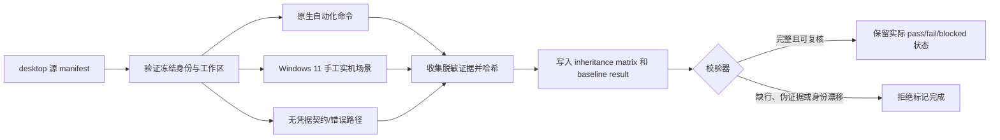

# 建立 Work Review 修改前回归基线与继承矩阵技术方案

> 对应功能：步骤 2：建立 Work Review 修改前回归基线与继承矩阵（dispatch_id=aich8-zhuochong-desktop-pet-rag-27-steps-20260805-task-02）
> 方案阶段：LOOF phase 1（仅方案设计，不实施）
> 设计日期：2026-08-05 23:41（Asia/Shanghai）
> 前置工件：`desktop/`、`desktop/docs/baselines/work-review-source.json`（Work Review v1.1.0，`500f9d2cb3027392cfcc32ad18395dfe348fb4a1`）
> 需求依据：`kaifa/最终需求文档.md` v0.3.1 的 AC-BASE、`kaifa/桌宠助手逐步骤编程实现计划.md` 的步骤 2

## 0. 方案设计原则（自检清单）

- 本步骤只为未改造的 `desktop/` 建立可复跑、可归因的继承基线；不新增微信、OCR、知识库/RAG、桌宠动画或产品运行时代码。
- `参考/Work-Review-main/` 继续只读；一切基线运行和后续改动均只针对步骤 1 已冻结的 `desktop/`。
- 基线矩阵的每一行都必须有“修改前状态”和可定位证据。没有 Windows 实机、权限或真实凭据时只能写 `blocked` / `conditional-pass`，绝不能写成 `pass` 或从矩阵删除。
- 自动化命令、Windows 人工验收、配置/错误路径契约分别记录；不以 macOS 上的构建结果代替 Windows 11 的真实运行结果，也不以源码存在代替功能通过。
- 已知上游失败必须固化为修改前缺陷：不得在后续微信实现后归因给新代码，也不得通过放宽断言、跳过测试或修改上游行为来掩盖。
- 产物只新增基线文档、最小校验脚本和测试说明；不改变 `desktop/` 的业务源码、依赖、构建配置、品牌或发行配置。

## 1. 背景与目标

### 1.1 已确认事实

1. 步骤 1 已将官方 Work Review `v1.1.0` 冻结到 `desktop/`；受控上游文件为 580 个、合计 44,961,912 字节，来源 manifest 已包含逐文件 SHA-256。
2. `desktop/.github/workflows/ci.yml` 的既有门禁是 `node --test`、`npm run build`、`cargo check --workspace --all-targets`、`cargo clippy --workspace --all-targets -- -D warnings` 与 `cargo test --workspace`；本步骤沿用这些原生入口，不新造第二套产品测试框架。
3. 步骤 1 记录的修改前自动化结果是：前端 `479/479` 通过且 Vite 生产构建成功；Rust `cargo check` 与 clippy 通过；`cargo test --workspace` 为 372 通过、1 失败，失败项是 `commands::system::tests::图标解析应忽略与app_name矛盾的executable_path`，实际首位图标为 `None`。
4. 产品的正式验收目标是 Windows 11 x64；本机为 macOS，因此启动、托盘、自启动、前台窗口、Windows OCR、空闲检测、负坐标/多显示器等结果尚不可由本机断言为通过。
5. AC-BASE 要求原有能力在产品派生后仍作为发布门禁，并要求无外部凭据的网络能力保留配置 schema、mock/契约、队列边界和错误路径验收。

### 1.2 可验收目标

1. 新增一份版本化继承矩阵，覆盖 AC-BASE 1--10；每行有唯一 ID、入口、核心文件、数据依赖、修改前证据、后续回归方式、凭据条件、微信/RAG 影响面和发布阻断规则。
2. 新增一份机器可校验的基线结果记录，锁定来源 manifest 身份、执行环境、命令摘要、Windows 实机记录与每个矩阵条目的状态；结果中的证据必须能从相对路径和 SHA-256 复核。
3. 在未改动业务代码的 Windows 11 x64 机器上完成可执行的实机清单；私有截图、活动正文、凭据、模型请求内容和绝对用户路径不得写入仓库证据。
4. 自动化结果、人工结果、无凭据契约结果和既有失败相互独立；任一 `fail` / `blocked` / 未核验的 required 行均使发布门禁保持关闭。
5. 后续步骤只需更新“修改后证据/结果”字段并重跑同一命令或同一场景，不得改写或覆盖本次“修改前”证据。

## 2. 核心流程与边界

### 2.1 基线建立流程



### 2.2 正常流程

1. 先运行现有 `verify_work_review_baseline.py verify`，确认 `desktop/` 仍对应已冻结的来源；来源漂移、受控文件不一致或运行中修改业务文件时停止记录。
2. 创建矩阵与结果模板，固定 `baseline_id`、来源 tag/commit、manifest 哈希、执行时间、Windows 版本、硬件/显示器拓扑、应用版本、Node/Rust 工具链版本和依赖锁文件哈希。
3. 使用现有 CI 同名命令采集前端、构建、Rust check、clippy 和 workspace test 的原始文本摘要；完整原始日志只保留在受控本地证据目录，仓库中只存脱敏摘录、退出码、测试计数、日志 SHA-256 和相对引用。
4. 在指定 Windows 11 x64 环境按矩阵逐项运行：每项记录前置数据、操作、观察、截图/导出文件的脱敏说明、结果、操作者和时间；Windows 权限、WebView2 或显示器条件不满足时记录 `blocked` 与原因。
5. 对依赖 S3/WebDAV、MCP、Bot、Localhost API、联网搜索或真实模型凭据的条目，先验证默认关闭、配置 schema、mock/契约、队列边界及错误处理；真实连通性只有在用户提供明确的测试凭据时追加为 `conditional-pass` 证据。
6. 运行校验器检查矩阵完整性、ID 唯一性、AC-BASE 覆盖、状态枚举、证据相对路径/哈希、来源一致性和已知失败登记；校验通过只表示“基线记录完整”，不把失败功能转为通过。

### 2.3 异常、补偿与归因

| 情况 | 记录方式 | 后续处理 |
| --- | --- | --- |
| 自动化命令失败 | `fail`，保留命令、退出码、失败测试 ID、日志摘要与 SHA-256 | 作为修改前缺陷；后续修复须单独任务、单独变更记录和修改后复验 |
| Windows 环境/权限缺失 | `blocked`，记录缺少的环境或权限，不杜撰截图 | Windows 环境就绪后只补相同行的 `before` 证据 |
| 无外部凭据 | `conditional-pass` 仅用于已完成 schema/mock/错误路径；真实连通性字段为 `not-run` | 不允许将整项删掉或误报真实连通 |
| 私密内容出现在日志/截图 | 停止收集，删除本次仅新建的未提交证据，改用脱敏状态、计数、哈希和复现步骤 | 不写聊天正文、token、密钥、cookie、用户目录或原始屏幕图 |
| 来源 manifest 失配 | `blocked`，不将测试结果登记为本次基线 | 先恢复/重新验证步骤 1 的冻结副本 |
| 后续改动使旧基线回归 | 保留本次 `before` 不变，在同一行添加 `after` 证据 | 根据该行 `release_blocker` 判定是否可发布 |

### 2.4 功能边界

- 不运行或设计微信聊天窗口采集，不读取 `微信聊天记录知识库/liaotian`，不引入任何 OCR/RAG 新测试夹具。
- 不启动真实外发、远程上传、搜索、MCP、Bot 或模型请求；无凭据场景只验证默认隔离及可控失败路径。
- 不用 VPet、.NET/WPF、GUI sidecar 或新的桌宠窗口替代 Work Review 现有路径。
- 不修复已知 Rust 测试失败；本步骤只建立其可追溯的修改前归因。

## 3. 数据模型与工件设计

本步骤不引入产品数据库、Tauri 命令、HTTP API 或运行时配置。新增的都是 Git 可审计 Markdown/JSON 与一个离线校验脚本。

### 3.1 计划实施时的最小文件集

| 路径 | 类型 | 用途 |
| --- | --- | --- |
| `desktop/docs/baselines/work-review-inheritance-matrix.md` | 新增 | AC-BASE 继承矩阵、固定的修改前/修改后证据栏位与发布门禁。 |
| `desktop/docs/baselines/work-review-regression-baseline.json` | 新增 | 机器校验的来源身份、环境、命令与逐项结果索引；不含隐私正文。 |
| `kaifa/kaifa_test/verify_work_review_regression_baseline.py` | 新增 | 只读校验上述 JSON、矩阵和来源 manifest 的一致性；不启动产品、不安装依赖、不发网络请求。 |
| `kaifa/kaifa_test/test.md` | 最小补充 | 写入命令、预期、已知失败与 Windows 实机执行条件。 |
| `kaifa/kaifa_personnel/mingling.md` | 最小补充 | 写入证据脱敏、状态语义和后续复跑约定。 |

`desktop/docs/baselines/evidence/` 仅在证据可脱敏、可安全提交时采用；每个文件名必须由矩阵条目 ID 和类型组成，且结果 JSON 记录 SHA-256。真实活动截图、OCR 文本、导出正文、密钥和用户机器绝对路径不得放入该目录；此类证据只在受控测试机器本地留存，并在矩阵写明“本地受控证据 + 哈希/时间/操作者”。

### 3.2 继承矩阵行契约

每一行必须使用以下字段，禁止用自由文字取代状态与证据引用：

| 字段 | 规则 |
| --- | --- |
| `id` / `ac_base` | 如 `BASE-01` / `AC-BASE-01`；ID 唯一，覆盖 AC-BASE 1--10。 |
| `capability` | 可观察的原有能力，不写“全部功能”。 |
| `entry_and_core_files` | UI/托盘/命令入口及只读核心文件的相对路径。 |
| `data_dependencies` | 仅描述配置、Work Review 数据库、截图目录或测试 fixture；不写真实数据内容。 |
| `before_method` / `before_evidence` / `before_status` | 未改造 `desktop/` 的复现方式、证据引用和 `pass|fail|blocked|conditional-pass|not-run`。 |
| `after_method` / `after_evidence` / `after_status` | 与 before 对称；初始为 `not-run`，不得预填 `pass`。 |
| `credential_mode` | `none`、`mock-contract`、`user-provided-test-credential` 之一。 |
| `wechat_rag_risk` | 说明后续可能触碰的共用模块或明确“无直接耦合”。 |
| `release_blocker` | `yes` / `conditional` / `no`；AC-BASE required 行默认为 `yes`。 |
| `known_issue` | 仅填有证据的修改前问题 ID；无问题写 `none`。 |

### 3.3 `work-review-regression-baseline.json` 结构

```json
{
  "schema_version": 1,
  "baseline_id": "work-review-v1.1.0-before-wechat-rag-20260805",
  "source": {
    "manifest": "docs/baselines/work-review-source.json",
    "tag": "v1.1.0",
    "commit": "500f9d2cb3027392cfcc32ad18395dfe348fb4a1",
    "source_file_count": 580,
    "source_total_bytes": 44961912
  },
  "environment": {
    "target_os": "Windows 11 x64",
    "webview2": "<installed version or blocked>",
    "display_topology": "<redacted topology>",
    "toolchains": {"node": "<version>", "rust": "<version>"}
  },
  "commands": [
    {"id": "AUTO-FE", "command": "node --test", "exit_code": 0, "summary": "479 passed", "log_sha256": "<sha256>"},
    {"id": "AUTO-RUST", "command": "cargo test --workspace", "exit_code": 101, "summary": "372 passed; 1 known failure", "log_sha256": "<sha256>"}
  ],
  "items": [
    {"id": "BASE-01", "before_status": "pass", "evidence": ["AUTO-FE"], "after_status": "not-run"}
  ],
  "known_issues": [
    {
      "id": "UPSTREAM-RUST-001",
      "test": "commands::system::tests::图标解析应忽略与app_name矛盾的executable_path",
      "before_status": "fail",
      "observed": "实际首位图标为 None",
      "release_blocker": true
    }
  ]
}
```

实施时全部替换为真实值；`log_sha256` 只能对应已脱敏的日志或安全的本地受控证据摘要，不能借哈希掩盖未记录的测试结果。

## 4. AC-BASE 继承矩阵设计

| ID / AC-BASE | 必须覆盖的能力 | 入口与核心文件 | 修改前验证与证据 | 后续微信/RAG 风险 |
| --- | --- | --- | --- | --- |
| BASE-01 / 1 | 启动、单实例、托盘、自启动、退出 | `src-tauri/src/main.rs`、`autostart.rs`、`src/routes/settings/components/SettingsGeneral.svelte` | Windows 冷启动、二次启动、托盘显示/显示主窗口、自启动开关和退出；记录事件顺序与脱敏截图 | 微信不得新增第二实例、托盘、自启动或窗口生命周期。 |
| BASE-02 / 2 | 录制暂停/恢复、前台窗口、标题、URL、时长、分类、空闲 | `main.rs`、`monitor.rs`、`idle_detector.rs`、`commands/recording.rs`、`commands/category.rs` | 真实 Windows 两个本地应用切换、暂停/恢复和空闲等待；核对时间线记录字段及分类变化 | 微信只能读取前台微信窗口并与既有记录循环隔离，不能破坏采样状态。 |
| BASE-03 / 3 | 普通截图、OCR、隐私忽略/脱敏 | `screenshot.rs`、`ocr.rs`、`storage.rs`、设置隐私组件 | 使用无敏感 fixture 或测试应用核对截图/OCR/排除规则；存储仅记录计数和路径类型 | 微信裁剪与隐藏恢复会共享截图/桌宠边界，不能扩大普通截图数据面。 |
| BASE-04 / 4 | 概览、时间线、详情、小时汇总、分类读取 | `src/routes/Overview.svelte`、`routes/timeline/*`、`commands/timeline.rs`、`commands/stats.rs` | 固定测试数据或本地产生的脱敏记录，核对列表、详情、汇总、分类和刷新 | 新增微信追踪不得污染 Work Review 活动/统计模型。 |
| BASE-05 / 5 | 日报、周报、历史、Markdown 导出 | `routes/report/*`、`commands/report.rs`、`crates/core/src/analysis/*` | 使用脱敏 fixture 完成日/周报、历史浏览及导出文件结构检查 | 微信建议不能进入既有报告、导出或上传内容。 |
| BASE-06 / 6 | 工作助手、模型设置、现有屏幕语义记忆 | `routes/ask/*`、`routes/settings/components/SettingsAI.svelte`、`commands/ai.rs`、`commands/semantic_memory.rs` | 无真实模型时验证配置持久化、mock/error 路径、既有语义记忆读写边界 | M2 `knowledge.sqlite` 必须独立，禁止污染现有 memory 表或工具型 Agent。 |
| BASE-07 / 7 | 设置保存、多语言、数据目录、存储统计与清理 | `routes/settings/*`、`commands/config.rs`、`storage.rs`、`crates/core/src/config.rs` | 改/重启/恢复设置；切换语言；使用临时数据目录验证统计与清理 | 微信隐私、留存和知识库配置不得改变默认工作记录配置。 |
| BASE-08 / 8 | 桌宠、普通气泡、已有提醒、位置、拖动、穿透、负坐标、多显示器 | `avatar_engine.rs`、`avatar_input.rs`、`routes/avatar/AvatarWindow.svelte`、`lib/components/Avatar/*` | 单屏与多屏 Windows 场景，记录显示、拖动、穿透、持久化、普通气泡/提醒以及负坐标边界 | 微信只能复用同一桌宠/气泡路径；持续气泡不得覆盖或破坏原提醒。 |
| BASE-09 / 9 | S3/WebDAV、远程上传、MCP、Bot、Localhost API、联网搜索入口与默认隔离 | `remote_upload.rs`、`localhost_api.rs`、`commands/integration.rs`、`bot_common.rs`、`agent/*`、`crates/mcp-server/` | 不填真实凭据时验证默认关闭、配置 schema、队列不入队与明确错误；有授权测试凭据时追加连通结果 | 微信回复链路必须保持这些能力零调用，保留入口不等于授权调用。 |
| BASE-10 / 10 | 无凭据网络能力的 mock/契约、队列和错误路径 | BASE-09 同源文件及相应 `*.test.js` / Rust 单测 | 对每个网络能力列出 mock/契约命令、失败码、队列状态、敏感字段脱敏规则 | 后续需复跑，证明微信/RAG 未隐式启用或复用这些外发链路。 |

矩阵须另设 `BASE-AUTO-FE`、`BASE-AUTO-BUILD`、`BASE-AUTO-RUST-CHECK`、`BASE-AUTO-RUST-CLIPPY`、`BASE-AUTO-RUST-TEST` 五个支撑行；它们不替代上述 AC-BASE 场景，而是把原生 CI 的源码/编译回归结果关联到相应能力。`BASE-AUTO-RUST-TEST` 初始必须关联 `UPSTREAM-RUST-001`。

## 5. 核心逻辑与最小实现顺序

1. **冻结输入**：复核运行前 `desktop/` 与 `work-review-source.json`；验证：580 文件、来源 tag/commit 与步骤 1 一致。任何差异先停止。
2. **先写矩阵模板**：按第 4 节建立 AC-BASE 1--10 和 5 个自动化支撑行；验证：每行有全部第 3.2 节字段，after 均为 `not-run`。
3. **收集既有自动化基线**：依 CI 既有命令记录实际退出码、计数、版本与日志摘要；验证：known failure 不能丢失，check/clippy 的上游 future-incompat 仅作 warning 说明，不能伪装成零警告的新结论。
4. **执行 Windows 手工基线**：只在 Windows 11 x64、未改造 `desktop/`、记录显示器和权限条件时执行；验证：每个 BASE-01 至 BASE-08 有 `pass` 或明确 `blocked/fail`。
5. **执行网络隔离契约**：默认不给凭据，不发真实请求；验证：BASE-09/10 完整记录 schema、mock/错误/队列状态。真实连通只在用户明确提供测试凭据且同意外发时追加。
6. **写 JSON 结果并校验**：校验器仅解析/比对 Markdown 表、JSON、source manifest 和证据哈希；验证：覆盖完整、ID/状态合法、每个 pass 有证据、每个 fail/blocked 有原因、来源一致。
7. **回写测试指南**：只补执行条件、命令、已知失败和状态语义；验证：不改 CI、不改 `package.json`、Cargo、产品源文件或锁文件。

伪代码如下：

```text
source = verify_frozen_desktop()
matrix = load_inheritance_matrix()
assert covers_ac_base_1_to_10(matrix)

for command in native_ci_commands:
    result = run_or_import_prior_result(command)
    record_command(result)

for item in matrix.required_items:
    evidence = collect_windows_or_contract_evidence(item)
    record_before_status(item, evidence)  # pass/fail/blocked/conditional-pass only by fact

record_known_issue(UPSTREAM-RUST-001)
assert validate(matrix, result_json, source) == ok
assert no_product_source_changed()
```

## 6. 验证设计与发布门禁

### 6.1 命令分层

| 层级 | 命令/方法 | 成功口径 | 备注 |
| --- | --- | --- | --- |
| 来源完整性 | `python3 -B kaifa/kaifa_test/verify_work_review_baseline.py verify --source '参考/Work-Review-main' --destination desktop` | 固定来源与受控文件集一致 | 先于所有基线结果。 |
| 前端回归 | `node --test` | 所有发现的原生 Node 测试通过，记录总数 | 使用 `desktop/` 工作目录。 |
| 前端构建 | `npm run build` | Vite 生产构建成功 | 不等同 Windows 运行证明。 |
| Rust 编译/lint | `cargo check --workspace --all-targets`；`cargo clippy --workspace --all-targets -- -D warnings` | 命令退出成功，warnings 如实记录 | 使用 `desktop/` 工作目录。 |
| Rust 测试 | `cargo test --workspace` | 全绿才可关闭其发布阻断；否则登记每个失败 | 初始预期发现 `UPSTREAM-RUST-001`，不可跳过。 |
| Windows 实机 | 第 4 节 BASE-01--08 场景 | 每项有可复核观察和脱敏证据 | 目标系统为 Windows 11 x64 + WebView2。 |
| 集成契约 | BASE-09/10 的 schema/mock/队列/错误路径 | 即使无凭据也有结果 | 不做未经授权的真实外发。 |
| 工件校验 | `python3 -B kaifa/kaifa_test/verify_work_review_regression_baseline.py --project-root .` | 结构、来源、覆盖、证据哈希和状态一致 | 不运行应用或联网。 |

### 6.2 发布判定

- `pass`：相应命令/场景已在冻结副本真实完成，且有可复核证据。
- `conditional-pass`：无真实外部连通，但 schema/mock/错误路径已通过；只能满足其条件性门禁，不能声明真实服务可用。
- `fail`：真实失败，必须保留并阻断该行的后续“已继承”结论；例如 `UPSTREAM-RUST-001`。
- `blocked`：环境、权限或前置条件不足；同样阻断 required 行。
- `not-run`：尚未执行，不是通过。每个 before required 行和所有 after required 行不得以空值跳过。
- M1/M2 发布前，所有 required AC-BASE 的 after 状态须满足其门禁；本步骤只建立 before，不能宣布 M1 或 M2 完成。

## 7. 风险、安全与回滚

- **隐私风险**：Work Review 的截图/OCR/报告可能含敏感内容。仓库只提交脱敏元数据、哈希、计数和复现步骤；截图、文本、数据库、模型 payload、Cookie/Token/Endpoint 密钥不入 Git。
- **错误归因风险**：`UPSTREAM-RUST-001` 以测试全名、观察值、命令和来源 commit 固化；后续修复必须能显示从 before fail 到 after pass，不能把失败记录删除。
- **环境漂移风险**：Windows 版本、WebView2、显示器拓扑、DPI、权限、Node/Rust 版本和锁文件哈希均进入 JSON；变更环境须建立新执行批次，不能覆盖旧证据。
- **外部服务风险**：未获用户明确测试授权前，禁止使用真实 S3/WebDAV/Bot/MCP/搜索/模型凭据；只验证默认隔离与失败路径。
- **回滚**：本步骤只新增文档、校验器和测试说明。若未提交，删除本步骤新增工件即可；提交后用 `git revert <commit>`。绝不删除 `desktop/`、来源 manifest、参考目录或私有聊天导出。

## 8. 方案验收清单

| 编号 | 验收 | 预期 |
| --- | --- | --- |
| P1 | 方案产物位置 | 本文件位于 `kaifa/kaifa_plan/`，且只描述步骤 2。 |
| P2 | 范围 | 不含产品源码、依赖、配置、微信/RAG 或 VPet 实现改动。 |
| P3 | 来源绑定 | 方案明确绑定 Work Review `v1.1.0`、commit、580 文件和 source manifest。 |
| P4 | AC-BASE 覆盖 | 10 项 AC-BASE 和自动化支撑行都有入口、证据、状态和回归方式。 |
| P5 | 真实状态 | 明确保存 Rust 372/373 已知失败；Windows/凭据未完成时不误报通过。 |
| P6 | 隐私 | 证据规则不提交截图正文、OCR、聊天导出、凭据或绝对个人路径。 |
| P7 | 后续可执行性 | 文件名、JSON 契约、命令、Windows 场景和校验规则足以让 phase 2 最小实施。 |

## 9. 代码实施修改顺序

1. 只读复核步骤 1 的来源 manifest 与 `desktop/` 完整性；验证：来源一致。
2. 新建 `work-review-inheritance-matrix.md` 和 `work-review-regression-baseline.json` 的模板；验证：P4 通过、after 全为 `not-run`。
3. 使用既有命令和 Windows 实机/无凭据契约收集修改前证据；验证：每项状态有事实依据，已知失败单独登记。
4. 新增只读基线校验脚本并补充测试/协作说明；验证：P6、P7 通过，且未修改产品业务源码。
5. 在校验器确认完整性后，才把步骤 2 作为“基线已建立”完成；验证：结果文件保留实际失败/阻塞，发布门禁不因文档存在而自动放行。
