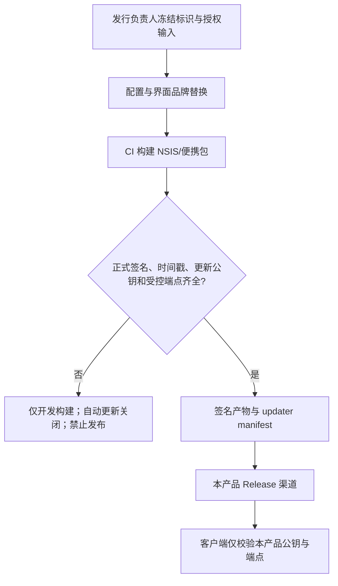

# 完成品牌、应用标识和发行基础的必要适配技术方案

> 对应功能：步骤 3：完成品牌、应用标识和发行基础的必要适配（dispatch_id=aich8-zhuochong-desktop-pet-rag-27-steps-20260805-task-03）
> 方案阶段：LOOF phase 1（仅方案设计，不实施）
> 设计日期：2026-08-06 00:31（Asia/Shanghai）
> 前置工件：`desktop/`（冻结的 Work Review v1.1.0 副本）、步骤 2 的继承基线矩阵
> 需求依据：`kaifa/最终需求文档.md` 2.2、AC-PET；`kaifa/桌宠助手逐步骤编程实现计划.md` 步骤 3

## 0. 方案设计原则（自检清单）

- 只在 `desktop/` 正式源码内做品牌、标识、发行和文档适配；`参考/Work-Review-main/` 继续只读。
- 不引入第二个桌面壳、更新器、安装器、数据服务或发布渠道；继续使用现有 Tauri 生命周期、NSIS 和 GitHub Actions 发布工作流。
- 将用户可见标识、平台包标识、更新信任链和发布资产一起收口，绝不保留指向 `wm94i/Work-Review` 的更新请求。
- 未取得正式名称、唯一 identifier、图标授权、签名与更新源时，宁可关闭自动更新和正式发布门禁，不猜测名称、域名、密钥或证书。
- 保留 `LICENSE`、`THIRD_PARTY_NOTICES.md`、冻结来源与资产台账；品牌替换不等于删除上游署名或把未核验资产当作可发行。

## 1. 背景与目标

### 1.1 已确认事实

1. `desktop/` 是步骤 1 冻结的 Work Review v1.1.0 副本；`desktop/src-tauri/tauri.conf.json` 仍声明 `productName: "Work Review"`、`mainBinaryName: "Work_Review"`、`identifier: "com.workreview.app"`，并配置上游更新公钥和 `wm94i/Work-Review` 更新地址。
2. 上游名称还出现在 `package.json`、`Cargo.toml`、窗口标题、桌宠窗口、关于页、侧边栏、`index.html`、本地化文案、macOS 权限说明、崩溃报告、CI 的便携包命名和 README 中。
3. `commands/updater.rs` 不只读取 Tauri 配置，还硬编码 GitHub Release API、Release 页面、三条 updater manifest URL 和 `WorkReview-Updater` User-Agent；仅改 `tauri.conf.json` 仍会连向上游。
4. 当前 `default_data_dir()` 与配置迁移入口使用 `work-review` 目录，核心库文件名为 `workreview.db`。正式需求要求旧 Work Review 配置和数据仍可读取，因此本步骤不能把名称替换为破坏性数据迁移。
5. `desktop/docs/baselines/third-party-assets.md` 将现有应用图标及供应商标识列为 `pending-verification`；`人物角色参考/*.jpg` 也未获可发行授权，均不可直接用作新品牌资产。
6. 正式名称、bundle identifier、binary 名、图标授权、签名证书、时间戳服务、更新域名、公钥和发布渠道尚未冻结，且被逐步骤计划明确列为正式发布阻断参数。

### 1.2 可验收目标

1. 安装包、主窗口、桌宠窗口、关于页、网页标题、崩溃报告、权限提示、README 和 Release 名称统一显示已确认的本产品名称，不再向用户展示 Work Review 作为当前产品名。
2. Tauri identifier、主二进制名、Windows 安装器/便携包名和 GitHub Release 资产名来自同一份已确认的标识表；它们不使用调度 id、临时目录名或未经授权的品牌。
3. 应用绝不请求或安装 `wm94i/Work-Review` 的更新：未配置本产品签名公钥和受控 manifest 时，检查更新明确返回“当前发行未启用自动更新”，而非访问上游。
4. Windows NSIS 打包保留 SHA-256、正式签名与时间戳的受控入口；开发本地构建不要求私钥或证书，不能产出可冒充正式发行的包。
5. MIT、第三方声明、来源基线和资产授权状态可被发行审查追溯；任何 `pending-verification` 图标/素材、未签名正式包或未配置更新信任链均阻断 release。
6. 在步骤 3 内不变更业务采集、微信、OCR、RAG、桌宠行为、远程能力开关、旧数据目录/数据库文件名或现有功能 API。

## 2. 核心流程与边界

### 2.1 发行标识与信任链

正常流程：冻结输入后，同一组值写入配置、界面、发行工作流和测试；CI 使用正式密钥生成签名产物与 manifest，客户端仅访问本产品更新地址并用匹配公钥校验。

异常/降级流程：任一品牌资产授权、证书、时间戳、发布仓库、更新域名或 updater 公钥缺失时，构建可保留为本地开发验证，但 `createUpdaterArtifacts=false`、自动更新入口不可发网、工作流不得创建正式 Release。

回滚流程：已发布版本只允许通过同一受控更新链发布版本号更高的修复包；若更新端点或签名异常，客户端保留当前版本并显示可理解的失败状态，不回退到上游 endpoint，也不覆盖用户数据。

### 2.2 本步骤边界

**包含**：产品显示名/描述/图标、Tauri identifier 与 binary、窗口和桌宠标题、发行资产命名、更新端点/公钥/Release 链接、Windows 签名与时间戳配置、CI 发布命名、相关测试与文档、许可/授权台账补充。

**不包含**：微信回复、知识库/RAG、业务页面重写、图标设计、PNG/Live2D 素材接入、数据目录迁移、重命名内部 SQLite 文件、macOS/Linux 的正式证书申请、真实 Release 创建，及任何上游功能的清理或重构。

## 3. 数据模型与配置契约

本步骤不新增业务数据库表、网络 API 或用户数据迁移。实施前由发行负责人一次性冻结下表；该表是人工配置契约，密钥私钥不得写入仓库。

| 字段 | 用途 | 约束 |
| --- | --- | --- |
| `display_name` | 窗口、关于页、README、安装包可见名称 | 正式商标/产品名；不得用 `aich8-zhuochong` 或调度文本代替。 |
| `package_slug` | npm/Cargo 可见包名、资产文件前缀 | 小写 ASCII；与现有第三方 crate 名冲突时只更改产品顶层包，不级联重命名 core/mcp/skills crate。 |
| `tauri_identifier` | Windows/macOS/Linux 平台应用标识 | 反向域名、全局唯一；一经正式发行不得复用上游 `com.workreview.app`。 |
| `main_binary_name` | Windows EXE、便携包内容及启动文档 | ASCII 安全名；CI 不允许继续硬编码 `Work_Review.exe`。 |
| `version` | `package.json`、顶层 Cargo、Tauri 的一致版本 | 三处一致，按 SemVer；首次本产品候选版本由发行负责人指定。 |
| `icon_source`/`license_evidence` | 生成 PNG/ICO/ICNS 的唯一来源与授权依据 | 必须可审计；缺失即不替换并阻断正式发行。 |
| `release_repository`/`release_url` | Release 页面与产物下载基址 | 必须为本产品受控渠道；不能沿用上游仓库。 |
| `updater_endpoints`/`updater_pubkey` | Tauri updater 信任链 | 所有 endpoint 都属于本产品；公钥和 CI 私钥必须同一密钥对。 |
| `windows_certificate_ref`/`timestamp_url` | 正式 Windows 签名 | 仅保存 secret 名称或安全凭据引用；证书和私钥不进 Git。 |

为保持兼容，本步骤维持 `work-review` 旧数据根和 `workreview.db` 不变；UI 和迁移提示改用中性“现有应用数据”。若将来要把数据目录改为新品牌，必须另立带备份、原子迁移、回滚和旧目录只读兼容的工作包。

## 4. 接口定义（配置与行为契约）

| 场景 | 输入/前提 | 预期结果 | 禁止结果 |
| --- | --- | --- | --- |
| 自动检查更新 | 本产品 endpoint 与公钥均已配置 | 仅请求本产品 manifest，签名和当前平台产物都有效后才报告可安装更新 | 请求 GitHub `wm94i/Work-Review` API/下载地址或接受上游签名。 |
| 自动检查更新未配置 | endpoint、公钥、CI 私钥任一未冻结 | 不创建 updater artifacts；前端显示未启用/不可用，不发出网络请求 | “为了可用”保留或回退上游 endpoint。 |
| 本地开发构建 | 未提供正式证书/更新私钥 | `tauri.local.conf.json` 继续关闭 updater artifact；可构建供开发验证 | 读取/提交正式私钥，或产出带正式发布标签的包。 |
| CI 正式发行 | 受保护 secrets、签名证书、时间戳、tag 和所有发行门禁齐全 | 生成签名 NSIS、便携包、manifest 和与发行名一致的资产 | 仅因构建成功就跳过签名/时间戳/授权审查。 |
| 数据兼容启动 | 已有 Work Review 数据目录 | 新品牌程序继续在兼容路径读取原配置和 `workreview.db` | 静默创建空的新目录，导致用户看似丢失历史。 |

## 5. 核心实施设计

### 5.1 修改顺序与最小文件范围

1. **先冻结发行输入和授权证据**：在 `desktop/docs/baselines/third-party-assets.md` 追加本产品图标来源、权利人、许可证/授权、适用发行版本和审查结论；在 `reference-ledger.md` 追加“品牌与发行配置适配”为本产品补丁。未通过时停止在开发配置，不替换二进制图标。
2. **统一静态产品元数据**：同步 `desktop/package.json`、`desktop/Cargo.toml`、`desktop/src-tauri/Cargo.toml`、`desktop/src-tauri/tauri.conf.json` 的顶层产品名称、说明、版本、identifier、`mainBinaryName`、版权和 bundle 描述。内部 `work-review-core`、MCP 与 skills crate 名称不是用户可见标识，本步骤不为品牌目的重命名它们。
3. **替换受用户可见的运行时文案与图标引用**：最小覆盖 `desktop/index.html`、`desktop/src/lib/components/Sidebar.svelte`、`desktop/src/routes/about/About.svelte`、四份 i18n 文件、`desktop/src-tauri/Info.plist`、`desktop/src-tauri/src/avatar_engine.rs`、`desktop/src-tauri/src/main.rs` 的权限/崩溃提示；仅替换产品身份，不改变业务文案语义或行为。
4. **替换图标产物**：仅在授权通过后，以一个受控源文件生成/替换 `desktop/public/icon.png`、`desktop/public/icons/*` 与 `desktop/src-tauri/icons/*` 所需 PNG、ICO、ICNS；更新关于页/侧边栏的 alt 文本。不得从 `人物角色参考/`、VPet 或未核验的上游图标直接复制。
5. **关闭上游更新链并接入本产品链**：将 `tauri.conf.json` updater 插件、`commands/updater.rs` 的 API/page/manifest 常量及 User-Agent 一起改为本产品值。若第 3 节的更新输入未冻结，移除上游常量/端点，令更新命令走显式 disabled 分支，并使 `runUpdateFlow` 呈现不可用状态；CSP 仅允许必要的新受控域名。
6. **调整发行工作流的名称耦合点**：在 `.github/workflows/release.yml` 用实际 `main_binary_name` 生成 EXE 查找、README、portable ZIP、上传 glob、Release 名和 macOS 安装说明，不再硬编码 Work Review。正式 Windows job 以受保护 secret 注入代码签名证书/密码与时间戳，开发 build 保持不签名路径；不得把证书文件放入仓库。
7. **保留兼容路径、许可与声明**：不改 `default_data_dir()`、`data_dir_preference_path()`、`workreview.db` 与现有数据迁移判定；保留 `LICENSE` 和 `THIRD_PARTY_NOTICES.md` 原文，在 README/关于页通过“基于 Work Review，详见许可证与第三方声明”说明继承关系，不能冒充上游作者或删除其 notice。

### 5.2 测试与文档设计

- 扩展 `ReleasePackaging.test.js`：断言 Tauri productName/identifier/binary、图标清单、Windows 资产命名、local build 的 updater 禁用、正式 workflow 签名/时间戳入口和 README 名称保持同一标识；不把真实密钥写入断言。
- 扩展 `UpdaterFlow.test.js`：断言 endpoint、Release API/page、User-Agent 均不含 `wm94i/Work-Review`；未配置更新链时断言 disabled 分支不构造网络客户端。
- 新增或扩展小型静态品牌一致性测试：读取上述配置、`index.html`、Sidebar、About、Info.plist 和四份 locale，禁止残留用户可见 `Work Review`（MIT/第三方来源说明的允许位置应精确白名单，而非全局替换）。
- 更新三份 README 的产品简介、下载链接、安装包/便携包名、权限说明和数据兼容说明；历史 release notes 只作为上游历史保留，不伪造为本产品 Release。

## 6. 非功能性、安全与回滚设计

- **安全**：更新公钥可公开，私钥、签名证书、密码、token 和时间戳凭据只能在密钥管理或 CI secrets 中出现；日志和测试不得打印它们。CSP、Rust updater 常量和 Tauri 插件端点必须使用同一受控域名集合。
- **可用性**：本产品更新服务不可用、签名不匹配、当前平台资产缺失或网络失败时保留当前可用版本并给出失败状态；不调用上游或代理站点作为隐式备用。
- **数据安全**：步骤 3 不改变历史数据根、SQLite 名称或配置格式；任何未来品牌目录迁移先备份并由单独验收覆盖升级、失败和回滚。
- **许可**：`pending-verification` 资产是发布阻断，不因上游仓库有文件就视为可商用；安装包必须携带 MIT 与第三方 notices。
- **回滚**：配置/界面适配回滚可通过下一版本恢复上一组产品配置；identifier 和已发行数据路径不可被重新指向上游。若误发布了含上游更新端点的候选包，撤下产物并以版本号更高、禁用上游端点的修复包替换，不让客户端降级安装。

## 7. 测试方案与发行门禁

| 编号 | 验证 | 通过条件 |
| --- | --- | --- |
| BRI-01 | 静态标识一致性 | package/Cargo/Tauri/窗口/关于/Sidebar/HTML/Info.plist/README 均使用已确认产品标识；旧名仅出现在许可证、第三方声明、来源台账和明确的兼容说明。 |
| BRI-02 | 更新隔离 | 源码与配置扫描不到上游 Release API、页面、manifest、代理 URL 或上游公钥；未配置本产品更新链时不发网。 |
| BRI-03 | Windows 构建与包名 | Windows CI 产出由 `main_binary_name` 派生的 NSIS `.exe` 与 portable `.zip`，README 名、Release 名、上传路径一致。 |
| BRI-04 | 签名与时间戳 | 正式 Windows runner 能验证 Authenticode 签名和时间戳；开发构建明确不签名、不开 updater artifacts。没有正式凭据时本项为 `blocked`，不记为通过。 |
| BRI-05 | 更新信任链 | 用本产品签名的三平台 manifest/产物进行 updater 验证；错误公钥、错误域名、缺少当前平台资产均不得提示可更新。 |
| BRI-06 | 旧数据兼容 | 使用脱敏 Work Review 旧数据目录启动，能读取既有配置和 `workreview.db`；不得创建空目录掩盖历史。 |
| BRI-07 | 许可与资产 | 打包前台账中所有实际随包图标/素材均为可发行状态，安装包含 MIT 与第三方 notices。 |
| BRI-08 | 回归 | 步骤 2 的 AC-BASE 相关构建、启动、单实例、托盘、设置、桌宠和更新边界测试按原矩阵复跑；已有上游失败继续按基线记录，不归因给本步骤。 |

正式发布的必要门槛为 BRI-01 至 BRI-07 全部通过，且 BRI-08 无新增回归。缺少外部证书、更新服务或 Windows 实机时可完成代码/契约测试，但正式 Release 状态必须保持阻断。

## 8. 风险、决策与待确认项

| 风险/未知项 | 处理决策 |
| --- | --- |
| 将调度名或仓库目录误当品牌 | 明确禁止；等待发行负责人提供 `display_name` 与商标/使用权证据。 |
| 新 identifier 与上游冲突 | 必须由产品所有者确认唯一反向域名，禁止沿用 `com.workreview.app`。 |
| 替换名称后丢失旧用户数据 | 本步骤保留 `work-review` 数据根和 `workreview.db`，未来迁移单独设计。 |
| 原 updater 仍可访问上游 | 配置、Rust 常量、CSP 和 CI 四处同时扫描/测试；缺新源时显式禁用。 |
| 未授权图标/角色图随包 | 按台账逐文件审计；未经授权的 `人物角色参考/`、VPet 和现有 pending 图标不进包。 |
| CI 成功但 Windows 包未签名 | 签名/时间戳独立 BRI-04；缺凭据不把 build 成功当作发行成功。 |
| 直接改内部 crate/数据名导致广泛回归 | 仅改变顶层可见元数据；内部 crate、数据根和数据库名维持兼容。 |

实施前需要发行负责人提供：正式产品名称、package slug、identifier、binary 名、首个版本号、图标原件及授权、受控 Release 仓库/域名、updater 公钥和 endpoint、Windows 证书 secret 引用与时间戳 URL。它们未确认时，阶段 2 只能实现“去上游更新并禁用自动更新”的安全下限，不能宣称完成正式品牌或发行。

## 9. 代码实施修改顺序

1. 核对步骤 2 基线、现有脏工作区与冻结发行输入；将缺失项记录为发布阻断，不覆盖其他 LOOF run 工件。
2. 在授权通过后提交图标和台账/补丁记录，再统一更新顶层元数据、用户可见文案及静态测试。
3. 实现 updater 禁用或本产品端点/公钥替换，连同 CSP、Rust fallback 和 UI 状态测试一次完成。
4. 调整 release workflow 的二进制/资产/Release 命名与签名时间戳入口，保留本地开发构建分离。
5. 更新 README、许可证关联说明与发行清单；不修改历史上游 release notes 的事实。
6. 按第 7 节运行静态、前端、Rust、构建、Windows 签名/更新/兼容验收，回填步骤 2 矩阵的修改后证据。
7. 仅在所有发布外部参数和 BRI 门禁满足时创建正式 Release；否则保留为不可发布的开发构建并清楚报告阻断项。
