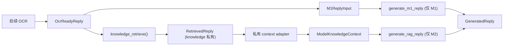
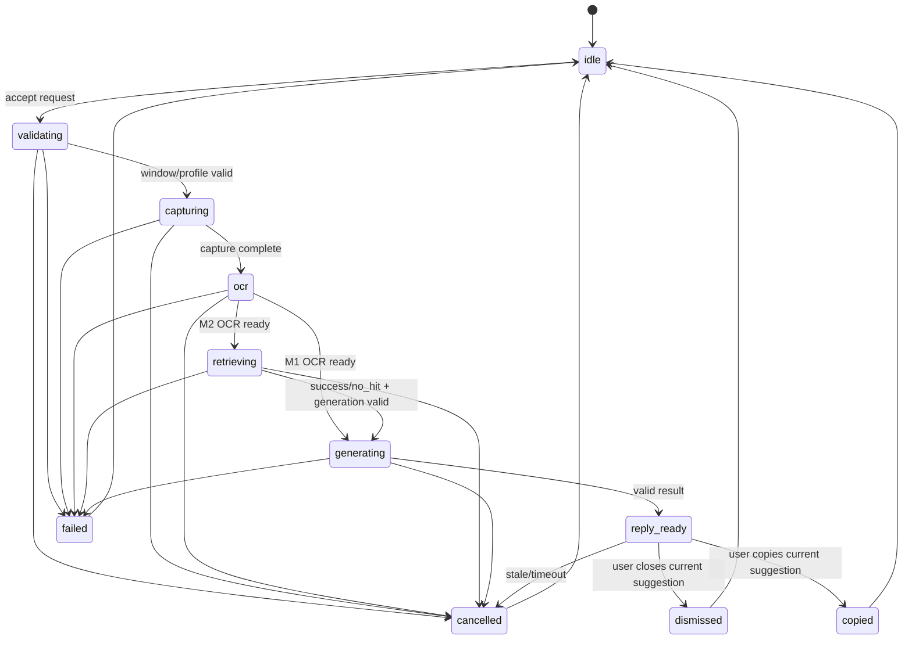

# 步骤 4：冻结微信、知识库、状态机和验收契约

> 文档状态：实施前技术方案（仅方案设计）
> 对应 dispatch：`aich8-zhuochong-desktop-pet-rag-27-steps-20260805-task-04`
> 实施边界：最小新增领域契约与测试资产；不实现微信采集、OCR、知识库导入、检索、模型调用、Tauri 命令或 UI。

## 0. 方案设计原则（自检清单）

- **继承不重构**：正式底座是当前 `desktop/` Work Review Rust/Tauri/Svelte 工程；本步骤只新增微信/RAG 的纯领域模块、文档和夹具，不移动既有模块，也不改核心数据库。
- **类型先于流程**：M1 与 M2 的输入、输出和权限在编译期分隔；M2 不能从裸 OCR、字符串、原始命中或 M1 类型调用模型入口。
- **RAG 不可绕过**：M2 只允许 `knowledge_retrieve()` 产生的 `RetrievedReply` 经私有适配器形成 `ModelKnowledgeContext`；检索故障绝不回退到 M1。
- **状态可审计**：使用单调 `stage_seq`、合法状态迁移、请求和代际校验；时间戳不能替代顺序证据。
- **数据最小化**：本步骤夹具完全脱敏，不读取、复制、哈希或提交真实 `微信聊天记录知识库/` 内容。

## 1. 背景、目标与非目标

### 1.1 当前基线

- `desktop/src-tauri/src/main.rs` 是 Work Review 的 Tauri 主进程模块入口；当前工程尚没有 `wechat/` 或 `knowledge/` 模块。
- 既有 `error.rs`、`avatar_engine.rs` 和 `crates/core/src/config.rs` 提供错误、serde 与有界气泡 payload 的邻近模式；它们没有微信/RAG 的运行时实现。
- 正式需求 v0.3.1 已固定：M1 使用临时 `M1ReplyInput -> generate_m1_reply()`；M2 的每次模型调用必须先完成 `knowledge_retrieve()`，且知识库独立于 Work Review 核心数据库。

### 1.2 本步骤目标

1. 冻结后续 M1/M2 共用的 Rust 领域类型、稳定 wire 形状、错误码和状态机规则。
2. 用可编译的 feature 门禁保证 M1/M2 发布构建互斥，M2 中 M1 模型入口不可注册或编译。
3. 固定 `RequestId`、采集版本、建议代际、绑定代际和观察版本的独立职责，消除旧结果误显示/误复制歧义。
4. 创建可查询的验收适用矩阵和无真实聊天内容 fixture，供后续步骤实施与测试。

### 1.3 非目标

- 不新增 Tauri command、managed state、前端页面、托盘入口、桌宠窗口或第二个应用生命周期。
- 不实现前台微信识别、截图裁剪、隐藏恢复、Windows OCR、RapidOCR fallback、剪贴板、模型 transport、网络调用或 UI Automation。
- 不创建或打开 `knowledge.sqlite`，不导入 JSON，不新增 `knowledge_*` 表、FTS、向量、migration、性能阈值或真实检索。
- 不变更 Work Review 核心 `Database`、已有 `memory_chunks`、远程上传、MCP、Bot、Localhost API、Agent 或既有普通桌宠状态。

## 2. 最小文件范围与依赖边界

| 路径 | 动作 | 职责 |
| --- | --- | --- |
| `desktop/src-tauri/src/wechat/mod.rs` | 新增 | 仅导出微信领域子模块；不注册 Tauri command。 |
| `desktop/src-tauri/src/wechat/types.rs` | 新增 | 请求、采集、OCR、M1 输入、建议、错误和版本 newtype。 |
| `desktop/src-tauri/src/wechat/state_machine.rs` | 新增 | M1/M2 通用状态迁移、`stage_seq` 和代际失效判定。 |
| `desktop/src-tauri/src/wechat/model_contract.rs` | 新增 | `ModelKnowledgeContext` 私有构造边界与 M1/M2 feature 选择；不实现模型传输。 |
| `desktop/src-tauri/src/knowledge/mod.rs` | 新增 | 仅导出知识领域类型和私有边界。 |
| `desktop/src-tauri/src/knowledge/types.rs` | 新增 | scope、检索请求/结果、命中、私有 `RetrievedReply` 和 catalog/index 代际类型。 |
| `desktop/src-tauri/src/main.rs` | 最小修改 | 仅声明 `mod wechat; mod knowledge;`；不注册 command、state 或后台任务。 |
| `desktop/src-tauri/Cargo.toml` | 最小修改 | 新增互斥 release feature；保留既有默认 feature 与依赖版本。 |
| `desktop/docs/contracts/ac-applicability-matrix.md` | 新增 | AC-WX/AC-PET/AC-KB/AC-RAG 的 M1、M2、条件适用和证据归属。 |
| `desktop/src-tauri/tests/fixtures/wechat_contract/*.json` | 新增 | 脱敏契约 fixture。 |
| `wechat/*`、`knowledge/*` 同级单元测试 | 新增 | 序列化、状态机、feature 组合和隐私边界测试。 |
| `kaifa/kaifa_test/test.md`、`kaifa/kaifa_personnel/mingling.md` | 最小补充 | 本步骤命令、预期、fixture 脱敏和后续变更规则。 |

除上表外不改动任何产品文件；尤其不触及 `screenshot.rs`、`ocr.rs`、`avatar_engine.rs`、`commands/*`、数据库 schema、前端 `src/`、锁文件和既有配置默认值。



- `knowledge/types.rs` 是唯一可构造 `RetrievedReply` 的模块；字段、构造器和从 `KnowledgeRetrieveResult` 的转换均为 `pub(in crate::knowledge)` 或更窄可见性。
- `model_contract.rs` 的受信任适配器是唯一可构造 `ModelKnowledgeContext` 的位置；只包含待回复文字、token 预算内摘录、必要时间/角色/方向标签和 `no_hit` 标记。
- 模型 client、桌宠显示 payload、Tauri command（后续步骤）不得取得 `KnowledgeHit` 完整列表、源路径、内部 ID、数据库句柄或原始 JSON。

## 3. 领域类型、wire 形状与错误契约

### 3.1 微信领域

| 类型 | 表示 | 不变量 |
| --- | --- | --- |
| `RequestId` | 单个手动回复请求 UUID | 追踪、检索、模型、气泡使用同一值。 |
| `CaptureVersion` | 本次截图/OCR 版本 | 只代表实际采集；header-only 复核不能替换。 |
| `SuggestionGeneration` | 可显示/复制建议代际 | 新请求递增；替换、取消、关闭、成功复制、超时、晚到结果使旧建议失效。 |
| `BindingGeneration` | 当前窗口/聊天/范围绑定代际 | 仅窗口实例、标题/身份、用户范围、profile/布局、窗口矩形或会话绑定变化时递增。 |
| `BindingObservationVersion` | 检索前/模型前 header 复核版本 | 记录复核，绝不替代 `CaptureVersion`。 |
| `CapturedWechat` | 经验证的微信采集元数据 | 不含持久化图片或 OCR 正文。 |
| `OcrReadyReply` | OCR 成功且规范化的待回复文字 | 只能从 `OcrBackendResult::Text` 构造。 |
| `M1ReplyInput` | M1 专用模型输入 | 只由 `OcrReadyReply` 构造，不能容纳知识库错误或命中。 |
| `GeneratedReply` | 单条建议 | 绑定 request 和 suggestion 代际；M2 还绑定 binding 代际；不含知识命中。 |

跨 UI/追踪字段用 `#[serde(rename_all = "camelCase")]`，但稳定枚举值逐项显式声明，禁止依赖 Rust variant 名称的未来重命名。

### 3.2 知识领域

`KnowledgeScope` 必须固定为以下 JSON 判别形状（不可由 Rust/前端驼峰命名推导替换）：

```json
{"kind":"conversation","id":"conversation-stable-id"}
{"kind":"selected_conversations","ids":["conversation-a","conversation-b"]}
{"kind":"global_user_selected"}
```

| 类型 | 责任 | 可见性 |
| --- | --- | --- |
| `KnowledgeScope` | 单会话、多会话或用户确认全库范围 | 可安全序列化；空 `ids` 非法。 |
| `KnowledgeRetrieveRequest` | request、query、scope、binding/index 代际、top-k、token budget | 仅后续编排器到检索门面传递。 |
| `KnowledgeRetrieveResult` | store/retriever 私有中间结果 | `knowledge` 模块私有，不得传模型/UI。 |
| `KnowledgeHit` | 本地审计所需 chunk、会话、时间、摘录、分数、来源 | 仅知识模块/本地审计层。 |
| `RetrievedReply` | 已成功执行检索的可信封装 | 字段/构造器私有，只由 `knowledge_retrieve()` 创建。 |
| `CatalogGeneration` / `IndexGeneration` | 目录和索引代际标识 | 只定义契约，本步骤不建数据库。 |

检索状态是 `success | no_hit | fts_fallback`，其中 `no_hit` 是成功结果，不是错误。`KB_NOT_READY`、`KB_SCOPE_UNRESOLVED`、`KB_RETRIEVAL_FAILED` 终止请求，均不能产生 `RetrievedReply` 或 M2 模型调用。

### 3.3 稳定错误码

| 域 | 错误码 |
| --- | --- |
| 请求/窗口 | `WX_BUSY`、`WX_NOT_FOREGROUND`、`WX_PROFILE_UNSUPPORTED`、`WX_WINDOW_UNSUPPORTED` |
| 采集/OCR | `WX_CAPTURE_FAILED`、`WX_CAPTURE_TIMEOUT`、`WX_OCR_EMPTY`、`WX_OCR_UNAVAILABLE`、`WX_OCR_FAILED` |
| 失效/取消 | `WX_REQUEST_CANCELLED`、`WX_REQUEST_STALE` |
| 知识库 | `KB_NOT_READY`、`KB_SOURCE_UNSUPPORTED`、`KB_SCOPE_UNRESOLVED`、`KB_RETRIEVAL_FAILED` |
| 模型 | `LLM_FAILED` |

`OcrBackendResult::{Text, Empty, Unavailable, Failed}` 与 WX 错误一一映射，只有 `Text` 可进入后续类型链。全部错误必须通过合法迁移进入 `cancelled` 或 `failed`，并增加一次 `stage_seq`。

## 4. 状态机与版本失效



1. 每次状态写入的 `stage_seq` 必须严格大于同一 `request_id` 的前一值；倒退、重复或非法跳转返回契约错误。
2. M1 不得进入 `retrieving`；M2 必须在 `retrieving` 获得 `success` 或 `no_hit` 后才进入 `generating`。
3. `reply_ready` 仅接受匹配 `SuggestionGeneration` 的结果；M2 还要匹配初始 `BindingGeneration` 与模型前 `BindingObservationVersion` 复核。
4. `copied`、`dismissed` 只由用户事件触发；旧代际、失效建议和非 `reply_ready` 不能复制。

| 事件 | capture | suggestion | binding | observation |
| --- | --- | --- | --- | --- |
| 接受新请求 | 后续真实采集时写入 | 递增 | 不变 | 不变 |
| 实际截图/OCR | 新值并贯穿请求 | 不变 | 不变 | 不变 |
| header-only 复核 | 不变 | 不变 | 绑定要素变化才递增并失效请求 | 递增 |
| 改范围/窗口/聊天/profile/矩形 | 不变 | 旧建议失效 | 递增 | 后续复核使用新值 |
| 复制、关闭、超时、取消、晚到结果 | 不变 | 使建议失效 | 不变 | 不变 |

四类版本绝不能共用一个计数器；新请求、复制、关闭、超时也不能改变 `binding_generation`。

## 5. M1/M2 发布 feature 与模型门禁

`desktop/src-tauri/Cargo.toml` 增加两个唯一 release feature：`wechat-m1` 和 `wechat-m2`。既有 `custom-protocol` 保持原职责。

- `wechat-m1`：只暴露 `generate_m1_reply(M1ReplyInput)` 契约，不暴露 RAG 模型入口。
- `wechat-m2`：只暴露 `generate_rag_reply(ModelKnowledgeContext)` 契约；`generate_m1_reply` 模块、符号和 command 注册点均不能编译。
- 同时启用或都不启用时在微信发布 target 命中 `compile_error!`；实现不能因此破坏现有纯 Work Review 默认构建，须以实际 target 结构限定门禁范围。
- 本步骤不接通模型实现；测试只验证类型可达性、feature 组合和 fake transport spy 的零调用。

## 6. 验收适用矩阵与 fixture

### 6.1 `ac-applicability-matrix.md`

最小列：`ac_id`、`phase(M1|M2|conditional)`、`applicability(required|conditional-not-enabled|deferred)`、`proof_type(unit|integration|contract|windows-manual|release-audit)`、`owner_step`、`blocking`、`evidence_target`。

步骤 4 必须覆盖三种 scope、全部错误码、状态单调性、M1/M2 feature 互斥、`no_hit` 非错误、`RetrievedReply`/`ModelKnowledgeContext` 私有构造、四类版本职责，以及“群聊仅可作用户明确选择的知识范围，实时回复只承诺单聊”。尚未实现的 AC 行标为 `deferred` 或 `conditional-not-enabled`，不得标为 `pass`。

### 6.2 fixture 清单

| 名称 | 内容 | 必须断言 |
| --- | --- | --- |
| `normal_m1.json` | 脱敏 OCR 成功、有效单聊 metadata | 能构造 `OcrReadyReply` 与 M1 输入。 |
| `empty_ocr.json` | 空白/仅空白字符 OCR | `WX_OCR_EMPTY`，不能构造输入。 |
| `duplicate_message.json` | 相同稳定消息标识 | 后续去重/导入契约样例，不执行真实导入。 |
| `unsupported_schema.json` | 未支持版本号 | `KB_SOURCE_UNSUPPORTED`，不推测字段。 |
| `ambiguous_conversations.json` | 同名会话元数据 | 未明确选择时 `KB_SCOPE_UNRESOLVED`。 |
| `no_hit.json` | 成功检索但空命中 | `no_hit`，允许 M2 后续生成。 |
| `retrieval_failed.json` | retriever 失败结果 | `KB_RETRIEVAL_FAILED`，模型 spy 为零。 |

fixture 只能使用虚构 ID、通用文字、固定时间与相对占位来源；不得包含联系人、真实聊天、原始文件路径、token、截图、凭据或真实源目录派生哈希。

## 7. 实施顺序与验证

1. 复核当前 `desktop/` 与既有错误/serde/气泡模式，确认不进入非目标范围；验证：实施前后无无关产品改动。
2. 新增纯类型和 JSON round-trip；验证：三种 scope 逐字匹配、错误码全覆盖、`no_hit` 非错误。
3. 实现不依赖 Tauri/数据库的状态机和版本规则；验证：非法迁移、重复/倒退序号、旧 suggestion、M2 binding 失配均被拒绝。
4. 加入 M1/M2 门禁；验证：M1-only、M2-only 编译，双启用/均未启用按预期 compile-fail，默认 Work Review 构建保持兼容。
5. 写矩阵、fixture、测试说明；验证：fixture 可解析且无真实数据，矩阵可按 AC/phase 查询。
6. 仅执行新契约的格式、编译、单元/compile-fail 测试；Windows 实机、真实微信、模型、数据库和全回归留在所属后续步骤。

建议在 `desktop/` 目录记录实际执行的以下命令（因最终 feature target 可能需附加既有 feature，以实际命令为准）：

`cargo fmt --check`
`cargo test --package work-review --lib wechat::`
`cargo test --package work-review --lib knowledge::`
`cargo check --package work-review --features wechat-m1`
`cargo check --package work-review --features wechat-m2`

双 feature、无 release feature 的命令是预期失败验证，必须断言 `compile_error!`，不能记作普通成功。

## 8. 通过条件、风险与回滚

### 8.1 本步骤通过条件

- 稳定错误码、scope JSON、状态迁移、版本失效测试通过。
- `M1ReplyInput` 不可调用 M2 模型；非受信任模块不可构造 `RetrievedReply` 或 `ModelKnowledgeContext`。
- `no_hit` 可进入 M2 后续生成；任何 `KB_*` 失败没有生成资格且 transport spy 为零。
- 互斥 feature 四种组合符合契约，现有默认 Work Review 构建不被强制选微信 feature。
- 矩阵、fixture、测试说明存在且没有真实/敏感聊天内容。

### 8.2 明确不在本步骤通过的项目

AC-BASE 全量回归、AC-WX 截图/OCR/复制/桌宠实机行为、AC-PET 运行时审计、AC-KB 导入与索引、AC-RAG 真正“先检索后模型”、Windows 微信 profile、性能阈值均不在本步骤实施或验收；矩阵只可标其后续责任步骤，不能伪报通过。

### 8.3 风险与处理

| 风险 | 处理 |
| --- | --- |
| feature 门禁破坏上游默认构建 | 限定于微信发布契约，先验证默认构建；不能用全 workspace 重构解决。 |
| 私有构造器被 `pub` 泄漏 | 用跨模块 compile-fail/可达性测试；审查所有 `pub`。 |
| 将 `no_hit` 当故障 | 检索状态与错误类型分离，fixture 和状态机分别断言。 |
| 版本混用导致旧建议复制 | 四个 newtype 不可隐式转换；失配进入 `WX_REQUEST_STALE`/终态。 |
| fixture 泄露聊天数据 | 手写虚构 fixture，排除敏感目录并人工抽查。 |
| 范围膨胀 | 禁止 command、前端、数据库、OCR、网络、截图和模型实际调用；需要时拆回对应后续步骤。 |

本步骤只增加可回滚的领域契约、测试、fixture 与文档。未提交时仅删除本步骤新建文件并撤销对 `main.rs`、`Cargo.toml`、`test.md`、`mingling.md` 的本步骤差异；提交后用 `git revert <commit>`。不得删除 `desktop/`、Work Review 基线、原始聊天导出或其他 LOOF run 产物。

完成仅表示本计划的契约和验证资产已按最小范围实现并通过本步骤测试；不代表 M1、M2、Windows 实机或正式发布完成。
