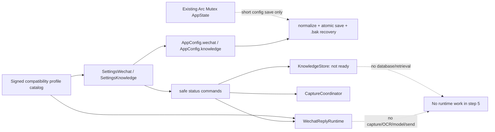

# 步骤 5：建立最小微信/知识库模块骨架并接入现有配置

> 文档状态：实施前技术方案（仅方案设计）  
> dispatch：`aich8-zhuochong-desktop-pet-rag-27-steps-20260805-task-05`  
> 前置基线：步骤 4 已冻结 `wechat/`、`knowledge/` 的纯领域契约；本步骤只接入安全的空 runtime、配置与设置页。

## 0. 方案设计原则

- **最小接线**：不重构 Work Review；保留 `AppState`、`Database`、既有 `save_config`、设置页保存流及步骤 4 的类型。
- **默认拒绝**：不自动触发、不保存正文、不选择知识 scope/模型/来源；缺 profile、模型、scope 或 Store 时停在明确的未就绪状态。
- **配置不是授权**：配置只保存受信任 compatibility profile ID；微信 allowlist、窗口特征、ROI、profile 版本与签名只在受信任 catalog，不能由前端或 `config.json` 编辑。
- **状态隔离**：`WechatReplyRuntime`、`KnowledgeStore`、`CaptureCoordinator` 分别 managed；慢操作只读取快照后在锁外执行，绝不持有 `Arc<Mutex<AppState>>`。
- **不伪造功能**：本步骤空实现只返回 `not_ready`/不支持；不创建 `knowledge.sqlite`，不调用采集、OCR、模型、embedding 或检索。

## 1. 背景、目标与非目标

### 1.1 当前基线

- `main.rs` 已声明 `wechat`/ `knowledge`；步骤 4 已有请求、状态机、`KnowledgeScope`、`RetrievedReply` 和 M1/M2 编译期边界，但没有 command、managed state、用户配置或设置页。
- `AppConfig` 的实际定义是 `desktop/crates/core/src/config.rs`；它已有 `normalize()`、临时文件原子替换、`.bak` 和 `load_with_recovery()`。
- `memory_semantic_enabled` 与 `embedding_*` 是 Work Review 屏幕语义记忆，禁止本功能读取、复用或成为 fallback。

### 1.2 本步骤可验收目标

1. 在 `main.rs` 注册三项独立 state 与仅返回安全状态 DTO 的微信/知识库 command；不向前端序列化 `AppState`、`Database`、句柄、聊天正文、命中或密钥。
2. 为 `AppConfig` 增加具备旧值默认、normalize、原子保存和备份恢复的 `wechat`、`knowledge` 子配置。
3. 加入 `SettingsWechat.svelte`、`SettingsKnowledge.svelte` 与简中/繁中/英文/阿拉伯文 i18n。
4. 用定向测试证明篡改 profile、模型缺失、scope null、空最近目录和非 loopback embedding 均 fail-closed。

### 1.3 明确非目标

- 不实现窗口发现、截图、ROI 裁剪、OCR、剪贴板、键鼠模拟、UI Automation、粘贴/发送、微信协议或数据库读取。
- 不实现模型传输、`generate_wechat_reply`、M1/M2 编排、导入/索引/embedding、`knowledge_retrieve()`、FTS/向量或后台循环。
- 不建 Work Review 核心库的 `knowledge_*` 表，不建顶层 `retrieval/`，不建 `knowledge.sqlite`。
- 不连接 MCP、Bot、Agent、Localhost API、联网搜索、上传或云端 embedding。

## 2. 最小文件范围

| 路径 | 动作 | 职责 |
| --- | --- | --- |
| `desktop/crates/core/src/config.rs` | 修改 | 微信/知识库 DTO、默认、serde 兼容、normalize、测试；复用原子保存与备份恢复。 |
| `desktop/src-tauri/src/wechat/{mod.rs,config.rs,runtime.rs,commands.rs}` | 修改/新增 | 受信任 profile catalog、trait/空实现、微信 runtime、采集协调器、command DTO。 |
| `desktop/src-tauri/src/knowledge/{mod.rs,config.rs,runtime.rs,commands.rs}` | 修改/新增 | Store 空壳、独立 loopback embedding 校验、多源清单 DTO、command DTO。 |
| `desktop/src-tauri/src/commands/mod.rs`、`main.rs` | 修改 | re-export command；独立 manage 三个 state 和注册 handler。 |
| `desktop/src/routes/settings/Settings.svelte` | 修改 | 两个 tab、旧值 UI 补齐、status loading；仍走统一 `save_config`。 |
| `desktop/src/routes/settings/components/SettingsWechat.svelte` | 新增 | profile/模型选择、默认关闭的留存设置。 |
| `desktop/src/routes/settings/components/SettingsKnowledge.svelte` | 新增 | M2 未就绪、来源 metadata、scope/topK/token/独立本地 embedding。 |
| `desktop/src/lib/i18n/locales/{zh-CN,zh-TW,en,ar}.js` | 修改 | 相同键集合。 |
| 定向 Rust/Node 测试 | 新增/修改 | 配置、安全边界、DTO 与 UI 接线。 |



## 3. 配置设计与安全不变量

### 3.1 `WechatConfig`

在 core config 新增 `#[serde(default)] pub wechat: WechatConfig`。

| 字段 | 默认值 | 约束 |
| --- | --- | --- |
| `compatibility_profile_id: Option<String>` | `None` | 空白归 `None`；只能精确命中 catalog ID，否则不启动并报 `WX_PROFILE_UNSUPPORTED`。绝不保存 appName、exe path、ROI、DPI 或签名。 |
| `text_model_profile_id: Option<String>` | `None` | 只能精确匹配 `text_model_profiles` 中已验证、模型非空的 ID；缺失/删除/未验证报 `WX_TEXT_MODEL_UNAVAILABLE`，不回退 `text_model` 或其他 profile。 |
| `auto_trigger: bool` | `false` | 本步骤没有监听器或启用入口；后续也只允许用户明确点击创建请求。 |
| `content_retention_enabled: bool` | `false` | 关闭时 retention 天数归零；本步骤不写任何内容。 |
| `content_retention_days: u16` | `0` | 开启时只允许 1–30；无永久留存。 |

catalog 位于微信模块内部。每项含 `id`、`profile_version`、签名/验证材料、Windows 微信可执行身份 allowlist、窗口特征和冻结 ROI。设置页只能收到 `CompatibilityProfileOption { id, label, version }`；profile ID、版本、签名、allowlist 或 ROI 任一失败即阻断，不能由 config 伪造任意应用为微信。

### 3.2 `KnowledgeConfig`

在 core config 新增 `#[serde(default)] pub knowledge: KnowledgeConfig`。它只保存用户选择与后续 Store 所需 metadata，不保存聊天正文，也不是数据库 schema。

| 字段 | 默认值 | 约束 |
| --- | --- | --- |
| `recent_picker_dir: Option<String>` | `None` | 空白归 `None`；不能将 macOS 目录或聊天目录作为默认种子。 |
| `scope_mode: Option<KnowledgeScopeMode>` | `None` | 未选择即 `KB_SCOPE_UNRESOLVED`；不得推断为全库。 |
| `top_k: u8` | `6` | 限制 1–12。 |
| `token_budget: u32` | `1200` | 限制 256–4096。 |
| `token_counter_version: String` | `v1` | 仅接受已支持的 `v1`，非法值归一化为 `v1`。 |
| `same_conversation_boost: bool` | `false` | 默认关闭；无稳定会话 ID 时不允许隐式偏好。 |
| `local_embedding: LocalEmbeddingConfig` | 通用 loopback、空 model | 独立于 `embedding_*`；仅接受 `ollama_loopback` 和 `http://127.0.0.1`、`http://localhost`、`http://[::1]`。空 model 表示未配置。 |
| `knowledge_sources: Vec<KnowledgeSourceRegistration>` | `[]` | 唯一权威来源清单；禁止新增单一全局 `source_path` 替代字段。 |

`KnowledgeSourceRegistration` 至少有稳定 `source_id`、受限 `source_kind`、用户选择的 `source_path`、`schema_version`、`priority`、`source_state(active|retired|missing)`、状态时间/原因、`lineage: Vec<SourceLineage>`（前身/后继 source ID、关系、验证时间）。normalize 负责 trim、稳定 ID 去重、拒绝空路径/非法优先级/自引用 lineage。此时 `active` 仍不代表已导入或可检索，空 source list 就是 `KB_NOT_READY`。

非 loopback、`0.0.0.0`、局域网 IP、DNS host、https 云端均拒绝；不解析 DNS、不发生网络测试、不降级到云端。该配置不读 `memory_semantic_enabled`、`embedding_provider`、`embedding_endpoint`、`embedding_model`。

### 3.3 兼容与持久化

1. 旧配置缺 `wechat`/ `knowledge` 由 serde Default 补齐，再进入既有 `AppConfig::normalize()`。
2. 保留现有 `save_config -> normalize -> AppConfig::save` 的临时文件、同步、原子替换、`.bak` 流程；不得创建第二套写文件逻辑。
3. 保留 `load_with_recovery()` 的主备恢复和损坏 fail-safe；新字段也须覆盖。
4. 已选 profile/model 无效时显示未就绪，不静默改选其他 profile/默认模型/全库 scope。

## 4. Runtime、trait 与 command

### 4.1 独立 managed state

| state | 只保存 | 本步骤行为 | 禁止保存 |
| --- | --- | --- | --- |
| `WechatReplyRuntime` | 无正文的可用性/错误码、catalog 校验摘要 | 默认 `disabled/not_ready`，短锁读取 | `AppState`、`Database`、截图/OCR 正文、模型 client、MCP/Bot/上传句柄。 |
| `CaptureCoordinator` | 请求占用/取消/代际的最小协调状态 | 空实现拒绝真实采集 | 自动化器、键鼠模拟器、未选聊天、持久截图。 |
| `KnowledgeStore` | catalog/index 未就绪状态、配置版本摘要 | 仅返回 `KB_NOT_READY` | SQLite 连接、原始 JSON、FTS/向量、Work Review DB 连接。 |

三项分别在 `main.rs` 中 `.manage(...)`。未来慢操作先克隆配置快照并释放锁，再由独立 async 任务/`spawn_blocking` 执行，最终以 request/generation 校验写回短状态；不得跨 await 持有 `AppState` 或上述 mutex。

### 4.2 trait 与空实现

- `WechatCapturePort`：以后承载“用户明确选择且仍前台的微信窗口”验证/采集；`UnsupportedWechatCapture` 固定返回 `WX_NOT_READY`，没有系统调用。
- `WechatReplyModelPort`：以后只接受步骤 4 受信任类型链；`UnavailableWechatReplyModel` 固定 `WX_TEXT_MODEL_UNAVAILABLE`，不调用通用文本生成、Agent 或工具模型。
- `KnowledgeStorePort`：以后才提供类型化 catalog/检索；`UninitializedKnowledgeStore` 固定 `KB_NOT_READY`，不打开数据库。

不创建顶层 retrieval 模块；不得用 `serde_json::Value`、任意 JSON 或 `Any` 逃逸类型边界。

### 4.3 command 与 DTO

在各领域 command 模块新增、由 `commands/mod.rs` re-export，并仅注册：

| command | 依赖 | 返回 | 明确禁止 |
| --- | --- | --- | --- |
| `get_wechat_settings_status` | Wechat runtime + 配置快照 | catalog option、已选 profile/模型是否有效、`autoTrigger=false`、留存设置、未就绪原因码 | AppState、api key、模型 endpoint、allowlist/ROI、聊天文本、截图。 |
| `get_knowledge_settings_status` | KnowledgeStore + 配置快照 | 未就绪、source 数量/状态摘要、scope 是否已选择、local embedding 是否有效 | 绝对 source path、导出内容、DB/索引句柄、命中、embedding 密钥。 |
| `validate_knowledge_local_embedding` | 纯 validator | `valid` 或稳定配置错误码 | 网络请求、model 调用、provider fallback。 |

设置仍用现有 `get_config`/`save_config`，status command 只用于展示与防错。所有 command fail-closed，前端永远得不到 `AppState` 或数据库的序列化副本。

## 5. 设置页与 i18n

### 5.1 微信设置

新增独立 tab 和 `SettingsWechat.svelte`：

- 明示“准备中”，没有自动监听、复制、粘贴或发送。
- profile select 只使用 status command 的 catalog option；不提供 appName/ROI 文本输入。
- 模型 select 只保存 `text_model_profiles` 的精确 ID；无效/空模型显示未就绪，不默认回退。
- 留存开关默认关；开启才展示 1–30 天输入，并说明本步骤仍不写聊天内容。

### 5.2 知识库设置

新增 `SettingsKnowledge.svelte`：

- 明示“M2 知识库尚未就绪”，不能让 M1 看起来已经检索。
- 显示来源 metadata 清单；添加/停用/missing 只保存选择结果的 metadata，不解析、上传或展示正文。列表必须包含 priority 和 lineage，没有单个 `sourcePath` 控件。
- scope 首次为“未选择”；不根据文件名、同名联系人或任何默认值推断。
- 显示 topK、token budget、token counter、same-conversation boost 和 loopback embedding；空模型/空 source/null scope 都保持未就绪。

### 5.3 四语与可访问性

在 `zh-CN.js`、`zh-TW.js`、`en.js`、`ar.js` 新增完全相同的键：两个 tab、默认关闭、未就绪、模型缺失、profile 无效、scope 未选、source 状态、loopback 拒绝、留存说明。阿拉伯文继续使用既有 RTL 机制，不硬编码语言字符串；控件有 label/描述/错误关联，不能只用颜色表状态。

## 6. 实施顺序

1. 先在 `crates/core/src/config.rs` 写 DTO/default/serde/normalize 和配置单测，确认不触碰核心 DB。
2. 在既有 `wechat/` 与 `knowledge/` 增加 catalog、validator、trait 与 no-op runtime；按需新增稳定错误码，不重写步骤 4 状态机/M1/M2 主体。
3. 加 command 和 main 的三项独立 state；审查 handler 签名不接收/返回 `AppState` 或 `Database`。
4. 接入两个 Svelte 组件，复用总保存、dirty、Toast、响应式布局和旧配置补齐。
5. 补四语与 Rust/Node 定向测试，并在实施阶段更新 `mingling.md`/ `kaifa_test/test.md` 的实际命令记录。
6. 最后跑格式、定向测试与 diff 检查；真实 Windows、微信、导入、检索留给后续步骤。

## 7. 测试方案与通过标准

| 场景 | 层级 | 必须证明 |
| --- | --- | --- |
| 旧 config 缺两个子配置 | core config | serde/default/normalize/主备恢复后获得安全默认，不影响旧字段。 |
| 篡改/未知 profile ID、版本或签名 | 微信 runtime | `WX_PROFILE_UNSUPPORTED`；不接受 config 内 appName/ROI 替代。 |
| 未选、删除、未验证或空模型 | 微信 runtime | `WX_TEXT_MODEL_UNAVAILABLE`，模型 transport spy 为 0，无 fallback。 |
| `scope_mode = null` | knowledge runtime | `KB_SCOPE_UNRESOLVED`，不解释为全库。 |
| 空 recent picker dir | core config | normalize 为 `None`，没有 macOS seed。 |
| DNS/云/局域网/0.0.0.0 endpoint | validator | 一律拒绝，无网络请求/云 fallback；精确 loopback 才可通过。 |
| 多 source/lineage/priority/status | core config | `knowledge_sources` 唯一权威；去重并拒绝自引用/非法状态，不生成单 sourcePath。 |
| command DTO | Rust | JSON 不含 AppState、Database、正文、命中、密钥、allowlist、ROI 或内部句柄。 |
| state 与慢任务规则 | Rust fake slow port | 三 state 分开 manage；慢调用不跨 await 持有 AppState mutex。 |
| Svelte/i18n | Node | 两 tab、dirty/save、禁用态、四语键/RTL 存在；无自动触发/发送入口。 |

实施阶段建议记录的命令（测试文件名以实际落地为准）：

```bash
cargo test --manifest-path desktop/Cargo.toml -p work-review-core config
cargo test --manifest-path desktop/src-tauri/Cargo.toml wechat:: knowledge:: commands::
npm test -- --runInBand SettingsWechat SettingsKnowledge I18n
cargo fmt --manifest-path desktop/Cargo.toml --check
git diff --check -- desktop/crates/core/src/config.rs desktop/src-tauri/src desktop/src/routes/settings desktop/src/lib/i18n
```

若 formatter 缺失，必须记录为环境限制，不能把门禁称为通过。

## 8. 风险、回滚与后续边界

| 风险 | 处理 |
| --- | --- |
| 误复用 Work Review 语义记忆 | 代码审查和测试禁止读 `memory_semantic_enabled`/ `embedding_*`；只用 `knowledge.local_embedding`。 |
| profile 可编辑绕过允许范围 | config 只存 ID；catalog 的版本化签名 allowlist/ROI 是唯一真值。 |
| command 泄露资料或 AppState | 专用 DTO，JSON 契约测试禁止路径/正文/命中/密钥/内部句柄。 |
| 空骨架被误认为 M2 已完成 | 固定 `not_ready` UI/状态；无导入、检索、模型 command。 |
| 后续慢任务卡住工作记录 | 本步骤固定快照后锁外运行规则。 |

回滚只删除本步骤新增 runtime、command、设置组件和翻译，并还原本步骤对 config、main、commands index、Settings 的差异；不删除步骤 4 契约，不改 Work Review 数据库，也不触碰其他 LOOF run。提交后用目标提交的 `git revert`。本步骤完成不代表微信回复、RAG、Windows 实机、知识导入或自动化能力已交付。
