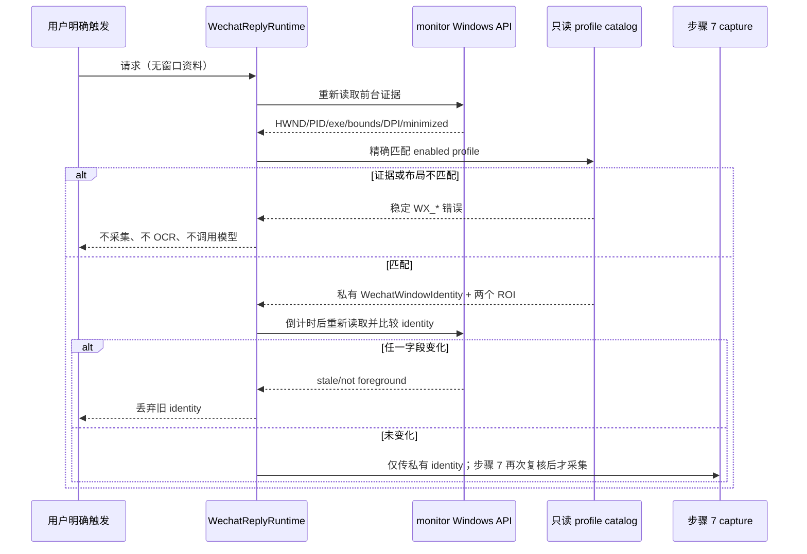

# 步骤 6：实现前台微信识别和版本化布局 compatibility profile

> 文档状态：实施前技术方案（仅方案设计）
> dispatch：`aich8-zhuochong-desktop-pet-rag-27-steps-20260805-task-06`
> LOOF run：`20260806-task-06-windows-wechat-compatibility-profile`
> 前置基线：步骤 4 已冻结 `WX_NOT_FOREGROUND`、`WX_PROFILE_UNSUPPORTED`、`WX_WINDOW_UNSUPPORTED`、`CaptureVersion` 与 `BindingGeneration`；步骤 5 已接入仅保存 profile ID 的安全配置和空 `CaptureCoordinator`，尚未采集、OCR 或调用模型。

## 0. 方案设计原则

- **默认拒绝**：只有重新读取到的前台 Windows 微信窗口，同时具有受支持档案、可执行文件证据、有效窗口几何和 DPI 时，才向步骤 7 返回内部 `WechatWindowIdentity`。任一证据缺失、不同或变化均在截图前终止。
- **证据不能伪造**：`config.json` 和设置页只能选择 profile ID；可执行文件 allowlist、文件指纹、版本、DPI、窗口约束、显示器拓扑、`chatRoi`、`headerIdentityRoi` 均由受版本控制的 profile 目录提供。窗口标题或 `app_name == "WeChat"` 只可用于普通 Work Review 展示，绝不单独放行。
- **最小扩展**：只扩展 `monitor.rs` 的 Windows 前台观测能力，并在既有 `wechat/` 模块实现 profile 解析与纯校验；不重构 Work Review 前台监控、截图、OCR、桌宠、配置保存或主窗口生命周期。
- **最小暴露**：`HWND`、内部窗口令牌、PID、进程启动时间、可执行文件路径/指纹只留 Rust 后端的短生命周期对象；不序列化、不写普通日志、不经 Tauri command/event/UI/模型 payload 暴露。
- **不扩权**：不读取微信数据库、协议、内部控件或 UI Automation，不点击、滚动、切换聊天、输入、粘贴或发送；本步骤也不创建截图、OCR、检索或模型调用。

## 1. 背景、目标与非目标

### 1.1 当前基线

- `desktop/src-tauri/src/monitor.rs` 的 Windows `get_active_window_fast()` 已读取 `GetForegroundWindow`、PID、`QueryFullProcessImageNameW`、`IsIconic`、`GetWindowRect`，并向原 Work Review 路径返回 `ActiveWindow { app_name, window_title, executable_path, window_bounds, is_minimized }`。
- 该实现可在进程信息不可读时从标题推断显示用 `app_name`；此降级对既有使用时长/展示有效，但对微信采集门禁不具备身份强度。
- `desktop/src-tauri/src/wechat/config.rs` 目前只有准备中的 catalog 占位项；`WechatReplyRuntime` 与 `CaptureCoordinator` 是不进行采集的空骨架。步骤 6 必须替换这个占位信任判断，不能把它当成已验证 profile。
- 正式需求只承诺经过实机验证的 Windows 11 x64 与 Windows 微信 4.0.x 精确小版本、主题、DPI、窗口尺寸和显示器布局；当前 macOS 开发环境不能产出这些实机证据。

### 1.2 可验收目标

1. Windows 后端可取得同一前台窗口的内部实例身份、PID、可执行文件证据、矩形、实际 DPI 与最小化状态，而不改变 `ActiveWindow` 现有公开字段和普通 Work Review 行为。
2. profile 校验必须同时匹配 exe 证据、目标产品版本、主题/布局、DPI、窗口尺寸、显示器拓扑和两个归一化 ROI；任一不匹配返回稳定错误，绝不采集。
3. 倒计时结束、截图前和后续绑定复核均重新读取前台窗口；窗口实例/PID/边界/DPI/profile 任一变化使旧身份失效。
4. 目标 Windows 探针形成可复核的冻结 profile 证据；在证据尚未取得前，catalog 没有 enabled profile，所有请求 fail-closed。

### 1.3 明确非目标

- 不实现步骤 7 的像素采集、覆盖层隐藏、裁剪、`CaptureCoordinator` 并发控制或临时图像。
- 不实现步骤 8 OCR、步骤 9 请求运行时/落盘、模型、RAG、剪贴板或桌宠气泡。
- 不把 `HWND`、PID 或路径持久化到 config、追踪、数据库或聊天知识库；不新增数据库表、缓存、网络请求或 Windows 服务。
- 不将任意用户设置的 appName、进程名、路径、ROI 或版本字符串作为放行条件。

## 2. 最小文件范围与职责

| 路径 | 动作 | 职责 |
| --- | --- | --- |
| `desktop/src-tauri/src/monitor.rs` | 修改（仅 Windows 分支及纯辅助函数） | 在既有前台读取中生成私有 `ForegroundWindowEvidence`：不透明实例 token、PID、可执行文件身份、启动时间（可取得时）、矩形、DPI、最小化与前台快照；保留旧 `ActiveWindow` 返回形状。 |
| `desktop/src-tauri/src/wechat/window_identity.rs` | 新增 | 定义后端私有 `WechatWindowIdentity`、`CompatibilityFailure`、纯 profile 校验与重读一致性比较。 |
| `desktop/src-tauri/src/wechat/profiles.rs` | 新增 | 解析、schema 校验并只加载随包冻结的 profile；拒绝未知 schema、空 allowlist、无签名/无证据或 ROI/几何非法项。 |
| `desktop/src-tauri/src/wechat/profiles/windows-wechat-v1.json` | 新增（Windows 探针验收后填入） | 唯一 production profile 数据源。无真实 Windows 探针及可执行文件证据前保持无 `enabled` profile，不写猜测版本、路径、hash 或 ROI。 |
| `desktop/src-tauri/src/wechat/config.rs` | 修改 | 删除“非空 signature_material 即 trusted”的占位判断；设置页选项只来自 schema 已验证且 `enabled` 的 profile 摘要。 |
| `desktop/src-tauri/src/wechat/runtime.rs`、`desktop/src-tauri/src/wechat/mod.rs` | 最小修改 | 增加仅供后续步骤调用的 `validate_foreground_wechat(...)` 门面与模块声明；仍不启动采集。 |
| `desktop/src-tauri/src/wechat/*.rs` 的单元测试 | 新增/修改 | 覆盖 JSON schema、证据匹配、ROI、DPI、多屏与重读失配；使用合成数据，不依赖 Windows 微信或真实聊天。 |
| `kaifa/kaifa_test/windows-wechat-profile-probe.md` | 实施时新增 | 记录目标 Windows 的人工探针命令、环境、profile 内容摘要、文件哈希和通过/阻断证据；不记录聊天正文或截图。 |

不改 `desktop/crates/core/src/config.rs`、Svelte 设置页、`screenshot.rs`、`ocr.rs`、数据库、普通 `ActiveWindow` 消费方和 Work Review 原有 UIA 浏览器 URL 路径。

## 3. 内部数据契约与 profile

### 3.1 私有窗口证据

Windows `monitor.rs` 保留现有 `get_active_window_fast()`，并新增仅 `pub(crate)` 可用的前台证据读取函数；不要把字段塞进 `ActiveWindow`，避免原有 command/日志路径意外获得敏感内部句柄。

```rust
// 仅 src-tauri Rust 内部使用；不 derive Serialize。
pub(crate) struct ForegroundWindowEvidence {
    instance: WindowInstanceToken,       // 由 HWND + PID + 进程启动时间（可得）构成的不可逆进程内 token
    pid: u32,
    executable: ExecutableEvidence,      // 规范路径、文件名、ProductVersion、SHA-256
    bounds_px: WindowBounds,
    dpi: u32,                            // GetDpiForWindow(hwnd)，不是系统默认 DPI
    is_minimized: bool,
}

pub(crate) struct WechatWindowIdentity {
    instance: WindowInstanceToken,
    pid: u32,
    title_hint: String,                  // 仅当前请求内供后续 header OCR 关联，不作为准入证据
    bounds_px: WindowBounds,
    dpi: u32,
    profile_id: String,
    profile_version: String,
    chat_roi: NormalizedRoi,
    header_identity_roi: NormalizedRoi,
}
```

实现约束：

1. 继续一次性读取 `GetForegroundWindow`、`GetWindowThreadProcessId`、`IsIconic`、`GetWindowRect`；在同一 Windows 分支补 `GetDpiForWindow(hwnd)`。空 HWND、PID 为零、最小化、取矩形/DPI/进程证据失败均不允许降级为标题猜测。
2. 读取 `QueryFullProcessImageNameW` 后，以 Unicode/分隔符和大小写规范化的绝对路径比对 allowlist。随后只对已匹配的候选文件计算 SHA-256，读取其 Windows `ProductVersion`；读取/哈希失败即为 exe 证据不足，不把文件名相同当作成功。
3. `WindowInstanceToken` 只支持同一进程内相等比较；它不能显示、序列化、保存或由前端传回。用 HWND、PID 和可得的进程启动时间构成 token；若启动时间不可得，仍须以当前 HWND + PID 比较，并把 identity confidence 降为受 profile 规则约束的可接受/拒绝结果，不能伪称强证据。
4. `title_hint` 只保留必要长度、去控制字符；它不参加 exe/profile 放行，亦不写普通日志。步骤 7/13 才以同一帧 header ROI 得到可复核聊天线索。

### 3.2 `windows-wechat-v1.json` schema

profile 作为安装包内受版本控制的资源，用 `include_str!` 解析；运行时不从用户目录下载、覆盖或编辑。建议 schema：

```json
{
  "schema_version": 1,
  "catalog_version": "windows-wechat-v1",
  "profiles": [
    {
      "id": "wechat-windows-4.0.x-<build>-<theme>-<dpi>-<layout>",
      "enabled": false,
      "profile_version": "1",
      "wechat_product_version": "<Windows 实机精确值>",
      "theme": "<light|dark 及实测标识>",
      "display_topology": { "monitors": 1, "target_monitor": "primary" },
      "executable": {
        "file_name": "WeChat.exe",
        "normalized_paths": ["<实测安装路径>"] ,
        "sha256": "<实测 SHA-256>",
        "product_version": "<实测 ProductVersion>"
      },
      "dpi": 96,
      "window_size_px": { "width": 1280, "height": 900, "tolerance_px": 2 },
      "chat_roi": { "left": 0.20, "top": 0.16, "right": 0.98, "bottom": 0.91 },
      "header_identity_roi": { "left": 0.20, "top": 0.05, "right": 0.60, "bottom": 0.15 },
      "probe_evidence": {
        "probe_id": "<脱敏 UUID>",
        "validated_at": "<UTC RFC3339>",
        "windows_build": "<实测 Windows 11 build>",
        "evidence_sha256": "<探针报告 hash>"
      }
    }
  ]
}
```

上例仅说明字段，尖括号和示例 ROI 不能进入 production profile。真实 profile 必须由目标 Windows 探针生成后，经人工复核填入。解析时必须要求：schema/catalog/profile 版本已支持；ID 唯一；`enabled=true`；exe 文件名、规范路径、文件 SHA-256、ProductVersion、Windows build、主题、拓扑、DPI、宽高均明确；两个 ROI 均为有限数且满足 `0 <= left < right <= 1`、`0 <= top < bottom <= 1`。一项缺失/未知/重复即拒绝整个候选，不做“最接近 profile”匹配。

### 3.3 放行与错误映射

| 检查顺序 | 条件 | 失败结果 | 后续行为 |
| --- | --- | --- | --- |
| 1 | 重读前台 HWND 成功，PID 非零且未最小化 | `WX_NOT_FOREGROUND` / `WX_WINDOW_UNSUPPORTED` | 立即停止。 |
| 2 | 矩形非零、在 profile 允许范围、实际 DPI 可读 | `WX_WINDOW_UNSUPPORTED` | 不裁剪、不推断 DPI。 |
| 3 | 进程路径、文件名、SHA-256、ProductVersion 均匹配 allowlist | `WX_PROFILE_UNSUPPORTED` | 标题/appName 不参与补救。 |
| 4 | 主题、Windows build、显示器拓扑、DPI、窗口大小匹配一个 enabled profile | `WX_PROFILE_UNSUPPORTED` | 不选“相似” profile。 |
| 5 | `chatRoi`、`headerIdentityRoi` 通过 schema/边界校验 | `WX_PROFILE_UNSUPPORTED` | 不调用截图。 |
| 6 | 需要使用 identity 前再次读取；token/PID/bounds/DPI/profile 全相同 | `WX_NOT_FOREGROUND` 或 `WX_REQUEST_STALE` | 使本次 identity/capture 失效。 |

当两个 profile 同时匹配，视为 catalog 错误并 fail-closed；不按文件排列顺序选择。`WX_WINDOW_UNSUPPORTED` 用于窗口状态/几何/DPI取值失败，`WX_PROFILE_UNSUPPORTED` 用于不可信 exe 或与冻结档案不符，保持步骤 4 的稳定 wire 值。

## 4. 流程与时序



1. 后续用户手动入口创建请求后，先调用 `validate_foreground_wechat()`；它不接收前端传来的 PID、路径、窗口矩形、标题、DPI 或 profile 内容。
2. 若桌宠入口导致失焦，运行时只保留有界倒计时状态；倒计时到期必须完整重读和重新匹配，绝不复用首次 `ForegroundWindowEvidence`。
3. 验证成功后只返回后端私有 `WechatWindowIdentity` 给步骤 7。步骤 7 在隐藏覆盖层前、真实 capture worker 完成后继续重读并比较；本步骤不提前声明 capture 成功。
4. 任何失败只产生非正文的稳定阶段/错误码；不记录窗口标题、路径、文件哈希、聊天内容或截图，且模型/RAG/OCR transport 计数保持 0。

## 5. Windows 实机探针、资料冻结与回滚

### 5.1 探针步骤

1. 在目标 Windows 11 x64、拟支持的微信精确小版本、主题、显示器布局、DPI 和窗口大小上运行只读 probe；记录 OS build、exe 规范路径/文件名、SHA-256、`ProductVersion`、PID 可读性、`GetDpiForWindow`、窗口物理像素矩形和拓扑。
2. 在用户自愿准备的非敏感测试会话，以人工测量/复核方式确定 chat/header 两个窗口相对 ROI；probe 报告只保存坐标与 hash，不保存截图或 OCR 正文。
3. 人工复核 profile 的全部字段与报告；生成 `windows-wechat-v1.json` 的 enabled 条目及 `kaifa/kaifa_test/windows-wechat-profile-probe.md`。如果任一项无法证实，profile 维持 disabled，实施不允许以标题猜测临时放行。
4. 在相同冻结条件重复验证成功；更换微信小版本、exe 文件、主题、DPI、窗口尺寸或显示器拓扑后，旧 profile 立即不适用，必须新建 profile、重跑步骤 6/7/14 验收，不能原地放宽 tolerances。

### 5.2 回滚

本步骤的回滚仅撤销 `monitor.rs` 的私有 Windows 观测扩展、微信 profile/identity 模块及其测试；删除或禁用本步骤新增 profile。不得修改 Work Review 普通前台统计、`ActiveWindow`、截图、OCR、步骤 4 契约、步骤 5 设置和其他 LOOF run。已发布的错误 profile 用后续补丁将其置为 disabled，避免继续采集；不能仅在设置页隐藏。

## 6. 实施顺序

1. 复核当前 `monitor.rs` Windows API/import 和所有 `ActiveWindow` 消费方；先为纯 profile/ROI/实例比较写测试，保证新增内部类型不改变公共显示 DTO。
2. 在 Windows 分支抽出私有前台证据读取，复用现有 HWND/PID/path/bounds/minimized 读取，补 `GetDpiForWindow`、可得的进程启动时间和可执行文件版本/hash；非 Windows 不提供伪实现放行。
3. 新增 `profiles.rs` 与只读 JSON schema 验证；把 `wechat/config.rs` 的占位 catalog 改为只列出已启用且经 schema 校验的项目。没有实机证据时选项为空，状态为不支持。
4. 新增 `window_identity.rs` 的精确匹配、二次读取比较和稳定错误映射；接至 `WechatReplyRuntime` 的只读校验门面，不接截图/OCR/模型 command。
5. 在目标 Windows 执行 probe、人工复核并冻结第一条 profile；若无法取得证据，交付 fail-closed 实现和 blocker 记录，不能填写虚构值。
6. 补 Rust 单元/契约测试与 Windows 手工 UAT；实施阶段在 `kaifa/kaifa_personnel/mingling.md`、`kaifa/kaifa_test/test.md` 记录实际执行命令和真实结果。

## 7. 测试方案与通过标准

| 场景 | 层级 | 必须证明 |
| --- | --- | --- |
| 标题含“微信”但 PID/path/sha/version 缺失或不符 | Rust fake evidence | `WX_PROFILE_UNSUPPORTED`；没有 capture/OCR/model/RAG 调用。 |
| 正确 exe 但未知/disabled profile、主题、OS build、拓扑、DPI 或窗口尺寸不符 | Rust pure profile validator | 精确拒绝，不选近似档案。 |
| ROI 为 NaN、边界相等/反向/超出 0..1 | Rust JSON/schema | catalog 加载失败且 profile 不可选。 |
| 同标题不同 HWND，或同 HWND 不同 PID/启动时间 | Rust token/comparator | token 不相等；旧 identity 失效。 |
| 倒计时期间切换窗口、最小化、关闭、移动/缩放或切 DPI | fake monitor + Windows 手工 | 二次读取拒绝；截图前失败。 |
| 副屏负坐标、不同 DPI、窗口边界 | 纯函数 + Windows 手工 | 物理像素 bounds/DPI 被正确保留；不使用全局 DPI。 |
| 合法冻结 profile + 目标 Windows 微信 | Windows probe/UAT | 返回私有 identity 和两个有效 ROI；尚未创建图片或调用 OCR。 |
| JSON/Tauri 边界 | Rust serialization/command audit | 不出现 HWND、token、PID、路径、hash、ROI、标题或聊天正文。 |
| Work Review 回归 | 既有定向测试与 diff | `ActiveWindow` 字段/普通前台统计、浏览器 URL 路径和非 Windows 构建未被破坏。 |

实施阶段建议记录实际结果的命令（Windows probe/包路径以受控机器实际值为准）：

```bash
cargo test --manifest-path desktop/src-tauri/Cargo.toml wechat::profiles
cargo test --manifest-path desktop/src-tauri/Cargo.toml wechat::window_identity
cargo test --manifest-path desktop/src-tauri/Cargo.toml monitor::
cargo fmt --manifest-path desktop/Cargo.toml --check
git diff --check -- desktop/src-tauri/src/monitor.rs desktop/src-tauri/src/wechat kaifa/kaifa_test
```

`cargo fmt` 当前是否可用必须由实施环境实际记录；没有 Windows 实机 probe、真实微信和完整截图/OCR 的结果均不能标记为通过。

## 8. 风险与防护

| 风险 | 防护 |
| --- | --- |
| 以标题/`app_name` 误认微信 | 微信门禁仅消费 `ForegroundWindowEvidence` 与 exe/profile 精确匹配；标题猜测不能通过。 |
| profile 被配置或用户修改绕过 | 配置只保存 ID；profile 编译进只读 catalog，schema/签名/证据缺失即禁用。 |
| DPI 或副屏导致后续 ROI 偏移 | 每次目标窗口 `GetDpiForWindow`，保存物理 bounds；步骤 7 使用 capture origin 再换算。 |
| HWND 被复用或用户切窗 | token 结合 HWND/PID/可得启动时间，倒计时/截图前后均重新读取比较。 |
| 路径泄露或被替换 exe 冒充 | 路径、文件名、SHA-256、ProductVersion 共同匹配；内部证据不序列化/持久化。 |
| macOS/CI 无法证明 Windows 行为 | 纯函数覆盖所有拒绝规则；Windows 条目在实机证据前 disabled，发布/UAT 保持 blocked。 |
| scope 蔓延到 UI 自动化或采集 | 本步骤只验证身份；测试审计没有 UIA、键鼠、截图、OCR、模型、网络或数据库调用。 |

## 9. 完成定义

本步骤完成仅表示：前台微信身份、版本化 profile 和布局准入具备最小、可测试、fail-closed 的设计与实施依据。它不表示已经截图、识别聊天、生成建议、完成 M1/M2 或通过 Windows 发布验收。只有 profile 的目标 Windows 探针、可执行文件证据和后续步骤 7 的捕获验收全部完成后，系统才可实际采集。
