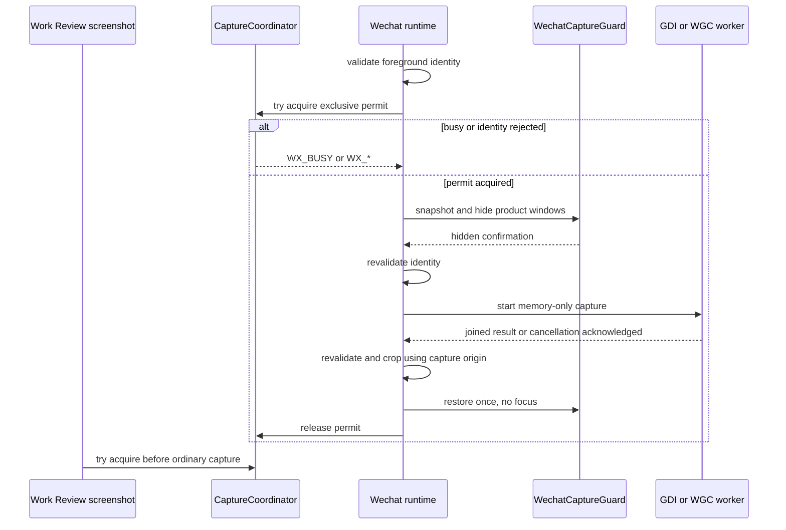

# 步骤 7：复用 Work Review 截图 primitive 实现临时微信裁剪与隐藏恢复

> 文档状态：实施前技术方案（仅方案设计）
> dispatch：`aich8-zhuochong-desktop-pet-rag-27-steps-20260805-task-07`
> LOOF run：`20260806-1001-步骤-7复用-work-review-截图-primitive-实现临时微信裁剪与隐藏恢复dis`
> 前置基线：步骤 6 已提供私有 `WechatWindowIdentity`、受冻结 profile 约束的 `chat_roi` / `header_identity_roi` 与截图前后重读接口；`CaptureCoordinator` 目前只是 managed-state 空类型，尚未采集像素。

## 0. 方案设计原则

- **复用而不改变原行为**：只在 `desktop/src-tauri/src/screenshot.rs` 抽取 GDI BitBlt 与 WGC 共用的“窗口所在显示器像素帧”能力；`ScreenshotService::capture_for_window()` 继续生成 Work Review 的归档 JPEG 与 OCR 临时 PNG，调用方和清理语义不变。
- **微信帧默认不落盘**：步骤 7 的临时帧、窗口裁剪图、chat/header ROI 和 OCR 输入全部是内存对象。内容留存关闭时，不创建 `screenshots/`、`ocr_source_path`、临时 PNG 或其他文件；步骤 8 若尚只支持路径输入，必须先增加内存输入适配，不能借临时文件绕过此边界。
- **先停 worker，后恢复覆盖层**：失败、取消和超时都可把请求结果返回为失败，但 `WechatCaptureGuard` 只能在 GDI/WGC worker 已完成或已收到真实取消确认后恢复。绝不以丢弃 `spawn_blocking` handle 作为“取消”。
- **坐标均为物理像素**：窗口 bounds 已是 Windows 物理像素；先以 `window_global - capture_origin` 得到帧内窗口矩形，再按同一 profile 的归一化 ROI 裁剪。DPI 只用于确认两次 identity 与坐标空间一致，不能把逻辑坐标直接当像素。
- **不扩展产品权限**：仅读取当前前台、已通过步骤 6 profile 的微信窗口屏幕像素；不读取微信数据库/协议/内部控件，不使用 UI Automation，不切换窗口或聊天，不注入、键鼠模拟、粘贴或自动发送。

## 1. 背景、目标与非目标

### 1.1 当前依据

- `screenshot.rs` 的 Windows `capture_with_gdi()` 已使用 `capture_target_monitor_rect()` 的显示器物理原点进行 BitBlt，并直接获得 RGBA 像素；但它只返回 `(pixels, width, height)`，调用者无法知道 capture origin。
- 同文件 `capture_with_wgc()` 目前以 `Frame::save_as_image()` 写出 `*_temp.png`，随后由 `persist_existing_png_capture()` 迁移为 OCR 源图与归档。这是普通 Work Review 的既有落盘路径，不能用于微信 ephemeral 捕获。
- `wechat/window_identity.rs` 已以 HWND token、PID、bounds、DPI、profile ID/version 精确重读；`wechat/runtime.rs` 已有 `validate_foreground_wechat()` 与 `revalidate_foreground_wechat()`，但没有 capture 实现。
- `avatar_engine.rs` 已有 `AVATAR_WINDOW_LABEL`、`hide/show` 与 `set_ignore_cursor_events`。气泡和卡片是该桌宠 Webview 的内容，不是独立截图窗口；主窗口标签为 `main`。现有 `reveal_main_window()` 会显式 `set_focus()`，本步骤不得调用它。

### 1.2 可验收目标

1. 受支持的前台微信只可获得一次内存 `EphemeralCapturedFrame`，其包含像素、尺寸、capture origin 与物理坐标空间；普通 Work Review 截图产物/行为不变。
2. 通过 `CaptureCoordinator`，微信隐藏事务与普通后台截图不会并发；等待 coordinator、前端隐藏确认、capture worker 时不持有 `Arc<Mutex<AppState>>`。
3. 所有已隐藏的产品窗口在成功、截图失败、取消、超时、identity stale 和 worker panic 后恢复到进入前状态，且不调用 focus、show 后 focus 或窗口激活 API。
4. chat 与 header 均由同一帧、同一 identity/profile 计算；负坐标、副屏和 DPI 不一致均 fail-closed，不把整块显示器图当聊天图。
5. macOS/CI 的合成测试只证明纯坐标、守卫和串行契约；真实 Windows 成功、失败、超时、取消尚未执行前必须标记为 **待验证**，不得写为已通过。

### 1.3 明确非目标

- 不做 OCR、消息比较、聊天/联系人识别、模型、RAG、剪贴板、建议气泡或内容留存实现（分别属于后续步骤）。
- 不修改普通 Work Review 的 `ScreenshotResult`、归档规则、OCR 临时文件清理、后台活动记录或已有截图 UX。
- 不为未知微信版本、主题、DPI、显示器布局或 profile 增加猜测性裁剪；步骤 6 未放行即不隐藏、不截图。

## 2. 最小文件范围与职责

| 路径 | 动作 | 最小职责 |
| --- | --- | --- |
| `desktop/src-tauri/src/screenshot.rs` | 修改 | 从 GDI/WGC 提取只在 Rust 内部使用的无落盘帧 primitive；补 capture origin/坐标空间与纯裁剪辅助函数；原 `capture_for_window()` 继续经现有 persist 分支。 |
| `desktop/src-tauri/src/wechat/runtime.rs` | 修改 | 让现有 `CaptureCoordinator` 持有短生命周期异步互斥/许可证；新增后端私有的微信捕获门面和 worker 生命周期编排。 |
| `desktop/src-tauri/src/wechat/capture.rs` | 新增 | 定义 `EphemeralCapturedFrame`、窗口/ROI 裁剪结果、`WechatCaptureGuard`、取消与超时状态；只接收私有 identity，绝不 Serialize。 |
| `desktop/src-tauri/src/wechat/mod.rs` | 最小修改 | 声明/重导出内部 capture 模块；不开放到 Tauri command 或前端。 |
| `desktop/src-tauri/src/wechat/types.rs` | 最小修改 | 仅在缺少内部捕获结果类型时补充；沿用既有 `WX_BUSY`、`WX_CAPTURE_FAILED`、`WX_CAPTURE_TIMEOUT`、`WX_REQUEST_CANCELLED`、`WX_REQUEST_STALE`，不改 wire 值。 |
| `desktop/src-tauri/src/main.rs` | 最小修改 | 在普通 `background_screenshot_task()` 取得同一 coordinator 许可再调用原截图服务；不在持有 `AppState` 锁时等待。仅在后续受控微信入口接入 capture 门面，不添加 UI 自动化入口。 |
| `desktop/src-tauri/src/avatar_engine.rs`（如缺必要查询） | 最小修改 | 只提供无焦点的窗口可见性/位置/尺寸/穿透状态快照与恢复小助手；不重构桌宠渲染或事件协议。 |
| 上述模块的单元测试 | 新增/修改 | 覆盖坐标、ROI、guard 的幂等恢复、串行/取消契约和普通截图回归。 |

不改数据库、知识库、OCR 后端、Svelte 业务 UI、微信配置/profile 格式、`monitor.rs` 的步骤 6 身份证据逻辑，亦不增加截图文件目录。

## 3. 内部数据与接口契约

### 3.1 无落盘帧

```rust
// 均为私有 Rust 类型；不 Serialize、不写普通日志。
pub(crate) struct EphemeralCapturedFrame {
    pixels_rgba: Vec<u8>,
    width_px: u32,
    height_px: u32,
    capture_origin_px: (i32, i32),
    coordinate_space: PhysicalPixels,
}

pub(crate) struct WechatCaptureSlices {
    request_id: RequestId,
    capture_version: CaptureVersion,
    chat_rgba: image::RgbaImage,
    header_identity_rgba: image::RgbaImage,
    // 仅当前请求的 identity/profile snapshot；不对 UI/模型暴露。
}
```

`capture_origin_px` 是像素 `(0, 0)` 对应的虚拟桌面物理坐标：GDI 使用已得到的 `(source_x, source_y)`；WGC 必须从同一个目标显示器的物理 `rcMonitor.left/top` 取得。两个 provider 都返回此信息，不能只以 width/height 推断。

通用 primitive 的输入为已经由步骤 6 验证的目标显示器/窗口证据，而不是前端传入的 HWND、矩形或 ROI。普通截图仍可调用 primitive 后进入原有 persist 流程；微信路径只消费内存结果。

### 3.2 坐标与 ROI

1. capture 前调用 `revalidate_foreground_wechat(identity)`；失败即返回稳定错误，不创建 guard 或 worker。
2. 取得帧后、裁剪前再次重读同一 identity。HWND token、PID、bounds、DPI、profile ID/version 或前台状态改变，立即释放像素并报 `WX_REQUEST_STALE`/`WX_NOT_FOREGROUND`。
3. 计算 `window_left = bounds_px.x - capture_origin_px.0`、`window_top = bounds_px.y - capture_origin_px.1`，并验证窗口矩形完全在帧内、宽高非零、帧与 identity 均为物理像素。任一溢出、负值、DPI 不同或 capture origin 不可证实即 `WX_CAPTURE_FAILED`。
4. 对窗口矩形以 profile `NormalizedRoi` 使用向下取整 left/top、向上取整 right/bottom，并将结果 clamp 前先验证不越界且宽高至少 1。分别裁 `chat_roi` 与 `header_identity_roi`；不得让两者互相覆盖或将显示器整图传给下一步。
5. 同一主聊天捕获创建新的单调 `CaptureVersion`，绑定 `RequestId`、完整 identity 和 profile version；窗口矩形变化令旧 capture 失效。以后仅为 binding 复核采 header 时创建独立 `BindingObservationVersion`，绝不覆写本次 `CaptureVersion`。

### 3.3 协调器、守卫与无焦点恢复

`CaptureCoordinator` 使用一个共享、可取消的 capture 许可。普通 Work Review 后台截图在真正调用 `capture_for_window()` 前取得许可；微信流程在隐藏任何窗口前取得许可。普通后台任务若短时无法取得许可按既有“本轮无截图”语义跳过，不排队积压；微信请求若许可被占用返回 `WX_BUSY`，不隐藏窗口。两条路径都在等待期间不持有 `AppState`。

`WechatCaptureGuard::begin(app, identity)` 的最小责任：

1. 只枚举已知产品窗口 `avatar` 与 `main`，记录窗口是否存在/可见、物理位置和大小；桌宠的展开/穿透配置从已有应用状态取得一个短快照，读取后立即释放锁。气泡/卡片随 `avatar` Webview 隐藏，不另建窗口或猜测其前端状态。
2. 先 hide 已存在且可见的产品窗口，再等待由后端可观测的隐藏完成；若现有 Tauri API 无法提供可靠“已隐藏”确认，实施必须补最小的前端确认事件并带本次 request token。确认失败/超时也进入恢复，不截图。
3. guard 只用 `hide/show`、`set_position`、`set_size`、`set_ignore_cursor_events` 恢复自己改动过的属性；恢复顺序为几何/穿透/展开状态，再 `show` 原先可见窗口。原先隐藏的窗口保持隐藏。全程禁止 `set_focus`、`unminimize`、`reveal_main_window`、激活或切换前台 API。
4. guard 保存 worker completion/cancellation acknowledgement；`Drop` 仅作为 panic-safe 兜底，正常 async 流程必须显式 `finish_after_worker()`，确保不会在仍可能截图的 WGC worker 前恢复。
5. 嵌套 begin 以每个 guard 的独立快照和 restore-once 标记处理：内层只恢复其进入时的隐藏状态，外层最后恢复初始状态；重复 finish/drop 不重复 show。

## 4. 核心流程与异常分流



| 分支 | 处理 | 必须保持的事实 |
| --- | --- | --- |
| 许可已占用 | 微信返回 `WX_BUSY`；普通后台截图跳过本轮 | 没有隐藏、像素、OCR 或落盘。 |
| 隐藏确认失败/请求取消 | 不启动 provider，显式恢复 guard | 原有窗口状态恢复，不抢焦点。 |
| GDI 失败 | 在 guard 仍持有时，使用同一内存 primitive 尝试 WGC | 不创建 WGC temp PNG。 |
| WGC 失败/panic | join worker 后映射 `WX_CAPTURE_FAILED` | 再恢复覆盖层，释放像素。 |
| 超时 | 请求标记 `WX_CAPTURE_TIMEOUT`，发送真实取消/stop；仅在 worker join 或取消确认后恢复 guard | 若底层 API不能确认停止，guard/许可继续由后台清理持有，不能伪称“已恢复”。 |
| capture 后 identity 变化、ROI 越界、DPI/原点不一致 | 销毁整帧及切片，返回 `WX_REQUEST_STALE` 或 `WX_CAPTURE_FAILED` | 不 OCR、不保留、不展示。 |
| 正常成功 | 裁剪后将内存切片交给后续步骤，并立即结束 guard/许可 | 本步骤不保存、OCR 或生成回复。 |

WGC 改造约束：当前 `Frame::save_as_image(path, ...)` 是落盘实现，微信 provider 必须基于当前依赖实际可用的 frame buffer/内存编码 API 转为 RGBA；若该版本库无法提供可验证的内存帧，微信 WGC fallback 保持不可用并返回失败，不能退回临时文件。实施前须以该版本 crate 文档/API 编译结果确认具体调用，不能在本方案中捏造 API 名称。

## 5. 内容留存、错误与安全边界

- 本步骤不负责“开启留存”时的正式存储实现。无论开关当前值如何，步骤 7 的 capture primitive 都先是 ephemeral；只有后续有独立、受期限管理的微信内容存储契约时，才允许在其边界显式复制成功的必要对象。
- 失败日志只记录稳定阶段/错误码及不含聊天内容的技术计数；不记录像素、header、标题、路径、PID、HWND、token、ROI、原始 bounds 或文件名。
- 不暴露 `EphemeralCapturedFrame`、identity 或裁剪图给 Tauri command/event/JS；后续步骤仅通过私有 Rust 类型传递。
- 对截图 worker 使用受限超时和取消令牌；禁止将 capture task 移入 detached thread 后释放 guard，也禁止使普通 Work Review 以锁住全局 `AppState` 的方式等待微信完成。

## 6. 测试方案与真实验证状态

| 场景 | 方法 | 通过条件 | 当前状态 |
| --- | --- | --- | --- |
| 普通 Work Review 截图 | 既有 `screenshot.rs` 定向测试和调用路径审计 | 仍生成原 JPEG/OCR 临时 PNG，调用签名和清理语义不变 | 待实施后验证 |
| capture origin/负坐标/副屏 | 纯函数 fake frame：origin `(-1920, 0)`、窗口/ROI 边界 | 先平移再裁剪；越界拒绝，不错裁 | 待实施后验证 |
| DPI/identity 变化 | fake revalidation | 捕获前后任一变更销毁帧并返回 stale | 待实施后验证 |
| GDI/WGC 无落盘 | fake provider + 临时目录观察 | 微信路径不调用 persist/PNG 写入，内存释放 | 待实施后验证 |
| guard 成功、失败、取消、panic | fake window port / 可观测调用序列 | 每一分支 restore-once；无 focus/activate 调用 | 待实施后验证 |
| 超时与迟到 worker | 可控 worker barrier | 未 join/取消确认前不 restore；确认后恰好恢复一次 | 待实施后验证 |
| 与普通截图竞争 | coordinator fake permit | 微信 `WX_BUSY` 或普通本轮跳过；不存在重叠 provider 调用 | 待实施后验证 |
| Windows 真机成功 | Windows 11 + 受支持微信/profile + 非敏感测试聊天 | 聊天/header 正确、无桌宠/气泡、微信仍前台 | **未执行，不能标记通过** |
| Windows 真机失败、超时、取消 | 同一受控真机注入三种路径 | 均恢复覆盖层、无焦点变化、无落盘 | **未执行，不能标记通过** |

实施阶段建议记录实际命令及结果（命令是否能在 macOS/Windows 环境运行须如实注明）：

```bash
cargo test --manifest-path desktop/src-tauri/Cargo.toml screenshot::
cargo test --manifest-path desktop/src-tauri/Cargo.toml wechat::capture::
cargo test --manifest-path desktop/src-tauri/Cargo.toml wechat::window_identity::
cargo fmt --manifest-path desktop/Cargo.toml --check
git diff --check -- desktop/src-tauri/src/screenshot.rs desktop/src-tauri/src/wechat desktop/src-tauri/src/main.rs desktop/src-tauri/src/avatar_engine.rs
```

## 7. 实施顺序、回滚与完成定义

1. 先为 capture-origin 平移、归一化 ROI、边界拒绝和帧释放写纯函数测试；审计当前 `ScreenshotService` 所有普通调用点，冻结其输出语义。
2. 在 `screenshot.rs` 提取 GDI/WGC memory primitive，先让普通路径适配它后仍走既有 persist；再仅为微信调用公开私有 ephemeral 入口。WGC 不具备内存实现时 fail-closed。
3. 实现 `CaptureCoordinator`，先接入普通后台截图的许可，再接微信 capture 门面；全程缩小 `AppState` 锁作用域。
4. 实现 guard 的端口/快照/restore-once 与隐藏确认；添加成功、错误、取消、超时和迟到 worker 测试，确认不调用聚焦 API。
5. 接入步骤 6 的重读 identity、坐标裁剪、版本绑定与稳定错误映射；仍不接 OCR/模型/持久化。
6. 在受控 Windows 真机按表执行四类验证。没有实机证据时，保留 fail-closed 状态和未验证记录，不能放宽 profile 或宣称通过。

回滚只撤销本步骤新增的 ephemeral primitive、微信 capture/guard/coordinator 接入及其测试；普通 Work Review 截图必须仍可独立工作。若生产发现恢复/焦点风险，立即禁用微信 capture 入口，使其返回 `WX_NOT_READY`/稳定捕获错误；不得以重新启用临时文件、UI 自动化或强制聚焦作为补救。

本步骤完成仅表示拥有可实施、可测试的最小设计。它不表示 Windows 实机已成功截取微信，也不表示 OCR、聊天识别、RAG、模型建议或自动动作已实现。

## 8. 代码实施修改顺序

1. `screenshot.rs`：内存帧 primitive、origin 与 ROI 纯函数及测试；保证普通 persist 分支无语义变化。
2. `wechat/capture.rs`、`wechat/runtime.rs`、`wechat/mod.rs`、`wechat/types.rs`：私有 capture/guard/coordinator 生命周期、错误映射与单元测试。
3. `main.rs`：为既有普通后台截图套用 coordinator 许可；接入后续受控微信入口时不扩大 Tauri command 面。
4. `avatar_engine.rs`：仅当守卫所需状态无现成无焦点读取/恢复接口时补最小助手及测试。
5. `kaifa/kaifa_log/`、`kaifa/kaifa_test/`：实施阶段记录实际命令、平台、结果与 Windows 未验证项；不在本方案阶段伪造运行结果。
