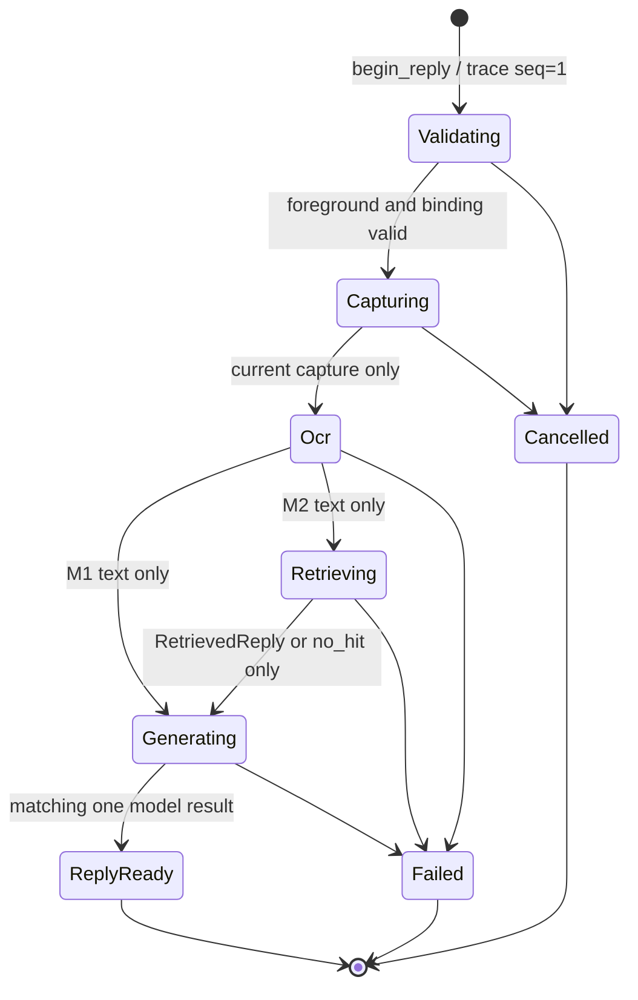

# 步骤 9：实现单请求运行时、阶段追踪和内容留存

> 文档状态：实施前技术方案（仅方案设计）
> dispatch：`aich8-zhuochong-desktop-pet-rag-27-steps-20260805-task-09`
> LOOF run：`20260806-1236-步骤-9实现单请求运行时阶段追踪和内容留存dispatch_idaich8-zhuochong-`
> 前置基线：步骤 4 已冻结 `RequestId`、`SuggestionGeneration`、`BindingGeneration`、`BindingObservationVersion`、M1/M2 合法状态迁移和 M2 先检索后生成的类型边界；步骤 5 已提供默认关闭的微信留存配置；步骤 7/8 已将临时微信截图、OCR 输入和 OCR 失败出口限定在私有、内存路径。本步骤只把这些既有契约接到一个可取消、single-flight、可审计的后端运行时；不交付用户触发入口、模型 transport、M2 检索/导入或 Windows 实机功能。

## 0. 方案设计原则（自检清单）

- **复用既有契约，不并行造轮子**：复用 `wechat/types.rs` 的 ID/代际 newtype、`state_machine.rs` 的状态合法性和 `CaptureCoordinator` 的非排队 capture permit。运行时不自行定义第二份 request ID、状态枚举或 capture version。
- **一个进程内请求，拒绝而非排队**：`WechatReplyRuntime` 持有一个短时互斥的 active-request slot；只有成功领取 slot 的请求才能在 `Validating` 前写入 trace，第二请求直接返回稳定 `WX_BUSY`，不创建任务、不产生内容文件、不覆盖当前 suggestion。
- **阶段证据先于结论**：每次阶段变更由 runtime 在同一个临界区验证预期状态、递增 `stage_seq`、更新 active snapshot，再向 `ReplyTraceStore` 追加一条事件。trace 写入失败、磁盘满、序列化失败或阶段不匹配均 fail-closed，不能继续调用 OCR、检索或模型。
- **正文默认零落盘**：非正文 trace 与可选正文内容分属 `data_dir/wechat_reply/trace/` 和 `data_dir/wechat_reply/content/`；`content_retention_enabled=false` 时绝不创建 content 目录或正文文件，trace 中也绝不含截图、OCR、excerpt、建议、裸 query 或本地绝对路径。
- **只限本功能的本地数据**：不写 Work Review SQLite、不接入 `screenshots/`、`ocr_logs/`、普通日志、assistant history、上传队列、MCP/Bot/Agent、localhost API 或知识源。微信请求内容永不自动成为知识库 source；M2 来源正文只能由后续 `KnowledgeStore` 依权限重取。
- **最小可回滚实现**：追加新微信子模块和受限 command；不重构 `storage.rs`、`remote_upload.rs`、`AppState`、现有数据目录迁移或 Svelte 设置页。Windows profile 仍为空时，运行时须保持 fail-closed，不能把本步骤标成可回复。

## 1. 当前实现、目标与非目标

### 1.1 已核实的可复用基础

1. `desktop/src-tauri/src/wechat/state_machine.rs` 已用 `stage_seq` 拒绝重复/倒退迁移，并把 M1 限为 `Ocr -> Generating`、M2 限为 `Ocr -> Retrieving -> Generating`；`fail_ocr` 与 `fail_retrieval` 已能在下游前终止。
2. `desktop/src-tauri/src/wechat/runtime.rs` 的 `WechatReplyRuntime` 尚不保存 app state、正文或模型 client；`CaptureCoordinator` 已使用 `try_acquire()`，并维护单调 `CaptureVersion`。这可作为 capture 资源竞争的辅助保护，但不能替代完整回复请求的 single-flight 权威。
3. `wechat/ocr.rs` 已只接受 `WechatCaptureSlices.chat_rgba`、为 OCR 结果写脱敏 audit，并对 `Empty`/`Unavailable`/`Failed` 调 `state.fail_ocr`。其 audit sink 目前是临时接口，适合由新的 trace adapter 实现。
4. `crates/core/src/config.rs` 已有 `WechatConfig.content_retention_enabled`（默认 `false`）和 `content_retention_days`（关闭为 0，开启钳制至 1–30）。`AppConfig` 仍通过现有原子 `save`/备份恢复流程持久化。
5. `main.rs` 的 `AppState` 已持有 `data_dir`；`commands/config.rs` 已有只读 data-dir 获取和受管理目录迁移。普通 `StorageManager` 操作 `screenshots/`、`ocr_logs/`，`remote_upload.rs` 从显式传入的普通截图路径上传，二者均不能被微信数据复用。

### 1.2 本步骤可验收目标

1. 任何时刻至多一个微信回复 request 进入 `Validating`；并发第二请求得到 `WX_BUSY` 且 trace/content/model/retrieval/capture 调用计数均为零。
2. 当前 request 的每个实际阶段都有严格递增、从 1 开始的 `stage_seq`，并与 `StateMachine` 的合法迁移原子一致；非法跳转、错 request、过期 binding/capture、取消、超时和晚到结果只能记终态，不能改变 suggestion 或进入下游。
3. 本地 append-only trace 能在重启后按 request ID、时间范围和游标分页读取完整有效 JSONL 行；最后一条截断/损坏行被忽略且诊断为 `trace_tail_recovered`，不能让其前的记录丢失或被伪造续写。
4. 默认仅保存脱敏 metadata。显式开启留存时，截图/OCR/excerpt/建议正文只能写微信专属 content 路径，随 1–30 天策略清理；关闭开关立即阻止新写入，手动删除只删除该 content 根，不删除 trace、原始聊天导出、知识库来源或 Work Review 数据。
5. 只读 trace command 只返回脱敏 DTO；M2 预留 query HMAC、catalog/import/index/retrieval/hit/model 字段，但不实现检索、导入、embedding 或模型网络请求。

### 1.3 明确非目标

- 不新增 `generate_wechat_reply`、自动监听、前端按钮/状态页、桌宠气泡、剪贴板、粘贴、发送、微信 UI Automation、注入、协议或数据库访问；正式 UI 入口属于后续步骤。
- 不实现文本模型 transport、知识源导入、`knowledge_retrieve()` 的实际 Store、SQLite/FTS/向量、query HMAC 密钥生成或跨重启密钥存储。M2 trace 字段仅类型/序列化占位，未具备密钥时不写 query fingerprint。
- 不修改普通 Work Review `StorageManager`、`screenshots/`、`ocr_logs/`、`workreview.db`、`remote_upload.rs` 或其远端配置；不把微信目录加入普通截图上传或数据迁移白名单。
- 不在此步骤声称任何 Windows 微信 profile、OCR、M1/M2 回复或安装包验收通过。当前 production catalog 无 enabled profile，真实执行仍须在早期校验处 fail-closed。

## 2. 最小文件范围与职责

| 路径 | 动作 | 最小职责 |
| --- | --- | --- |
| `desktop/src-tauri/src/wechat/trace.rs` | 新增 | 定义单写者 `ReplyTraceStore`、append/read JSONL、脱敏 trace DTO、分页游标、尾行恢复和 M2 metadata 预留；不是普通日志包装器。 |
| `desktop/src-tauri/src/wechat/content.rs` | 新增 | 定义微信专属正文存储门、留存清理和一键删除；只接收受信任的 request/content token，不接收任意路径。 |
| `desktop/src-tauri/src/wechat/runtime.rs` | 修改 | 把空 `WechatReplyRuntime` 扩为 single-flight request lease、取消/超时/失效校验、原子阶段推进和 trace/content 编排；保留现有 capture helper 行为。 |
| `desktop/src-tauri/src/wechat/state_machine.rs` | 最小修改 | 暴露 runtime 所需的当前 request/mode/版本只读访问器，或新增受限 transition helper；不重写既有迁移表。 |
| `desktop/src-tauri/src/wechat/types.rs` | 最小修改 | 补齐内部 trace/content 所需的严格 newtype/稳定错误码（仅在现有枚举无法表达 trace I/O 或留存失败时）；正文仍保持私有。 |
| `desktop/src-tauri/src/wechat/ocr.rs` | 最小修改 | 让 OCR audit sink 映射到当前 request trace；不得改变聊天图内存边界、fallback 门禁或向 trace 传 OCR 正文。 |
| `desktop/src-tauri/src/wechat/commands.rs`、`commands/mod.rs`、`main.rs` | 最小修改 | 注册独立 managed trace/runtime state 和仅查询/删除微信内容的 command，命令 DTO 不含正文、路径、密钥或 handle。 |
| `desktop/crates/core/src/config.rs` | 最小修改 | 只补本步骤必要的 config round-trip/normalize 测试；沿用已有开关与 1–30 天范围，不增加第二套留存配置。 |
| `desktop/src-tauri/tests/fixtures/wechat_trace/*.jsonl`、`kaifa/kaifa_test/verify_wechat_reply_runtime.py` | 新增 | 虚构 trace fixture、损坏尾行/分页/禁止目录与上传边界检查；不含真实聊天数据。 |
| `kaifa/kaifa_personnel/mingling.md`、`kaifa/kaifa_test/test.md`、`kaifa/kaifa_log/<实施日志>.md` | 后续阶段修改 | 实施命令、实际结果和本步骤代码变更记录；本阶段不写入。 |

不修改 `desktop/src/`、`SettingsWechat.svelte`、数据库 schema、`storage.rs`、`remote_upload.rs`、普通截图/OCR目录和已有 data-dir 迁移逻辑。若后续的用户入口确需显示 trace 或执行删除，必须在对应 UI 步骤另行接入这些 command，不在本步骤提前新增界面。

## 3. 运行时、阶段与取消契约

### 3.1 `WechatReplyRuntime` 的权威 active slot

`WechatReplyRuntime` 改为 managed、可 clone 的轻量协调器，内部为 `Mutex<RuntimeInner>`（只保存 request 元数据、状态机、generation、cancel sender、deadline 和 trace handle；不保存截图/OCR/excerpt/建议正文、`AppState`、`Database` 或模型 client）。新私有 API 的形状以实现为准，但职责固定如下：

```rust
struct ActiveReply {
    request_id: RequestId,
    suggestion_generation: SuggestionGeneration,
    binding_generation: BindingGeneration,
    capture_version: Option<CaptureVersion>,
    state: StateMachine,
    stage_seq: u64,
    deadline: Instant,
    cancel: watch::Sender<bool>,
    model_transport_calls: u8,
}

fn begin_reply(snapshot: BeginReplySnapshot) -> Result<ReplyLease, ContractError>;
fn transition(lease: &ReplyLease, expected: ReplyState, next: ReplyState, detail: TraceDetail)
    -> Result<StageReceipt, ContractError>;
fn cancel_reply(lease: &ReplyLease, reason: CancelReason) -> Result<(), ContractError>;
fn finish_reply(lease: ReplyLease, terminal: ReplyTerminal) -> Result<(), ContractError>;
```

- `begin_reply` 在一个 mutex 临界区检查没有 active request，分配新 `RequestId` 与全局单调 `SuggestionGeneration`，初始化 `StateMachine::new(..., Idle)`，写 `created` trace，然后推进 `Idle -> Validating`。任一 trace 写失败时撤销 slot 并返回 fail-closed 错误；不得出现未追踪的已开始 request。
- 成功返回的 `ReplyLease` 是不可伪造的私有 capability，含 request ID 和 generation；每个异步任务只持有 lease 的只读 clone，完成回调再次入锁比对当前 active request、取消位、deadline、capture/binding/observation generation 和 expected state。
- 若已 active，`begin_reply` 直接 `Err(WxBusy)`。该分支不写 busy request trace（因为请求未创建），但可在现有普通安全日志写无正文计数；不得排队、抢占或自动取消前一请求。
- `cancel_reply` 先设置 `watch`，再在锁内把合法活跃阶段推进为 `Cancelled` 并写 trace；`finish_reply` 只允许 `ReplyReady`/`Failed`/`Cancelled` 的终结记录后清除 slot。超时由 runtime 的 deadline 在每个 stage entry/async completion 处检查，映射既有 `WX_REQUEST_CANCELLED` 或新增且固定的 timeout 错误码（实现前须先确认 wire 契约）；不能依赖调用方“记得检查”。
- `CaptureCoordinator` 仍只序列化 capture transaction；它的 permit 不能取代该 active slot。active request 结束后才允许下一请求获取 slot，避免 capture/OCR/trace 的交叉污染。

### 3.2 原子阶段推进与状态表

所有后续 stage 只能调用 runtime 的 `transition`，不得直接调用 `StateMachine::advance`。该 helper 在同一个 lock 中检查 lease、`expected == current state`、未取消、未超时、所有相关版本仍匹配，使用 `previous_stage_seq + 1` 调现有状态机，再追加 trace；仅在追加成功后提交内存 state。若 JSONL 追加失败，内存 state 保持原值并把 request fail-closed 到可追踪的失败终态；不得继续调用下游。

| 阶段 | 允许的前置状态 | 运行时必须校验 | 可到达状态 |
| --- | --- | --- | --- |
| `validating` | `Idle` | 新 lease、无 active 冲突 | `Validating` |
| `capturing` | `Validating` | 仍前台、profile/binding 快照未变、未取消/超时 | `Capturing` |
| `ocr` | `Capturing` | capture request ID/version 与 lease 匹配，且当前 capture version 未被替换 | `Ocr` |
| `retrieving`（仅 M2） | `Ocr` | OCR 成功、binding/observation 复核、M2 scope 与未来 store snapshot 完整 | `Retrieving` |
| `generating`（M1） | `Ocr` | OCR 成功、lease 当前 | `Generating` |
| `generating`（M2） | `Retrieving` | `RetrievedReply.request_id` 与 lease 相同，检索成功或 `no_hit`，非 `KB_*` 失败 | `Generating` |
| `reply_ready` | `Generating` | 回调 request + suggestion + M2 binding/observation 全匹配，模型调用计数恰为 1 | `ReplyReady` |
| `failed` / `cancelled` | 活跃非终态 | 对应错误/取消原因，且 stage sequence 前进 | terminal |

`Ocr -> Generating` 只在 M1，M2 只能经过 `Retrieving`。`CapturedWechat`、`OcrReadyReply`、`RetrievedReply`、`GeneratedReply` 的 request/generation check 不能由裸字符串或前端参数替代。晚到的 capture/OCR/retrieval/model callback 返回 `WX_REQUEST_STALE`，写入**当前 request 的一个 `stale_result_rejected` metadata 事件（不含正文）**，但绝不改变其阶段、suggestion 或 content；已被清除的 lease 不重新创建 trace request。



## 4. `ReplyTraceStore`：非正文、append-only、可恢复追踪

### 4.1 目录、写入与恢复

Trace 根固定为 `<data_dir>/wechat_reply/trace/`，按 UTC 日期分片为 `YYYY-MM-DD.jsonl`。`ReplyTraceStore` 仅接受经过 runtime 验证的 `ReplyTraceEvent`，用 store 内部单写者 mutex 串行完成 `create_dir_all`、单行 JSON encode、append、flush；每个事件一行，失败绝不重试到普通 log 或另一个目录。

- 启动/查询时顺序读取分片；只有以 `\n` 完整结束且能解析、字段/版本有效的行可见。最后一个不完整或坏 JSON 行视作崩溃尾部，停止读取该分片、报告 `tail_recovered=true`，保留原字节以便诊断，不删除、修复或吞掉先前有效行。
- 中间损坏、超出单行上限、未知 schema、request ID 不可解析、stage seq 为零或明显非法均使该查询失败并返回稳定 trace error；不能跳过中段后继续把后续事件当可信审计。
- 磁盘满/权限/目录创建/flush 错误都使当前 request 进入 fail-closed；若连终态也无法追加，运行时清空 active slot 并以明确 `WX_TRACE_PERSIST_FAILED`（或最终冻结的等价值）返回，进程日志只记录 I/O 类别、不记录正文或路径。
- JSONL 只承担 metadata audit，不作为 authoritative content 或回复恢复队列。进程重启时不恢复执行中的 request；启动扫描发现无终态 request 时仅追加/显示 `interrupted_on_restart` 元数据终态，不重启 capture、OCR、检索或模型。

### 4.2 固定事件形状

```json
{
  "schemaVersion": 1,
  "eventId": "uuid",
  "occurredAt": "2026-08-06T04:45:00Z",
  "requestId": "uuid",
  "stageSeq": 4,
  "stageName": "ocr",
  "status": "entered",
  "errorCode": null,
  "captureVersion": 12,
  "suggestionGeneration": 9,
  "bindingGeneration": 3,
  "observationVersion": 4,
  "modelTransportCalls": 0,
  "finalState": null,
  "m2": null
}
```

公共字段至少包含题目要求的 request ID、stage seq/name/status、UTC 时间、错误码、capture/binding generation、模型 transport count 和 final state。它们禁止包含联系人、窗口标题、路径、截图尺寸、OCR、建议、excerpt、query 或原始错误字符串。

`m2` 是 `Option<M2TraceMetadata>`，先冻结字段名与空值语义：`query_hmac: Option<String>`、`catalog_generation_seq: Option<u64>`、`active_import_snapshot_hash: Option<String>`、`index_generation_id: Option<String>`、`retrieval_mode: Option<"success"|"no_hit"|"fts_fallback">`、`hit_ids: Vec<String>`、`hit_scores: Vec<bounded numeric>`、`model_request_id: Option<String>`。`query_hmac` 只能由后续每安装 secret（非 config、非普通日志、非裸 SHA-256）计算；本步骤没有密钥时必须为 `null`。hit ID/scores 仅为 metadata，来源正文不复制进入 trace。

### 4.3 只读查询 DTO 与游标

新增私有 store query 和一个 Tauri read-only command（建议名 `list_wechat_reply_traces`），参数为 `request_id: Option<Uuid>`、`occurred_after: Option<RFC3339>`、`occurred_before: Option<RFC3339>`、`cursor: Option<opaque>`、`limit: u16`，其中 limit 严格钳制，例如 1–100。所有时间用 UTC，范围为 `[after, before)`；非法/倒置时间、未知 cursor 或跨 filter cursor 返回参数错误，不做全目录模糊搜索。

返回 `WechatReplyTracePage { entries, next_cursor, tail_recovered }`。entry 是白名单 DTO，只含上述 metadata；绝不返回 content file 名、data dir、HMAC key、原始错误、截图/OCR/excerpt/建议/来源正文。该 command 不写内容、不触发清理、不调模型/知识库/上传；此步骤不新增设置页面，后续 UI 只能调用这个 DTO。

## 5. 微信专属可选内容留存

### 5.1 内容目录与受限对象

内容根固定为 `<data_dir>/wechat_reply/content/`，文件以 request UUID 创建受限子目录。只允许四类 enum label：`capture`、`ocr_text`、`retrieval_excerpt`、`suggestion`；文件名由内部固定映射产生，不接受前端/trace/外部路径片段。写入前 `WechatContentStore` 同时校验：当前 lease、明确 `content_retention_enabled`、有效的 1–30 天、对应阶段已成功、正文对象来自受信任私有类型。

| 条件 | 行为 |
| --- | --- |
| 默认关闭、配置被关闭、days=0、request 已取消/失效 | 不创建 content 根/请求目录/临时文件；返回不持久化成功语义，流程可继续。 |
| 显式开启且在合法阶段 | 仅写对应微信内容文件；先写同目录随机临时文件、`sync_all` 后原子 rename，权限按平台最小化；trace 只记 `content_retained=true` 类型/计数，不记文件名或内容。 |
| 配置在 request 中途关闭 | runtime 在每一次写前重新读取最短配置快照；停止后续写入，并调本 request 已写内容的删除流程，不影响 metadata trace。 |
| 到期 | 根据受信任写入时间和当前留存天数删除微信 content request 目录；不可解析/异常目录不递归猜测删除，记录无正文失败并保留给人工处理。 |
| 用户一键删除 | 只删除 `<data_dir>/wechat_reply/content` 下受管理内容；先 canonicalize/边界检查、永不跟随越界路径或符号链接；删除 trace、knowledge source、原始聊天导出、`workreview.db` 或普通 `screenshots/` 均属错误。 |

清理触发仅为应用启动和受控的显式 command/后续设置动作；不能由后台自动触发回复。应在 `main.rs` 启动时取得 config/data-dir 快照，锁外执行；配置损坏恢复状态沿用现有“跳过破坏性 startup cleanup”原则。微信 content 目录不加入 `StorageManager`，也不加入 `MANAGED_DATA_ENTRIES`，除非后续数据迁移步骤专门审计迁移/清理语义。

### 5.2 禁止进入知识库和上传

- `WechatContentStore` 不暴露 `Path` 给 `KnowledgeStore`、`remote_upload`、普通 screenshot service、MCP/Bot/Agent/localhost API；模块可见性和静态检查同时保证无调用边。
- trace 中的 M2 hit ID/scores 仅能由后续 authorized retrieval 交给模型/查询 DTO；用户查看来源由未来 `KnowledgeStore` 对当前源按权限重取。源缺失时显示/记录“不可用”，不能用 retention content 形成隐含备份。
- 为防止未来误接线，新增静态测试禁止 `wechat/{trace,content,runtime}.rs` import `remote_upload`、`Database`、`ScreenshotService::capture_*` 的落盘 API、Agent/Bot/MCP/localhost 模块；并测试微信 content 路径从未作为 `upload_screenshot` 参数。

## 6. 错误、补偿与回滚

| 故障 | 处理 | 不可做的降级 |
| --- | --- | --- |
| 第二请求到达 | `WX_BUSY`，无 lease、无下游调用 | 排队、自动取消先前 request、复用前一 ID。 |
| 取消/超时/窗口或 binding 失效 | 发送 cancellation，记录终态；晚到回调拒绝 | 让旧结果显示/复制，或继续下游。 |
| 非法 stage/request/seq | `WX_CONTRACT_VIOLATION` / `WX_REQUEST_STALE`，终止 current request（适用时） | 跳过缺失 stage 或重置 seq。 |
| trace I/O/磁盘满/中段损坏 | 当前 request fail-closed；读取停止并明确报告 | 写普通应用日志当审计、静默丢事件、继续模型。 |
| content I/O | 已开启留存时记录受限 content failure 并把该 request 标记失败；关闭留存时不写即成功 | 写到 temp、screenshots、普通 OCR log 或上传目录。 |
| retention 清理/手删部分失败 | 返回删除统计及失败项计数，保留未删 content；不影响 trace/原始源 | 扩大删除范围、删除 trace 或 Work Review 数据。 |

回滚仅移除 `wechat/trace.rs`、`wechat/content.rs` 及本步骤对 runtime/module/command/main 的差异；已有 state machine、capture/OCR、config、Work Review 数据和其他 LOOF run 不动。若已写入微信目录，产品内“一键删除微信回复内容”应先清除 content；trace 依设计保留为无正文审计，不能把它误称为内容删除。

## 7. 测试方案与通过条件

| 场景 | 方法 | 通过条件 |
| --- | --- | --- |
| single-flight 并发 | Tokio barrier + fake stage ports | 同时两个 `begin_reply` 中恰一个到 `Validating`；另一个 `WX_BUSY`，capture/OCR/retrieval/model/content 调用均为 0。 |
| 单调阶段与 M1/M2 路径 | runtime + 现有 state machine unit tests | `stage_seq` 从 1 严格递增；M1 不到 `Retrieving`，M2 不能 `Ocr -> Generating`；非法 expected state 无 trace 续写。 |
| 取消、超时、失效、晚到 | controllable clock/watch + fake callbacks | terminal 后不接受结果；binding/capture/request/generation mismatch 为 stale，建议不改变；worker 被通知取消。 |
| OCR/RAG 失败短路 | fake OCR/retrieval/model spies | `Empty`/`Unavailable`/`Failed` 和 `KB_*` 均有终态 trace，模型 spy=0；M2 failed retrieval 不回退 M1。 |
| JSONL 正常、重启、尾损坏 | temp data dir + fixture | 重启可查询完整行；最后截断行不影响之前 entries 且 `tail_recovered=true`；中段坏行 fail-closed。 |
| JSONL 写失败/磁盘满模拟 | injectable append writer | 不推进下游/不留下 active slot；返回固定 trace persist failure，不写普通日志正文。 |
| 分页与筛选 | 多日期/多 request fixture | request/time filter、UTC 边界、opaque cursor 和 1–100 limit 正确；DTO 无正文/路径。 |
| 留存关闭与开启 | filesystem spy | 关闭时 content 根及四类正文均不存在；开启时只在微信 content root 出现，关闭后新写立即停止并清除本 request 已写内容。 |
| 到期与手动删除 | 临时目录 + 固定时钟/边界攻击 fixture | 只删过期或受管理微信 content；不触碰 trace、知识源、Work Review `screenshots/`/DB/原始导出；符号链接/越界名被拒绝。 |
| 知识库/上传隔离 | compile/static dependency scan + fake queue | 微信正文不会创建 knowledge source/索引任务，且没有进入 `upload_screenshot`/upload queue 的调用。 |
| 配置兼容 | core config tests | 缺 `wechat` 配置默认为关闭；关闭归零，开启钳制 1–30，现有原子保存/恢复不变。 |

实施阶段应先执行最小定向 Rust 测试和新增静态 verifier，再依实际工程命令记录结果，例如：

```bash
cargo test --manifest-path desktop/Cargo.toml -p work-review-core config
cargo test --manifest-path desktop/src-tauri/Cargo.toml wechat::trace wechat::content wechat::runtime
python3 kaifa/kaifa_test/verify_wechat_reply_runtime.py
cargo fmt --manifest-path desktop/Cargo.toml --check
git diff --check -- desktop/crates/core/src/config.rs desktop/src-tauri/src/wechat desktop/src-tauri/src/main.rs desktop/src-tauri/src/commands
```

若工具链缺失、Windows 目标无法验证或 production profile 仍为空，必须记录为未覆盖/blocked，不能把 Linux/macOS 合成测试写成真实微信运行通过。

## 8. 代码实施修改顺序

1. 复核当前工作区和其他 run 的未提交状态，只在本步骤清单范围内动文件；先为 trace schema、JSONL tail、分页和 content 路径写虚构 fixture/纯函数测试。
2. 新建 `ReplyTraceStore` 与白名单 DTO/单写 append/read；先把 I/O、损坏尾部、磁盘写错和重启终态测试跑通，禁止接入普通日志。
3. 新建 `WechatContentStore`，实现默认无目录、受限写入、到期清理和边界受控的一键删除；以文件系统 spy 固定不进普通/上传/知识库路径。
4. 将 `WechatReplyRuntime` 扩为 active lease + 原子 stage helper，复用既有 `StateMachine`/newtype；接入 OCR audit、取消/超时/晚到拒绝，但仍不实现用户 command 或模型 transport。
5. 最小注册 trace/runtime managed state 和只读查询/删除 command，取得 data-dir/config 快照后在锁外做 I/O；审核 DTO、handler 和 module visibility。
6. 补齐并发、failure-injection、配置兼容和静态隔离测试，更新 `kaifa/kaifa_personnel/mingling.md`、`kaifa/kaifa_test/test.md` 及本 run 的代码变更日志，最后按实际命令记录通过/阻断情况。

本步骤完成只表示运行时编排、非正文审计和可选本地留存的最小边界已落地并经定向验证；不表示已具备可点击微信回复、M1/M2 模型调用、知识检索、Windows 实机验收或发布资格。
