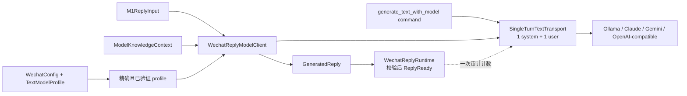

# 步骤 10：抽取无工具单轮模型 transport 并实现微信专用客户端

> 文档状态：实施前技术方案（仅方案设计）
> dispatch：`aich8-zhuochong-desktop-pet-rag-27-steps-20260805-task-10`
> LOOF run：`20260806-1346-步骤-10抽取无工具单轮模型-transport-并实现微信专用客户端dispatch_idai`
> 前置基线：步骤 4 已冻结 M1/M2 类型、feature 互斥及 M2 先检索；步骤 5 已冻结微信模型 profile；步骤 9 已提供 single-flight runtime、阶段 trace 与 `record_model_transport_call()`。本步骤只抽取现有 system + 单条 user 文本调用并实现私有微信客户端，不新增用户触发入口。

## 0. 方案设计原则

- **复用不重写**：以 `commands/ask.rs::generate_text_answer_with_model` 的 Ollama、Claude、Gemini、OpenAI-compatible 非流式实现为来源，将其移至 `agent/model.rs`；继续使用 `ModelConfig`、`AiProvider`、现有 JSON parser 和 60 秒总超时/10 秒连接超时。
- **无工具是硬边界**：新 transport 只接收 system prompt 与一条 user prompt，没有 history、tools、tool-result、streaming 或 Agent 参数；请求体不出现 `tools`、function/functionCall 或 `tool_choice`。
- **微信精确选型**：只接受 `WechatConfig.text_model_profile_id` 精确命中的、`test_status=success` 且模型名非空的 `TextModelProfile`。缺失、删除、未验证或空模型都为 `WX_TEXT_MODEL_UNAVAILABLE`，不回退 `text_model`、首个 profile 或 Agent 模型。
- **一次逻辑请求就是一次物理请求**：微信路径不经 Agent 的 `send_with_retry()`；它保留旧单轮 command 的无重试语义，符合步骤 9 单 request 单 transport 的审计约束。429、5xx、超时与网络错误直接失败。
- **最小私有接线**：客户端只接收 `M1ReplyInput` 或 `ModelKnowledgeContext`。不注册 Tauri command，不接入 UI、自动监听、剪贴板、粘贴、发送、注入、协议/数据库访问、上传、MCP/Bot/Agent 或普通聊天历史。

## 1. 当前实现、目标与非目标

### 1.1 已核实的基础

1. `commands/ask.rs::generate_text_answer_with_model` 已有四类 provider 的单轮纯文本调用，但位于 command 层、每次新建 HTTP client，微信不能以它作为安全依赖。
2. `agent/model.rs` 是 provider 协议/响应解析归属，已有共享非流式 client；其 `chat_with_tools()` 允许工具与重试，不能直接用作微信的一次物理调用。
3. `crates/core/src/config.rs` 已保存 `WechatConfig.text_model_profile_id`；`wechat/config.rs::model_profile_is_available()` 已定义精确 ID、测试成功、模型非空的可用性规则。
4. `wechat/model_contract.rs` 已把 M1 输入和 M2 `ModelKnowledgeContext` 分隔；`RetrievedReply` 与 context 构造仍是私有可信链路。当前 `generate_m1_reply`/`generate_rag_reply` 只是回显式占位，不是模型调用。
5. `wechat/runtime.rs` 已只允许 `Generating` 阶段成功记录一次模型 transport，并以 request/generation/binding 校验保护 `ReplyReady`。

### 1.2 可验收目标

1. 提供唯一的无工具、非流式、单轮纯文本 transport，并让既有 `generate_text_with_model` command 委托它，保留外部签名、provider URL、认证头、请求字段、超时及无重试行为。
2. transport 的接口不含 tools/history；四类 provider body 不序列化工具字段。工具调用、非 `stop`、空白或超限正文不能形成成功结果。
3. `WechatReplyModelClient` 只用已验证微信 profile 与可信领域输入产出 `GeneratedReply`：M1 用 `M1ReplyInput`，M2 用 `ModelKnowledgeContext`；不接受裸 OCR/query、JSON 或前端 model config。
4. 配置快照和网络调用全程不跨 `AppState`/runtime mutex `.await`；调用前 runtime 记录一次 transport，调用后仍用 lease/request/generation/binding 决定是否能进 `ReplyReady`。trace 仅收稳定 `LLM_FAILED`，不含 prompt、回复、密钥、endpoint 或 provider 原始错误。
5. M2 真实检索不在本步骤实现。`KB_*` 失败在 client 前终止并使 transport spy 为零；`no_hit` 仍可用可信 context 进入一次生成。

### 1.3 非目标

- 不接入 `CaptureCoordinator`、Windows 微信窗口、截图、OCR、知识导入/SQLite/FTS/向量、实际 `knowledge_retrieve()`、模型设置 UI 或端到端 Tauri 入口。
- 不重构 `chat_with_tools`、streaming、Agent executor/orchestrator、工具注册、普通 Work Review 问答或 provider 列表；它们保留原有工具/重试语义。
- 不增加 fallback 模型、自动选择、重试、排队、流式 token、会话历史、可编辑 system prompt 或留存；不把部分文本作为建议。

## 2. 最小文件范围与职责

| 路径 | 动作 | 最小职责 |
| --- | --- | --- |
| `desktop/src-tauri/src/agent/model.rs` | 修改 | 抽取 command 中的无工具单轮调用，定义 `SingleTurnTextTransport` 及默认 provider 实现；复用共享 client/parser，但微信不经 `send_with_retry()`。 |
| `desktop/src-tauri/src/commands/ask.rs` | 最小修改 | 删除本地 provider 分发重复实现，使 `generate_text_answer_with_model`/既有 command 仅委托新 transport，外部签名不变。 |
| `desktop/src-tauri/src/wechat/model_client.rs` | 新增 | 私有 `WechatReplyModelClient`：解析精确 profile、组装固定微信 prompt、调用 no-tools transport、校验回复并构造 `GeneratedReply`。 |
| `desktop/src-tauri/src/wechat/mod.rs` | 最小修改 | 仅声明私有 client 模块，不导出 Tauri API。 |
| `desktop/src-tauri/src/wechat/config.rs` | 最小修改 | 将现有布尔检查收敛为取已验证 profile/model config 的唯一 helper，status 与 client 共用，选择标准不变。 |
| `desktop/src-tauri/src/wechat/model_contract.rs` | 最小修改 | 收窄回显式生成占位，保留 M1/M2 可信输入和 feature 边界；成功 `GeneratedReply` 只由 client 路径构造。 |
| `desktop/src-tauri/src/wechat/runtime.rs` | 最小修改 | 加受限提交 helper，在 `Generating` 中核验 `GeneratedReply` 与当前 lease/M2 binding 后才进入 `ReplyReady`。 |
| `desktop/src-tauri/src/wechat/types.rs` | 最小修改 | 增加稳定 `WX_TEXT_MODEL_UNAVAILABLE`（如尚不存在）和私有长度/空白错误映射；模型失败仍向 trace 写 `LLM_FAILED`。 |
| 定向 Rust 测试 | 新增/修改 | fake transport/请求体构造器覆盖 no-tools、一次调用、profile 拒绝、M1/M2 类型链和失败出口；不发真实 HTTP。 |
| `kaifa/kaifa_personnel/mingling.md`、`kaifa/kaifa_test/test.md`、`kaifa/kaifa_log/<实施日志>.md` | 后续阶段 | 仅记录实际实施命令、结果和变更日志；方案阶段不修改。 |

不修改 `desktop/src/`、`main.rs`、`commands/mod.rs`、`Cargo.toml`、`crates/core/src/config.rs`、数据库、普通 `StorageManager`、trace/content 目录规则或其他 LOOF run 产物。

## 3. 架构与接口契约



### 3.1 无工具单轮 transport

`agent/model.rs` 新增内部专用边界，名称可按代码风格调整，职责固定：

```rust
struct SingleTurnTextRequest {
    system_prompt: String,
    user_prompt: String,
}

#[async_trait]
trait SingleTurnTextTransport: Send + Sync {
    async fn complete(
        &self,
        model: &ModelConfig,
        request: SingleTurnTextRequest,
    ) -> Result<String, AppError>;
}
```

- 默认实现复用 `chat_client()`、endpoint/auth 与当前 parser；Ollama 固定 `stream:false`，Claude 保持顶层 system，OpenAI-compatible/Gemini 保持原 provider 格式。
- 只直接 `.send().await`，不调 `send_with_retry()`；共享 client 的 60/10 秒限制不变。每个 provider body 均没有 tools/function/history/stream event。
- 成功必须是 parser 得到唯一 trim 后非空文本、`StopReason::Stop` 且无 `tool_calls`/function call。`MaxTokens`、工具调用、空文本、多文本工具混合或解析失败均返回 `AppError`，微信统一映射 `LLM_FAILED`。
- `commands/ask.rs` 的 `generate_text_answer_with_model(model_config, system_prompt, prompt)` 保留为兼容薄包装，只创建 `SingleTurnTextRequest` 并 await 默认实现；Tauri command 名和成功文本语义保持不变。

### 3.2 微信 profile 与专用 client

`wechat/config.rs` 增加唯一解析 helper：

```rust
fn selected_verified_model(
    config: &WechatConfig,
    profiles: &[TextModelProfile],
) -> Result<ModelConfig, ContractError>;
```

- helper 精确匹配 `text_model_profile_id`，复用当前 `success` + 非空 model 判定，返回调用前克隆的 `ModelConfig`；status command 与 client 都调用它。
- 无 ID、未知 ID、`untested/error` 或空模型统一 `WX_TEXT_MODEL_UNAVAILABLE`，不静默改选。

`wechat/model_client.rs` 使用 concrete client 与仅测试用 fake transport，不把 transport 放入 `AppState`：

```rust
async fn generate_m1(
    &self, config: &WechatConfig, profiles: &[TextModelProfile],
    input: M1ReplyInput, suggestion: SuggestionGeneration,
) -> Result<GeneratedReply, ContractError>;

async fn generate_m2(
    &self, config: &WechatConfig, profiles: &[TextModelProfile],
    context: ModelKnowledgeContext, suggestion: SuggestionGeneration,
) -> Result<GeneratedReply, ContractError>;
```

- M1 仅读已规范化 OCR 文本；M2 仅读受 token budget 限制的 excerpts 和 `no_hit`。两个入口都不得接收裸字符串、hit 列表、来源路径、请求 JSON 或前端 model config。
- 固定 system prompt 只要求“输出一条供用户审阅的微信纯文本回复，不得调用工具或宣称已发送消息”。M1 user prompt 为 OCR 文本；M2 才附带带标签的可信 context。不得加入 Work Review memory、Agent history、窗口 metadata、trace、密钥或用户可编辑 system instruction。
- 只有成功文本通过 trim、非空、UTF-8 scalar/byte 上限检查时，才可按 M1/M2 的 request/suggestion/binding 代际构造 `GeneratedReply`。最大硬界沿用 OCR 的 8,192 scalar / 32 KiB；如采用更小微信建议上限，必须固定常量并测试，不能静默截断。
- client 不写 trace/content/普通日志，不缓存 config/API key；底层错误只以无正文类别诊断，向 runtime 仅返回 `ContractError::LlmFailed`。

### 3.3 runtime 提交与异常出口

私有编排顺序固定如下，且本步骤不把它暴露为 command：

1. 现有 runtime 先进入 `Generating`；从 `AppState` 复制 `WechatConfig` 与 profiles 后立即释放锁。
2. lease 仍有效时调用 `record_model_transport_call(lease)`，再调用 client 一次；配置无效时不得计数且 transport 为零。
3. await 期间不持有 runtime/AppState mutex。返回后由 runtime 复核取消、超时、request/suggestion，以及 M2 binding/observation。
4. 新增 `complete_generated_reply(lease, reply)`：仅当 active 为 `Generating`、代际匹配且计数恰为 1 时，以已有 trace 原子记录 `ReplyReady`；其他结果是 stale/failed，不能覆盖 suggestion。
5. transport、文本校验或 client 出错时用合法终态写 `LLM_FAILED` 并释放 slot；不重试、不留部分输出、不以 `finish_reply` 伪造成功。

M2 的真实 `knowledge_retrieve()` 仍不在本步骤。只有可信 `RetrievedReply`（含 `no_hit`）才可产生 `ModelKnowledgeContext` 并调用 `generate_m2`；`KB_NOT_READY`、`KB_SCOPE_UNRESOLVED`、`KB_RETRIEVAL_FAILED` 必须先 `fail_retrieval`，client/transport 调用计数为零。

## 4. 实施顺序

1. 先为现有单轮 command 冻结请求体/响应判定测试，验证四 provider 的 endpoint、auth、body、超时及无重试语义。
2. 在 `agent/model.rs` 抽取 no-tools transport，令 `commands/ask.rs` 只保留兼容委托；验证请求没有工具字段，tool/max-token/空文本不返回成功字符串。
3. 在 `wechat/config.rs` 实现并复用精确 profile resolver，补稳定错误码；验证无效配置零调用。
4. 新增私有 client，以 M1/M2 可信类型组装固定 prompt 并创建 `GeneratedReply`；验证 fake transport 只收到无工具单轮请求。
5. 以最小 runtime helper 保护 call count/结果提交；验证取消、超时、晚到结果与 M2 retrieval 失败均不能到 `ReplyReady`。
6. 实施阶段只记录本 run 的实际命令、测试和日志，最后运行定向格式/测试/diff 检查；不创建 UI 或 Windows 实机测试。

## 5. 测试方案与通过标准

| 场景 | 层级 | 必须证明 |
| --- | --- | --- |
| 四 provider 单轮请求 | `agent/model.rs` 纯 builder/helper | 正确 endpoint/auth/body，恰好 system + user，无 tools/function/history/stream，无 retry。 |
| 工具、max tokens、空白/超长回复 | transport/client | 无成功文本；微信为 `LLM_FAILED`，不接受部分建议。 |
| 既有 command 回归 | `commands/ask.rs` | 仍委托抽取后的 transport，签名与成功纯文本语义不变。 |
| profile 解析 | `wechat/config.rs` | 精确成功 profile 才可用；所有无效选择 `WX_TEXT_MODEL_UNAVAILABLE`、fake transport 为零。 |
| M1/M2 可信输入 | `wechat/model_client.rs` | M1 不带知识上下文；M2 只由 `ModelKnowledgeContext` 调用；无裸输入绕过。 |
| 一次调用与结果绑定 | `wechat/runtime.rs` | 每 lease 恰一次 transport；错误、取消、超时、stale request/generation/binding 不写 `ReplyReady`。 |
| M2 检索失败 | contract + fake transport | `KB_*` terminal 且 client/transport 为零；`no_hit` 允许一次生成。 |
| 隐私/范围 | 静态与 diff 检查 | 无 command/UI/自动化/上传/DB；trace/error DTO 不含正文、prompt、密钥、endpoint、原始 provider error。 |

实施阶段建议记录实际命令：

```bash
cargo test --manifest-path desktop/src-tauri/Cargo.toml agent::model::
cargo test --manifest-path desktop/src-tauri/Cargo.toml commands::ask::
cargo test --manifest-path desktop/src-tauri/Cargo.toml wechat::config:: wechat::model_client:: wechat::runtime::
cargo check --manifest-path desktop/src-tauri/Cargo.toml --features wechat-m1,wechat-contract-check
cargo check --manifest-path desktop/src-tauri/Cargo.toml --features wechat-m2,wechat-contract-check
cargo fmt --manifest-path desktop/Cargo.toml --check
git diff --check -- desktop/src-tauri/src/agent/model.rs desktop/src-tauri/src/commands/ask.rs desktop/src-tauri/src/wechat
```

双 feature / 无 feature 的预期失败门禁继续按步骤 4 单独断言；formatter 缺失必须记录为环境限制。

## 6. 风险、回滚与后续边界

| 风险 | 处理 |
| --- | --- |
| 误用 `chat_with_tools` 导致工具或重试 | 微信固定走 no-tools/no-retry transport；请求体与 fake transport 计数双重证明。 |
| 无配置时回退普通助手模型 | client 唯一经过 profile resolver；无效即 `WX_TEXT_MODEL_UNAVAILABLE`、零调用。 |
| provider 原始报错或正文进入 trace | client 只返回稳定错误码；trace 继续 metadata-only。 |
| 旧回调覆盖新建议 | runtime 的 request/suggestion/binding/observation 与一次计数检查后才写 `ReplyReady`。 |
| client 被误解为自动回复 | API 不提供 command/UI/自动触发、复制、粘贴或发送；端到端手动请求留待后续步骤。 |

回滚只还原本步骤对 `agent/model.rs`、`commands/ask.rs`、`wechat/config.rs`、`wechat/model_contract.rs`、`wechat/runtime.rs` 的差异，删除 `wechat/model_client.rs` 与本步骤测试。不得删除步骤 4/9 契约、普通聊天能力、任何数据目录或其他 LOOF run 产物；提交后用目标提交的 `git revert`。本步骤完成仅表示无工具单轮 transport 与私有微信模型客户端已实现并经定向验证，不代表真实微信回复、M2 RAG、Windows 实机兼容性或发布验收完成。
