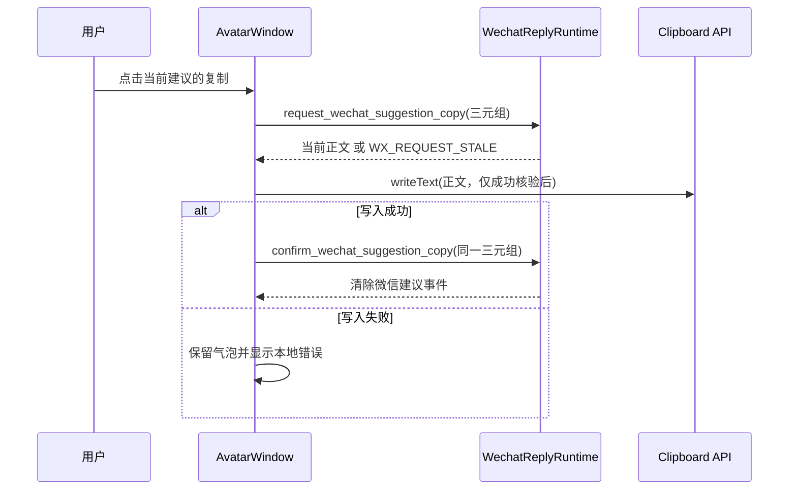

# 步骤 12：扩展现有桌宠持续气泡、复制/关闭和代际校验

> 文档状态：实施前技术方案（仅方案设计）
> dispatch：`aich8-zhuochong-desktop-pet-rag-27-steps-20260805-task-12`
> LOOF run：`20260806-1548-步骤-12扩展现有桌宠持续气泡复制关闭和代际校验dispatch_idaich8-zhuocho`
> 设计时间：2026-08-06 15:48（Asia/Shanghai）

## 0. 方案设计原则

- **只扩展既有单一桌宠通道**：继续使用 `AVATAR_WINDOW_LABEL`、`emit_avatar_bubble()`、`AvatarWindow.svelte`、`AvatarPopover.svelte`；不创建窗口、WebView、桌宠运行时或第二套 UI。
- **显示层只拿受限结果**：桌宠事件只携带建议正文、`requestId`、`suggestionGeneration`、可选 `bindingGeneration`、kind 与动作标志。不得传递截图、OCR 原文、窗口/聊天身份、knowledge hit、数据库路径、retriever、模型 client 或密钥。
- **后端先验权，前端仅写剪贴板**：`request_wechat_suggestion_copy` 必须在 runtime 中原子核验三元组后才返回正文；前端只对该返回正文调用 `navigator.clipboard.writeText()`。任何展示、悬停、拖动、普通气泡、关闭或失效都不得写剪贴板。
- **代际失效优先于便利**：新请求、取消、超时、主动关闭、成功确认或 suggestion generation 变化都令旧建议不可复制；M2 的 binding 变化同样清除展示。M1 的 `bindingGeneration` 始终省略，不以占位值伪装绑定。
- **兼容既有普通气泡**：为新增字段提供 serde 默认值，现有 `info`、`success`、`persistent_info`、`clear` 与其调用点不改语义。微信建议只在有效期间占用最高展示优先级，低优先级气泡暂停并在结束后恢复一次。

## 1. 现状、目标与边界

### 1.1 已确认现状

1. `desktop/src-tauri/src/avatar_engine.rs` 已有 `AvatarBubblePayload`、`AVATAR_BUBBLE_EVENT` 与定向到 `avatar` 窗口的 `emit_avatar_bubble()`；当前 payload 只有 `message/tone/persistent/durationMs/clear`。
2. `desktop/src/routes/avatar/AvatarWindow.svelte` 目前以 `focusBubble || bubbleSource` 选择显示内容，普通状态事件可调用 `showBubble()` 覆盖 `bubbleSource`；`AvatarPopover.svelte` 对所有 persistent 气泡铺设整面板关闭按钮，正文固定 `max-height: 140px; overflow: hidden`。
3. 步骤 11 的 `wechat/reply_flow.rs` 只返回私有 `GeneratedReply`，没有 Tauri command、展示副作用或保留的建议对象；`WechatReplyRuntime` 已管理 single-flight lease、`request_id`、`suggestion_generation`、M2 binding 校验及终态 trace，但 `finish_reply()` 会释放 active slot。
4. `WechatReplyRuntime`、`CaptureCoordinator` 已由 `main.rs` 以 Tauri state 管理；现有 `wechat/commands.rs` 是微信命令入口，`main.rs` 是唯一命令注册处。截图 guard 已按 `AVATAR_WINDOW_LABEL` 隐藏完整原生窗口，天然覆盖任意新气泡 DOM。

### 1.2 可验收目标

1. 一次已完成的 M1/M2 `GeneratedReply` 可被受限地发布为 `kind=wechatSuggestion` 的持续气泡；运行时仍只有现有 `avatar` 窗口。
2. 只有点击当前有效气泡的“复制”按钮，且后端核验 `requestId + suggestionGeneration + bindingGeneration` 成功后，才会发生一次 Web Clipboard 写入；复制失败保留气泡并显示本地错误。
3. 微信建议有效时，focus、普通状态和提醒都不覆盖它；建议关闭、成功复制或失效后，暂停的低优先级气泡按其剩余寿命恢复，且不重放已结束内容。
4. 旧 suggestion、错误 request id、错误/缺失 binding、M2 binding 变化、新请求/取消/超时、重复确认与已关闭建议均 fail closed，返回既有 `WX_REQUEST_STALE`，不得返回正文。
5. 长建议可在现有气泡内滚动阅读并完整复制；中文、繁体中文、英文、阿拉伯文均有动作/错误文案，阿拉伯文沿用现有 RTL 规则。

### 1.3 不在本步骤范围

- 不新增自动触发、微信聚焦/点击/输入/粘贴/发送、WeChat 数据库或协议访问、MCP/Bot、上传、动作工具。
- 不实现步骤 13 的显式 `generate_wechat_reply` 用户入口、倒计时、设置页或真实微信 M1 冒烟；本步只提供该入口将来消费的展示与动作边界。
- 不实现 M2/RAG、知识导入、检索、content retention，也不改变步骤 6--11 的截图、OCR、模型或 trace 契约。
- 不迁移/重构现有 avatar follow-up 卡片、动画、拖拽、多显示器夹紧、窗口生命周期或 VPet；只保持其行为不回归。

## 2. 数据模型与后端契约

### 2.1 受限桌宠事件

在 `avatar_engine.rs` 为 `AvatarBubblePayload` 增加带 serde default 的字段，并以受限 enum 取代任意字符串 kind：

| 字段 | 微信建议值 | 规则 |
| --- | --- | --- |
| `kind` | `wechatSuggestion` | 旧 payload 默认 `standard`；前端不得将未知 kind 视为微信建议。 |
| `requestId` | UUID 字符串 | 仅作当前建议动作核验，不写 trace audit tag。 |
| `suggestionGeneration` | 非零 `u64` | 与 runtime 当前展示建议严格相等。 |
| `bindingGeneration` | M1 为省略；M2 为非零 `u64` | `null` 与数值不可互换。 |
| `actions` | `copy=true,dismiss=true` | 只允许微信 kind 消费；普通 payload 默认没有动作。 |

`AvatarBubblePayload::wechat_suggestion(...)` 是唯一生成微信事件的构造器；其余现有构造器显式/默认生成 `standard`、无 request/version/action 元数据。`clear` 仍只能清普通气泡，不能绕过微信建议的后端代际校验。

### 2.2 runtime 的展示建议记录

在 `desktop/src-tauri/src/wechat/runtime.rs` 的同一 mutex 保护域内新增一个**仅保留当前一条**的 `PresentedSuggestion`，而非数据库、config 或历史列表。它只保存：正文、request id、suggestion generation、可选 binding generation、状态（`Ready`/`CopyAuthorized`/`Dismissed`）和一次性动作所需的最小元数据。

新增 crate-private 方法（名称可按既有风格微调，但职责不得拆散）：

```text
publish_generated_suggestion(reply) -> AvatarBubblePayload
request_suggestion_copy(request_id, suggestion_generation, binding_generation) -> text
confirm_suggestion_copy(request_id, suggestion_generation, binding_generation) -> ()
dismiss_suggestion(request_id, suggestion_generation, binding_generation) -> ()
invalidate_presented_suggestion_for_binding(binding_generation) -> bool
```

- `publish_generated_suggestion` 只能接收已被 `complete_generated_reply()` 接纳的 `GeneratedReply`；它将私有 newtype 转为事件中的 string/u64，替换并使旧展示记录失效。发布由 future M1/M2 入口在 `finish_reply()` 前完成，随后仍正常释放 active lease。
- `request_suggestion_copy` 比对所有代际字段、当前状态及 M1/M2 的 binding 形态。成功仅返回正文，并将记录标记为 copy-authorized；失败不泄露正文，返回 `WxRequestStale`。它不写剪贴板、不中断 binding、也不清气泡。
- `confirm_suggestion_copy` 仅接受刚刚授权的同一建议，转为不可再次动作的终态并清除记录；重复确认、先关闭、被新请求替换或 binding 失效均返回 stale。这样前端写入成功才关闭，写入失败则不调用确认并保留气泡。
- `dismiss_suggestion` 以同样三元组核验后清除记录；它不影响仍有效的 binding，也不调用剪贴板。新 `begin_reply()`、`cancel_reply()`、deadline/失败终态与 generation 递增路径必须在同一锁内使已展示建议失效。
- M2 的窗口/header/profile/范围变更沿用其拥有者推进 binding generation 后调用 `invalidate_presented_suggestion_for_binding`；M1 无 binding，不得接收这条失效调用。由于本步不实现 M2 入口，使用模块单测证明该 API 即可，不能宣称完成 RAG。

为避免 `GeneratedReply` 成为公开内容通道，仅在 `wechat` 模块内增加必要 getter/转换；`avatar_engine`、Tauri DTO 和 Svelte 一律不导入 `GeneratedReply`、`ModelKnowledgeContext`、`RetrievedReply`、`KnowledgeStore` 或 model client。

### 2.3 Tauri 命令与动作时序

在 `desktop/src-tauri/src/wechat/commands.rs` 增加严格 camelCase 反序列化的 `WechatSuggestionActionInput`，字段为 `requestId`、`suggestionGeneration`、`bindingGeneration`。命令只依赖 `State<WechatReplyRuntime>`、`AppHandle` 和受限输入：

| 命令 | 成功返回/副作用 | 失败 |
| --- | --- | --- |
| `request_wechat_suggestion_copy(input)` | 返回 `{ text }`；无窗口/剪贴板副作用 | `WX_REQUEST_STALE` 或输入格式错误 |
| `confirm_wechat_suggestion_copy(input)` | runtime 清除当前建议，`emit_avatar_bubble` 发送受限微信 clear/失效事件 | stale，不清除新建议 |
| `dismiss_wechat_suggestion(input)` | runtime 清除当前建议，发送同一失效事件 | stale，不清除新建议 |

在 `main.rs` 的既有 `generate_handler!` 只注册这三个命令。不得新增 global shortcut、轮询、clipboard Rust crate、shell 命令或 capability 权限；Web Clipboard API 已在 avatar webview 使用即可。

正常复制流程：



## 3. 前端展示、优先级与交互

### 3.1 `AvatarWindow.svelte`

将单一 `focusBubble || bubbleSource` 改为三个有来源的槽位：`wechatSuggestionBubble`、`focusBubble`、`ordinaryBubble`，显示优先级固定为：

`有效微信建议 > focus 会话 > 普通状态/提醒`。

- 收到 `wechatSuggestion` 时保存为最高槽位；收到普通状态、报告或提醒时，保留为 ordinary 槽位而不覆盖它。
- 微信建议出现期间，把被遮挡的 focus/ordinary 气泡连同 timer 的剩余毫秒暂存；建议结束后恢复优先级最高且仍未到期的一条，并从剩余时间继续计时。已到期或已被新的同级内容替代的项直接丢弃，避免重复播放。
- 仅后端发出的微信失效事件或动作成功回包可移除 `wechatSuggestionBubble`；普通 `clear`、focus stop、状态切换和 `dismissBubble()` 不得清除它。
- 为 `AvatarPopover` 提供 `onCopyWechatSuggestion`、`onDismissWechatSuggestion`、`copyPending`、`copyError`；动作运行期间禁用重复点击。错误只本地渲染，不能把回复正文写进 console、toast、trace 或配置。
- 保持现有 `set_avatar_window_expanded` 行为，不根据内容创建或 resize 新窗口；若现有固定 expanded 尺寸不足以容纳动作区，仍在同一 popover 内滚动，而非扩张无限高度。

### 3.2 `AvatarPopover.svelte`

- `kind=wechatSuggestion` 使用显式“复制”“关闭”按钮；取消现有 persistent 的整面板透明关闭按钮，正文容器和按钮都必须阻止误触关闭。
- 普通 persistent 气泡保留既有整面板关闭和 × 按钮行为，避免无关交互回归。
- 微信正文改为受限可滚动区域（保留 word wrapping，使用 `overflow-y: auto` 和可访问焦点/aria 标签），不再使用 `overflow: hidden` 截断。复制使用后端已返回的完整文本，不从 DOM 截取。
- 新增 `avatar.wechatSuggestionCopy`、`avatar.wechatSuggestionDismiss`、`avatar.wechatSuggestionCopying`、`avatar.wechatSuggestionCopyFailed` 等键到 `zh-CN.js`、`zh-TW.js`、`en.js`、`ar.js`；阿拉伯文不硬编码 left/right，沿用现有 locale/document direction。

## 4. 实施文件与最小修改顺序

1. `desktop/src-tauri/src/avatar_engine.rs`：添加后向兼容的 kind/metadata/action payload 与微信构造器；不修改窗口创建、位置夹紧或非微信 emitter。
2. `desktop/src-tauri/src/wechat/types.rs`、`runtime.rs`：仅补受限 `GeneratedReply` 内部转换、当前展示建议记录、三元组校验、suggestion/binding 失效和单测。不得把正文写入 trace/content store。
3. `desktop/src-tauri/src/wechat/reply_flow.rs`：在 future 可调用 M1/M2 成功 hand-off 的唯一位置接入 `publish_generated_suggestion`；保持它目前没有 command/UI 副作用的原则，具体用户入口仍由步骤 13 添加。
4. `desktop/src-tauri/src/wechat/commands.rs`、`desktop/src-tauri/src/main.rs`：实现并注册三个动作命令；成功后只 emit 受限 avatar 事件。
5. `desktop/src/routes/avatar/AvatarWindow.svelte`、`desktop/src/lib/components/Avatar/AvatarPopover.svelte` 和四个 locale 文件：实现优先级/暂停恢复、显式动作、Clipboard 写入与可滚动文本。
6. 只扩展 `desktop/src/lib/components/Avatar/avatarWindow.test.js`、`avatarOutline.test.js`，以及贴近 runtime/commands 的 Rust 单测；必要时在 `kaifa/kaifa_test/` 添加步骤 12 的静态边界检查和实际命令记录。不得修改其他 LOOF run 产物。

## 5. 测试与验收

### 5.1 Rust 单元/命令测试

- 正确 M1 三元组（binding 缺失）可请求一次正文并确认；错误 UUID、旧 generation、M1 伪造 binding、重复确认、关闭后复制、新请求后复制均为 `WX_REQUEST_STALE` 且不泄露正文。
- 构造 M2 fixture：正确 binding 可复制；缺失/错误 binding 与 `invalidate_presented_suggestion_for_binding` 后均为 stale；验证失效不修改 binding 本身。
- `begin_reply` 替换、cancel、timeout/failed 以及成功 copy/dismiss 都使旧展示不可复制；新的建议不受旧 confirm/dismiss 影响。
- 审计 `AvatarBubblePayload` JSON：旧 payload 可反序列化为 standard；微信 payload 只有白名单字段；`avatar_engine`/commands 的依赖图中没有 importer、`KnowledgeStore`、retriever、model client、输入自动化或 clipboard Rust API。

### 5.2 Svelte/Node 测试

- 有效微信建议压过 focus、报告和普通提醒；结束后恢复仍有效的一条，不重复 timer/动画；普通 `clear` 不清微信建议。
- 微信建议无整面板关闭控件，只有显式复制/关闭；普通 persistent 仍保留旧行为。
- clipboard spy 只在复制点击且 `request_*` 成功后调用一次；请求 stale 时零调用；`writeText` reject 时气泡仍在且出现本地错误；成功才调用 confirm 并清除。
- 长文本容器可滚动、完整正文传给 Clipboard；四语种键齐全，Arabic 场景不破坏 RTL/现有 anchor。
- 保留并复核截图 guard 的完整 native avatar hide/show 顺序；包含持久建议时不另加 DOM 级截图/窗口逻辑，验证内容、位置与穿透状态未被本步骤改变。

### 5.3 建议实施验证命令

实施阶段先按实际脚本和 feature 条件记录命令，再运行至少：

```bash
cd desktop && npm test -- --runInBand src/lib/components/Avatar/avatarWindow.test.js src/lib/components/Avatar/avatarOutline.test.js
cargo test --manifest-path desktop/src-tauri/Cargo.toml wechat::runtime
cargo test --manifest-path desktop/src-tauri/Cargo.toml wechat::commands
cargo check --manifest-path desktop/src-tauri/Cargo.toml --no-default-features --features 'wechat-contract-check,wechat-m1'
git diff --check -- desktop/src-tauri/src/avatar_engine.rs desktop/src-tauri/src/wechat desktop/src/routes/avatar desktop/src/lib/components/Avatar desktop/src/lib/i18n/locales kaifa/kaifa_test
```

若本机不能运行 Windows capture/微信实机，记录为未覆盖；不得用 fake 单测宣称 Windows 微信 profile 或步骤 13 用户入口已验收。

## 6. 风险、回滚与完成定义

| 风险 | 控制 |
| --- | --- |
| `finish_reply()` 释放 lease 后无法判断旧展示 | 仅在 runtime mutex 内保留当前受限展示记录；不复活 active reply 或新增持久化。 |
| 普通事件/transparent overlay 误关微信建议 | kind 分支禁止整面板关闭；清除路径必须经后端三元组校验。 |
| 复制 race 或重复点击 | request 前核验、前端 pending、confirm 再核验；任何不匹配 fail closed。 |
| 高优先级建议吞掉已有提醒 | 暂存 payload 与剩余寿命，建议结束后恢复一次；测试覆盖不丢失/不重放。 |
| 展示层获得 RAG/隐私数据 | payload 白名单、crate 可见性与静态依赖检查；正文之外的回复上下文永不跨边界。 |
| 为长文本破坏现有桌宠尺寸 | 仅改 popover 内部可滚动区域，继续使用同一固定 native window 和已有 expansion。 |

回滚时只撤销本步骤在上述 Rust/Svelte/i18n/测试文件中的差异：移除微信 kind、展示记录、三条命令与显式 UI；不得回退步骤 6--11 的 runtime/capture/OCR/model 状态机、既有普通气泡、截图 guard 或其他 LOOF 的变更。

本步骤完成只表示：后续显式入口可把已生成的受限建议交给一个可验证、可复制、可关闭的现有桌宠气泡。它不表示已具备用户触发、微信实机闭环、自动粘贴/发送或 M2 RAG。
