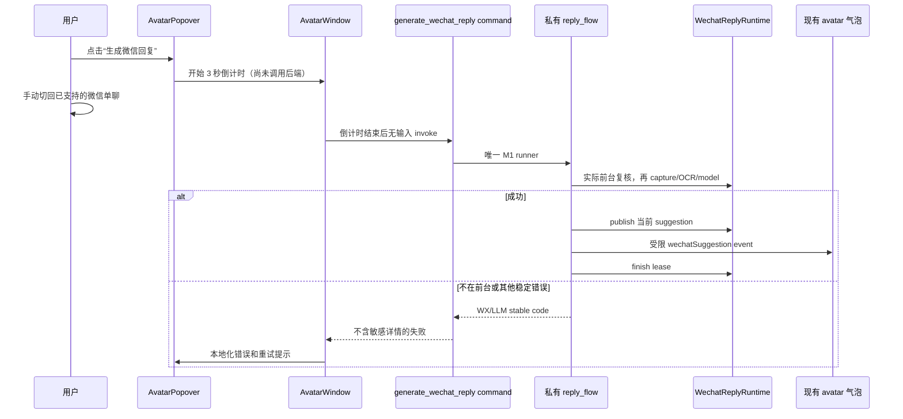

# 步骤 13：接入显式触发、微信设置、隐私设置和用户错误反馈

> 文档状态：实施前技术方案（仅方案设计）
> dispatch：`aich8-zhuochong-desktop-pet-rag-27-steps-20260805-task-13`
> LOOF run：`20260806-1656-步骤-13接入显式触发微信设置隐私设置和用户错误反馈dispatch_idaich8-zhuoc`
> 设计时间：2026-08-06 16:58（Asia/Shanghai）

## 0. 方案设计原则

- **只增加用户明确发起的最后一段接线**：复用步骤 11 的 M1 `reply_flow`、步骤 12 的 `publish_generated_suggestion()`、`AvatarBubblePayload::wechat_suggestion()` 与现有 `avatar` 窗口；不新建窗口、运行时或第二条生成链路。
- **倒计时不采集**：用户点击后，前端仅显示固定、可取消的短倒计时和“请切回微信”；倒计时结束后才调用后端。后端再次读取并验证前台微信，绝不由前端声称“已经切回”。
- **设置只选择可信值**：继续只保存 catalog 中的 `compatibilityProfileId` 和精确的已验证文本模型档案 ID；ROI、窗口特征、exe allowlist、DPI、主题、截图或 appName 均不进入配置/DTO/UI。当前无“已通过实机探针的可校准 profile”证据，因此本步骤不提供 ROI 高级编辑或预览入口。
- **错误白名单化**：只把固定 `WX_*`/`LLM_FAILED` 映射到四语用户文案；未知异常统一为通用失败提示，不回显 Rust 错误、绝对路径、endpoint、密钥、堆栈、OCR、截图或模型正文。
- **M1 不冒充 M2**：M1 界面仅展示生成可用性、请求阶段和留存边界，不显示知识命中、来源、RAG、检索状态或 M2 操作。

## 1. 当前基线、目标与边界

### 1.1 已确认基线

1. `wechat/reply_flow.rs::generate_wechat_reply()` 已是 M1-only 私有编排：它从 managed state 复制快照、申请 single-flight lease、在后台验证前台窗口、临时 capture/OCR、调用一次无工具模型并返回受限 `GeneratedReply`。非 Windows 固定失败为 `WX_WINDOW_UNSUPPORTED`。
2. `WechatReplyRuntime::publish_generated_suggestion()` 已仅接受当前 `ReplyReady` 的 `GeneratedReply`，并产生受限的桌宠 payload；步骤 12 的 avatar 窗口已能对当前 suggestion 执行显式复制、关闭和代际核验。
3. `SettingsWechat.svelte` 已复用 `Settings.svelte` 的 `get_config`/dirty/`save_config` 链路，并只能选择后端返回的 compatibility catalog；`delete_wechat_reply_content` 已限定删除 `<data_dir>/wechat_reply/content` 下 UUID 请求目录。
4. `AvatarPopover.svelte` 由现有单一 `AvatarWindow.svelte` 载入；它是合适的首个入口宿主，但当前只呈现气泡/复制/关闭，尚无用户生成按钮、倒计时或 WX 错误界面。

### 1.2 可验收目标

1. 没有用户点击，绝不调用生成 command、`reply_flow`、capture、OCR 或模型；所有入口最终只能走同一个无输入的 M1 command。
2. 点击后最多显示一个固定 3 秒（实现为单一常量）的准备倒计时；用户可手动切回微信或取消。倒计时结束后由后端再次验证实际前台窗口，失败不采集、不调用 OCR/模型。
3. 成功顺序为：`generate_wechat_reply` → 仅当前 lease 的 `publish_generated_suggestion` → `emit_avatar_bubble` → `finish_reply`；显示已存在的持续建议，并继续只允许用户自行检查、复制、粘贴和发送。
4. 微信设置页展示可信 profile、精确文本模型、当前安全可用性/请求状态、默认关闭的留存开关/1–30 天期限，以及经确认的“删除已留存内容”入口；重启后仍由现有 config 保存/恢复保持。
5. 所有稳定错误有可操作的本地化文案；`WX_NOT_FOREGROUND` 会提示回到已支持的单聊微信后重试，`WX_BUSY` 提示等待当前请求，`WX_GROUP_CHAT_UNSUPPORTED` 提示仅支持单聊。未知异常绝不原样展示。

### 1.3 非目标

- 不监听微信消息、轮询窗口、全局快捷键、托盘入口、自动重试、排队、后台定时触发、自动聚焦、点击、输入、粘贴或发送。
- 不新增/编辑 compatibility profile、ROI、截图预览、校准工具或任意 appName/exe/path 输入；新 profile 仍须先完成步骤 6、7、14 的受控 Windows 实机验收。
- 不实现 M2/RAG、知识导入/检索、trace 正文查看、历史建议列表、内容导出、Agent/MCP/Bot、Localhost API、上传或 clipboard Rust API。
- 不修改 Work Review 普通隐私规则、普通截图/OCR、桌宠窗口生命周期、已有 suggestion 复制/关闭代际协议，亦不触碰其他 LOOF run 的产物。

## 2. 最小修改范围

| 路径 | 动作 | 最小职责 |
| --- | --- | --- |
| `desktop/src-tauri/src/wechat/reply_flow.rs` | 最小修改 | 将“持有 lease 的成功收尾”保留在私有编排层：发布当前建议、发 avatar 事件、再释放 `ReplyReady` lease；失败仍走现有稳定终态/释放逻辑。 |
| `desktop/src-tauri/src/wechat/commands.rs` | 修改 | 新增无前端输入的 M1 显式生成 command；扩展安全状态 DTO 的 request phase（只含枚举/布尔值）；复用既有 content delete command。 |
| `desktop/src-tauri/src/wechat/runtime.rs` | 最小修改 | 提供仅含 `idle/validating/capturing/ocr/generating/replyReady` 的快照方法，不返回 request ID、trace、正文、路径或错误原文。 |
| `desktop/src-tauri/src/main.rs` | 最小修改 | 在既有 `generate_handler!` 注册唯一生成 command；不添加 tray、shortcut、listener 或启动任务。 |
| `desktop/src/routes/avatar/AvatarWindow.svelte` | 修改 | 维护倒计时/运行中/错误本地状态，倒计时后调用唯一 command，并将入口、取消和错误回调传给 popover。 |
| `desktop/src/lib/components/Avatar/AvatarPopover.svelte` | 修改 | 在同一现有 popover 内增加显式“生成微信回复” affordance、倒计时/取消、用户提醒和错误区域；保持现有 suggestion 复制/关闭优先级。 |
| `desktop/src/routes/settings/components/SettingsWechat.svelte` | 修改 | 展示可信可用性、request phase、留存解释、确认删除；不增加 ROI/appName/profile 原始字段。 |
| `desktop/src/routes/settings/components/SettingsKnowledge.svelte` | 最小修改 | 在 M1 构建明确呈现“M2 未启用/未就绪”，不展示检索成功或来源命中。 |
| `desktop/src/lib/utils/errorDisplay.js` | 最小修改 | 增加只接受白名单 stable code 的微信错误格式化函数；未知错误一律回退通用 i18n 文案。 |
| `desktop/src/lib/i18n/locales/{zh-CN,zh-TW,en,ar}.js` | 修改 | 新增完全一致的入口、倒计时、取消、人工复核/粘贴发送、删除确认/结果、状态和错误映射键。 |
| 对应 Rust/Node 测试与 `kaifa/kaifa_test/` 静态检查 | 修改/新增 | 验证 command 边界、状态/错误 DTO、倒计时、删除确认、i18n 和没有自动化入口。 |

不新增 config 字段、数据库、文件格式、Cargo feature、Tauri capability、依赖或新的前端路由。

## 3. 后端契约与时序

### 3.1 唯一显式 command

新增 `#[tauri::command] generate_wechat_reply`（实际 Rust 命名可沿现有风格微调），参数为空，仅注入：

```text
AppHandle + State<Arc<Mutex<AppState>>> + State<WechatReplyRuntime> + State<CaptureCoordinator>
```

- 不接收文本、requestId、profile ID、窗口标题、appName、ROI、路径、模型配置或任何 `serde_json::Value`。
- 仅在 `wechat-m1` 编译；其他 feature/平台返回既有稳定 `WX_WINDOW_UNSUPPORTED`/不注册 M1 入口，不能悄然降级到 M2 或通用 Agent。
- command 立即 await 私有 M1 runner；没有 `tokio::spawn` 脱离 Tauri 请求生命周期，也没有第二次模型调用。
- `WX_BUSY` 由 runtime 最终裁决，即使不同 UI 同时发出请求也不会产生第二个 lease。

### 3.2 私有成功收尾

现有 `generate_wechat_reply(...) -> GeneratedReply` 不能把 `ReplyLease` 交给 command，而 `finish_reply` 必须持有该不可伪造 lease。因此实施应把以下逻辑封装在 `reply_flow.rs` 的同一私有所有权边界，而不是为前端暴露 lease 或 `GeneratedReply`：

```text
begin/validate/capture/OCR/model
  -> complete_generated_reply (ReplyReady)
  -> publish_generated_suggestion(reply)
  -> emit_avatar_bubble(app, payload)
  -> finish_reply(lease)
```

- `publish` 失败时不得 emit；将当前请求按现有稳定错误终结并释放，不能留下 active slot。
- emit 只接收步骤 12 已定义的白名单 payload；不将 `GeneratedReply`、OCR、trace 或 model handle 传给 command/Svelte。
- 成功返回空成功 DTO（或 `()`）；建议正文只通过既有 avatar event 进入桌宠，不能作为 command 返回值。

### 3.3 安全 request 状态 DTO

扩展 `get_wechat_settings_status`（不另造可绕过的控制 command）返回：

```json
{
  "selectedProfileValid": true,
  "selectedModelValid": true,
  "autoTrigger": false,
  "requestPhase": "idle",
  "contentRetentionEnabled": false,
  "contentRetentionDays": 0
}
```

`requestPhase` 只能是固定公开枚举 `idle|validating|capturing|ocr|generating|replyReady`，为设置页提供状态提示；没有 request ID、deadline、error raw text、trace path、正文、头像 payload 或历史记录。进入/结束请求可在设置页挂载和一次显式 refresh 时读取；不得用高频 polling 启动或维持任何微信行为。

### 3.4 倒计时与生成时序



前端规则：

1. 点击即禁用重复入口，显示 3、2、1 和“请切回微信”；取消/组件卸载清理 timer，且不 invoke。
2. 倒计时期间不调用 `get_wechat_settings_status` 以外的后端微信操作；不尝试聚焦微信。
3. 倒计时结束只 invoke 一次；promise pending 时显示进行中，完成/失败后复位。建议出现后继续由现有 `wechatSuggestion` UI 负责复制/关闭。
4. 入口、倒计时和错误使用不同于 suggestion 的普通本地 UI 状态，不能用普通 `clear` 清除当前有效 suggestion，也不能覆盖其最高优先级。

## 4. 设置、隐私和错误反馈

### 4.1 微信设置

`SettingsWechat.svelte` 继续通过父级统一保存按钮更新 `config`：

- profile 下拉只显示 `catalogOptions { id, label, version }`；选项旁展示 Windows/微信兼容说明及有效/未选/不受支持状态。不能渲染 allowlist、ROI 或输入框。
- 文本模型下拉只使用现有 `textModelProfiles` 的精确 ID；未选、删除、未测试/非 success、空 model 均显示“请在模型设置完成验证”，不回退默认模型。
- request phase 仅作为只读状态徽标；`autoTrigger=false` 永远只读显示，不能提供开关。
- 留存开关保持默认关；开启时显示 1–30 天和“仅本次微信受限内容、可随时删除”的边界，不承诺留存 OCR/建议一定存在。
- “删除已留存内容”先复用 `confirm()`，确认后调用既有 `delete_wechat_reply_content`；成功以 toast 显示仅 `deletedRequestDirectories/failedEntries` 计数，失败使用通用安全文案。禁止显示 data directory、文件名或未删除项路径。

保存/刷新顺序保持既有 `Settings.svelte` 统一 `save_config`、原子恢复和 dirty 行为；保存失败不得让 UI 假称新 profile/留存已生效。

### 4.2 M1 知识设置

在 `SettingsKnowledge.svelte` 的 M1 视图只增加清晰的静态状态：M2 未启用/尚未就绪，当前微信建议不使用知识库。保留已有安全的元数据设置显示，但不把 `sourceCount`、scope、embedding 配置误标为“本次已检索”，不加导入/检索按钮。

### 4.3 错误映射

`formatWechatUserError(error, fallback)` 从 Tauri error 文本中仅提取以下精确 token 后选择 i18n 键：

| code | 用户动作 |
| --- | --- |
| `WX_BUSY` | 等待当前建议完成或关闭后再试。 |
| `WX_NOT_FOREGROUND` | 切回已支持的微信单聊后重新点击。 |
| `WX_PROFILE_UNSUPPORTED` / `WX_WINDOW_UNSUPPORTED` | 在微信设置检查已支持的 Windows/微信 compatibility profile。 |
| `WX_CAPTURE_FAILED` / `WX_CAPTURE_TIMEOUT` | 保持微信在前台、勿改变窗口布局后重试。 |
| `WX_OCR_EMPTY` / `WX_OCR_UNAVAILABLE` / `WX_OCR_FAILED` | 确认单聊中有可读的近期文本后重试。 |
| `WX_GROUP_CHAT_UNSUPPORTED` | 切换至已支持的单聊。 |
| `WX_TEXT_MODEL_UNAVAILABLE` | 在模型设置验证已选择的文本模型。 |
| `WX_REQUEST_CANCELLED` / `WX_REQUEST_STALE` | 请求已取消/过期，重新明确点击。 |
| `LLM_FAILED` | 模型本次未生成建议，请稍后重试。 |
| 其余（含 `WX_CONTRACT_VIOLATION`、trace/content 错误、技术异常） | 统一通用失败，不显示原始值。 |

错误只能显示在入口/设置对应的本地 alert 或 toast；不得写入普通 avatar bubble、console 内容、config、trace 或本地正文留存。

## 5. 实施顺序

1. 先补 runtime 的安全 request-phase snapshot 及 Rust 单测，证明无正文/ID/trace 可从 DTO 获得。
2. 在 `reply_flow` 收拢成功发布/finish 所有权，再实现无输入 command；先用 fake runner/transport 验证“无点击无调用、成功一次 publish/emit/finish、失败不 emit 且 slot 可复用”。
3. 在 `main.rs` 注册该唯一 command，并做 feature/静态检查，确认没有 listener、tray/shortcut 或输入自动化调用点。
4. 扩展 `AvatarWindow`/`AvatarPopover` 的倒计时、取消、pending 和安全错误映射；不改步骤 12 suggestion 的复制/关闭协议。
5. 增强微信设置/知识提示和受确认的 content delete；沿用父级 dirty/save、`confirm` 和 toast。
6. 加齐四语、Node/Rust 测试和步骤 13 静态边界检查；实施阶段才按实际命令回填 `mingling.md`、`kaifa_test/test.md` 与开发日志。

## 6. 测试与验收

| 场景 | 必须验证 |
| --- | --- |
| 未点击/取消倒计时 | command、capture、OCR、model 调用均为 0；timer 被清理。 |
| 倒计时结束且微信未前台 | command 仅得到 `WX_NOT_FOREGROUND`；capture/OCR/model 为 0；界面显示安全重试提示。 |
| 正常 M1 fake 链路 | 仅一次 command、一次 transport；`ReplyReady → publish → avatar event → finish` 顺序成立；桌宠得到现有 suggestion，并能走步骤 12 的复制/关闭。 |
| busy/取消/过期/模型和 OCR 错误 | 无泄露 DTO；错误映射为四语文案；失败请求释放 slot，不覆盖较新的 suggestion。 |
| 配置与设置 | profile/model 仅能选择可信候选；`autoTrigger` 无可编辑控件；留存默认关闭、1–30 天保存恢复正确；无 ROI/appName/path 输入。 |
| 删除留存 | 取消确认零调用；确认只调用既有 command；成功仅显示计数，失败不显示路径；不删除 trace、普通 Work Review 数据或非 UUID 条目。 |
| M1 知识页 | 显示 M2 未启用/未就绪；没有“检索完成”、hit、来源正文或 RAG 成功暗示。 |
| 静态安全范围 | 没有 `listen` 微信消息、polling、global shortcut、tray duplicate flow、clipboard Rust API、微信输入/发送、MCP/Bot/Agent/上传/数据库/协议访问。 |

实施阶段建议以实际落地的测试名为准，至少执行：

```bash
cd desktop && npm test -- --runInBand src/lib/components/Avatar/avatarWindow.test.js src/lib/components/Avatar/avatarOutline.test.js src/routes/settings/SettingsWechat.test.js src/routes/settings/SettingsKnowledge.test.js
cargo test --manifest-path desktop/src-tauri/Cargo.toml wechat::commands
cargo test --manifest-path desktop/src-tauri/Cargo.toml wechat::reply_flow
cargo check --manifest-path desktop/src-tauri/Cargo.toml --no-default-features --features 'wechat-contract-check,wechat-m1'
python3 -B kaifa/kaifa_test/verify_wechat_explicit_trigger.py --project-root .
git diff --check -- desktop/src-tauri/src/wechat desktop/src-tauri/src/main.rs desktop/src/routes/avatar desktop/src/lib/components/Avatar desktop/src/routes/settings desktop/src/lib/utils/errorDisplay.js desktop/src/lib/i18n/locales kaifa/kaifa_test
```

真实纵向验收必须在受控 Windows 11、已冻结微信版本/profile、已验证文本模型中执行一次：用户点击 → 倒计时手动切回单聊 → 后端 M1 → 持续气泡 → 显式复制/关闭。当前 macOS/fake 测试只能验证契约，不能代替该实机证据。

## 7. 风险、回滚与完成定义

| 风险 | 控制 |
| --- | --- |
| 前端伪造微信/ROI/正文 | command 无输入；profile/identity/ROI 全在后端受信任 catalog 和 foreground 复核。 |
| 点击使微信失焦后立即采集 | 固定倒计时期间零后端生成调用；倒计时结束后才进行后端复核。 |
| 成功后 active lease 泄漏 | 由同一私有 flow 持有 lease，按 publish/emit/finish 顺序收尾；测试验证下一请求可开始。 |
| 错误泄露路径、密钥或堆栈 | 仅白名单 code 映射；未知错误统一 fallback；DTO 不含敏感字段。 |
| 留存删除范围扩大 | 复用已有限制 UUID 目录的 `WechatContentStore::delete_all()` 和二次确认；不接收路径。 |
| 把 M1 伪装成 RAG 或自动助手 | M1 固定未启用 M2 文案、`autoTrigger=false`、无监听/快捷键/托盘入口；明确用户自行检查、粘贴和发送。 |

回滚仅撤销本步骤在上述 command/runtime 私有收尾、AvatarPopover/AvatarWindow、微信/知识设置、错误映射、翻译和测试中的差异；不回退步骤 6–12 的 profile/capture/OCR/model/runtime/持续气泡契约，不删除用户已存在的留存内容，也不触碰其他 LOOF 运行记录。

本步骤完成表示 M1 的首个用户纵向闭环已接通，但不表示 M2/RAG、任何微信自动控制、所有 Windows 版本兼容或步骤 14 的完整实机/回归门禁已经完成。

## 8. 代码实施修改顺序

1. `wechat/runtime.rs` 与 `wechat/commands.rs`：安全 request-phase DTO、无输入 command 的单测。
2. `wechat/reply_flow.rs`：在私有 lease 所有权内实现 publish/emit/finish 成功收尾及失败清理。
3. `main.rs`：仅注册这一条显式 M1 command。
4. `AvatarWindow.svelte`、`AvatarPopover.svelte`、`errorDisplay.js`：倒计时、取消、pending、白名单错误反馈和现有 suggestion 共存。
5. `SettingsWechat.svelte`、`SettingsKnowledge.svelte`：可信设置状态、受确认删除和 M1/M2 文案边界。
6. locale、Rust/Node/static tests 与实施日志：只记录实际变更和实际命令结果。
