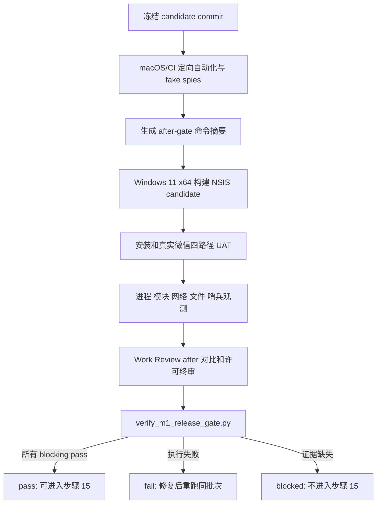

# 步骤 14：执行 M1 自动化、Windows 实机和 Work Review 回归门禁

> 文档状态：实施前技术方案（仅方案设计）
> dispatch：`aich8-zhuochong-desktop-pet-rag-27-steps-20260805-task-14`
> LOOF run：`20260806-1807-步骤-14执行-m1-自动化windows-实机和-work-review-回归门禁对照-kai`
> 设计时间：2026-08-06 18:08（Asia/Shanghai）

## 0. 方案设计原则

- **本步骤是门禁执行，不重写 M1**：复用步骤 1—13 已有的 `WechatReplyRuntime`、`reply_flow::generate_wechat_reply`、`CaptureCoordinator`、`WechatContentStore`、`AvatarWindow` 及现有 `verify_wechat_*` 脚本；除为可验证性确有缺口的测试夹具/测试 seam 外，不改变产品行为、Tauri command、配置、模型请求或桌宠交互。
- **冻结的 before 基线不可改写**：`work-review-source.json`、`work-review-regression-baseline.json` 与 `work-review-inheritance-matrix.md` 仍表达步骤 2 的修改前事实（包括 `UPSTREAM-RUST-001`）。修改后证据写入新的 after-gate 工件，以 `baseline_id` 和 `BASE-*` ID 关联，绝不把 before 结果覆盖成 after 结果。
- **“通过”必须是同一 candidate 的可复核组合证据**：自动化、Windows 实机、NSIS 安装、Work Review 回归、能力零调用、哨兵和许可审计都需指向同一 Git commit、同一 candidate SHA-256 和同一执行批次；缺一项即 `blocked` 或 `fail`，不能由 macOS 静态检查替代。
- **M1 仍是用户手动闭环**：只测试用户点击、手动切回已支持单聊、建议显示、用户自己复制/粘贴/发送；严禁增加微信注入、协议/数据库读取、UI Automation 输入、鼠标键盘模拟、自动复制/粘贴/发送、未选择聊天处理、MCP/Bot/search/upload/Agent/action tool 调用。
- **真实外部能力不作测试前提**：模型成功路径使用现有 fake single-turn transport 的固定、脱敏短句；网络、MCP、Bot、上传、搜索、Localhost API 和 action tool 的断言目标均为零调用，不读取真实聊天、导出、凭据或私密目录。

## 1. 基线、目标和非目标

### 1.1 已确认基线

1. `desktop/src-tauri/src/wechat/commands.rs::generate_wechat_reply` 是无用户输入的显式 command，`reply_flow` 已持有 single-flight lease，并在成功时调用 `publish_generated_suggestion`、发出 `emit_avatar_bubble`、再 `finish_reply`。
2. 步骤 7—10 已有捕获、Windows OCR、runtime 留存和无工具模型 transport 的静态门禁；步骤 13 已有显式触发、倒计时、设置/错误显示的静态检查。它们证明源码/合成测试边界，不是 Windows UAT 证据。
3. `desktop/docs/contracts/ac-applicability-matrix.md` 已定义 AC-WX、AC-PET、AC-BASE 相关证据类型；其中 Windows/manual/deferred 项尚不能因当前 macOS 主机而标记通过。
4. 步骤 2 冻结的 Work Review 基线包含一个已登记上游失败 `UPSTREAM-RUST-001`；after 对比须确认该失败仍被正确归因，不能把它误称为微信回归。
5. 当前 `third-party-assets.md` 仍含 `pending-verification` 图标、截图和 BongoCat 资产。未补齐每项许可证/商业授权证据前，M1 candidate 不能成为可发布完成态。

### 1.2 可验收目标

1. 一个 versioned gate runner 读取命令结果和人工 Windows 观察记录，强制所有 blocking 项完整、同批次、可哈希关联；它不自行把缺失证据推断为通过。
2. 对窗口身份/ROI、隐藏恢复、OCR、状态机、模型 transport、持续建议、复制/关闭/代际和留存运行定向 Rust/Node/静态测试；失败 OCR、截图、取消、超时、非微信时 fake model 调用恒为 0。
3. 受控 Windows 11 x64 + 冻结微信版本/profile 上，证明成功、截图失败、超时、取消四条路径均保持焦点不变且临时覆盖层恢复；真实 profile 不匹配时 fail-closed。
4. 同一 Windows candidate 的 NSIS 包可安装、启动、单实例、托盘、自启动、退出；安装包、依赖图、进程、窗口与加载模块均不含 VPet/.NET/WPF sidecar、额外托盘或更新器。
5. 在 M1 错误路径和正常路径均证明：一次请求最多一次文本模型调用；禁止 capability 和资源哨兵（DLL、脚本、命令清单、URL）均为零访问/零加载/零启动/零网络/零合成输入。
6. 仅当全部当前适用 AC-BASE、AC-WX、AC-PET 和参考/素材终审通过时，产出 `pass`；M2-only 条款保留 `conditional-not-enabled`，不删除、不伪装为 M1 成功。

### 1.3 非目标

- 不实现 M2/RAG、知识导入、`knowledge.sqlite`、聊天导出读取、性能门禁、正式签名/正式发布、更新器恢复或新 profile/ROI 校准工具。
- 不修改 Work Review 的冻结 before 证据、上游失败归因、普通截图/OCR/隐私数据、桌宠正常生命周期或其他 LOOF run 产物。
- 不把 Windows target 编译、安装、真实微信 UI、WebView2、签名或许可的缺失写成 `pass`；在无受控 Windows 或授权资料时只形成明确的 `blocked` 结果。

## 2. 最小修改范围

| 路径 | 动作 | 最小职责 |
| --- | --- | --- |
| `kaifa/kaifa_test/verify_m1_release_gate.py` | 新增 | 读取 after-gate JSON、命令摘要、candidate hash、Windows 观察记录和台账；校验 schema、关联键、状态闭合和所有 blocking 条件，输出唯一 `pass/fail/blocked`。不启动产品、网络或微信。 |
| `kaifa/kaifa_test/fixtures/m1_gate/**` | 新增（仅虚构数据） | 为 runner 的 pass/fail/blocked 解析、缺证据、哈希不一致、错误路径零调用和 M2 条件不适用建立脱敏 fixture；不放截图、聊天、联系人、路径、凭据或真实安装包。 |
| `desktop/docs/baselines/work-review-m1-after-gate.json` | 新增 | after 对比覆盖 `BASE-*`、AC-WX、AC-PET、candidate、命令和 Windows 证据摘要；引用而不修改步骤 2 的 baseline ID/哈希。真实运行时只写脱敏观察、退出码、时间、artifact SHA-256、版本和 verdict。 |
| `desktop/docs/baselines/work-review-m1-after-gate.md` | 新增 | 面向人工复核的同内容矩阵：before 引用、after 方法/证据/status、已知上游失败、M2 条件不适用、阻断原因和发布结论。 |
| `kaifa/kaifa_test/verify_wechat_{reply_flow,reply_runtime,windows_ocr,explicit_trigger,model_transport,ephemeral_capture}.py` 与对应 Rust/Node tests | 最小扩展 | 只补当前门禁缺少的可计数 fake/spies/断言；优先复用已有测试与 fake transport，不为生产代码新增能力。 |
| `desktop/src-tauri/src/wechat/**`、`desktop/src/routes/avatar/**` | 仅当测试不可注入时最小修改 | 只允许 `#[cfg(test)]` 或等效测试 seam，使现有 fake 能观测模型/能力调用计数；不得新增对外 command、运行时开关、网络、文件写入或用户功能。 |
| `kaifa/kaifa_test/test.md`、`kaifa/kaifa_personnel/mingling.md`、`kaifa/kaifa_log/<时间>-执行M1自动化Windows实机和Work Review回归门禁.md` | 回填/新增 | 只登记实际执行的命令、环境、证据位置、退出码和未执行原因。 |

不得修改 `desktop/docs/baselines/work-review-regression-baseline.json` 的 before 结果，也不得以修改 `verify_work_review_regression_baseline.py` 来逃避冻结比对。不得新增 npm/Cargo 依赖、Tauri capability、配置字段、数据库或产品路由。

## 3. After-gate 证据契约与判定

### 3.1 `work-review-m1-after-gate.json` 的最小结构

```json
{
  "schema_version": 1,
  "gate_id": "m1-regression-gate-20260806",
  "baseline": {
    "baseline_id": "work-review-v1.1.0-before-wechat-rag-20260805",
    "source_commit": "500f9d2cb3027392cfcc32ad18395dfe348fb4a1",
    "source_manifest_sha256": "<copied-from-frozen-manifest>"
  },
  "candidate": { "git_commit": "<exact-commit>", "nsis_sha256": "<sha256-or-null>" },
  "automated": [{ "id": "M1-AUTO-...", "command": "<actual command>", "exit_code": 0, "status": "pass", "log_sha256": "<sha256>" }],
  "after_matrix": [{ "id": "BASE-01", "before_ref": "BASE-01", "status": "pass|fail|blocked", "evidence_ids": ["..."] }],
  "windows": { "host": "<sanitized Windows build>", "wechat_profile_fingerprint": "<approved profile hash>", "scenarios": [] },
  "capability_counters": {},
  "asset_ledger_review": { "status": "pass|fail|blocked", "evidence_ids": [] },
  "verdict": "pass|fail|blocked"
}
```

- 路径、聊天文本、截图像素、账号、联系人、模型 endpoint/密钥、证书私钥与完整进程命令行均不得写入。每个证据仅记录相对 artifact ID、不可逆 SHA-256、退出码、时间和人工复核结论。
- `candidate.git_commit`、所有自动化摘要、Windows record、NSIS hash、能力计数和台账复核必须一致；任何 `null`、缺失、哈希/commit 不一致、重复 ID 或未知 status 使 runner `blocked`。
- `UPSTREAM-RUST-001` 必须与 before 记录完全匹配时才允许 `known-upstream-failure`；新增失败或原失败发生变化均为 `fail`，不得用已知问题兜底。

### 3.2 门禁状态

| 状态 | 含义 | 对步骤 15 的影响 |
| --- | --- | --- |
| `pass` | 所有 blocking 条件有同一 candidate 的真实证据，台账无待核验发行项，M1 only 说明完整。 | 允许开始步骤 15。 |
| `fail` | 已执行但测试/观察/计数/对比不满足契约，或出现未解释 Work Review 回归。 | 阻断；先修复并重新取得完整 evidence batch。 |
| `blocked` | Windows 环境、冻结 profile、candidate、安装权限、许可证/素材证据或其他必要输入缺失。 | 阻断；记录缺什么，不伪造通过。 |

M2-only 项固定为 `conditional-not-enabled`，只证明它没有被启用，不计为 M1 的 Windows/隐私/安装通过项。

## 4. 执行流程



### 4.1 自动化与 fake-spy 批次

1. 首先运行 `verify_work_review_regression_baseline.py`，确认 before 工件与冻结来源仍一致；随后运行已有六个 `verify_wechat_*` 静态门禁及它们对应的 Rust/Node 定向测试。命令以实际 `package.json` 的 `node --test` 和 `cargo test/check` 为准，结果逐条入 after JSON。
2. 对 `non-WeChat`、unsupported/disabled profile、capture failed、capture timeout、OCR empty/unavailable/failed、cancel、stale 和 model unavailable，使用 fake window/capture/OCR/transport 断言 `model_calls == 0`；正常 M1 仅允许 `model_calls == 1`，并断言单轮 request 无 tools 字段。
3. 预置 clipboard 内容并在前端现有建议组件验证：显示、悬停、拖动、普通提醒、关闭和 stale `suggestionGeneration` 都不改变 clipboard；只有当前 generation 的有效复制按钮改变它。验证复制后不自动粘贴或发送。
4. 增加 capability spies：`replyModelNonLoopback` 正常路径至多 1，`ocrBackendLocalProcess` 仅受微信 OCR 编排器且 profile/探针允许时条件计数；MCP、Bot、上传、搜索、Localhost API、Agent/action tool、微信输入、剪贴板 Rust API、进程启动、网络和合成输入均为 0。桌宠和资源层发起 OCR/进程/网络/输入同样必须为 0。
5. content retention 关闭时用临时目录/文件系统 spy 断言没有聊天截图、OCR、命中摘录或建议正文文件；开启、到期清理、一键删除各自只影响受管理微信 content root，绝不进入知识库、上传队列或普通 Work Review 数据。

### 4.2 Work Review after 对比

1. 以步骤 2 的 `BASE-01`—`BASE-10` 和五条 `BASE-AUTO-*` 为稳定 ID 创建 after 行，逐项记录 before 引用、修改后命令/人工步骤、artifact、结果和解释。不可访问的 Windows/manual 项保持 `blocked`，而不是继承 before 或猜测 `pass`。
2. 对原有普通功能运行与矩阵一致的修改后测试：启动/单实例/托盘/自启动/暂停恢复退出、活动窗口与分类、普通截图/OCR/隐私与清理、概览/时间线/日报周报/导出、设置/多语言/桌宠；对凭据型能力只验证默认关闭/契约/错误路径，不进行外发。
3. `cargo test --workspace` 的 `UPSTREAM-RUST-001` 仅当失败名称、位置和归因与冻结记录一致时登记为已知上游失败。其余全部运行项应无新增退化；任何不一致使 after-gate `fail`。

### 4.3 Windows candidate、UAT 和安装验证

1. 在受控 Windows 11 x64 上记录 Windows build、Rust/Node/Tauri 版本、WebView2、微信版本、可执行文件 SHA-256、DPI/主题/显示器拓扑和获批准 compatibility profile fingerprint；这些是脱敏元数据，不记录聊天内容。
2. 以当前仓库脚本 `cd desktop && npm run tauri:build -- --bundles nsis` 构建候选包，计算 NSIS SHA-256。正式签名参数仍未具备时只可标注为未签名/测试签名 candidate，不能标为正式发行。
3. 安装后验证安装、启动、单实例、托盘、自启动、退出；再审计安装目录、依赖图、进程、窗口和已加载模块。不得出现 VPet、.NET、WPF GUI sidecar、额外托盘、更新器或 updater artifact。
4. 真实微信只测试用户可见的已支持单聊：显式点击、倒计时后用户手动切回、成功 capture/OCR/一条短建议、气泡、复制/关闭；并分别执行 capture fail、timeout、cancel。全部场景验证不抢焦点、覆盖层/桌宠状态恢复、无自动输入/发送。
5. 版本化中文虚构样例只要求“一次一条简短自然、可复制建议”；不得输出分析过程、RAG/命中/来源状态。真实聊天内容不进入报告。

### 4.4 哨兵、隐私和资产终审

1. 在受测资源目录旁放置无害、不可执行的哨兵 DLL、文本脚本、命令清单和 URL 声明；通过受控文件/模块/子进程/网络/合成输入观测记录其访问计数。禁止使用可执行 payload、真实 URL 请求或注入手段。
2. 各计数必须为零；任何访问、加载、启动、请求或合成输入立即为 `fail`。哨兵测试结束后只删除本次明确创建的临时测试目录，并在日志记录其清理结果。
3. 重新审阅 `reference-ledger.md` 与 `third-party-assets.md`：每一项给出复制/未复制、上游 commit/原文件/产品位置、显著修改、LICENSE/NOTICE/归属义务与商业授权证据。任一 `pending-verification`、缺失或冲突为 `blocked`，不能把 NSIS 测试成功当作素材许可通过。

## 5. 测试矩阵

| 类别 | 场景 | 关键断言 |
| --- | --- | --- |
| 错误短路 | 非微信、profile/capture/OCR 失败、取消、超时 | model/外部 capability 均 0；稳定错误；slot/覆盖层恢复。 |
| 正常 M1 | fake model、Windows 单聊 | 仅一条无工具模型请求；一条短建议；用户自行复制/粘贴/发送。 |
| 桌宠与剪贴板 | 显示/悬停/拖动/普通提醒/关闭/stale copy | 仅当前有效复制按钮改变 clipboard；无自动复制/输入/发送。 |
| 留存 | 关闭/开启/到期/一键删除 | 关闭零正文文件；开启仅受管目录；不入知识库/上传队列。 |
| 能力隔离 | network/process/module/filesystem/input spies + 哨兵 | 禁止项零调用；local OCR 仅条件允许路径可计数。 |
| Work Review | BASE 与自动化行 after 对比 | 无新增退化；唯一上游失败只按冻结归因。 |
| Windows/包 | NSIS、安装、启动、单实例、托盘、自启动、退出 | 同一 candidate hash；无 sidecar/更新器/额外进程窗口。 |
| 资产/发布语义 | 台账与 release note | 没有未核验素材；准确声明 M1 未完成 RAG、无正式签名时不称正式发行。 |

## 6. 实施顺序与命令边界

1. 先实现 after-gate schema、虚构 fixture 和 parser tests，使用故意缺少 Windows/台账/哈希的 fixture 证明 runner 会 `blocked`，而不是默认 `pass`。
2. 复用并补齐现有静态/Rust/Node 测试的 fake/spies；先让所有 macOS 可执行项有可哈希摘要，再生成 after JSON 的自动化段。
3. 不修改冻结 before 工件，新增 after 矩阵/JSON 并运行 `verify_work_review_regression_baseline.py` 加 after runner，确认两套工件可以同时成立。
4. 在 Windows 环境可用时构建 candidate、完成 UAT/安装/哨兵/进程模块审计；不可用时将缺少的证据项明确写为 `blocked`，不启动后续步骤。
5. 最后执行许可终审和 gate runner，回填实际命令与结果到 `mingling.md`、`test.md`、开发日志；实施日志不得把计划命令写成已运行结果。

建议执行集合（实施时仅运行环境允许且当前工作区所需的命令；全部实际退出码必须入证据）：

```bash
python3 -B kaifa/kaifa_test/verify_work_review_regression_baseline.py --project-root .
python3 -B kaifa/kaifa_test/verify_wechat_ephemeral_capture.py
python3 -B kaifa/kaifa_test/verify_wechat_windows_ocr.py --project-root .
python3 -B kaifa/kaifa_test/verify_wechat_reply_runtime.py --project-root .
python3 -B kaifa/kaifa_test/verify_wechat_model_transport.py
python3 -B kaifa/kaifa_test/verify_wechat_reply_flow.py --project-root .
python3 -B kaifa/kaifa_test/verify_wechat_explicit_trigger.py --project-root .
cargo test --manifest-path desktop/src-tauri/Cargo.toml wechat:: --no-default-features
cargo check --manifest-path desktop/src-tauri/Cargo.toml --no-default-features --features 'wechat-contract-check,wechat-m1'
cd desktop && node --test src/lib/components/Avatar/avatarWindow.test.js src/lib/components/Avatar/avatarOutline.test.js src/routes/avatar/WechatExplicitTrigger.test.js src/routes/settings/SettingsWechatKnowledge.test.js src/lib/utils/errorDisplay.test.js
python3 -B kaifa/kaifa_test/verify_m1_release_gate.py --project-root .
```

Windows candidate 只在受控 Windows 11 x64 执行 `cd desktop && npm run tauri:build -- --bundles nsis` 及本节 UAT。macOS 不可将该命令或合成测试的成功计入 Windows/安装/签名证据。

## 7. 风险、回滚和完成定义

| 风险 | 控制 |
| --- | --- |
| 静态测试被误作实机通过 | runner 将 `windows-manual`、NSIS、安装、许可设为 blocking；无 record 必为 `blocked`。 |
| 修改后篡改冻结 before 基线 | after 工件只引用 baseline ID/哈希；保留并先运行原基线 verifier。 |
| 观测工具自身引入能力/隐私风险 | fake/spies、无害哨兵和脱敏摘要均为测试范围；不注入微信、不访问真实 URL、不保存聊天正文。 |
| 上游已知失败掩盖新增回归 | 只接受精确匹配的 `UPSTREAM-RUST-001`；其余失败不可豁免。 |
| candidate 的测试签名/资产状态被误称发行 | 证据显式区分测试 candidate、正式签名和素材授权；任何缺口保持阻断。 |

回滚只撤销本步骤新增的 gate runner、虚构 fixture、after 证据模板、测试 seam 和本步骤日志；不得删除步骤 1—13 的基线、产品逻辑、用户内容或其他 LOOF run 文件。若 Windows 或素材条件无法取得，保留已完成的自动化工件并以 `blocked` 结束，不通过修改规则来绕过门禁。

本步骤只有在 after-gate verdict 为 `pass` 时才算 M1 回归门禁完成并允许步骤 15。当前无受控 Windows 11/冻结微信实机、同批 NSIS evidence 或完整素材商业授权时，预期正确结果是 `blocked`，不是失败后降级成“仅自动化通过”。

## 8. 代码实施修改顺序

1. `kaifa/kaifa_test/verify_m1_release_gate.py` 与虚构 fixture：先固定 schema、阻断判定和 parser tests。
2. 现有 `verify_wechat_*`、Rust/Node tests：只补 fake/spies、零调用和 generation/clipboard/retention 的可观测断言；必要时才加 test-only seam。
3. `desktop/docs/baselines/work-review-m1-after-gate.{json,md}`：生成 after 对比模板/真实脱敏结果，保持 before 工件不动。
4. Windows candidate/UAT/哨兵/资产审计：仅在受控环境执行并填实际 evidence；缺环境则写 `blocked`。
5. `mingling.md`、`test.md` 与实施日志：回填真实命令、退出码、artifact hash、环境限制和最终 verdict。
