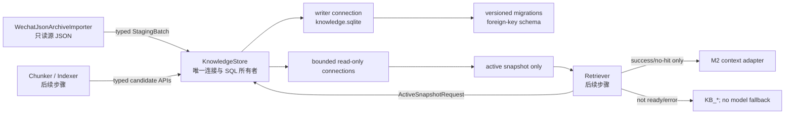

# 步骤 16：建立独立 knowledge.sqlite、版本化 migration 和单一 Store

> 文档状态：实施前技术方案（仅方案设计）
> dispatch：`aich8-zhuochong-desktop-pet-rag-27-steps-20260805-task-16`
> LOOF run：`20260806-2055-步骤-16建立独立-knowledgesqlite版本化-migration-和单一-store`

## 0. 方案设计原则（自检清单）

- **物理隔离**：知识库只位于 `<AppState.data_dir>/wechat_knowledge/knowledge.sqlite`；绝不向 `desktop/crates/core/src/database.rs::Database::init_tables()` 增加聊天表、迁移或锁。
- **单一入口**：只有 `KnowledgeStore` 可以打开 SQLite 连接、执行 migration 或执行 SQL。导入器、后续 chunker/indexer/retriever 只传递类型化输入和接收类型化结果；不暴露 `rusqlite::Connection`、路径或 SQL 字符串。
- **候选不可见**：`staging`、`ready_candidate`、失败代际均不可被 active-read API 或 `knowledge_retrieve()` 查询；激活必须一次事务更新会话指针和 catalog 指针。
- **故障安全**：迁移版本超前、PRAGMA/FTS5 不满足、schema 非法、busy 超时和损坏库统一使知识库不可用并返回既有 `KB_NOT_READY`；不删除、重建或“修复”已有库。M2 不得降级到 M1 或裸模型。
- **最小范围**：本步骤仅落地独立库基础设施、schema、代际/删除约束及 Store API；不实现第 17 步的 lineage 合并规则、真实消息写入、分块、向量、检索算法、前端或微信采集改动。

## 1. 已核对基线与目标

- 当前 `knowledge/runtime.rs` 的 `KnowledgeStore` 是 managed 的空门面；`archive_importer.rs` 直接创建 `WechatArchiveStore`，而 `archive_store.rs` 在 `open()` 时以 `CREATE TABLE IF NOT EXISTS` 建三张临时审计表。这违反本步骤要求的唯一连接所有者与版本化 schema。
- 当前 `rusqlite = { version = "0.30", features = ["bundled"] }` 已可使用。Work Review 的 `Database::new()` 已采用 WAL 与 `busy_timeout=5000`，仅参考其连接/事务风格；其 `Database::init_tables()` 和 `crates/core/src/knowledge.rs` 均不在修改范围。
- 第 15 步已冻结 archive v1 的只读输入与脱敏 fixture。本步骤保留其源目录只读、真实内容不进普通日志的边界；将临时 `archive_*` 审计记录迁入统一 Store，而非再保留第二个数据库所有者。
- 当前前台微信 M1 链路、截图/OCR、模型 transport、桌宠和 Tauri command 不改。现有 M2 contract 的 `KnowledgeScope`、`knowledge_retrieve()`、`RetrievedReply` 仍只能在 active snapshot 已就绪时使用，否则维持 `KB_NOT_READY`。

验收目标是：新库可新建和重复打开；每条连接已验证 WAL、外键、busy timeout、FTS5 和 schema 版本；调用者只能写 staging、校验 candidate、读 active 或写删除/deny；数据库异常不会影响 Work Review 工作记录库或放宽 M2 边界。

## 2. 组件边界与主流程



### 2.1 生命周期与并发

1. `main.rs` 在已有 `data_dir` 确定后创建 `KnowledgeStore::open_or_unavailable(&data_dir)` 并 `.manage(...)`；它自身创建 `wechat_knowledge/` 与唯一 writer。打开失败不阻止现有 Work Review/M1 启动，但 Store 记录不可用状态，所有知识操作 fail-closed 为 `KB_NOT_READY`。
2. `KnowledgeStore` 内部持有一个仅供短事务写入的 writer connection；writer 串行化只覆盖 `BEGIN IMMEDIATE` 到 commit/rollback。它不包裹导入器文件解析、candidate 索引构建或 UI 等待，也不以一个全局 `Mutex<Connection>` 阻塞所有读者。
3. Store 以有界 reader factory/pool 创建只读连接（数量固定、超额请求等待有限时长后返回 `KB_NOT_READY`）。每个 reader 都由 Store 创建并设 `query_only=ON`，在单个一致性 read transaction 内解析 catalog 的 active index/import snapshot；reader 从不读取 staging/candidate。
4. 所有连接都在打开后执行并读回验证：`PRAGMA foreign_keys=ON`（结果必须为 1）、`PRAGMA journal_mode=WAL`（结果必须为 `wal`）、`PRAGMA synchronous=NORMAL`、有界 `PRAGMA busy_timeout=5000`、以及 FTS5 探针。任何验证不符均关闭该连接并将 Store 标为 unavailable；不得继续使用默认 SQLite 行为。

### 2.2 migration 规则

新增内嵌资源 `desktop/src-tauri/src/knowledge/migrations/knowledge/0001_initial.sql` 与极小 `migrations.rs` runner。迁移清单按编号升序，当前 head 为 1。

1. 空库：writer 在一次 `BEGIN IMMEDIATE` transaction 内执行 `0001_initial.sql`，更新 `PRAGMA user_version=1` 后提交。
2. 已有库：读取 `user_version`，仅执行连续缺失 migration；等于 head 时只做 schema/PRAGMA 验证，不重复 DDL。
3. `user_version > head`、版本为 0 却已有知识表、缺少/字段不符的已知表、`foreign_key_check` 非空、FTS5 探针失败或 `integrity_check` 非 `ok`，都视为非法/损坏库：不开启替代库、不改旧文件，Store unavailable。
4. 未来 migration 只能新增编号 SQL 与对应测试；不得通过修改 `0001_initial.sql` 改写已发布版本。migration SQL 与 `user_version` 必须同一事务，失败回滚且下次重开仍可诊断。

## 3. `0001_initial.sql` 数据模型

所有表均在该独立库中，以外键和 `CHECK` 约束表示状态，不以注释替代约束。时间字段使用 `*_at_ms INTEGER`；ID 使用 Store 生成的 opaque TEXT，不把原始 source 路径或聊天正文写入日志。

| 表 | 最小字段和约束 | 用途 |
| --- | --- | --- |
| `knowledge_sources` | `id PK`、账号/export/schema/时间、manifest/content/coverage hash、filters JSON、`snapshot_kind`、priority、`source_state CHECK(active,retired,missing)`、完整性/导入状态、检查时间、错误码/摘要 | 第 15 步导出源审计；`UNIQUE(account_stable_id, export_id, schema_version, manifest_hash, coverage_hash)`。 |
| `knowledge_source_lineage` | predecessor/successor source FK、relation kind、verified_at、evidence_hash；`UNIQUE(predecessor_source_id,successor_source_id,relation_kind)` | 为第 17 步预留真实 lineage 关系，两个 source 均 `ON DELETE RESTRICT`。 |
| `knowledge_conversations` | `id PK`、account/conversation stable ID、显示元数据、`active_import_generation_id` nullable FK | `UNIQUE(account_stable_id, conversation_stable_id)`；active 指针不得指向另一个会话的 generation。 |
| `knowledge_import_generations` | `id PK`、trigger source FK、conversation FK、parent FK、source-set hash、merge mode、`status CHECK(staging,ready_candidate,active,superseded,failed)`、计数、时间、错误 | `UNIQUE(conversation_id, id)` 供复合会话外键；仅 Store 的 activate API 可产生 `active/superseded`。 |
| `knowledge_import_generation_sources` | generation/source FK、precedence、coverage role | `PRIMARY KEY(import_generation_id,source_id)`。 |
| `knowledge_messages` | conversation FK、stable ID nullable、fallback key nullable、low confidence | 稳定路径 `UNIQUE(conversation_id,message_stable_id)`；fallback 路径 `UNIQUE(conversation_id,fallback_key)`；CHECK 恰有一种 identity。 |
| `knowledge_message_versions` | message/generation FK、正文和规范化字段、content hash | `UNIQUE(import_generation_id,message_id)`；版本不可由 update API 修改。 |
| `knowledge_import_generation_members` | generation/message/version FK、selection reason | `PRIMARY KEY(import_generation_id,message_id)`；复合 FK 确认 version 属于该 message。 |
| `knowledge_message_sources`、`knowledge_media_refs` | version/source provenance 与 media reference FK | source unique `(message_version_id,source_id,source_relative_path)`；media 通过 version/provenance 关联，首期不读取媒体。 |
| `knowledge_denials` | source/conversation/message nullable FK、原因、effective generation、created_at | 至少一个拒绝目标的 CHECK；active read 以此过滤，不能安全过滤则返回 `KB_NOT_READY`。 |
| `knowledge_index_generations`、`knowledge_index_generation_imports` | schema/embedding 元数据、snapshot hash、`status CHECK(building,ready,failed)`、计数；index/conversation/import 三元冻结表 | `PRIMARY KEY(index_generation_id,conversation_id)`；候选 index 显式绑定各会话 candidate generation。 |
| `knowledge_catalog_state` | `singleton_id INTEGER PRIMARY KEY CHECK(singleton_id=1)`、catalog seq、active snapshot hash、active index FK、activated_at | 仅一行；初始无 active index，避免把空库假装成可检索。 |
| `knowledge_chunks`、`knowledge_chunk_messages`、`knowledge_chunks_fts` | index FK、chunk key、会话/首尾 version、内容/hash/embedding BLOB；chunk-message 完整映射；FTS 按 index generation 隔离 | `UNIQUE(index_generation_id,chunk_key)`；FTS 与 chunks 在同一 writer transaction 显式同步，不能由触发器提前暴露 building index。 |

删除规则：可重建的派生 objects（members、versions provenance/media、chunks、chunk-message、FTS rows）用 `ON DELETE CASCADE`；被 catalog 或 lineage 引用的 source/index 使用 `RESTRICT`，必须先经 Store 的 typed deletion/invalidation 事务移除指针或写 denial。`knowledge_conversations.active_import_generation_id` 使用 `(id,conversation_id)` 复合外键，保证不能激活错误会话的代际。

## 4. 类型化 Store 契约

下列类型置于 `knowledge/types.rs`，SQL 和 `Connection` 均只在 `knowledge/store.rs`/`migrations.rs` 私有可见。名称可按现有 crate 风格微调，但不改变状态边界。

```rust
enum ImportGenerationState { Staging, ReadyCandidate, Active, Superseded, Failed }
enum StoreAvailability { Ready, Unavailable }

struct StagingImport;              // 已验证 source/conversation 与新 generation ID
struct CandidateImport;            // 只可交给 index builder 或 activate
struct ActiveSnapshot;             // catalogGeneration + active index/import IDs
struct DeletionRequest;            // source/conversation/message + reason

fn begin_staging_source(&self, input: NewSource) -> Result<StagingImport, ContractError>;
fn append_staging_batch(&self, staging: &StagingImport, batch: MessageBatch) -> Result<(), ContractError>;
fn mark_ready_candidate(&self, staging: StagingImport, checks: CandidateChecks)
    -> Result<CandidateImport, ContractError>;
fn read_active_snapshot(&self, request: ActiveReadRequest)
    -> Result<ActiveSnapshot, ContractError>;
fn activate_candidate(&self, candidate: CandidateImport, ready_index: ReadyIndex)
    -> Result<CatalogGeneration, ContractError>;
fn deny_or_delete(&self, request: DeletionRequest) -> Result<(), ContractError>;
```

- `begin/append/mark` 只能生成或更新 staging，`mark_ready_candidate` 必须验证计数、来源集合、外键和候选索引前置条件；失败转 `failed`，旧 active 不动。
- `activate_candidate` 在一个 writer transaction 中验证 candidate/index 均 ready，更新相关 `knowledge_conversations.active_import_generation_id`、旧 active → `superseded`、`knowledge_catalog_state` 和 `catalog_generation_seq`。任一步失败回滚，retriever 继续看到旧 active。
- `read_active_snapshot` 先检查 Store availability、catalog 单行、index ready 与 denial 可安全过滤性；任何条件不满足返回 `KB_NOT_READY`，绝不查询 candidate 或回退 M1。
- `deny_or_delete` 先持久化 denial，再级联删除/使受影响派生 index 失效；若旧 index 无法按 `knowledge_chunk_messages` 精确过滤，就在事务中撤销该范围的 active 可用性，直到重建完成。
- `WechatJsonArchiveImporter` 改为持有 `&KnowledgeStore`（或只在调用处接收 Store），仅提交 `NewSource`/审计批次；删除 `WechatArchiveStore::open()`、直接 `Connection` 字段和调用者自拼 SQL 的路径。

## 5. 最小修改范围与实施顺序

| 路径 | 改动 |
| --- | --- |
| `desktop/src-tauri/src/knowledge/migrations.rs` | 新增 migration registry、每连接 PRAGMA/FTS/schema 验证与不可用错误归一化。 |
| `desktop/src-tauri/src/knowledge/migrations/knowledge/0001_initial.sql` | 新增本节 schema、索引、外键、FTS5 和初始 catalog 单行。 |
| `desktop/src-tauri/src/knowledge/store.rs` | 新增唯一 writer、bounded read-only connections、typed staging/candidate/active/deletion API。 |
| `desktop/src-tauri/src/knowledge/archive_store.rs` | 删除或收缩为无连接的 archive DTO 迁移层；不再拥有 DDL/SQLite connection。 |
| `desktop/src-tauri/src/knowledge/archive_importer.rs` | 最小替换为调用 Store typed API，保留第 15 步只读 guard 与流式输入边界。 |
| `desktop/src-tauri/src/knowledge/runtime.rs`、`mod.rs`、`types.rs`、`main.rs` | 用初始化后的 Store 取代空 marker；仅接入现有 dataDir，保持 command/M1 不变。 |
| `desktop/src-tauri/src/knowledge/*` 的单元测试 | 新增本节 migration、并发和 fail-closed 测试；不使用真实聊天数据。 |

实施顺序：先写 migration 失败测试和 `0001`，再写 open/validate 与 Store writer/read API；然后替换 archive importer 的直接连接；最后在 `main.rs` 以已有 dataDir 管理 Store，并运行定向回归。不得先改变 `Database::init_tables()`、检索/模型调用或 UI。

## 6. 测试与验收

| 用例 | 断言 |
| --- | --- |
| 新建库 | 仅 `<temp-data-dir>/wechat_knowledge/knowledge.sqlite` 出现；`user_version=1`、所有连接 PRAGMA/FTS5 通过；Work Review 库路径和表未变化。 |
| 重复打开 | 第二次 open 不重放 `0001`，schema 与 catalog 单行数量稳定，既有 active 数据可读。 |
| 非法 schema/未来版本 | 缺表、错误字段、version 0 却有知识表、`user_version > 1`、`foreign_key_check` 失败都使 Store unavailable，返回 `KB_NOT_READY` 且不修改数据库。 |
| 外键与级联 | 插入孤儿 member/version/index 失败；通过 typed deletion 删除 message/source 时预期的 provenance/media/member/chunk mapping 级联，catalog/lineage 仍受 RESTRICT 保护。 |
| staging/candidate/active 隔离 | staging 与 candidate 永不由 active read 返回；activate 成功前后读者分别稳定看到旧/新完整 snapshot，失败候选不污染旧 active。 |
| busy | 用测试专用第二连接持有写锁；Store 在 5 秒以内按 bounded timeout 返回 `KB_NOT_READY`，不会死锁、panic 或持有 Work Review `Database` 锁。 |
| 损坏库 | 写入截断/非 SQLite 测试文件或使 `integrity_check` 失败；open fail-closed，不自动删除/覆盖，M1 仍可启动。 |
| 单写多读 | writer 批事务期间 reader 只读最近已激活 snapshot；reader 不占 writer mutex，写者也不等待文件解析/UI。 |
| M2 边界回归 | `KB_NOT_READY` 时 M2 model transport spy 为零，且没有 M1/裸模型 fallback；本步骤不改变前台微信识别。 |

建议命令（以实际 Cargo package 名核对后执行）：`cargo test knowledge::`、针对 Store 的 migration/busy 测试、`cargo fmt --check`（限本轮 Rust 文件）及 `git diff --check`。Windows 实机 OCR/UAT 不属于本步骤；不得以 macOS 单元测试声称其已通过。

## 7. 风险、回滚与完成标准

- SQLite 捆绑构建若没有 FTS5，或目标设备 WAL/目录权限不满足，知识库保持 unavailable；不改用 Work Review DB、内存库、远端服务或自动降级。
- busy、损坏和版本冲突的诊断只记录安全错误码/匿名 ID，不记录路径、消息正文或数据库行。
- 未提交时只移除本步骤新增文件并还原本步骤列出的文件；提交后使用 `git revert <本步骤提交>`。不得删除用户 dataDir、导出源或其他 LOOF run 文件。

完成条件：所有连接与 migration 验证有测试证据；`KnowledgeStore` 是唯一知识库连接所有者；active/candidate/denial 边界由约束和 API 验证；Work Review `Database::init_tables()` 未改；所有失败保持现有前台微信和 M2 fail-closed 行为。
