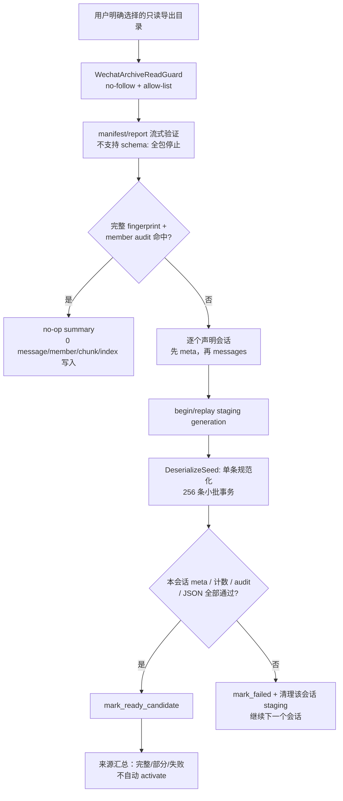

# 步骤 18：实现大型 messages[] 流式导入、规范化和媒体引用

> 文档状态：实施前技术方案（仅方案设计）
> dispatch：`aich8-zhuochong-desktop-pet-rag-27-steps-20260805-task-18`
> LOOF run：`20260807-task-18-streaming-messages-import`

## 0. 方案设计原则

- **保持既有边界**：只扩展 `desktop/src-tauri/src/knowledge/` 的 archive schema、importer、Store、migration 和合成测试；不改微信采集/OCR/前端/Tauri command/M1/M2、桌宠或发送链路。
- **严格流式**：以现有 `serde_json::DeserializeSeed` / `SeqAccess` 为实现基线；不得反序列化完整 archive、`messages[]`、会话清单、消息 ID 集合或 candidate 集合到 `Vec`/`HashSet`。每次仅持有一个会话、一条反序列化消息和至多 `BATCH_SIZE=256` 条待提交 DTO。
- **候选不可见**：每会话从 `staging` 起步；仅当该会话的 meta、messages envelope、解析/去重/计数、member audit 与 Store 约束全部成功后才变为 `ready_candidate`。任何失败 generation 都不能进入 active catalog、chunk 或检索。
- **只读媒体**：媒体行只登记已声明的相对元数据，`exists_state='unknown'`；不得打开、遍历、`metadata/stat`、哈希、复制或读取媒体正文。现有 `WechatArchiveReadGuard` 仍只允许 manifest 声明的 JSON/integrity member。
- **失败不扩散**：manifest/schema 路由不支持时在任何 staging 写入前整体停止；单一会话损坏、写失败或中断时只清理/标记该会话 staging，继续处理后续声明会话；已完成会话保留其 candidate。
- **不记录敏感源定位**：普通日志和错误只含错误码、匿名 generation/source ID、计数、截断 hash；不写源根路径、媒体名称、账户/会话/消息原值或消息正文。

## 1. 基线、目标与验收

已核对的基线：当前 `archive_importer.rs` 已用 `MessagesEnvelopeSeed` 流式消费 `messages[]`，但仍将 manifest 会话、已处理 staging、会话 message ID 和 member audit 放入无界 `Vec`/`HashSet`；`MessageV1` 只落库 text，`media` 被忽略；`KnowledgeStore::append_staging_messages` 只保存正文/正文规范化/hash，导入器最后把所有会话 candidate 聚为一个 index/activate 批次。因此它尚不满足大型输入、完整规范化、可恢复会话级提交和媒体引用要求。

本步骤的可验收目标：

1. 对任意 `messages[]`，内存上界只随固定 reader buffer、单条 JSON 上限和 256 条 SQL batch 变化，而不随消息总量或会话数线性增长。
2. 每条支持消息形成可重复计算的 canonical record：stable/fallback identity、UTC 毫秒、源序号排序键、message/render type、sender、文本、引用、受控 extra、source member token 与 canonical hash；同一输入重放得到相同 hash 与版本选择。
3. 单会话可从头幂等重放；被 kill、磁盘满或 JSON 损坏后，不泄漏 partial staging，也不影响其他会话或旧 active snapshot。
4. 相同源 fingerprint 加完整 member-audit 命中时快速 no-op：`message_versions`、generation membership、`knowledge_chunks`、FTS/index generation 的写入计数全部为 0，并有耗时基线测试锁定。
5. 成功会话可到 `ready_candidate`，但本步骤不改变 active catalog；现有 chunk/index builder 只接收后续明确选择的 ready candidate，避免部分损坏包被静默发布为 active。

## 2. 输入流程、状态与边界



### 2.1 包级预检与两次 manifest 游标

1. 仍先打开并严格反序列化 `manifest.json`、`report.json`，检查 `wechat_archive_v1`、`source.kind=user_selected`、scope、`includeMedia=false`、export/account/时间及 report 一致性；未知/未来 schema、顶层未知字段、非法路径或不支持的 manifest 语义一律 `KB_SOURCE_UNSUPPORTED`，且不调用 `begin_staging_*`。
2. 将现有 `ManifestProbeV1.scope.conversations: Vec<_>` 改为 `ManifestHeaderSeed` + `DeclaredConversationSeed`。第一次仅验证完整 manifest（字段唯一、声明路径、`stats.conversationCount` 与声明数）并计算不含正文的 declaration digest/count；第二次重开 manifest，逐条交给会话处理器。这样不保留整个会话列表，也能在任何写入前确认源 schema。
3. `member_audits()` 改为流式 `SourceAuditAccumulator`：每个 JSON/integrity member 只产生一个固定大小的 canonical audit tuple；Store 保存 member 行并维护 count/digest。开始和结束各扫描一次，要求 `count + digest + 每个已声明 member` 一致，避免 `Vec<MemberAudit>`。
4. 快速 no-op 在 package preflight 和**不读取 messages 正文**后判定：Store 比较 source fingerprint、source status、声明 member count/digest 与逐项 audit。命中即返回既有汇总；未命中才读取 meta/messages。它不扫描或访问媒体。

### 2.2 会话级流程与故障分流

对第二次 manifest cursor 的每个 `DeclaredConversationV1`，按声明顺序执行：

1. `open_conversation_meta()`，严格解析 `ConversationMetaV1`，验证 schema、account/conversation stable ID、`exportedAt` RFC3339、非空且与 manifest 一致的 messageCount；无效 meta 记为该会话失败，继续下一个。
2. `begin_or_restart_staging(source, conversation, source_fingerprint)` 在短 `BEGIN IMMEDIATE` 内创建 staging；若发现同一 source fingerprint/conversation 的残留 `staging`/`failed` generation，先只删除该 generation 的派生 rows，再从**会话开头**创建新的 staging。不得尝试从 JSON 偏移续读，也不得复用半批数据。
3. 执行 strict `MessagesEnvelopeSeed`。envelope 必须在 `messages` 前给出并完成 `schemaVersion/exportId/account/conversation/filters`；先验证其与 manifest/meta 相同，再逐项 `next_element::<MessageV1>()`。这样 header 不合法时零消息写入。
4. 每条 canonical record 追加到容量 256 的 batch；达到阈值立即 `append_staging_batch`。该 API 的每次事务只涉及本会话 staging；解析器返回后提交尾批，比较 parsed count、accepted count、duplicate/error count 与 meta/manifest 计数，再校验结束 audit。
5. 上述检查全部通过才 `mark_ready_candidate`。损坏 JSON、重复 identity、写入失败、磁盘满、被 kill 后重启、字符串超限或计数不符：该 generation 保持/标记 `failed`，删除其 membership/version/provenance/media staging 派生行，写匿名错误计数，随后继续下一个会话。
6. 包结束只汇总 `declared/succeeded/failed/parsed`。若有失败，会写 source 的 `incomplete` 审计状态，成功会话依然为 `ready_candidate`；自动 index/activate 必须拒绝 incomplete source。全会话成功也只返回 ready candidates，本步骤不调用现有 `register_ready_index_set` / `activate_candidates`。

**明确非范围**：没有用户选择不能打开导出目录；不会注入微信、读微信协议或数据库、操作 UI 输入、自动发送，亦不调用 MCP/Bot/search/upload/Agent 工具。

## 3. 规范化与媒体契约

### 3.1 `MessageV1` 白名单与 canonical record

`archive_schema.rs` 增加严格、可选的消息级白名单字段，而既有 fixture 仍兼容：`id`、`type`、`renderType`、`sender`、`createdAt`、`text`、`reference`、`extra`、`mediaRefs`。所有 struct 继续 `deny_unknown_fields`；每个字符串先经过现有 64 KiB JSON-string guard，再受字段级上限约束。

```rust
struct NormalizedMessage {
    stable_id: Option<String>,       // 非空且 <= 512 bytes
    fallback_key: Option<String>,    // 无 stable ID 时唯一存在
    created_at_ms: i64,              // RFC3339 -> UTC ms
    source_ordinal: u64,             // messages[] 中从 0 起的序号
    sort_key: String,                // {created_at_ms:020}|{source_ordinal:020}|identity_hash
    message_kind: MessageKind,       // 固定 v1 白名单
    render_kind: RenderKind,         // 无合法 renderType 时由 kind 映射
    sender_key: String,              // 非空、trim、<=512 bytes
    text: String,                    // 受控文本或明确 fallback
    reference_json: Option<String>,  // 受控 canonical JSON
    extra_json: Option<String>,      // 受控 canonical JSON，<=8 KiB
    source_member_token: String,
    canonical_hash: String,          // SHA-256(canonical JSON; 不含原根路径)
    media_refs: SmallBatch<MediaRef>,
}
```

- `type` 仅接受当前 v1 的 `text/image/video/voice/file/location/link/emoji/quote/reply/system/recall/unknown`；`renderType` 缺省时使用固定映射，出现不匹配或未知值使**该会话**失败。`reference` 只允许 `{messageId?, sender?, createdAt?}`；三者均缺失或字段超限即拒绝。
- `extra` 仅保留稳定白名单键：`title`、`description`、`url`、`fileName`、`durationMs`、`width`、`height`；键必须唯一、值仅为受限 string/整数/bool，数组/嵌套对象和未列键拒绝。按键序 canonical JSON，UTF-8 字节数最多 8 KiB。
- 文本白名单为 `text` 字符串。`text` 类型必须有非空 trim 后文本；`location/link/emoji/quote/reply/system/recall` 可用非空 `text`，缺失时固定为 `[{kind}]`；`image/video/voice/file` 固定为 `[{kind}]`，不把 `media`/文件名/路径转入正文；`unknown` 固定为 `[unknown]`。所有文本统一 CRLF->LF、trim、连续 Unicode whitespace 合并为一个 ASCII 空格，最长 64 KiB。不存在“猜测 OCR/媒体内容”的回退。
- identity：非空 `id` 使用 `stable_id`；否则 `fallback_key=SHA-256(account|conversation|sender_key|created_at_ms|message_kind|text_hash|source_ordinal)`，`low_confidence=1`。stable 与 fallback 永不互配。`canonical_hash` 覆盖 identity、时间、序号、kind/render、sender、normalized text、reference、extra、媒体声明及 source member token；现有 `content_hash` 的调用语义改为此 canonical hash，避免“同正文不同元数据”错误复用版本。

### 3.2 多行媒体引用

`mediaRefs` 仅接受数组（最多 64 项），每项为 `{kind, relativePath?, label?, extra?}`。`relativePath` 若出现，必须是 UTF-8、非空、<=4096 bytes、相对且经 `normalize_member_path` 拒绝绝对路径、`..`、空 component、反斜杠绕过；这只做字符串验证，**不会**调用 guard、open、read、`metadata` 或 hash。旧 `media: String` 只作为无路径 legacy render token，既不打开，也不写媒体引用行。

每个 media item 在 Store 中得到独立行：`ordinal` 保留输入序，`kind`、可选已净化 label/extra、`source_relative_path` 和 `exists_state='unknown'`。media 行从属于 message version + source，重放时以 `(message_version_id, source_id, ordinal, canonical_ref_hash)` 幂等去重；绝不基于文件是否存在改变状态。

## 4. Store、迁移与 API 契约

新增 migration `0003_streaming_message_normalization_media.sql`，将 `SCHEMA_HEAD` 升为 3。保持 0001/0002 不改写；任一迁移、外键、完整性或空间错误使 Store `KB_NOT_READY`，不删除/重建用户库。最小新增对象如下（名称可按 crate 风格微调）：

```sql
CREATE TABLE knowledge_message_normalizations (
  message_version_id TEXT PRIMARY KEY REFERENCES knowledge_message_versions(id) ON DELETE CASCADE,
  created_at_ms INTEGER NOT NULL,
  source_ordinal INTEGER NOT NULL CHECK(source_ordinal >= 0),
  sort_key TEXT NOT NULL,
  message_kind TEXT NOT NULL,
  render_kind TEXT NOT NULL,
  sender_key TEXT NOT NULL,
  text_hash TEXT NOT NULL,
  reference_json TEXT,
  extra_json TEXT,
  canonical_hash TEXT NOT NULL,
  UNIQUE(message_version_id, canonical_hash)
);
CREATE INDEX knowledge_message_normalizations_sort_idx
  ON knowledge_message_normalizations(message_version_id, created_at_ms, source_ordinal, sort_key);

ALTER TABLE knowledge_media_refs ADD COLUMN ordinal INTEGER NOT NULL DEFAULT 0;
ALTER TABLE knowledge_media_refs ADD COLUMN media_kind TEXT NOT NULL DEFAULT 'unknown';
ALTER TABLE knowledge_media_refs ADD COLUMN exists_state TEXT NOT NULL DEFAULT 'unknown';
ALTER TABLE knowledge_media_refs ADD COLUMN metadata_json TEXT;
CREATE UNIQUE INDEX knowledge_media_refs_version_source_ordinal_idx
  ON knowledge_media_refs(message_version_id, source_id, ordinal);

CREATE TABLE knowledge_import_generation_input_keys (
  import_generation_id TEXT NOT NULL REFERENCES knowledge_import_generations(id) ON DELETE CASCADE,
  identity_key TEXT NOT NULL,
  PRIMARY KEY(import_generation_id, identity_key)
);
```

`knowledge_message_versions.content_hash` 继续作为唯一版本 digest，但其新写入值为 `canonical_hash`；`text_hash` 另存 normalization 表。迁移不猜测旧 v2 行的 sender/time/type，所以不伪造 normalization row；旧 immutable version 保持可读，新版本不会用“只有正文 hash”与之错误合并。

Store 的私有 API 收敛为：

```rust
fn begin_or_restart_staging(&self, source: SourceDescriptor, meta: ConversationMeta)
  -> Result<StagingImport, ContractError>;
fn append_staging_batch(&self, staging: &StagingImport, batch: &[NormalizedMessage])
  -> Result<BatchCounts, ContractError>;
fn finalize_conversation(&self, staging: StagingImport, checks: ConversationChecks)
  -> Result<CandidateImport, ContractError>;
fn fail_conversation(&self, staging: StagingImport, code: ImportFailureCode)
  -> Result<(), ContractError>;
fn fast_verify_source(&self, fingerprint: &ImportFingerprint, audit: SourceAuditDigest)
  -> Result<Option<ArchiveImportSummary>, ContractError>;
```

`append_staging_batch` 的单事务顺序固定为：插入 `input_keys`（冲突即会话失败）→ resolve/create message identity → 以 canonical hash insert/reuse immutable version → insert normalization → insert provenance → 按 ordinal insert media refs → upsert staging membership → 增加 parsed/accepted 计数。禁止 `UPDATE` 任何 version 正文、normalization 或媒体事实。batch 失败回滚该 batch；`fail_conversation` 在新短事务清理该 generation 的成员、版本、provenance、normalization、media、input keys 和未被其他 generation 引用的 source 派生行。

## 5. 计数、no-op 与可观测性

每次导入返回/持久化以下无正文计数：`declared_conversations`、`meta_validated`、`messages_parsed`、`messages_accepted`、`duplicates_rejected`、`conversation_ready`、`conversation_failed`、`manifest_declared_messages`、`member_audit_count` 与 audit digest。成功必须满足：

- manifest 声明会话数 = streamed declaration 数 = `ready + failed`；
- 每个 ready 会话的 `meta.messageCount = messages_parsed = input_keys count`，且 Store membership/version/media/provenance 计数与 batch 累加一致；
- 没有会话失败时，所有会话 parsed 总和 = manifest `stats.messageCount`；有失败时仍须使 `parsed + 未读取失败会话的 declared meta count = manifest`，否则 source 只能为失败审计，不能 ready；
- start/end member audit digest、count 与 Store member rows 相等。

测试专用 `ImportMemoryProbe` 记录 `peak_batch_len`、`peak_message_dto=1`、reader bytes、批提交数和累计解析数；生产 summary 只保留计数，不记录正文。no-op probe 同时采样单调耗时与写入计数，固定 synthetic 大包的阈值以当前 CI 基线为准：耗时不超过基线的 1.25 倍且无消息解析；避免以绝对机器毫秒造成脆弱测试。

## 6. 测试方案

| 场景 | 证据/断言 |
| --- | --- |
| 大型流式输入 | 合成百万级 `messages[]` reader；`ImportMemoryProbe.peak_batch_len <= 256`、累计解析正确、无 `Vec<MessageV1>`/全量 identity 集合；隔离进程 allocation high-water 与小样本相比增量受固定阈值限制。 |
| 规范化 | stable/fallback、RFC3339、source ordinal、kind/render mapping、文本 fallback、reference、extra 8 KiB/未知键、canonical hash 均确定；同文本而 sender/time/reference 不同产生不同 immutable version。 |
| 多媒体 | 单消息 0/1/多条 `mediaRefs` 生成独立 ordinal 行，均 `unknown`；使用 fake reader/guard 断言媒体没有 `open/read/metadata/hash` 调用，路径逸出被拒绝。 |
| 会话级事务 | 256 条边界、尾批、空会话、重复 stable/fallback identity、meta/message/manifest 计数不符；只有完整会话到 `ready_candidate`，candidate 从不进入 active。 |
| 包级错误 | manifest schema、source/scope/options、report、envelope header 不支持时在首次 Store 写前停止；损坏 JSON/非法消息只失败该会话并继续下一会话。 |
| 恢复 | fault-injection 在第 N 批后 kill、writer 返回 `SQLITE_FULL`、重开后从会话开头重放；旧 active 与其他 ready candidate 不变，残留 staging 不会重复版本/媒体/membership。 |
| 跨包与顺序 | 同一 stable ID 跨包同/异 canonical hash、跨包重复、同会话不同导入顺序；source lineage、version 与排序键可重放、无随机 UUID/本机时间影响选择。 |
| no-op | 同 fingerprint + 完整 audit 二次导入只执行 preflight/audit；版本、membership、chunks、FTS/index 计数增量均 0，耗时满足冻结基线；任一 fingerprint/audit 变化不得 no-op。 |
| 回归 | 现有 `verify_wechat_json_archive.py`、`verify_knowledge_store.py`、`verify_knowledge_lineage_generations.py`，相关 Rust 单测、`cargo fmt --check`（限改动文件）及 `git diff --check`。macOS 单测不作为 Windows 微信实机证明。 |

所有 fixture 必须为新建脱敏 synthetic 数据，不含用户 archive、真实路径、真实媒体或真实消息正文；磁盘满/kill 通过 Store fault hook 实现，不实际消耗磁盘或终止测试进程。

## 7. 最小修改范围与实施顺序

| 路径 | 最小修改 |
| --- | --- |
| `desktop/src-tauri/src/knowledge/archive_schema.rs` | manifest 会话 declaration 流式 seed、严格 meta/message/reference/extra/media DTO 与白名单。 |
| `desktop/src-tauri/src/knowledge/archive_importer.rs` | 去除无界 `Vec/HashSet` 导入状态；两次 manifest 游标、meta-first 会话循环、严格 header-first `DeserializeSeed`、256 batch、会话错误继续和 memory probe。 |
| `desktop/src-tauri/src/knowledge/store.rs` | typed normalized batch、input-key 去重、会话 restart/fail/finalize、audit digest/no-op 计数；保留 Store 为唯一 SQL owner。 |
| `desktop/src-tauri/src/knowledge/migrations.rs` 与 `migrations/knowledge/0003_streaming_message_normalization_media.sql` | 注册 v3 及本方案的 normalization/media/staging-key schema。 |
| `desktop/src-tauri/tests/fixtures/wechat_archive_v1/**`、knowledge 单测、`kaifa/kaifa_test/verify_*` | 仅新增合成流式/故障/no-op 验证；不读取真实档案。 |
| `kaifa/kaifa_personnel/mingling.md`、`kaifa/kaifa_test/test.md`、`kaifa/kaifa_log/` | 只在 phase 2 实际实现后按本 run 回填，本阶段不改。 |

实施顺序：先写 migration/Store 单元测试和 fault hook；再实现 canonical DTO 与 Store batch；随后替换 manifest/message 游标和会话状态机；最后补 large fixture、memory/no-op/故障测试与静态 gate。不要先动 command、runtime、active activation 或 chunk/retrieval。

## 8. 回滚、降级与上线条件

- migration、SQLite 完整性、busy、空间或任何 Store 约束失败时返回既有 `KB_NOT_READY`，不删除 `knowledge.sqlite`、不重建源包、不退回 M1/裸模型。
- 发布后如需撤回，仅回滚本步骤独立提交；保留数据库及失败审计，避免数据破坏。旧 active snapshot 保持直到后续步骤显式、安全地构建并 activate 完整 index。
- 通过条件是：所有上述合成测试和 gate 通过，no-op/内存/媒体只读/会话恢复有可复现断言，且源码检查确认未新增微信输入自动化、自动发送、MCP/Bot/search/upload/Agent 调用。此通过不宣称 Windows 实机、真实 archive、模型回复或检索/chunk 已完成。

## 9. 代码实施修改顺序

1. 为 v3 schema 与 Store 的 normalized batch/failed replay 写失败测试和 migration。
2. 以 typed Store API 落地 immutable normalization/media rows、input-key 去重和 no-op 写入计数。
3. 将 importer 改为两次 manifest + 单会话、meta-first、header-first `DeserializeSeed` 流程，移除无界导入集合。
4. 加入 synthetic large/fault/media/no-op fixtures、memory probe 和静态回归 gate。
5. 仅在 phase 2 再运行并记录命令、测试和实现日志；本 phase 1 不改产品代码。
