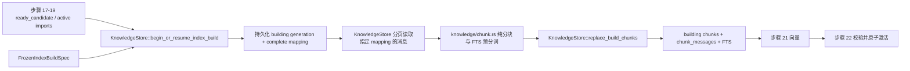

# 冻结候选索引代际并实现会话内分块与隔离 FTS5 技术方案

- **run_id**：`20260807-1543-步骤-20冻结候选索引代际并实现会话内分块与隔离-fts5dispatch_idaich8-zh`
- **dispatch_id**：`aich8-zhuochong-desktop-pet-rag-27-steps-20260805-task-20`
- **阶段边界**：本文件只设计步骤 20；本阶段不修改产品代码、测试、命令清单、开发日志或 heartbeat。

## 0. 方案设计原则（自检清单）

- **最小改动**：沿用 `KnowledgeStore` 唯一持有 `knowledge.sqlite` 连接和 SQL 的边界，追加一个 migration、一个纯分块模块和少量 Store API；不重构导入器、配置页、M1 回复链路或 Work Review 屏幕记忆。
- **复用现状**：复用步骤 17—19 已落地的 `ready_candidate -> active -> superseded`、`knowledge_index_generation_imports`、`knowledge_message_normalizations`、`knowledge_catalog_state`、维护 lease 和独立 `knowledge.sqlite`，不再建立第二套代际表。
- **失败关闭**：候选冲突、代际映射不完整、冻结配置不一致、未知 token counter、单条消息超预算、FTS/映射写入不同步或 scope 无法解析时返回现有 `KB_NOT_READY` / `KB_SCOPE_UNRESOLVED` / `KB_RETRIEVAL_FAILED`，不得退回全库查询或旧 M1 路径。
- **代际隔离**：步骤 20 只产生或恢复 `building` index generation；不写 `ready`、不切换 catalog、不激活 import generation。向量由步骤 21 接续，完整校验与原子激活由步骤 22 完成。
- **隐私边界**：只读已导入、已规范化的派生数据库内容；测试只使用手写脱敏样本。不得读取微信数据库/协议、媒体正文或真实私有导出，不新增网络、上传、自动粘贴或自动发送。
- **可验证性**：候选映射、冻结配置、消息顺序、chunk key、FTS 文档和查询 scope 均有行为级 Rust 测试；静态脚本只补充边界检查，不替代数据库行为证据。

## 1. 背景与目标

### 1.1 已核对的现状

当前 `main` 已包含步骤 17—19 的提交：`5ab206c`（来源谱系/导入代际）、`162e06e`（流式消息规范化）和 `a5aefcb`（知识源管理/安全重建）。现有代码已经具备以下可复用基础：

- `desktop/src-tauri/src/knowledge/store.rs` 是唯一连接/SQL owner，并已有 `CandidateImport`、`ReadyIndex`、`ActiveSnapshot`、maintenance lease、reader/writer 门面。
- schema head 为 3；`0001_initial.sql` 已预留 `knowledge_index_generations`、`knowledge_index_generation_imports`、`knowledge_chunks`、`knowledge_chunk_messages` 和 `knowledge_chunks_fts`。
- `0003_streaming_message_normalization_media.sql` 已保存 `created_at_ms`、`source_ordinal`、`sort_key`、`message_kind`、`render_kind`、`sender_key` 和 canonical hash，可作为稳定分块输入。
- `finalize_source_candidates()` 只把完整会话推进到 `ready_candidate`；生产导入流程当前没有调用测试辅助的 `register_ready_index*` / `activate_candidate*`，因此可在不破坏导入事务的前提下增加正式 builder。
- 当前预留表仍不足以满足步骤 20：`register_ready_index*` 会直接写 `ready`；候选集合只接收调用者给出的 candidates，不能自动沿用未变化会话的 active pointer；chunk 缺少顺序/时间/token/schema 字段；chunk-message 只记录 `message_id`；没有活动代际 + stable scope 的 FTS 查询。

参考实现仅复用两类局部模式：

- `参考/Work-Review-main/crates/core/src/database.rs` 的 FTS5 `MATCH`、SQL 时间条件、`LIMIT` 参数绑定和 chunk upsert 邻近写法。
- `参考/Work-Review-main/src-tauri/src/commands/semantic_memory.rs::index_semantic_memory()` 的“读取一批、形成 draft、短事务写入、报告进度”外形。

聊天候选 snapshot、会话内 chunk key 和按 index generation 隔离的 FTS 必须在知识模块内原创；不得共用屏幕记忆表、键空间、云 embedding 配置或“FTS 无结果后 LIKE 全库扫描”的回退。

### 1.2 可验收目标

1. 在任何 chunk/FTS/vector 行写入前，以单个 `BEGIN IMMEDIATE` 事务持久化完整 `conversation -> import generation` 映射和一个 `building` index generation；进程重启后仅凭数据库即可恢复相同快照与冻结配置。
2. 每个有可发布变化的会话选择唯一 `ready_candidate`；没有变化的会话只沿用 `knowledge_conversations.active_import_generation_id` 指向的唯一 `active`。`staging`、`failed`、`superseded` 永不入选。
3. 分块内消息只来自一个会话，按规范化稳定顺序输出 UTC 时间、sender 和 `self|other` 方向；每条成员同时记录 `message_id + message_version_id + message_index`。
4. chunk 使用冻结的 `chunk-v1 + token-counter-v1`，单 hit 不超过 512 个保守 token、最多 40 条消息；总预算取冻结的 `KnowledgeConfig.token_budget`，相邻大小边界最多重叠 2 条，时间边界不跨越重叠，绝不从单条消息中间截断。
5. 相同 import 内容、稳定会话键和 schema 在不同导入/SQLite 返回顺序下产生相同 `import_snapshot_hash`、`chunk_index`、`chunk_key` 和 `content_hash`。
6. chunk、chunk-message 和 FTS 行在显式事务内同步写入同一 `index_generation_id`；building/failed 代际和没有 catalog 指针的代际对活动查询零可见。
7. FTS 查询在 SQL 内同时限制 catalog active index、`ready` 状态、显式稳定会话 scope、可选时间区间和 `top_k`；禁止查全库后由 Rust/UI 过滤。
8. 真实感但完全脱敏的中文样本可命中两字/多字中文短语、专有名词和中英文混排；探针版本与生成规则被冻结并可重复运行。

### 1.3 明确非目标

- 不实现 embedding HTTP、向量生成、余弦召回或 RRF（步骤 21）。
- 不把 index generation 标为 `ready`，不更新 `knowledge_catalog_state`，不推进 import `active/superseded`（步骤 22）。
- 不接入最终 `knowledge_retrieve()` 编排、会话绑定 UI、M2 模型上下文或微信气泡（步骤 23—26）。
- 不修改 Work Review 的 `activities_fts`、`memory_chunks`、`index_semantic_memory()` 公开行为。
- 不为本步骤新增 Tauri/UI 的“立即索引”入口。正式 builder 保持知识模块私有，由步骤 21 的本地 embedding orchestration 接续；步骤 20 的行为级测试直接验证该生产 API，而不是增加临时 UI。
- 不修改已发布的 `0001`—`0003` migration；不删除或清理用户已有派生库、旧 active index、候选目录或其他 LOOF run 产物。

### 1.4 假设与取舍

- `knowledge_message_normalizations.sender_key` 是导出协议内的稳定 sender key；当它与所属会话的 `account_stable_id` 完全相等时方向为 `self`，否则为 `other`。不做显示名、昵称或文本启发式猜测。
- 当前 `LocalEmbeddingConfig` 只有 provider/endpoint/model，没有可可信推导的 fingerprint/dimension。本步骤因此定义 `FrozenEmbeddingIdentity` 为 builder 的必填内部输入；缺 fingerprint 或 dimension 时不创建 generation。步骤 21 从受验证的本地服务取得它后只能传入一次，不能在 build 中重读 UI。
- 当前系统 SQLite 探针中，`unicode61` 不能命中中文子短语；`trigram` 能命中三字以上中文和中英混排，但两字中文仍为 0 hit。为覆盖常见两字词并避免新依赖，本方案选择版本化的 2/3-gram 预分词 + 现有 FTS5 `unicode61`，不引入第三方中文分词库。

## 2. 核心业务流程与边界

### 2.1 组件关系



`chunk.rs` 不导入 `rusqlite`，不接收数据库路径，不打开连接，也不查询“所有 ready candidate”。它只消费 Store 返回的 `FrozenIndexBuild` / `BuildMessagePage`，输出 `ChunkDraft` / FTS terms；SQL、事务和 activity visibility 全部留在 Store。

### 2.2 创建或恢复候选 generation

`KnowledgeStore::begin_or_resume_index_build(spec)` 在 maintenance lease 内执行：

1. 校验 `spec`：`chunk_schema_version == "chunk-v1"`、`token_counter_version == "v1"`、`token_budget` 在现有 256—4096、embedding provider/endpoint/model/fingerprint 非空、dimension 在 `1..=65536`；endpoint 继续调用现有 loopback validator。本步骤不发 HTTP。
2. 若存在唯一 `building` generation：读取其 snapshot mapping 和冻结字段；全部与调用 spec 相同则返回原 `index_generation_id` 作为恢复，任何字段不同返回 `KB_NOT_READY` 且不修改旧 building。显式失败/重建动作以后可把旧 building 标 `failed`，不得静默覆盖。
3. 若不存在 building，在同一 `BEGIN IMMEDIATE` 内枚举可索引会话。对每个会话：
   - 若恰有一个 `ready_candidate`，且其 `parent_generation_id` 与当前 active pointer 同值（首次导入时二者同为 NULL），选择该 candidate；
   - 若没有 ready candidate，要求 pointer 非空、指向同会话唯一 `active`，选择该 active；
   - 多个 ready candidate、悬空 pointer、多个 active、candidate parent 不匹配、来源为 retired/missing/denied、generation 为 staging/failed/superseded，整次创建失败，不做任意挑选。
4. 对每个选中 generation，按稳定消息 identity 排序计算 `membership_digest = SHA-256(message stable/fallback key + canonical content_hash)`；按 `(account_stable_id, conversation_stable_id)` 排序形成 canonical snapshot 行。
5. 计算 `import_snapshot_hash = SHA-256("import-snapshot-v1" + stable conversation tuple + source_set_hash + membership_digest)`。hash 不使用随机 conversation/import UUID、到达顺序、SQLite 默认顺序或当前时间；实际 UUID 只保存在 mapping 中用于恢复。
6. 先插入 `knowledge_index_generations(status='building', ...)`，再插入全部 `knowledge_index_generation_imports`，回读行数、conversation 唯一性、generation 状态和 snapshot hash；全部通过才提交。任何失败整个事务回滚，因此不会出现“generation 有了但 mapping 不全”。

### 2.3 分页读取、分块和崩溃恢复

Store 提供 keyset 分页，不让 `chunk.rs` 持有连接：

```rust
struct FrozenEmbeddingIdentity {
    provider: String,
    endpoint: String,
    model: String,
    fingerprint: String,
    dimension: u32,
}

struct FrozenIndexBuildSpec {
    chunk_schema_version: &'static str, // chunk-v1
    token_counter_version: &'static str, // v1
    retrieval_token_budget: u32,
    embedding: FrozenEmbeddingIdentity,
}

struct BuildMessage {
    account_stable_id: String,
    conversation_stable_id: String,
    message_id: String,
    message_version_id: String,
    stable_message_key: String,
    created_at_ms: i64,
    source_ordinal: u64,
    sort_key: String,
    sender_key: String,
    direction: Direction, // Self_ | Other
    message_kind: MessageKind,
    content: String,
    content_hash: String,
}
```

- `list_build_conversations(index_generation_id)` 只从该 generation 的 persisted mapping 返回稳定会话 tuple。
- `read_build_message_page(index_generation_id, stable_conversation_key, after_cursor, 256)` 通过 mapping -> generation membership -> immutable version -> normalization 查询；按 `created_at_ms, source_ordinal, sort_key, stable_message_key` 排序。不得按随机版本 UUID 或无 `ORDER BY` 的表顺序分页。
- 白名单仅纳入具备真实规范化文本语义的 `text|quote|reply|link|location|emoji|system`；`image|video|voice|file|recall|unknown` 的固定占位符不进入知识 chunk。未知 kind 或缺 normalization/direction 的已选版本使 generation 失败，而不是猜测内容。
- 恢复同一个 building 时，Store 先在一个短事务中删除该 generation 的 FTS、chunk-message、chunk 行，保留 generation/mapping/frozen spec，再从第一页确定性重建。旧 active generation 不受影响；不从残缺 chunk 数猜测续点。

### 2.4 `chunk-v1` 算法

每条消息渲染为确定性单元：

```text
[<UTC epoch millis>][self|other][<sender_key>] <normalized content>
```

算法冻结以下常量，不提供额外 UI 配置：

- `token-counter-v1`：对最终 UTF-8 渲染文本按 byte 计数，空文本计 0。它是本地、确定性且保守的上界；同一版本在建索引和后续模型 context 裁减中复用。
- `max_chunk_tokens = min(512, frozen retrieval_token_budget)`。
- `max_messages = 40`。
- `max_gap_ms = 30 * 60 * 1000`。
- `overlap_messages = 2`，只用于 token/message-count 边界；超过时间间隔时 overlap 为 0，避免跨语境拼接。

按消息稳定顺序逐条处理：

1. 单条渲染消息已超过 `max_chunk_tokens` 时返回 `KB_NOT_READY`；不截断、不丢正文、不生成永远无法进入单 hit 预算的 chunk。
2. 当前 chunk 为空时加入消息。否则若时间间隔超过 30 分钟，先封块并无重叠开始新块；若加入后超过 40 条或 token cap，先封块，再从前块末尾取最多 2 条且能与新消息共同满足上限的消息作为 overlap。
3. 每个 chunk 保存首尾 version、首尾时间、精确 token_count、message_count、content 和 content hash；成员按块内顺序写入 `knowledge_chunk_messages`，同一 message version 可以因有界 overlap 属于相邻两个 chunk。
4. `chunk_index` 是同一稳定会话内从 0 开始的确定性序号。
5. `chunk_key = SHA-256("chunk-v1" + import_snapshot_hash + account_stable_id + conversation_stable_id + chunk_index + first_stable_message_key + last_stable_message_key)`；`id` 可继续用内部 opaque ID，但去重和后续 RRF 键只能使用 `chunk_key`。

### 2.5 写入、失败和代际可见性

`replace_build_chunks()` 使用固定小批事务。每个 batch 内按顺序显式写：

1. `knowledge_chunks`；
2. 对应的全部 `knowledge_chunk_messages`；
3. 对应 `knowledge_chunks_fts(content=versioned_fts_terms, chunk_id, index_generation_id)`；
4. 回读 chunk/member/FTS 计数及 generation ID 一致性后提交。

禁止为 FTS 建跨表 trigger；trigger 会在未来状态变化时提前暴露或误删其他 generation。batch 任一步失败即回滚该 batch并把 generation 保持 `building` 以便确定性重建；确认为不可恢复的输入/配置错误时由 Store 写 `failed + error_code`，仍不改变 catalog。

活动查询必须从 `knowledge_catalog_state.active_index_generation_id` 开始，并要求目标 index `status='ready'`。因此：

- building/failed generation 即使已有完整 FTS 行也不可见；
- 步骤 20 新建 building 时，旧 active ready index 继续作为唯一可查询代际；
- 没有活动 ready index 返回 `KB_NOT_READY`，不能解释为 `no_hit`；
- 本步骤不调用 `activate_candidate(s)`，现有直接注册 ready 的历史测试 helper 应限制为 `#[cfg(test)]`，生产路径只能创建 building。

## 3. 数据模型设计

新增 `desktop/src-tauri/src/knowledge/migrations/knowledge/0004_candidate_index_chunks_fts.sql`，`SCHEMA_HEAD` 从 3 升到 4。以下为最小追加 DDL；不重写 `0001`—`0003`：

```sql
ALTER TABLE knowledge_index_generations
  ADD COLUMN token_counter_version TEXT;
ALTER TABLE knowledge_index_generations
  ADD COLUMN retrieval_token_budget INTEGER;
ALTER TABLE knowledge_index_generations
  ADD COLUMN message_count INTEGER NOT NULL DEFAULT 0;
ALTER TABLE knowledge_index_generations
  ADD COLUMN completed_at_ms INTEGER;
ALTER TABLE knowledge_index_generations
  ADD COLUMN error_code TEXT;

CREATE UNIQUE INDEX knowledge_index_generations_one_building_idx
  ON knowledge_index_generations(status)
  WHERE status = 'building';

ALTER TABLE knowledge_chunks ADD COLUMN chunk_index INTEGER;
ALTER TABLE knowledge_chunks ADD COLUMN chunk_schema_version TEXT;
ALTER TABLE knowledge_chunks ADD COLUMN started_at_ms INTEGER;
ALTER TABLE knowledge_chunks ADD COLUMN ended_at_ms INTEGER;
ALTER TABLE knowledge_chunks ADD COLUMN token_count INTEGER;
ALTER TABLE knowledge_chunks ADD COLUMN message_count INTEGER;

CREATE UNIQUE INDEX knowledge_chunks_generation_conversation_index_idx
  ON knowledge_chunks(index_generation_id, conversation_id, chunk_index);
CREATE INDEX knowledge_chunks_generation_conversation_time_idx
  ON knowledge_chunks(index_generation_id, conversation_id, started_at_ms, ended_at_ms);

ALTER TABLE knowledge_message_normalizations
  ADD COLUMN direction TEXT NOT NULL DEFAULT 'other';

UPDATE knowledge_message_normalizations
SET direction = CASE
  WHEN sender_key = (
    SELECT c.account_stable_id
    FROM knowledge_message_versions v
    JOIN knowledge_messages m ON m.id = v.message_id
    JOIN knowledge_conversations c ON c.id = m.conversation_id
    WHERE v.id = knowledge_message_normalizations.message_version_id
  ) THEN 'self'
  ELSE 'other'
END;

CREATE TABLE knowledge_chunk_messages_v4 (
  chunk_id TEXT NOT NULL REFERENCES knowledge_chunks(id) ON DELETE CASCADE,
  message_id TEXT NOT NULL REFERENCES knowledge_messages(id) ON DELETE CASCADE,
  message_version_id TEXT NOT NULL,
  message_index INTEGER NOT NULL CHECK(message_index >= 0),
  PRIMARY KEY(chunk_id, message_version_id),
  UNIQUE(chunk_id, message_index),
  FOREIGN KEY(message_id, message_version_id)
    REFERENCES knowledge_message_versions(message_id, id)
);

INSERT INTO knowledge_chunk_messages_v4(
  chunk_id, message_id, message_version_id, message_index
)
SELECT old.chunk_id,
       old.message_id,
       member.message_version_id,
       ROW_NUMBER() OVER (
         PARTITION BY old.chunk_id
         ORDER BY COALESCE(msg.message_stable_id, msg.fallback_key)
       ) - 1
FROM knowledge_chunk_messages old
JOIN knowledge_chunks chunk ON chunk.id = old.chunk_id
JOIN knowledge_index_generation_imports mapping
  ON mapping.index_generation_id = chunk.index_generation_id
 AND mapping.conversation_id = chunk.conversation_id
JOIN knowledge_import_generation_members member
  ON member.import_generation_id = mapping.import_generation_id
 AND member.message_id = old.message_id
JOIN knowledge_messages msg ON msg.id = old.message_id;

DROP TABLE knowledge_chunk_messages;
ALTER TABLE knowledge_chunk_messages_v4 RENAME TO knowledge_chunk_messages;
CREATE INDEX knowledge_chunk_messages_version_idx
  ON knowledge_chunk_messages(message_version_id, chunk_id);
```

迁移执行前，`migrations.rs` 对旧 `knowledge_chunk_messages` 与上述确定性 join 的行数做等值 preflight；若无法一一恢复 version mapping，拒绝迁移并保持原库不变。迁移后 `validate_schema()` 额外验证：

- head=4、上述新列/索引/FTS5 均存在；
- index generation 的 building 行只有一条，冻结字段非空且预算/dimension 合法；embedding 的 provider/endpoint/model/fingerprint/dimension 继续存在 canonical `embedding_metadata_json`，不再复制到第二套配置表；
- 新 chunk 的 schema/time/count/token 非空且首尾合法；member 数与 chunk.message_count 一致，成员 version 属于该 index mapping 的 import generation；
- FTS/chunk 的 `(chunk_id,index_generation_id)` 一一对应；无跨 generation 行；
- `foreign_key_check` / integrity 继续沿用现有门禁。

现有 `knowledge_chunks_fts(content, chunk_id UNINDEXED, index_generation_id UNINDEXED)` 不改名、不加 trigger；其中 `content` 从本步骤起明确保存 `fts-pretoken-v1` terms，展示正文仍只取 `knowledge_chunks.content`。

## 4. 接口定义（知识模块私有契约）

不新增公网/HTTP API。Store 增加以下 `pub(crate)` 或更窄接口：

```rust
fn begin_or_resume_index_build(
    &self,
    spec: FrozenIndexBuildSpec,
) -> Result<FrozenIndexBuild, ContractError>;

fn list_build_conversations(
    &self,
    index_generation_id: &str,
) -> Result<Vec<StableConversationKey>, ContractError>;

fn read_build_message_page(
    &self,
    index_generation_id: &str,
    conversation: &StableConversationKey,
    after: Option<&BuildMessageCursor>,
    limit: u16,
) -> Result<BuildMessagePage, ContractError>;

fn reset_build_chunks(&self, index_generation_id: &str)
    -> Result<(), ContractError>;

fn write_chunk_batch(
    &self,
    index_generation_id: &str,
    drafts: &[ChunkDraft],
) -> Result<(), ContractError>;

fn search_active_fts(
    &self,
    request: ActiveFtsRequest,
) -> Result<Vec<FtsHit>, ContractError>;
```

契约约束：

- `FrozenIndexBuild` 的字段从数据库回读后返回；调用者传入的 spec 只用于首次创建/一致性比对，chunk/FTS 后续永远消费数据库中的冻结值。
- scope 使用稳定 tuple `account_stable_id + conversation_stable_id`。当前 `KnowledgeScope` 的 wire DTO 不在本步骤扩展；进入 Store 前必须由未来的可信会话绑定适配器解析为明确 tuple。空 scope、重复/超上限 scope 或无法解析返回 `KB_SCOPE_UNRESOLVED`。
- `top_k` 限制 1—12，时间采用半开区间 `[from_ms, to_ms)`，非法范围返回 `KB_RETRIEVAL_FAILED`。
- SQL 绑定 `MATCH`、时间和 limit 参数；stable scope 用有界参数化 `VALUES` CTE / 占位符，不拼接用户文本。原始 query 不直接作为 FTS 语法执行。

## 5. 核心逻辑详解

### 5.1 中文与中英文 FTS 预分词

`fts-pretoken-v1` 只做确定性、无字典、无网络转换：

1. 统一使用已规范化文本，ASCII 字母转小写；连续 ASCII letter/digit 保留为一个 term。
2. 每个连续 CJK run 生成所有相邻 2-gram 和 3-gram；长度为 2 的 run 保留完整 2-gram，长度为 1 不建 term。
3. terms 去重后按首次出现顺序用单个空格连接。索引文本和 query 调用同一函数。
4. query terms 每项作为 FTS phrase 安全转义后以 AND 组合并通过参数绑定；不允许用户注入 `OR`、`NEAR`、列名或引号语法。
5. 没有可索引 term 的 query 返回空 hit/受控失败，由最终 retrieval 层决定 `no_hit`；不得用 `LIKE '%query%'` 扫描全库。

脱敏探针固定为版本化 fixture，例如：

- `周五下午同步知识库迁移进度`，查询 `知识库迁移` 和两字词 `迁移`；
- `ProjectA 发布窗口调整到 v2`，查询 `ProjectA`；
- `ProjectA 知识库迁移`，查询相同中英文混排。

当前本机 `sqlite3 3.51.0` 仅作为设计探针：`unicode61` 的中文 partial 为 0，`trigram` 对四字中文/专有名词/混排为 1、两字中文为 0。phase 2 必须通过项目实际 `rusqlite = 0.30, features=["bundled"]` 连接重跑相同 fixture 并记录 tokenizer/probe version；不得把系统 SQLite 结果冒充项目 bundled SQLite 或 Windows 实机证据。

### 5.2 活动 FTS 查询 SQL 形状

查询必须具备等价于以下 join/filter，不允许先扩大结果再过滤：

```sql
WITH requested(account_stable_id, conversation_stable_id) AS (
  VALUES (?scope_account_1, ?scope_conversation_1)
)
SELECT chunk.chunk_key,
       chunk.content,
       chunk.token_count,
       chunk.started_at_ms,
       chunk.ended_at_ms,
       fts.rank
FROM knowledge_catalog_state catalog
JOIN knowledge_index_generations generation
  ON generation.id = catalog.active_index_generation_id
 AND generation.status = 'ready'
JOIN knowledge_chunks_fts fts
  ON fts.index_generation_id = generation.id
JOIN knowledge_chunks chunk
  ON chunk.id = fts.chunk_id
 AND chunk.index_generation_id = fts.index_generation_id
JOIN knowledge_conversations conversation
  ON conversation.id = chunk.conversation_id
JOIN requested scope
  ON scope.account_stable_id = conversation.account_stable_id
 AND scope.conversation_stable_id = conversation.conversation_stable_id
WHERE knowledge_chunks_fts MATCH ?query_terms
  AND (?from_ms IS NULL OR chunk.ended_at_ms >= ?from_ms)
  AND (?to_ms IS NULL OR chunk.started_at_ms < ?to_ms)
  AND NOT EXISTS (
    SELECT 1 FROM knowledge_denials denial
    WHERE denial.conversation_id = chunk.conversation_id
       OR denial.message_id IN (
         SELECT message_id FROM knowledge_chunk_messages
         WHERE chunk_id = chunk.id
       )
  )
ORDER BY fts.rank, chunk.chunk_key
LIMIT ?top_k;
```

`GlobalUserSelected` 也必须先解析为用户明确选择的稳定 tuple 列表；不能用“没有 requested CTE”表示全库。source denial 的影响继续沿用现有 Store 全局 fail-closed，直到步骤 22 有完整 target-aware 校验后再收窄。

### 5.3 一致性与补偿

- **候选创建失败**：事务回滚，无 generation/mapping 残留。
- **chunk/FTS 中途失败或进程崩溃**：generation 保持 building；重开后验证冻结 spec + mapping，再清空该 generation 的派生 chunk/FTS 重建。旧 active catalog 不变。
- **配置变化**：与 persisted spec 不同即拒绝 resume；不从 UI 覆盖。只有显式把旧 build 标 failed 后才能创建新 generation。
- **候选来源在构建期间被 deny/retire**：maintenance lease 阻止并发写；lease 丢失/进程重启后，resume 前重新校验 mapping 与 denial/source state，不合法则 failed，绝不继续写。
- **FTS 写失败**：与 chunk/member 在同一 batch rollback。不能留下只有 chunk 没有 FTS 或反向孤儿。
- **查询数据库 busy/损坏/非法 MATCH**：返回 `KB_RETRIEVAL_FAILED` 或 `KB_NOT_READY`，不回退 M1、内存扫描或旧 generation。

## 6. 非功能性设计

- **内存上界**：Store 每页最多 256 条；chunker 只保留当前 chunk、最多 2 条 overlap 和当前 batch，不随全库消息数增长。conversation key 清单只含稳定键/ID，不含正文。
- **事务长度**：snapshot 冻结使用一次短 `BEGIN IMMEDIATE`；消息正文分页读取；chunk/member/FTS 以小批事务写入。禁止在 writer mutex 内执行网络请求或读取 UI/AppState。
- **确定性**：所有 hash 输入有版本前缀与明确字段顺序；禁止随机 DB ID、当前时间、文件遍历顺序或无 ORDER BY 的 SQLite 结果参与 snapshot/chunk key。
- **安全**：所有 SQL 值参数绑定；MATCH 使用生成后的安全 terms。日志只记录匿名 index token、conversation/chunk/message 计数、阶段、耗时和错误码，不记录正文、query、sender、稳定 ID、路径、source hash 或命中片段。
- **兼容性**：知识 migration/reader 继续验证 WAL、foreign_keys、busy timeout、FTS5 和 integrity；不触碰 Work Review 主数据库及其锁。
- **可恢复性**：本步骤不自动删除 failed/building 代际或用户文件。重新运行相同 build 是“清该 building 的派生行后确定性重建”，不是从 UI 猜配置或 hash 猜 mapping。

## 7. 测试方案

### 7.1 Rust 行为测试

| 场景 | 必须断言 |
| --- | --- |
| 候选 snapshot | 有变更会话选唯一 ready candidate，未变更会话沿用 pointer active；staging/failed/superseded、悬空 pointer、多 candidate、多 active、retired/missing/denied 均 fail-closed。 |
| 顺序无关 | 交换 source 导入顺序、candidate 输入顺序、SQLite 插入顺序和 opaque ID 后，稳定事实相同则 snapshot/membership digest/chunk key 相同。 |
| mapping 恢复 | 创建 building 后模拟重启，只传 index ID 即可回读完整 mapping/spec；修改 UI/config fixture 不改变已冻结结果，spec 不同不能 resume。 |
| mapping 原子性 | mapping 第 N 行 fault injection、busy/constraint 失败后 generation 和 mapping 同时为 0；不会留下半快照。 |
| 方向/顺序 | sender==account 为 self，其余为 other；时间相同按 source ordinal/sort key/stable message key；输出标签和首尾 version 正确。 |
| 类型白名单 | 白名单文本进入 chunk；media/recall/unknown 占位符不进入；未知 kind、缺 normalization 或非法 direction 使 generation failed。 |
| token/时间/数量 | 512 token、40 条、30 分钟边界的前后各一用例；单条超限失败且正文不截断；time gap 不 overlap，大小边界 overlap <=2。 |
| 稳定 key | 同输入重跑 chunk_index/key/content_hash/member order 一致；改变首尾 version/content/schema/snapshot 任一稳定事实后 key 或 hash 相应变化。 |
| 事务同步 | 在 chunk、member、FTS 每一步注入失败，batch 全回滚；成功时三者 generation/count 一致。 |
| 崩溃恢复 | 留下部分 building chunk/FTS 后重开，清理并重建得到与干净构建相同结果；旧 active rows/查询结果字节级不变。 |
| 代际不可见 | building/failed 有命中词仍返回 0/KB_NOT_READY；catalog 指向 ready 后才可查询；构建新代际时旧 ready 仍服务。 |
| scope/time/topK | 单/多 stable tuple、显式 global-selected tuple、空/未知 scope、跨账户同 conversation key、时间半开区间、topK 1/12/越界；只返回 SQL scope 内结果。 |
| FTS probe | 通过 bundled rusqlite 重跑两字、多字中文、专有名词、中英文混排；query 语法字符不能改变 MATCH 结构；无 LIKE 全库回退。 |
| migration | v3->v4、重复打开、future version、旧 member mapping 可恢复/不可恢复、foreign key、schema 列/索引/FTS5 缺失和 integrity failure。 |

### 7.2 静态与回归门禁

- 新增 `kaifa/kaifa_test/verify_knowledge_candidate_chunks_fts.py`，只检查必要结构：`0004` 已注册、`chunk.rs` 无 `rusqlite/Connection/open`、生产代码无直接 `ready` 注册 shortcut、FTS 无跨代表 trigger、活动查询具备 catalog/status/scope/time/limit join。
- 定向 Rust：知识 migration/store/chunk 测试；现有 archive importer、source lineage、streaming normalization、source management 测试必须回归。
- 运行既有 `verify_knowledge_store.py`、`verify_knowledge_lineage_generations.py`、流式导入和 source management gate，确认新 schema 未破坏步骤 16—19。
- 对相关 Rust 文件执行 scoped `rustfmt --check`，再执行 `git diff --check`。不得用全仓 formatter 改写无关 dirty 文件。
- 若尝试 Windows target 而工具链/平台不可用，记录 `not-run` 或真实阻塞；macOS/bundled SQLite 探针不能写成 Windows 实机验证通过。

### 7.3 完成标准

- migration 从 v3 原子升级到 v4，真实表/索引/FTS schema 与校验一致。
- building generation 可由 mapping + frozen spec 完整恢复；不靠 snapshot hash 反推选择。
- 每个 chunk 的全部 memberVersion、首尾 version、时间、方向、token/schema 和稳定 key 可追溯。
- FTS 只查询 catalog active ready generation 和显式 stable scope；building/failed 零可见。
- 中文 probe 结果被版本化、可复核；所有 synthetic 行不含真实微信正文/ID/路径。
- 步骤 20 的定向行为测试、既有知识回归 gate、格式和 diff 检查均有实际命令输出；未运行项如实标注。

## 8. 回滚、风险与后续衔接

- **发布回滚**：只回滚本步骤提交；不删除或降级用户 `knowledge.sqlite`。已迁移到 v4 的库由旧二进制按 future schema 规则 fail-closed，不能伪装兼容。
- **两字中文与索引体积**：2/3-gram 会扩大 FTS 文档；这是换取两字词可检索的明确代价。步骤 22 的真实性能门禁若超限，只能在新 schema/version 下替换预分词实现，不能原地改变 `fts-pretoken-v1` 语义。
- **方向语义**：当前 repo 没有独立 `is_sent` 列，本方案只用稳定 sender key 与 account stable ID 精确比较；若真实 v1 协议证明两者不可比，应先扩展冻结 archive schema 并重新导入，不能用昵称猜方向。
- **embedding 身份**：步骤 20 不探测模型；缺 fingerprint/dimension 就不创建 build。步骤 21 必须把其本地、无代理、无重定向验证结果作为一次性 `FrozenEmbeddingIdentity` 接续同一个 generation。
- **激活边界**：步骤 22 必须复核本步骤 mapping、frozen spec、message/chunk/FTS/vector 计数后才能 ready/activate；不得复用现有弱 `register_ready_index*` 直接跳过 building。

## 9. 代码实施修改顺序

| 顺序 | 路径 | 最小修改与验证 |
| --- | --- | --- |
| 1 | `desktop/src-tauri/src/knowledge/migrations/knowledge/0004_candidate_index_chunks_fts.sql`、`migrations.rs` | 追加 v4、旧 member mapping preflight、schema/integrity 校验；先写 v3->v4/回滚/重复打开测试。 |
| 2 | `desktop/src-tauri/src/knowledge/store.rs` | 增加 frozen spec、候选选择/snapshot digest、building 恢复、分页读、batch 写和 active FTS 查询；限制旧 ready shortcut 为测试边界。 |
| 3 | `desktop/src-tauri/src/knowledge/chunk.rs`、`knowledge/mod.rs` | 新增纯 Rust token counter、方向化渲染、边界/overlap、稳定 key 和 `fts-pretoken-v1`；禁止数据库/网络/UI 依赖。 |
| 4 | `desktop/src-tauri/src/knowledge/archive_importer.rs`（仅必要行） | 仅把 sender 与 account 的精确方向事实写入 normalization；不改流式 parser、媒体 read guard、来源选择或完整性规则。若 Store 读取时可确定方向，则不修改此文件。 |
| 5 | `desktop/src-tauri/src/knowledge/store.rs` 内定向 tests / 紧邻 `chunk.rs` tests | 补候选、恢复、崩溃、分块、FTS、scope/代际不可见的行为测试，全部使用临时数据库和脱敏 fixture。 |
| 6 | `kaifa/kaifa_test/verify_knowledge_candidate_chunks_fts.py`、`kaifa/kaifa_test/test.md`、`kaifa/kaifa_personnel/mingling.md`、`kaifa/kaifa_log/<本run时间戳日志>.md` | phase 2 按真实新增命令/测试回填；只记录本 run 产物和真实 pass/not-run/blocked，不混入其他 LOOF run。 |

实施循环：先让 migration/候选映射失败测试成立，再实现 frozen snapshot；随后完成纯 chunk 算法与 Store batch；最后接入 active FTS 查询和 bundled SQLite 中文探针。每一步都先运行最窄行为测试，再跑知识模块回归与静态 gate。任何测试失败必须保留真实失败边界，不能以静态字符串命中代替行为通过。
