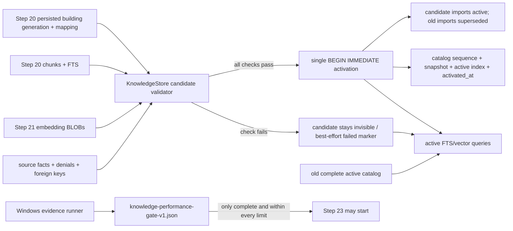

# 校验候选索引、原子切换 Catalog 并冻结性能门禁技术方案

## 变更元信息

| 字段 | 内容 |
| --- | --- |
| 功能 | 步骤 22：校验候选索引、原子切换 catalog 并冻结性能门禁 |
| dispatch_id | `aich8-zhuochong-desktop-pet-rag-27-steps-20260805-task-22` |
| run_id | `20260807-task-22-candidate-index-catalog-performance-gate` |
| 依赖基线 | `main@e8d28c5`，步骤 20 `fa5d8e9`，步骤 21 `e8d28c5` |
| 阶段边界 | 本文仅做方案设计；不修改产品代码、测试、性能数据或 heartbeat |

## 0. 方案设计原则（自检清单）

- **最小改动**：继续由 `KnowledgeStore` 独占 `knowledge.sqlite` 的 SQL/事务边界，只追加正式候选校验/激活 API、必要的 schema v5 错误字段、定向测试和性能门禁文件。
- **不重建已有机制**：直接复用 `begin_or_resume_index_build()`、`FrozenIndexBuildSpec`、`knowledge_index_generation_imports`、`chunk-v1`、`fts-pretoken-v1`、步骤 21 的 exact BLOB decoder/流式 Top-K 和 catalog generation token；不建第二套 catalog 或向量数据库。
- **先校验后发布**：只有同一 `index_generation_id` 下的 mapping、chunk、FTS、vector、source/denial 和外键全部通过，才能在同一个 `BEGIN IMMEDIATE` 事务内将它变为完整 active 组合。
- **失败关闭**：任一校验、计数、维度、写入、忙锁或 commit 失败都不变更旧 catalog。没有完整 active 组合或无法证明 deny 过滤安全时返回 `KB_NOT_READY`，不当作 `no_hit`。
- **真实证据与合成测试分开**：Rust/临时 SQLite 故障注入可证明原子性，不能证明目标 Windows 性能。`knowledge-performance-gate-v1.json` 只能用真实 Windows 硬件、冻结导出和真实采样得出 `pass`。
- **隐私与手动边界**：只读用户选定的聊天导出及独立派生库；不读微信数据库/协议，不用 UIA 输入、键鼠、注入、自动粘贴/发送、未选聊天、MCP/Bot/search/upload/Agent。

### 0.1 已核对事实与显式假设

1. 现有 schema head 为 4；`0004_candidate_index_chunks_fts.sql` 已增加 `completed_at_ms`、`error_code`、冻结 token/FTS 字段和 chunk-message version/index，但 index generation 没有 `error_summary`。
2. `activate_completed_build_for_test()` 只检查 `embedding IS NULL` 并直接改 ready/catalog；`register_ready_index*()` / `activate_candidate*()` 均是测试辅助，不能作为正式激活路径。
3. `mapping_is_publishable()` 已覆盖部分 parent/pointer/source/denial 检查，`validate_chunk_derivations()` 已能重算 chunk/hash/FTS，步骤 22 应抽取并复用这些真实逻辑，而不是再写一套宽松 SQL。
4. 步骤 21 的 `write_build_embeddings()` 已在写入时校验 exact byte length、finite 和单位范数；激活前仍必须对已持久化 BLOB 全量重验，防止崩溃/维度变更/离线损坏。
5. 当前 active vector/FTS SQL 对 conversation/message denial 有行级过滤，但又会因“库中任意 denial”整体返回 `KB_NOT_READY`，`deny_or_delete()` 还会清空 active catalog。本步骤将改为“可证明安全就精确过滤，否则对受影响 scope 返回 `KB_NOT_READY`”。
6. 本聊天未提供目标 Windows 机器、真实冻结 exportId、本地模型或事先批准的数值上限，因此本方案不声称性能门禁已通过。实施阶段若仍缺失这些输入/证据，必须写 `not_run/blocked`，不得把 phase 2 或步骤 22 标为真正完成。

## 1. 背景与可验收目标

### 1.1 背景

步骤 20 已将候选 import 快照、冻结配置、chunk 和 FTS 写入一个不可见的 `building` index generation；步骤 21 又将向量 BLOB 写入这个 generation。现在缺少的不是另一个 builder，而是一个只接受现有 building id、先证明完整性、再一次性切换 import/catalog 的正式发布边界。

该边界同时必须保证：候选失败时旧索引仍可用；删除/禁用已导入内容时旧索引不再泄露被 deny 的 chunk；真实性能超限时不能因“功能测试通过”而继续步骤 23。

### 1.2 可量化成功标准

1. 正式 API 只接受一个已存在的 `status='building'` id；对不存在、`ready`、`failed` 或临时无 mapping 的 id 零 catalog 写入。
2. 候选 mapping 中的 conversation 数 `> 0`，且一个 conversation 恰好一个 import generation；所有 `ready_candidate` 的 parent 精确等于切换前 active pointer，未变会话只能沿用 pointer 指向的唯一 `active`。
3. 重算 `import_snapshot_hash`、累加 `message_count`、实际 import member 集合与 generation 冻结值完全相等；不使用随机 id、时间或 SQLite 默认顺序参与重算。
4. `knowledge_chunks` 数 = generation.`chunk_count` = FTS 行数 = 非 NULL vector 行数；每个 chunk 恰好一条同 generation FTS，每个 BLOB 字节数精确为 `dimension * 4`、全 finite、非零且单位范数在现有容差内。
5. 全部可索引 import member version 至少被一个 chunk 覆盖，chunk 不包含 mapping 外 version；每块 `message_index=0..n-1`、first/last version、hash、token、时间和 FTS terms 均可由 `chunk-v1` 重算得到。
6. `PRAGMA foreign_key_check` 零行；source set hash/precedence/有效来源证明可重算，任一未决 source conflict、retired/missing source 或无法安全执行的 denial 阻止激活。
7. 唯一激活事务内完成：`building -> ready + completed_at_ms`、新 import `ready_candidate -> active`、对应旧 import `active -> superseded`、所有会话 pointer、catalog snapshot/index/activated_at 和 `catalog_generation_seq + 1`。任意故障注入后要么全部可见，要么全部不可见。
8. 正常重建、候选校验失败、数据库忙或进程在 commit 前中止时，旧 catalog sequence/index/snapshot 和旧 active import pointers 全部不变，旧完整索引查询结果仍可复核。
9. building/failed/无 catalog 对活动 FTS/vector 查询零可见；active 组合不完整时统一 `KB_NOT_READY`，不返回 `no_hit`。
10. 性能门禁文件含真实目标 Windows 硬件、冻结样本摘要、测量方法、事先批准的每项数值上限、原始证据 hash 和观测值。任一必需值缺失、非 Windows 或超限时 `verdict != pass`。

### 1.3 明确非目标

- 不重新导入原始 JSON，不修改步骤 15—19 的导入/来源 UI。
- 不重写 chunker、FTS pretokenizer、embedding HTTP、RRF 或 `knowledge_retrieve()`。
- 不在步骤 22 接入回复模型、`ModelKnowledgeContext`、微信气泡或自动触发；这些是步骤 23 以后。
- 不预先引入 ANN/HNSW/新向量扩展。只有真实 BLOB 流式扫描超限后，才在后续最小分支中替换 `KnowledgeStore` 私有索引实现并重验。
- 不清理旧 ready index 或已 superseded import。旧 ready 无 catalog 指针即不可见，保留它便于审计/回滚；清理策略不在本步骤扩展。

## 2. 核心流程与边界

### 2.1 组件关系



### 2.2 预检和事务内重验

为了不长时持有 writer lock，允许在只读连接上先运行一次完整预检并生成不含正文的 `CandidateValidationDigest`，但这不是发布证据。激活 API 随后必须获取 `BEGIN IMMEDIATE`，从数据库重读所有冻结事实，再次校验并对预检 digest 做精确比较。这样同时避免大部分等锁时间和 TOCTOU。

`CandidateValidationDigest` 至少绑定：

```text
index_generation_id
frozen_spec_digest
mapping_digest
import_snapshot_hash
message_count
chunk_count
fts_count
vector_count
member_coverage_digest
denial_digest
foreign_key_check_row_count (= 0)
```

digest 不包含聊天正文、原始 exportId、source path、向量或内部随机 id 清单；只用于同一进程内的竞态检测和审计计数。

### 2.3 激活正常流程

1. 调用方仅传 `index_generation_id`，Store 通过 `load_frozen_build()` 回读完整冻结 spec，禁止再传一份可变 UI 配置。
2. 校验 target 恰好是 `building`，且 mapping 非空、conversation 不重复、import status/parent/pointer 与创建 building 时冻结的规则一致。
3. 重算 source facts、source set hash、message membership digest 和全局 snapshot hash，与 generation 列精确相等。
4. 重算 chunk derivation，核对 chunk-message 覆盖、唯一 FTS 行、vector BLOB 维度/数值、数量和外键。
5. 校验 deny 安全性：新 generation 不得包含已被 conversation/message deny 的内容；对 source deny/retired/missing，每个 chunk member version 必须仍有至少一条 active、非 denied 且属于该 import source set 的 provenance。
6. 校验通过后获取 `BEGIN IMMEDIATE`，全量重验上述事实与 digest。
7. 在同一事务内按第 5.2 节伪代码转移 status/pointer/catalog，每条 DML 都检查 affected-row count。
8. commit 成功后返回不含正文的 `ActivationReceipt { index_generation_id, snapshot_hash, catalog_sequence, activated_at_ms, counts }`。任一 commit 前错误显式 rollback。

### 2.4 失败、崩溃和补偿

| 场景 | 事务结果 | 旧 active 服务 | 候选状态 |
| --- | --- | --- | --- |
| 预检失败 | 不开激活事务 | 保持 | 后续短事务 best-effort 标 `failed` |
| `BEGIN IMMEDIATE` 忙/超时 | 零写入 | 保持 | 保持 `building`，可重试 |
| 事务内重验不同 | rollback | 保持 | best-effort 标 `failed` |
| DML affected rows 不等于预期 | rollback | 保持 | best-effort 标 `failed` |
| 进程在 commit 前崩溃 | SQLite/WAL 恢复时 rollback | 保持 | 保持 `building` |
| commit 成功后立即崩溃 | 全部新状态可见 | 已原子切到新组合 | `ready` |
| 写 failed marker 也遇忙锁 | 不改 catalog | 保持 | 仍 `building` 且不可见 |

`failed/error_summary` 是候选诊断，不能与 active 切换事务混在一个“先部分发布再记错”流程中。错误摘要只能是固定代码和红线文字（例如 `VECTOR_DIMENSION_MISMATCH`），禁止包含正文、路径、exportId、模型原始响应或 SQL 值。

### 2.5 denial 后的旧索引持续服务

1. `deny_or_delete()` 不再为了单个 denial 清空整个 catalog。它在短 `BEGIN IMMEDIATE` 内写 denial；如果当前有 building，将与该 denial 冲突的 building 标为 `failed`/redacted error，不动 active catalog。
2. active FTS/vector 查询在 SQL 层排除 conversation deny 和含 denied message 的整个 chunk。对 source deny，只有块中每个 member version 都可由另一个 active/非 denied source 证明时才可返回。
3. 请求显式 scope 中的 conversation 如被整体 deny，或 source/message provenance 缺损使 Store 无法证明精确过滤，本次返回 `KB_NOT_READY`，不将“被阻止”冒充为“真实零命中”。
4. denial 写入后可启动新候选重建；新 generation 必须已从 mapping/chunk 中排除受影响内容才能激活。
5. 查询仍保留步骤 21 的 catalog token 前后复核，避免 deny/激活期间混合两个 generation。

## 3. 数据模型设计

### 3.1 schema v5 最小追加

不修改已发布的 `0001`—`0004`。新增 `0005_candidate_activation_diagnostics.sql`，仅补齐步骤 22 要求但当前无法持久化的 redacted 失败摘要：

```sql
ALTER TABLE knowledge_index_generations ADD COLUMN error_summary TEXT;

CREATE INDEX knowledge_index_generations_status_created_idx
  ON knowledge_index_generations(status, created_at_ms, id);
```

- 不新增会话级 snapshot 列：每个会话的真实 active import 仍由 `active_import_generation_id` 指向，全局一致快照仍由 `knowledge_catalog_state.active_snapshot_hash` 绑定 mapping 集合。复制 snapshot 会产生双写一致性，不是最小改动。
- `completed_at_ms` 仅对 `ready` 非 NULL；`error_code/error_summary` 仅对 `failed` 非 NULL。该状态不变式由 Store 激活/失败 API 和 `validate_schema()` 检查。SQLite 无法在 ALTER 后安全补表级 CHECK，不为此重建大表。
- 索引只服务“找到唯一 building/审计 failed”，不改变现有 partial unique `one_building` 约束。

### 3.2 激活后必须同时成立的不变式

```text
catalog.active_index_generation_id -> generation(status=ready, completed_at_ms!=NULL)
catalog.active_snapshot_hash == generation.snapshot_hash
catalog.catalog_generation_seq == previous_seq + 1 (checked add, no wrap)

for every generation mapping:
  mapping.import_generation_id == conversation.active_import_generation_id
  mapped import status == active
  mapped import conversation_id == mapping.conversation_id

for every newly activated import:
  exactly one prior active for that conversation becomes superseded, or this is first activation

for every active chunk:
  chunk.index_generation_id == catalog.active_index_generation_id
  exactly one same-generation FTS row
  exact dimension vector BLOB
  every member belongs to the mapped import version set
```

旧 index generation 仍可保留 `ready`，但它不再被 catalog 指向，所以活动查询不可见。不为 index 额外增加 `superseded` status，避免扩大迁移和回滚面。

### 3.3 source conflict 和 provenance 验证

对每个 mapped import generation：

1. 用现有 `SourceFact` 固定排序重算 `source_set_hash`，并检查 `precedence` 从 0 连续、与该排序一致。
2. 所有 source 必须 `source_state='active'`，import status 必须是已审核的 `full_declared|filtered_selected`，不得是 incomplete/failed。
3. 对每个 member，重放现有确定性 source winner 规则。最高优先级若仍留下两个不同 `content_hash`，则为 `SOURCE_CONFLICT_UNRESOLVED`；不允许依赖导入到达顺序或 row id 任意挑选。
4. member 选中的 version 至少有一条 `knowledge_message_sources` 指向 generation source set 中 active/非 denied source。

## 4. 内部 API 契约

### 4.1 正式 Store API

```rust
pub(crate) struct CandidateValidationCounts {
    pub(crate) conversations: u64,
    pub(crate) messages: u64,
    pub(crate) chunks: u64,
    pub(crate) fts_rows: u64,
    pub(crate) vectors: u64,
}

pub(crate) struct ActivationReceipt {
    pub(crate) index_generation_id: String,
    pub(crate) snapshot_hash: String,
    pub(crate) catalog_sequence: u64,
    pub(crate) activated_at_ms: i64,
    pub(crate) counts: CandidateValidationCounts,
}

impl KnowledgeStore {
    pub(crate) fn validate_candidate_index(
        &self,
        index_generation_id: &str,
    ) -> Result<CandidateValidationDigest, ContractError>;

    pub(crate) fn activate_validated_candidate(
        &self,
        index_generation_id: &str,
        expected: &CandidateValidationDigest,
    ) -> Result<ActivationReceipt, ContractError>;
}
```

- API 不接受 caller-provided candidates、snapshot hash、dimension、ready index 或 catalog sequence，全部从 target building 及 mapping 回读。
- `CandidateValidationDigest` 字段保持 crate-private，不序列化到 UI/Tauri，不成为可伪造的公开通行证。
- `register_ready_index*()`、`activate_candidate*()` 不得被生产代码调用；测试迁移到新正式 API 后删除弱 shortcut，只保留构造损坏数据所必需的 `#[cfg(test)]` 低层 fixture helper。

### 4.2 错误语义

| 场景 | 对内/对外结果 |
| --- | --- |
| target 不是 building、冻结配置漂移、计数/维度/source/denial/FK 失败 | `KB_NOT_READY` |
| 无完整 active catalog/import/index 组合 | `KB_NOT_READY` |
| 请求 scope 本身空、重复或无法解析 | 保留 `KB_SCOPE_UNRESOLVED` |
| 已有完整 active，但查询中损坏/切换 | 保留 `KB_RETRIEVAL_FAILED` |
| 合法 active 查询确实无 hit | 才能 `no_hit` |

### 4.3 性能门禁文件契约

路径固定为 `desktop/docs/performance/knowledge-performance-gate-v1.json`。文件是审计门禁，不是运行时配置；产品不根据它动态放宽限制。最小形状：

```json
{
  "schemaVersion": 1,
  "gateId": "knowledge-performance-gate-v1",
  "candidateCommit": "<40-hex>",
  "thresholdsFrozenAt": "<RFC3339 before measurement>",
  "thresholdsApprovedBy": "<non-empty approval reference>",
  "targetWindows": {
    "osEdition": "<real>",
    "osBuild": "<real>",
    "cpuModel": "<real>",
    "logicalProcessors": 0,
    "ramBytes": 0,
    "storageModel": "<real>",
    "storageKind": "ssd|nvme|hdd",
    "powerPlan": "<real>",
    "webView2Version": "<real>"
  },
  "frozenDataset": {
    "exportIdSha256": "<sha256(accountStableId + NUL + exportId)>",
    "manifestSha256": "<real>",
    "coverageSha256": "<real>",
    "conversationCount": 0,
    "messageCount": 0,
    "indexableMessageCount": 0,
    "chunkCount": 0,
    "embeddingModelDigestShort": "<redacted short digest>",
    "embeddingDimension": 0
  },
  "limits": {
    "firstIndexMsMax": 0,
    "knowledgeSqliteBytesMax": 0,
    "derivedIndexBytesMax": 0,
    "peakWorkingSetBytesMax": 0,
    "queryP50MsMax": 0,
    "queryP95MsMax": 0,
    "workRecordSchedulerDriftP95MsMax": 0,
    "uiInputLatencyP95MsMax": 0
  },
  "observed": {
    "firstIndexMs": 0,
    "knowledgeSqliteBytes": 0,
    "derivedIndexBytes": 0,
    "peakWorkingSetBytes": 0,
    "querySamples": 0,
    "queryP50Ms": 0,
    "queryP95Ms": 0,
    "workRecordSchedulerDriftSamples": 0,
    "workRecordSchedulerDriftP95Ms": 0,
    "uiInputLatencySamples": 0,
    "uiInputLatencyP95Ms": 0
  },
  "evidence": [{"path": "<repo-relative redacted summary>", "sha256": "<64-hex>"}],
  "vectorBackend": "sqlite_blob_stream_v1",
  "metricVerdicts": {},
  "verdict": "not_run|pass|fail|blocked",
  "blockers": []
}
```

说明：

- 真实 exportId 不进 Git/普通日志，用确定性 SHA-256 与 manifest/coverage hash 冻结同一样本；本地原始证据只留在用户选定的私有路径。
- `limits` 必须在首次正式采样前由用户/产品所有者批准并保留时间/引用；禁止看到结果后调大限制来制造 pass。当前文档未给出数值，实施者不得臆造。
- query 至少使用固定、完全脱敏的 100 条查询，先预热 10 次不计入；实测集合同时覆盖 FTS、vector 和 hybrid，使用单调时钟计时。
- 首次索引从没有 `knowledge.sqlite`/派生索引的冷状态开始，到 activation commit 成功结束；失败后重跑不能冒充首次时间。
- 数据库体积记 `knowledge.sqlite + -wal + -shm`；如后续有私有外部向量索引，它单独记为 `derivedIndexBytes`，不遗漏。
- 峰值内存记录应用进程树在索引窗口的最大 working set；不只记 Rust allocator 抽样。
- 调度漂移用 Work Review 现有工作记录任务的“实际触发单调时间 - 计划单调时间”；UI 响应用真实 WebView2 前台窗口测量用户无副作用操作到下一帧确认的延迟，不点击复制/发送，不注入微信。
- verifier 采用全量 fail-closed：类型错、值为 0/缺失、非 Windows、commit/样本/evidence hash 不匹配、sample 数不足、任一 observed `> limit` 或任一 metric verdict 非 pass，总 verdict 均不得 pass。

## 5. 核心逻辑详解

### 5.1 候选完整性检查顺序

以快速、无正文扫描的检查在前，昂贵的 chunk/vector 全量重验在后：

1. generation 状态、唯一 building、冻结 spec JSON/版本/维度。
2. mapping 非空/唯一，import status/parent/active pointer 一致。
3. source state/import verdict/source set hash/precedence/conflict/denial。
4. message count 与 snapshot hash 重算。
5. chunk/FTS/vector 计数、NULL/多行/跨 generation 检查。
6. chunk-message 外键、覆盖集合和 `chunk-v1` 派生重算。
7. 向量 exact decode、finite、非零、单位范数。
8. `PRAGMA foreign_key_check`。
9. 组装 digest，进入 writer 事务后同顺序重验。

任一检查返回第一个稳定、红线错误代码，不在日志输出错误行的正文或 id。

### 5.2 单事务激活伪代码

```text
BEGIN IMMEDIATE

actual = validate_again(index_generation_id)
require actual.digest == expected.digest

old_catalog = read singleton row
next_seq = checked_add(old_catalog.catalog_generation_seq, 1)
activated_at = now_ms_once()

UPDATE target generation
  SET status='ready', completed_at_ms=activated_at,
      error_code=NULL, error_summary=NULL
  WHERE id=? AND status='building'
require changed == 1

for mapping ordered by stable account/conversation:
  if mapped import is ready_candidate:
    require parent_generation_id IS current conversation.active pointer
    UPDATE exactly that current active import -> superseded (0 for first activation, else 1)
    UPDATE mapped ready_candidate -> active; require changed == 1
  else:
    require mapped import is the exact existing active pointer

  UPDATE conversation.active_import_generation_id = mapped import id
  require changed == 1

re-read every mapped import/pointer and require complete active combination

UPDATE singleton catalog
  SET catalog_generation_seq=next_seq,
      active_snapshot_hash=target.snapshot_hash,
      active_index_generation_id=target.id,
      activated_at_ms=activated_at
  WHERE singleton_id=1 AND catalog_generation_seq=old_seq
require changed == 1

re-read catalog + target + all mappings; require all invariants
COMMIT
```

激活时间只取一次，generation `completed_at_ms` 与 catalog `activated_at_ms` 共用同一值，避免外部把毫秒差误解为中间可见状态。

### 5.3 激活后读路径的完整组合检查

`load_active_embedding_read()` / FTS/vector scope resolution 不再只 join `catalog -> ready index`。它们必须同时证明：

- catalog snapshot hash 与 index snapshot hash 相等；
- target `completed_at_ms` 非 NULL；
- 请求中每个 stable scope 都有 index mapping；
- mapping import id 等于 conversation active pointer 且 import status 为 active；
- denial 能安全评估。

组合不完整时在开始扫描 BLOB/FTS 前返回 `KB_NOT_READY`。扫描开始后的损坏或代际切换继续是 `KB_RETRIEVAL_FAILED`。

### 5.4 BLOB 扫描超限时的唯一可允许备选

1. 先保留本步骤功能/原子性修复，门禁写 `fail`，步骤 23 不得开始。
2. 定位只有 vector scan 指标超限后，在 `KnowledgeStore` 私有边界内引入新的本地索引持久化，并用新 schema/backend version 与 index generation 绑定。
3. `search_active_vectors*()` 的 crate-private 输出、stable `chunk_key`、RRF、scope/time/denial/catalog token 不变；`knowledge_retrieve()` 及其错误码、token budget、M2 fail-closed 契约不变。
4. 重跑完整功能测试和同一 Windows/同一冻结样本性能门禁。禁止用更小数据集、更快机器或放宽阈值取代。

## 6. 非功能性设计

### 6.1 性能与锁

- 预检用 reader 连接，不将 HTTP embedding 或原始 JSON 读取放进 writer 事务。
- 激活事务内不发网络请求、不生成向量、不重建 chunk；只重读已持久化事实、重算和执行有界 DML。
- 保留现有 5 秒 busy timeout；超时不循环重试，不饿饿 Work Review 写入。
- vector 检查逐行 decode，仅保留一个 dimension 向量；不把全库 BLOB 装入内存。chunk 派生校验沿用分页/每块重算。

### 6.2 安全与隐私

- 所有新 SQL 使用参数绑定；性能 probe 不接受任意 SQL、外部进程命令或云 endpoint。
- 激活/性能日志只可写 generation 短 token、计数、耗时、结果码；不写 chunk content/query、向量、路径、真实 ID 或完整 model digest。
- 性能测试不点击复制、粘贴或发送，不将微信窗口作为输入目标。UI 响应只测产品自身无副作用控件/帧时序。

### 6.3 可观测性

激活事件只保存结构化摘要：

```text
operation=knowledge_candidate_activation
index_generation_token=<short>
phase=preflight|transaction|commit|failed_marker
counts={conversations,messages,chunks,fts,vectors}
elapsed_ms=<u64>
outcome_code=<fixed enum>
```

不记录“失败的那条消息/SQL 值”。需要定位时用脱敏故障 fixture 重现。

## 7. 测试方案

### 7.1 migration 与 schema

1. v4 空/有 building/有 active 数据库均能在单事务升 v5，现有行不变；重开 schema head=5。
2. 迁移故障回滚时 user_version/table 均仍为 v4，不部分加列/索引。
3. `validate_schema()` 拒绝 ready 却 `completed_at_ms IS NULL`、failed 却缺 error code/summary、building 却有 completed_at 的数据。

### 7.2 候选校验行为测试

1. 冻结配置任一 provider/endpoint/model/fingerprint/dimension/chunk/token/FTS/budget 字段损坏都失败，旧 active 不变。
2. mapping 缺失/重复会话/跨会话 import/非 candidate-or-exact-active/parent 过期/悬空 active pointer 都失败。
3. generation `message_count/chunk_count`、实际 member/chunk/FTS/vector 任一加 1 或减 1 均失败。
4. BLOB 覆盖 NULL、少 1、多 1/2/3/4 字节、完整但不同维度、NaN、Inf、零向量、非单位范数；不得跳过损坏行继续 ready。
5. chunk-message 覆盖缺 member、多 mapping 外 member、version 不属于 message、index 不连续、first/last/hash/content/FTS 篡改均失败。
6. `PRAGMA foreign_keys=OFF` 人工造孤儿后重开 Store，激活拒绝且不更换 catalog。
7. source retired/missing/failed/incomplete、source set hash/precedence 篡改、同优先级不同 content conflict 均失败。
8. conversation/message/source denial 分别测试；source denial 有另一 active provenance 时安全过滤，无替代证明时 `KB_NOT_READY`。

### 7.3 原子性、崩溃和持续服务

1. 对 target ready、每个 import supersede/activate、每个 conversation pointer、catalog update、final reread 每一步注入失败；断言 old catalog/import pointers/status/query hits 完全不变。
2. 正常激活断言 candidate ready/completed_at、新 active、旧 superseded、全部 pointers、snapshot/index/time 和 sequence 一次同时变更；sequence 恰好 `+1`。
3. 将 sequence 置为 `i64::MAX` 或 Rust 转换上限，checked add 失败并全回滚，禁止 wrap。
4. 用第二连接持有 writer lock 超过 busy timeout；新激活失败，旧 reader 仍可查询。不使用几毫秒假锁代替真实 busy 路径。
5. 用子进程在事务 DML 中止后重开数据库，证明 SQLite 恢复为旧完整组合；在 commit 返回后终止则恢复为新完整组合。fixture 只用完全虚构数据。
6. 候选 building/failed 存在时旧 ready active 的 FTS/vector/hybrid 命中不变；候选任一失败都不导致短暂空 catalog。
7. 激活前/后和查询中 catalog token 切换分别测试，不允许 vector 来自 A、FTS 来自 B 后 RRF 混合。

### 7.4 active 完整组合与 denial 查询

1. catalog NULL、指 building/failed、snapshot 不等、ready 缺 completed_at、mapping 缺会话、mapping import 不等 pointer、import 非 active 都是 `KB_NOT_READY`。
2. 无损完整 active 且真实零 hit 才是空 hits/no_hit。
3. denied message 所属整块不出现；其他会话/其他块仍可服务。整会话 deny 的显式 scope 返回 `KB_NOT_READY`。
4. source deny 在单源块上阻止，在多源且每条消息有其他 active 证明时只过滤受影响块；不做“正文相同就视为有来源”的猜测。

### 7.5 性能门禁测试

1. JSON verifier 对每个必需字段删除、类型错、0/负数、非 Windows、样本/commit/evidence hash 不匹配、sample 不足、metric 超限都返回非零并禁止 pass。
2. 边界值 `observed == limit` 可通过，`observed == limit + 1` 失败；p50/p95 使用文档化的 nearest-rank 算法，不由实现任意选分位数方法。
3. macOS/Linux/fake-server 运行只能产生 `not_run` 或功能证据，不能改成 Windows pass。
4. 真实 Windows 跑次先校验阈值冻结时间早于采样，再校验同 commit/同样本/同向量 backend，最后全量比较。

### 7.6 回归与建议验证命令

阶段 2 实施后回填精确 test filter，不使用不存在的测试名冒充执行：

```bash
cargo test --manifest-path desktop/src-tauri/Cargo.toml knowledge::migrations::tests:: --no-default-features --features 'wechat-contract-check,wechat-m2'
cargo test --manifest-path desktop/src-tauri/Cargo.toml knowledge::store::tests:: --no-default-features --features 'wechat-contract-check,wechat-m2'
cargo test --manifest-path desktop/src-tauri/Cargo.toml knowledge::embedding::tests:: --no-default-features --features 'wechat-contract-check,wechat-m2'
python3 -B kaifa/kaifa_test/verify_knowledge_candidate_activation.py --project-root .
python3 -B kaifa/kaifa_test/verify_knowledge_performance_gate.py --project-root . --gate desktop/docs/performance/knowledge-performance-gate-v1.json
python3 -B kaifa/kaifa_test/verify_knowledge_candidate_chunks_fts.py --project-root .
python3 -B kaifa/kaifa_test/verify_knowledge_embedding_loopback.py --project-root .
cargo check --manifest-path desktop/src-tauri/Cargo.toml --no-default-features --features 'wechat-contract-check,wechat-m2'
git diff --check
```

真实 Windows benchmark 命令必须调用产品的 Store/builder/query 路径，不另写宽松的 Python SQLite/vector 实现。实际命令、目标机信息、结果和 `pass/fail/not_run/blocked` 必须如实回填 `kaifa/kaifa_test/test.md` 与本 run 开发日志。

## 8. 文件改动范围与回滚

### 8.1 预计必要修改

| 路径 | 最小作用 |
| --- | --- |
| `desktop/src-tauri/src/knowledge/migrations/knowledge/0005_candidate_activation_diagnostics.sql` | 只增 index generation redacted `error_summary` 和 status 查找索引 |
| `desktop/src-tauri/src/knowledge/migrations.rs` | schema head 5、v4->v5 原子迁移、新状态不变式与测试 |
| `desktop/src-tauri/src/knowledge/store.rs` | 候选完整性校验、正式原子激活、failed marker、active 组合/deny 安全查询及行为测试 |
| `desktop/src-tauri/src/knowledge/embedding.rs` | 仅在正式 build orchestration 需要调用激活 API 或 benchmark 复用查询路径时做极小粘合；不改 endpoint/RRF 契约 |
| `desktop/docs/performance/knowledge-performance-gate-v1.json` | 真实 Windows 性能门禁；无证据时只能 `not_run/blocked` |
| `kaifa/kaifa_test/verify_knowledge_candidate_activation.py` | 静态边界辅助检查，不代替 Rust 事务测试 |
| `kaifa/kaifa_test/verify_knowledge_performance_gate.py` | fail-closed 验证 JSON schema、证据 hash、阈值和 verdict |
| `kaifa/kaifa_test/test.md`、`kaifa/kaifa_personnel/mingling.md`、`kaifa/kaifa_log/<本run时间戳>.md` | 按实际命令/结果回填，不混入其他 run |

### 8.2 禁止修改

- 已发布的 `0001_initial.sql`—`0004_candidate_index_chunks_fts.sql`。
- `knowledge_retrieve()`、`RetrievedReply`、`ModelKnowledgeContext` 的现有可见契约（除非只是步骤 22 必需的 `KB_NOT_READY` 完整组合校验粘合）。
- 微信 capture/OCR/window/focus/clipboard/input/send 代码。
- Work Review 屏幕语义记忆数据库、云 provider/API key 和屏幕 RRF 公开行为。
- 其他 LOOF run 的 state/done/artifact、heartbeat automation 或用户已有脏改动。

### 8.3 回滚

- 代码回滚不删除/降级 `knowledge.sqlite`。数据库升到 v5 后，旧二进制按 future schema 规则 fail-closed，不伪装兼容。
- 新 generation 激活前回滚只会留下 building/failed 不可见数据；旧 catalog 不动。
- 激活 commit 后如需业务回滚，不直接手改 pointer；必须将旧 ready index 的 mapping 作为新候选再经同一校验/激活 API，产生新 sequence。

## 9. 代码实施修改顺序

1. **先补 schema v5 和状态不变式** → 验证：v4->v5、回滚、重开、非法 ready/failed/building 都有 Rust 测试。
2. **抽取并复用现有 frozen mapping/chunk derivation 校验** → 验证：每一类配置、计数、映射、source conflict、denial、BLOB/FK 篡改都被精确拒绝。
3. **实现单 `BEGIN IMMEDIATE` 激活 API** → 验证：每个 DML/commit 故障点全回滚，正常路径 sequence 只 +1，旧服务无空窗。
4. **加强 active 完整组合和 denial 读边界** → 验证：不完整/unsafe scope 为 `KB_NOT_READY`，精确可过滤时其他块继续服务，不泄露被 deny 内容。
5. **迁移步骤 20/21 测试到正式激活路径** → 验证：生产代码无弱 ready shortcut，中途崩溃、维度变更、忙锁和查询切换测试全部使用新 API。
6. **增加性能 runner/verifier 和门禁 JSON** → 验证：静态 fixture 证明缺字段/超限/非 Windows 必不 pass；真实 pass 只能由批准阈值后的目标 Windows 跑次产生。
7. **若且仅若 BLOB scan 真实超限，另做 Store 私有索引替换** → 验证：同 Windows/同数据/同阈值重跑，`knowledge_retrieve()` 契约差分为空。未超限则不引入该改动。
8. **回填本 run 命令、测试和开发日志** → 验证：`mingling.md`、`test.md`、时间戳 log 与真实执行结果一致，Windows 未取证时如实 `not_run/blocked`。
9. **最终范围和阶段门禁** → 验证：只有第 8.1 节必要文件，`git diff --check` 通过；性能门禁非 pass 时阶段不得声称步骤 22 完成，也不得开始步骤 23。

## 10. 完成定义

- 候选索引的冻结配置、mapping、source/denial、message/chunk/FTS/vector 和外键全部通过正式行为级校验。
- 只有一条生产激活路径，它在一个 `BEGIN IMMEDIATE` 中完成 ready/import/pointer/catalog 全部变更，任意失败无部分可见状态。
- building/failed/不完整 active 组合均不会变成 hit/no_hit；旧完整索引在候选失败和普通重建中继续服务。
- denial 对可证明的块精确过滤，无法安全证明的 scope 返回 `KB_NOT_READY`，不因为“保持旧索引服务”而召回已移除内容。
- `knowledge-performance-gate-v1.json` 的阈值在采样前冻结，证据来自真实目标 Windows/真实冻结样本，任一指标缺失或超限都不是 pass。
- 如 BLOB 流式扫描超限，仅替换 `KnowledgeStore` 内部向量索引实现并全量重验，`knowledge_retrieve()`、显式 scope、M2 fail-closed 和微信手动边界均不变。

