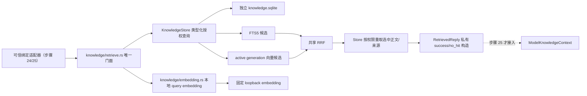
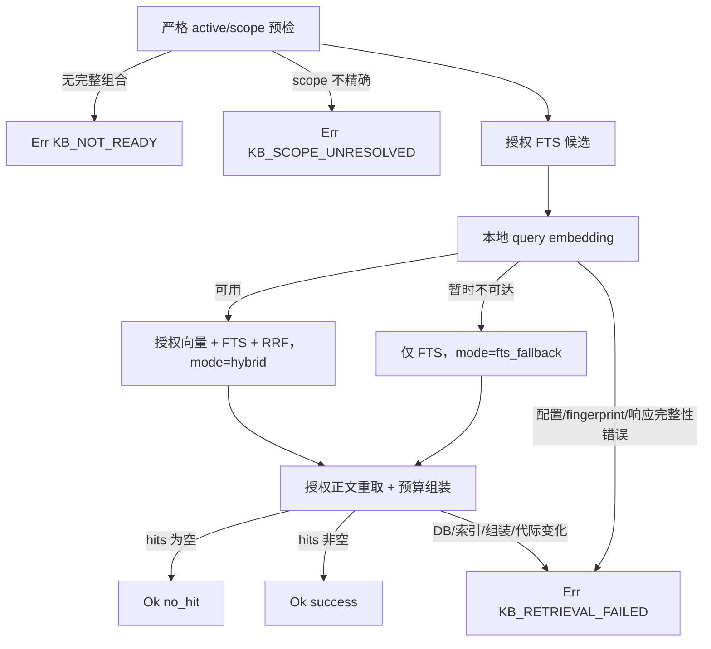

# 实现唯一 `knowledge_retrieve()` 混合检索门面技术方案

## 0. 方案设计原则（自检清单）

- **阶段与 run 边界**：本文件只设计步骤 23，run_id 为 `20260807-2013-步骤-23实现唯一-knowledge_retrieve-混合检索门面dispatch_idai`；不实现步骤 24 的绑定 UI、步骤 25 的 M2 模型编排或步骤 26 的端到端发布门禁。
- **最小改动**：复用现有 `KnowledgeStore`、active-ready catalog 校验、`knowledge_chunks_fts`、严格向量 BLOB 扫描、loopback embedding 和 `work_review_core::semantic::reciprocal_rank_fusion()`；不另建数据库、不引入向量引擎、不重写索引链路。
- **唯一门面**：只在 `desktop/src-tauri/src/knowledge/retrieve.rs` 定义可供知识模块外调用的 `knowledge_retrieve(request)`；旧 `knowledge/types.rs` 的占位 `knowledge_retrieve(result)` 必须移除，避免两条业务入口。
- **私有成功凭据**：`RetrievedReply` 字段和 `success/no_hit` 构造器都留在 `retrieve.rs` 私有范围。任何 `KnowledgeError` 均直接返回 `Err`，不能产生空回复、降级 M1 或模型调用资格。
- **授权先于排序**：active generation、scope、denial、source state/provenance 以及 chunk 每条消息的 active 来源验证，必须在 `KnowledgeStore`/SQL 候选查询和正文重取查询中完成；禁止全库召回后在 Rust、UI 或模型上下文层过滤。
- **本地与手动边界不变**：只读聊天导出与独立 `knowledge.sqlite` 不变；只服务用户明确选择的前台微信、手动检查/复制/粘贴/发送流程。不得新增微信协议/数据库读取、注入、UIA 输入、键鼠模拟、自动发送、未选聊天、上传、MCP、Bot、search 或 Agent。
- **可验证目标**：三种 scope wire 逐字固定；越界会话零命中泄漏；向量不可用时显式 `fts_fallback`；索引/SQLite/scope/组装故障 fail closed；默认 trace 仅 IDs/scores；本门面编译依赖图中没有回复模型。

## 1. 背景与目标

### 1.1 当前程序状态

生产代码位于 `desktop/`，沿用 Work Review 的 Tauri 2 + Rust + Svelte 主体。步骤 15—22 已建立以下可复用基础：

- `desktop/src-tauri/src/knowledge/store.rs` 是唯一 `knowledge.sqlite` 连接和 SQL owner；已有严格 active-ready loader、generation 二次校验、FTS 候选查询和向量流式 Top-K。
- `desktop/src-tauri/src/knowledge/embedding.rs` 已有严格 loopback endpoint、禁止 proxy/redirect、模型 fingerprint、query embedding、向量与 FTS 的 generation 绑定和共享 RRF。
- `desktop/crates/core/src/semantic.rs` 已有严格向量 primitive 与按稳定 key 去重、确定性同分排序的 `reciprocal_rank_fusion()`。
- schema v5 已具备 `knowledge_catalog_state`、active import/index mapping、`knowledge_denials`、`knowledge_message_sources`、`knowledge_chunk_messages`、FTS5、embedding BLOB、token counter/version 与 retrieval budget。
- `desktop/src-tauri/src/knowledge/types.rs` 目前只有步骤 4 的契约占位：它接收人为组装的 `KnowledgeRetrieveResult`，尚未查询 Store；`RetrievedReply` 也只保留 request/query/excerpts，不能满足步骤 23 的完整绑定和本地审计字段。

参考代码仅复用算法思路：`参考/Work-Review-main/src-tauri/src/commands/semantic_memory.rs::search_semantic_memory_inner()` 的 vector + FTS + RRF 流程，以及 `参考/Work-Review-main/crates/core/src/database.rs` 的 BLOB 流式 Top-K。聊天知识的 scope SQL、私有构造器、`no_hit`/错误分流和受控重取必须在本项目原创实现。

### 1.2 技术目标（可验收）

1. 只有一个业务入口：`KnowledgeStore::knowledge_retrieve(request) -> Result<RetrievedReply, KnowledgeError>`，其 `impl` 仅位于 `knowledge/retrieve.rs`。以 `&self` 注入唯一 Store，调用方仍只提供一个显式 `request`，避免全局单例或在 retriever 中另开数据库。
2. 请求完整绑定 `request_id`、规范化 `query_text`、`binding_generation`、精确 scope、`top_k`、`token_budget`、`token_counter_version`、可信当前会话 ID 和 boost 开关；结果增加实际 catalog/index generation、active snapshot hash、冻结结果 hash、status、mode、完整本地 hits 与 `elapsed_ms`。
3. `top_k` 固定接受 `1..=12`；`token_budget` 固定接受 `256..=4096` 且必须与 active index 冻结值相等；单 hit 最多 512 个 `token-counter-v1` 单位，总命中不超过请求 budget。
4. active-ready 组合缺失或冻结版本/预算不匹配返回 `KB_NOT_READY`；scope 不能精确解析返回 `KB_SCOPE_UNRESOLVED`；SQLite、索引损坏、代际切换或组装不一致返回 `KB_RETRIEVAL_FAILED`。
5. 向量服务“暂时不可达”时仍执行 FTS，返回 `retrieval_mode=fts_fallback`；fingerprint 改变、响应维度/finite 错误或索引 BLOB 损坏属于完整性错误，不能伪装为可用性降级。
6. 同一次检索最多一次 query embedding 正文调用，回复模型调用数恒为 0；不得自动重试、切云端或调用外部工具。
7. 默认 trace 只生成 `request_id` audit tag、generation IDs、hit IDs 和有界 scores；query、excerpt、source relative path、sender、provenance 和 embedding 均不进入普通日志/trace。

### 1.3 明确非目标

- 不新增或修改 migration；不改变步骤 22 的 catalog 激活协议和性能政策文件。
- 不把门面注册为 Tauri command、MCP tool、Bot/search tool 或 Localhost API。
- 不接 `reply_flow`、`ModelKnowledgeContext` 或 `WechatReplyModelClient`；这些属于步骤 25。只保留步骤 25 可消费的私有 getter。
- 不修改设置页或会话绑定 UI；步骤 23 只接受上游可信适配器构造的内部 request。
- 不保存绝对导出根路径。hit 的 `source_path` 只允许来自 `knowledge_message_sources.source_relative_path` 的规范化相对路径；原始 source root 仍不持久化。
- 不为无关 Work Review 屏幕语义记忆改变 endpoint、API key、FTS fallback 或旧 BLOB 兼容行为。

## 2. 核心业务流程与边界

### 2.1 系统上下文



依赖方向固定为 `retrieve -> KnowledgeStore + local embedding + core semantic`。Store 仍是唯一 SQL owner；embedding 模块不拿数据库句柄；retriever 不依赖 UI、回复模型、微信输入控制或任何工具系统。

### 2.2 正常混合检索流程

1. `knowledge_retrieve()` 用 `Instant` 开始计时，校验 request 字段并执行确定性 query 规范化：CRLF/CR 统一为 LF、移除除 LF/TAB 外的控制字符、逐行 trim、连续空行折叠、整体 trim；结果必须非空，且不超过 32 KiB/8192 Unicode scalar。规范化后的文本才用于 FTS、embedding、结果和冻结 hash。
2. 调用 `KnowledgeStore::begin_authorized_retrieval(scope, expected policy)`：在一次 reader 中读取严格 active-ready catalog、完成时间、snapshot、index generation、冻结 embedding、`token_counter_version` 与 `retrieval_token_budget`；同时把 wire scope 解析为不可伪造的 `AuthorizedScopeToken`。无完整组合先返回 `KB_NOT_READY`，不发生 embedding HTTP。
3. scope 解析规则：
   - `conversation(id)`：该稳定 ID 在 active mapping 中必须精确匹配一条会话；0 条或跨 account 歧义均为 `KB_SCOPE_UNRESOLVED`。
   - `selected_conversations(ids)`：1—32 个非空、去重 ID，每个 ID 都必须在同一 active index 中精确匹配一条；不得忽略未知项或扩大范围。
   - `global_user_selected`：只代表当前 active index mapping 中由用户导入/选择并仍为 active 的会话，不代表所有磁盘导出、退役源或未选择聊天；SQL 直接从 active mapping 生成范围，不先枚举全库后过滤。
4. Store 使用同一 `AuthorizedScopeToken` 执行 FTS 候选查询。候选只返回稳定 chunk/conversation/message/time/token 元数据和 rank，不返回正文给 trace 层。
5. 对 active generation 冻结 endpoint 做本地向量尝试：仅连接拒绝、timeout、loopback 服务暂时不可达归类为 `VectorUnavailable`；此时跳过向量列表并保留 FTS。endpoint 政策错误、fingerprint 改变、非法 payload/维度/NaN/Inf 归类为 `VectorIntegrityError` 并 fail closed。
6. 向量可用时，Store 对同一 token 和同一授权 scope 流式扫描严格 BLOB，输出候选 ID/metadata/score；发现 NULL、尾字节、维度错误、非单位向量或 generation 改变时整次失败。
7. 向量候选先应用版本化相关性门槛 `retrieval-policy-v1`，再与 FTS key 列表交给现有 `reciprocal_rank_fusion()`；去重 key 使用稳定 `knowledge_chunk_id`，同分按该 ID 升序。门槛常量必须在实现时与单测一起冻结，不能由 UI/请求临时修改；如没有已批准的质量证据，采用保守默认并把该事实写入测试记录，不能伪称真实召回质量已验证。
8. `same_conversation_boost` 只对 RRF 已产生的授权候选重排：若开启且 candidate 的 `conversation_id == bound_conversation_id`，在 RRF score 上加固定、版本化的小权重；不开启和开启时先后分别记录 `BTreeSet<conversation_id>` 并断言完全相同。它不能触发第二次查询、加入新 hit 或改变 scope。
9. 取 RRF 前 `candidate_k=max(20, top_k*4)`，最终按 boost 后 score desc、chunk ID asc 取不超过 `top_k` 个 ID。Store 用 `read_authorized_hit_payloads(scope_token, selected_ids)` 再次执行同一 active/scope/denial/provenance predicate，按请求顺序重取正文、相对来源和消息范围；数量、ID、generation 任一不一致即失败。
10. 对重取 payload 依次按单 hit 512 和总 `token_budget` 用 `token-counter-v1` 截断。当前 v1 counter 是 UTF-8 byte length，因此截断必须回退到合法 char boundary；预算耗尽立即停止，不跳过高排名 hit 去装低排名 hit。
11. 有至少一个有界 hit 时私有 `RetrievedReply::success(...)`；否则私有 `RetrievedReply::no_hit(...)`。向量可用为 `hybrid`（只有向量命中而 FTS 无命中仍为 hybrid），向量暂不可用为 `fts_fallback`。响应构造前重读 generation token，切换则返回 `KB_RETRIEVAL_FAILED`。
12. 以 canonical field order 计算 `frozen_result_hash`：绑定 request ID、规范化 query bytes、binding/catalog/index generation、active snapshot hash、scope canonical JSON、policy/token 版本、budget、topK、mode、按序 hit IDs 和量化 score。hash 只作为内存中的不透明冻结凭据；普通 trace 不保存 query 或可离线猜测 query 的裸 hash。

### 2.3 FTS fallback、no-hit 与错误分流



`no_hit` 只表示 active-ready、scope 与查询均成功执行但最终没有相关授权候选；它不是异常。`KB_NOT_READY`、`KB_SCOPE_UNRESOLVED`、`KB_RETRIEVAL_FAILED` 均不能通过私有构造器，也不能被转换为 `no_hit`。

### 2.4 授权 SQL 不变式

FTS、向量候选和选中后正文重取必须共享同一个 Store 内部 predicate builder，至少包含：

```sql
FROM knowledge_catalog_state catalog
JOIN knowledge_index_generations generation
  ON generation.id = catalog.active_index_generation_id
 AND generation.status = 'ready'
 AND generation.completed_at_ms IS NOT NULL
 AND generation.snapshot_hash = catalog.active_snapshot_hash
JOIN knowledge_chunks chunk
  ON chunk.index_generation_id = generation.id
JOIN knowledge_conversations conversation
  ON conversation.id = chunk.conversation_id
JOIN knowledge_index_generation_imports mapping
  ON mapping.index_generation_id = generation.id
 AND mapping.conversation_id = conversation.id
 AND mapping.import_generation_id = conversation.active_import_generation_id
JOIN knowledge_import_generations import_generation
  ON import_generation.id = mapping.import_generation_id
 AND import_generation.status = 'active'
WHERE <exact AuthorizedScopeToken predicate>
  AND NOT EXISTS (
    SELECT 1 FROM knowledge_denials d
    WHERE d.conversation_id = chunk.conversation_id
       OR d.message_id IN (
          SELECT message_id FROM knowledge_chunk_messages
          WHERE chunk_id = chunk.id
       )
  )
  AND NOT EXISTS (
    SELECT 1
    FROM knowledge_chunk_messages member
    WHERE member.chunk_id = chunk.id
      AND NOT EXISTS (
        SELECT 1
        FROM knowledge_message_sources provenance
        JOIN knowledge_import_generation_sources active_source_map
          ON active_source_map.import_generation_id = mapping.import_generation_id
         AND active_source_map.source_id = provenance.source_id
        JOIN knowledge_sources source
          ON source.id = provenance.source_id
         AND source.source_state = 'active'
        WHERE provenance.message_version_id = member.message_version_id
          AND NOT EXISTS (
            SELECT 1 FROM knowledge_denials sd
            WHERE sd.source_id = source.id
          )
      )
  )
```

关键语义：对 chunk 中每条 message version，只要至少一个属于当前 active import source set、状态 active 且未 denied 的 provenance 即可保留；某个来源 retired/missing/denied 但同一消息另有 active provenance 时不误删；任一消息没有 active 授权来源时整个 chunk 不进入候选。不得用 `source_state` 的展示字段或前端清单代替此 SQL 证明。

### 2.5 补偿与并发

- 所有查询只读，不更新 catalog 或 source。失败没有数据补偿动作，只丢弃本次局部结果。
- `AuthorizedScopeToken` 内含 catalog sequence、index generation、snapshot hash 和 canonical scope digest；每个 Store 调用在查询前后重验。任何阶段切换都返回 `KB_RETRIEVAL_FAILED`，不拼接两个 generation。
- DB busy 在 active/scope 初始预检阶段映射 `KB_NOT_READY` 还是检索中途映射 `KB_RETRIEVAL_FAILED`，按“请求是否已经取得冻结 token”区分；两者均不得返回部分 hit。
- FTS fallback 只补偿本地向量 transport 暂不可达，不补偿 SQLite、FTS、scope、fingerprint、维度、BLOB 或组装错误。

## 3. 数据模型设计

### 3.1 数据库设计

本步骤 **不新增 DDL、不修改 schema v5**。所需字段已经存在：

- `knowledge_catalog_state.catalog_generation_seq/active_snapshot_hash/active_index_generation_id/activated_at_ms`
- `knowledge_index_generations.status/completed_at_ms/token_counter_version/retrieval_token_budget/embedding_metadata_json`
- `knowledge_chunks.id/chunk_key/conversation_id/content/token_count/time range/embedding`
- `knowledge_chunk_messages.message_id/message_version_id/message_index`
- `knowledge_message_sources.source_id/source_relative_path`
- `knowledge_index_generation_imports`、`knowledge_import_generation_sources`、`knowledge_sources.source_state`、`knowledge_denials`

不存在迁移回滚；若实现发现上述 schema 无法表达授权条件，应将 phase 2 标记 blocked，而不是在步骤 23 擅自增加新表。

### 3.2 内部 request 与响应契约

`KnowledgeScope` 保留现有逐变体 rename，不改为 `rename_all` 推断：

```rust
#[derive(Clone, Debug, PartialEq, Eq, Serialize, Deserialize)]
#[serde(tag = "kind")]
pub(crate) enum KnowledgeScope {
    #[serde(rename = "conversation")]
    Conversation { id: String },
    #[serde(rename = "selected_conversations")]
    SelectedConversations { ids: Vec<String> },
    #[serde(rename = "global_user_selected")]
    GlobalUserSelected,
}
```

请求使用显式 snake_case wire 字段，避免 Rust/前端自动命名改变协议。`bound_conversation_id` 与 `same_conversation_boost` 是步骤 23 排序所必需的可信绑定输入；前者必须与 `binding_generation` 一起由后续受信任绑定适配器提供，不能从窗口标题猜测。

```rust
#[derive(Clone, Debug, Serialize, Deserialize)]
#[serde(deny_unknown_fields)]
pub(crate) struct KnowledgeRetrieveRequest {
    request_id: RequestId,
    query_text: String,
    binding_generation: BindingGeneration,
    bound_conversation_id: String,
    scope: KnowledgeScope,
    top_k: u8,
    token_budget: u32,
    token_counter_version: String,
    same_conversation_boost: bool,
}

#[derive(Clone, Copy, Debug, PartialEq, Eq, Serialize, Deserialize)]
#[serde(rename_all = "snake_case")]
pub(crate) enum RetrievalStatus { Success, NoHit }

#[derive(Clone, Copy, Debug, PartialEq, Eq, Serialize, Deserialize)]
#[serde(rename_all = "snake_case")]
pub(crate) enum RetrievalMode { Hybrid, FtsFallback }

#[derive(Clone, Debug, PartialEq)]
struct LocalKnowledgeHit {
    knowledge_chunk_id: String,
    conversation_id: String,
    source_message_range: SourceMessageRange,
    source_time_range: SourceTimeRange,
    source_paths: Vec<String>, // only normalized relative paths
    excerpt: String,
    token_count: u32,
    score: f64,
}

#[derive(Clone, Debug)]
pub(crate) struct RetrievedReply {
    // all fields private; only narrow getters required by trusted adapters
    request_id: RequestId,
    normalized_query: String,
    binding_generation: BindingGeneration,
    catalog_generation: u64,
    index_generation_id: String,
    active_snapshot_hash: String,
    frozen_result_hash: String,
    status: RetrievalStatus,
    retrieval_mode: RetrievalMode,
    hits: Vec<LocalKnowledgeHit>,
    elapsed_ms: u64,
}
```

`RetrievedReply` 不实现 `Deserialize`、`Default`、public fields、public `new` 或 `From<raw hits>`。仅实现私有 `success(...)`、`no_hit(...)`，以及供步骤 25 使用的窄 getter：request/binding/hash/no-hit、`excerpts()`。本地审计 getter 仅可见于 `crate::knowledge`，不得把路径/内部 ID 暴露给 `wechat::model_contract`。

### 3.3 Store 类型化中间模型

```rust
pub(in crate::knowledge) struct AuthorizedScopeToken { /* private fields */ }
pub(in crate::knowledge) struct FrozenRetrievalRead {
    scope: AuthorizedScopeToken,
    catalog_generation: u64,
    index_generation_id: String,
    snapshot_hash: String,
    token_counter_version: String,
    retrieval_token_budget: u32,
    embedding: KnowledgeEmbeddingConfig,
}

pub(in crate::knowledge) struct RetrievalCandidate {
    chunk_id: String,
    conversation_id: String,
    first_message_id: String,
    last_message_id: String,
    started_at_ms: i64,
    ended_at_ms: i64,
    token_count: u32,
    score: f64,
}
```

token 字段来自 active index generation，而不是当前 UI config。现有 `FrozenEmbeddingRead` 需补回 `retrieval_token_budget`，并让所有 active loader 使用同一个严格 SQL；不得再出现宽松 active 判定。

## 4. 接口定义（内部 API 契约）

### 4.1 唯一门面

在 `desktop/src-tauri/src/knowledge/retrieve.rs` 内：

```rust
impl KnowledgeStore {
    pub(crate) async fn knowledge_retrieve(
        &self,
        request: KnowledgeRetrieveRequest,
    ) -> Result<RetrievedReply, KnowledgeError>;
}
```

这是概念 `knowledge_retrieve(request)` 的具体依赖注入形式：Store receiver 不属于 wire，也不允许另开连接。`knowledge/mod.rs` 只 re-export request/reply/error 和该方法所在模块，不 re-export `run_retrieval`、构造器、raw candidate 或 SQL token。

`KnowledgeError` 只含三种稳定 serde code：

```rust
pub(crate) enum KnowledgeError {
    #[serde(rename = "KB_NOT_READY")]
    NotReady,
    #[serde(rename = "KB_SCOPE_UNRESOLVED")]
    ScopeUnresolved,
    #[serde(rename = "KB_RETRIEVAL_FAILED")]
    RetrievalFailed,
}
```

Store 的现有 `ContractError` 在门面边界显式映射；意外的非 `KB_*` 变体统一 `RetrievalFailed`，不得透出 WX/LLM 错误或被当作成功。

### 4.2 KnowledgeStore 最小新增/调整 API

```rust
fn begin_authorized_retrieval(
    &self,
    scope: &KnowledgeScope,
    token_counter_version: &str,
    token_budget: u32,
    top_k: u8,
) -> Result<FrozenRetrievalRead, ContractError>;

fn search_authorized_fts(
    &self,
    frozen: &FrozenRetrievalRead,
    query: &str,
    candidate_k: u8,
) -> Result<Vec<RetrievalCandidate>, ContractError>;

fn search_authorized_vectors(
    &self,
    frozen: &FrozenRetrievalRead,
    query_vector: &[f32],
    candidate_k: u8,
) -> Result<Vec<RetrievalCandidate>, ContractError>;

fn read_authorized_hit_payloads(
    &self,
    frozen: &FrozenRetrievalRead,
    ordered_chunk_ids: &[String],
) -> Result<Vec<AuthorizedHitPayload>, ContractError>;
```

实现可复用并收窄现有 `preflight_active_embedding_config`、`search_active_fts_for_generation`、`search_active_vectors_for_generation`；不保留两套授权 SQL。旧步骤 21 内部 helper 如仍被 build/test 使用可薄转调新 API，不复制 predicate。

### 4.3 embedding 与 RRF

`knowledge/embedding.rs` 仅增加可分类的 query primitive：

```rust
enum QueryVectorAttempt {
    Available(Vec<f32>),
    Unavailable(VectorUnavailableReason),
}

async fn query_active_vector(
    frozen: &FrozenRetrievalRead,
    query: &str,
) -> Result<QueryVectorAttempt, ContractError>;
```

只有连接拒绝/timeout/服务无响应映射 `Unavailable`。policy/fingerprint/payload/dimension/finite 错误返回 `Err(KbRetrievalFailed)`。不复制 reqwest client 或 RRF；最终融合继续调用 `work_review_core::semantic::reciprocal_rank_fusion()`。

### 4.4 trace 摘要

```rust
pub(in crate::knowledge) struct RetrievalTraceSummary {
    request_audit_tag: String,
    catalog_generation: u64,
    index_generation_id: String,
    retrieval_mode: RetrievalMode,
    hit_ids: Vec<String>,
    hit_scores: Vec<f64>,
    elapsed_ms: u64,
}
```

score 在 trace 前先校验 finite，并固定量化到 6 位小数。该摘要没有 query、excerpt、conversation title、source path、message ID range 或 provenance；需要查看来源时，用 hit ID 和当前权限重新调用 Store 受控读取，不从 trace 恢复正文。

## 5. 核心逻辑详解

### 5.1 `run_retrieval()` 伪代码

```text
validate_and_normalize(request)
frozen = store.begin_authorized_retrieval(scope, token version/budget/topK)
assert boundConversationId is authorized by scope, else KB_SCOPE_UNRESOLVED

fts = store.search_authorized_fts(frozen, normalizedQuery, candidateK)
vectorAttempt = embedding.query_active_vector(frozen, normalizedQuery)

if vectorAttempt == Available(vector):
    vector = store.search_authorized_vectors(frozen, vector, candidateK)
    vector = filter_by_retrieval_policy_v1(vector)
    ranked = shared_rrf(vector.ids, fts.ids)
    mode = hybrid
else if vectorAttempt == Unavailable:
    ranked = fts.ids
    mode = fts_fallback
else:
    return KB_RETRIEVAL_FAILED

beforeSet = conversation_set(ranked)
ranked = apply_same_conversation_boost_only(ranked, trustedBoundId, enabled)
assert conversation_set(ranked) == beforeSet
selectedIds = ranked.take(topK)

payloads = store.read_authorized_hit_payloads(frozen, selectedIds)
assert exact ordered IDs/count and same generation
hits = assemble_with_per_hit_and_total_budget(payloads)
assert store.active_token_still_matches(frozen)

if hits.is_empty(): return RetrievedReply::no_hit(...)
return RetrievedReply::success(...)
```

### 5.2 same-conversation boost

- 固定版本 `same-conversation-boost-v1`，只调整已有 candidate score，不查询更多行。
- `bound_conversation_id` 必须在 `conversation` scope 中相等、在 `selected_conversations` 中属于 ids、在 `global_user_selected` 中由 Store token 证明 active；否则整个请求 `KB_SCOPE_UNRESOLVED`。
- boost 前后的 **候选 chunk ID 集合和 conversation ID 集合** 都要相等；测试不能只比较最终 topK，因为重排后 topK 本来允许变化。
- 禁止把当前聊天自动追加到用户选择集合，也禁止从前台标题/联系人名称猜稳定 ID。

### 5.3 hit 组装和截断

1. Store 按 `ordered_chunk_ids` 返回完全相同顺序；每个 payload 必须包含 chunk ID、conversation ID、至少一个 message、有效首尾时间、至少一个 active provenance relative path、finite score 和正文。
2. `source_message_range` 使用 chunk membership 的首尾稳定 message key；内部 row ID 可留本地审计，但不得进入模型 context。
3. `source_paths` 去重后字典序，逐项拒绝绝对路径、`..`、NUL 和反斜杠逃逸；不拼接 source root。
4. v1 单 hit 上限 `min(512, remaining_budget)` bytes，截断到 UTF-8 char boundary；截断后重新计算 `token_count_v1`，不得信任旧 chunk count。
5. 若第一个 hit 在有效截断后为空、字段缺失或 score 非 finite，返回 `KB_RETRIEVAL_FAILED`；不得静默跳过损坏高排名 hit。
6. `hits.len() <= top_k`、每 hit `<=512`、总 token `<=token_budget` 是构造器前置条件；构造器内部再次断言并返回错误而不是 panic。

### 5.4 冻结 hash 与隐私

- canonical 序列化不使用 `HashMap`；scope IDs、source paths 使用已定义顺序，score 使用固定量化字符串。
- hash 绑定原始规范化 query 仅存在内存，不能写普通 trace。若后续 trace 需要 query fingerprint，只能复用步骤 9 设计的每安装 secret HMAC；不能把本 hash 当作 query HMAC。
- 模型重试在步骤 25 复用同一 `RetrievedReply`/hash，不重复检索；本步骤不实现重试。

## 6. 非功能性设计

### 6.1 性能与资源

- `top_k<=12`，每路 `candidate_k<=48`；RRF/boost 只处理小向量。
- 向量保持现有 SQLite BLOB 流式 Top-K，不把全量 embedding 或正文载入内存；只有最终至多 12 条正文受控重取。
- FTS/向量/重取都以 active index、scope 和稳定 ID 索引约束；禁止 `LIKE '%query%'` 全库 fallback。
- 单请求 query embedding 正文 batch=1；endpoint timeout 复用现有 5s connect/60s request，步骤 23 不自动重试。

### 6.2 可用性与降级

- 唯一允许的降级是本地向量 transport 暂不可达 -> FTS；该路径仍要求 Store、active-ready、FTS 与 scope 完整。
- FTS 查询失败、DB busy、索引损坏、catalog 切换、source/denial 无法安全判定均 fail closed。
- 现有旧 active index 在新 candidate build/失败时仍服务，由步骤 22 保证；步骤 23 只读 active pointer。

### 6.3 安全与隐私

- 所有 SQL 使用参数绑定；动态 `VALUES` 只生成占位符数量，不拼接用户 ID/query。
- query 只发送到冻结并重验 fingerprint 的 loopback embedding；无 proxy、redirect、API key、云 fallback。
- 私有正文只在 active scope SQL 和选中后重取两次授权均通过时进入 `RetrievedReply`；普通日志禁止正文、路径、sender、source ID、query 和 embedding。
- `RetrievedReply` 不序列化给前端；桌宠只在后续得到最终建议和不透明 display metadata。

### 6.4 可维护性

- active predicate 只有一个 Store builder/typed token；FTS、vector、payload read 共用，避免三份长 SQL 漂移。
- 复用 `semantic.rs` 的唯一 RRF 和 `chunk.rs::token_count_v1`；不再实现第二份算法。
- 只在 `retrieve.rs` 组装业务状态/no-hit/hash；Store 不知道模型或微信状态机。

## 7. 测试方案

### 7.1 Rust 单元与行为测试

| 用例 | 断言 |
| --- | --- |
| 三种 scope wire | JSON 逐字为 `conversation(id)`、`selected_conversations(ids)`、`global_user_selected`；request 字段 snake_case；未知字段、空/重复 ids 拒绝。 |
| query 规范化 | CRLF/control/多空行得到唯一规范值；空、超 32 KiB/8192 scalar 拒绝且 embedding/模型 spy 均 0。 |
| active-ready 预检 | catalog NULL、building/failed、snapshot 不等、completed/activated 缺失、mapping/pointer/import status 不完整均 `KB_NOT_READY`，embedding spy 0。 |
| 越界会话 | conversation/selected/global 三类都只返回授权 conversation；未知、歧义、跨 account ID 为 `KB_SCOPE_UNRESOLVED`，不能自动扩大。 |
| active provenance | 每消息单一来源 retired/missing/denied 时 chunk 不返回；有第二个 active provenance 时仍返回；conversation/message denial 不泄漏。 |
| 混合 RRF | vector + FTS 按同一 chunk ID 去重，score 确定，同分 chunk ID 升序；不使用 date/app/title key。 |
| boost 集合不变 | 开关前后完整 candidate chunk/conversation 集合相等；只允许 score/顺序改变，bound ID 不在 scope 时失败。 |
| `no_hit` | FTS 空且无合格向量候选时 `Ok(no_hit)`、hits 空、字段/hash/mode 完整；不能由错误构造。 |
| FTS fallback | loopback connection refused/timeout 时 FTS 仍返回、mode=`fts_fallback`；只发生一次向量尝试，回复模型 spy 0。 |
| 不可降级错误 | fingerprint 改变、非法 endpoint/redirect、响应错维/NaN/Inf 返回 `KB_RETRIEVAL_FAILED`，不得返回 FTS hit。 |
| 索引损坏 | FTS row/chunk 不一致、NULL/短/长/非 finite BLOB、payload 缺 message/source path 均整次失败，无部分 reply。 |
| DB busy | 初始冻结前 busy -> `KB_NOT_READY`；冻结后 FTS/vector/refetch busy -> `KB_RETRIEVAL_FAILED`；均无 reply/model call。 |
| generation 竞态 | FTS 前后、embedding 后、vector scan 后、refetch 前后切 catalog，均丢弃所有 hits 并失败。 |
| token 截断 | UTF-8 多字节边界安全；每 hit <=512、总量 <=budget、hits <=topK；高排名 hit 截断后不改装低排名。 |
| 响应完整 | success/no_hit 均绑定 request/query/binding/catalog/index/snapshot/hash/status/mode/hits/elapsed；hash 对字段/顺序变化敏感。 |
| 私有构造 | compile-fail probe 证明 sibling 模块不能构造 `RetrievedReply`、`LocalKnowledgeHit` 或调用 success/no_hit 构造器。 |
| 模型调用数 0 | 对 success、no_hit、fallback 和全部错误路径，retriever 测试依赖图/spy 的回复模型调用均为 0。 |

所有 fixture 必须完全虚构、脱敏，不使用真实微信正文、账号、路径或导出 ID。HTTP 测试只允许临时 loopback listener；不能把它当作真实模型质量或 Windows 验收。

### 7.2 静态门禁

新增 `kaifa/kaifa_test/verify_knowledge_retrieval_facade.py`，只检查本步骤稳定边界，不替代 Rust 行为测试：

- 业务 `knowledge_retrieve` 只在 `knowledge/retrieve.rs` 定义；`types.rs` 无旧占位入口。
- retriever imports 不含 model/UI/Tauri command/upload/MCP/Bot/search/Agent。
- scope 三个 serde rename 与错误/状态/mode wire 值存在。
- Store SQL 具有 active-ready、mapping、denial、`knowledge_chunk_messages`、active provenance predicate。
- 默认 trace DTO 不含 query/excerpt/path/provenance 字段。

### 7.3 建议实施阶段命令（phase 2 执行，本阶段不运行）

```bash
cargo test --manifest-path desktop/src-tauri/Cargo.toml 'knowledge::retrieve::tests' --no-default-features --features 'wechat-contract-check,wechat-m2'
cargo test --manifest-path desktop/src-tauri/Cargo.toml 'knowledge::store::tests' --no-default-features --features 'wechat-contract-check,wechat-m2'
cargo test --manifest-path desktop/src-tauri/Cargo.toml 'knowledge::embedding::tests' --no-default-features --features 'wechat-contract-check,wechat-m2'
cargo test --manifest-path desktop/src-tauri/Cargo.toml knowledge:: --no-default-features --features 'wechat-contract-check,wechat-m2'
cargo check --manifest-path desktop/src-tauri/Cargo.toml --no-default-features --features 'wechat-contract-check,wechat-m2'
python3 kaifa/kaifa_test/verify_knowledge_retrieval_facade.py
git diff --check -- desktop/src-tauri/src/knowledge desktop/crates/core/src/semantic.rs kaifa/kaifa_test kaifa/kaifa_personnel/mingling.md
```

如 sandbox 禁止临时 loopback bind，应在获准环境原命令重跑并分别记录结果；不得把 sandbox failure 写成产品失败，也不得把 macOS 测试写成 Windows 实机通过。

### 7.4 完成标准

- 唯一门面、私有构造、三种 scope、完整响应、授权候选、重取、fallback、no-hit 和错误分流均有行为证据。
- 任何失败路径没有 `RetrievedReply`，回复模型调用数为 0。
- 没有新增 migration、UI、回复模型接线、微信自动化或外部工具依赖。
- `kaifa/kaifa_personnel/mingling.md`、`kaifa/kaifa_test/test.md` 和时间戳变更日志由 phase 2 按实际命令/结果补录；not-run 项保持 not-run。

## 8. 附录

### 8.1 复用与原创映射

| 能力 | 复用来源 | 步骤 23 动作 |
| --- | --- | --- |
| loopback embedding/fingerprint | `desktop/src-tauri/src/knowledge/embedding.rs` | 增加“暂不可达”分类，不复制 client。 |
| vector BLOB Top-K | `KnowledgeStore::search_active_vectors_for_generation()` + `semantic.rs` | 收窄为授权 candidate DTO，去掉候选正文外泄。 |
| FTS5 | `KnowledgeStore::search_active_fts_for_generation()` | 复用 tokenizer/FTS5，统一 scope/provenance predicate。 |
| RRF | `work_review_core::semantic::reciprocal_rank_fusion()` | 直接调用，以 chunk ID 去重。 |
| hybrid 流程参考 | `参考/Work-Review-main/.../semantic_memory.rs` | 只参考流程，不复用屏幕记忆开关、云 provider 或错误吞掉策略。 |
| 门面/私有构造/scope SQL/no-hit | 无可直接复用参考 | 在 `retrieve.rs` 与 Store typed query 中极简原创。 |

### 8.2 风险与回滚

| 风险 | 控制 | 回滚 |
| --- | --- | --- |
| 授权 SQL 漂移 | 单一 predicate + 三路行为测试 | 回滚步骤 23 API/测试，不改 schema/active catalog。 |
| fallback 吞掉损坏 | 只允许 transport unavailable 降级 | 恢复 fail-closed query primitive，旧索引不变。 |
| boost 扩大集合 | boost 前后 set 断言 | 关闭 boost，不影响基础排序。 |
| token 截断破坏 UTF-8 | v1 byte counter + char boundary | 返回错误，不返回部分 reply。 |
| vector 相关性门槛缺真实证据 | 版本化保守策略、真实质量保持 not-run | 可在不改门面契约下调整下一版本策略并重验。 |

回滚不需要数据库操作：删除 `retrieve.rs` 新门面及相应 Store/embedding 内部 API，恢复步骤 22 active index 只读状态即可；不得删除用户导出、`knowledge.sqlite` 或 source lineage。

## 9. 代码实施修改顺序

1. **收敛契约**：在 `knowledge/retrieve.rs` 定义 request/error/status/mode/reply 私有模型与唯一 `KnowledgeStore::knowledge_retrieve()`；从 `knowledge/types.rs` 移除旧占位门面和 raw result fixture，保留/迁移 scope 与 generation 类型。验证：scope wire、私有构造 compile-fail、错误不构造 reply。
2. **统一 active 冻结读取**：让 `store.rs` 的严格 loader 同时返回 budget/token version，并构造 `AuthorizedScopeToken`；删除/薄转调宽松或重复 active 判定。验证：所有不完整 active 组合在 HTTP 前 `KB_NOT_READY`。
3. **实现 SQL 候选授权**：以单一 predicate 支持 conversation/selected/global，FTS/vector 只返回 candidate metadata。验证：越界、denial、active provenance、替代 active source 行为测试。
4. **实现显式向量尝试与融合**：在 `embedding.rs` 分类 unavailable 与 integrity error；复用共享 RRF，加入版本化相关性门槛。验证：hybrid、FTS fallback、fingerprint/维度/BLOB 错误分流。
5. **实现 boost 与受控重取**：仅在候选集合内排序，按选中 IDs 再次授权读取完整本地 payload。验证：boost 集合不变、generation 中途切换、来源相对路径完整。
6. **实现预算、hash 与 trace summary**：用 `token_count_v1` 做单 hit/总预算截断，生成私有 success/no-hit 和 IDs/scores-only trace。验证：UTF-8 截断、响应完整、hash 稳定/敏感、trace 无正文。
7. **补齐故障与零模型调用证据**：索引损坏、DB busy、no-hit、全部错误和 compile-fail 测试；增加静态门禁。验证：每条错误路径无 reply，模型 spy 恒为 0。
8. **阶段记录**：只在实际命令执行后更新 `mingling.md`、`kaifa_test/test.md` 与本 run 的时间戳 `kaifa_log`；不把未跑 Windows/真实 embedding 质量写成通过。
