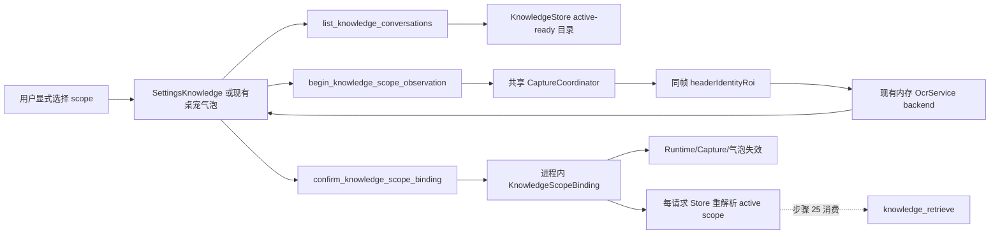

# 会话范围绑定、重名消歧与 bindingGeneration 技术方案

## 0. 方案设计原则（自检清单）

- **阶段与 run 边界**：本文件只设计步骤 24，run_id 为 `20260807-task-24-knowledge-scope-binding-generation`，dispatch_id 为 `aich8-zhuochong-desktop-pet-rag-27-steps-20260805-task-24`。本阶段不修改产品代码、不执行步骤 25 的 M2 模型编排、不推进后续 LOOF 阶段。
- **前置事实**：步骤 19 已提供 `SettingsKnowledge.svelte`、只读 archive importer、单一 `KnowledgeStore` 与安全重建；步骤 23 已提供唯一 `KnowledgeStore::knowledge_retrieve()`、三种 `KnowledgeScope`、active-ready 授权读取和 `same_conversation_boost` 集合不变约束。
- **最小新增面**：只新增一个进程内 `wechat/binding.rs`；其余改动落在现有 Store、捕获/OCR/runtime/commands、设置页和桌宠气泡入口。没有新窗口、后台监听、第二套数据库 owner、第二个捕获协调器或第二套 OCR 引擎。
- **默认拒绝**：启动后固定为 `unbound`；设置页和气泡均默认不勾选任何 scope。旧配置、上次提示 key、微信窗口标题、OCR 猜测、同名项和数据库内部 row id 都不能自动形成授权。
- **只读与手动边界**：只处理用户当前明确切回并确认的前台微信；只读可见窗口像素和用户选择的独立 `knowledge.sqlite`。不读取微信数据库/协议，不注入微信，不使用 UI Automation 输入、键鼠模拟、自动粘贴/发送、未选聊天、上传、MCP、Bot、search 或 Agent 工具。
- **谁来实现都不走样**：下面固定状态模型、DTO、代际规则、竞态处理、错误码和测试矩阵；实现阶段不得用标题字符串匹配、正文搜索或隐式全库 fallback 替代。

## 1. 背景与目标

### 1.1 当前程序状态

生产代码位于 `desktop/`，主体是 Tauri 2 + Rust + Svelte：

- `knowledge/store.rs` 是 `knowledge.sqlite` 唯一 SQL owner；active catalog 通过 `knowledge_catalog_state`、active import/index mapping 和 denial/provenance predicate fail closed。
- `knowledge/retrieve.rs` 已要求 `request_id + binding_generation + KnowledgeScope`，但当前 scope 的 `id` 仍直接按 `conversation_stable_id` 解析，跨 account 同值会歧义；设置页的 `scopeMode` 只是持久化下拉框，并不构成安全绑定。
- archive importer 已读取 `ConversationMetaV1.display_name/is_group/message_count`，但当前只校验 username/count，没有在 active 会话目录中安全发布这些显示信息；`knowledge_conversations.display_metadata_json` 已存在，可复用而无需 migration。
- `wechat/window_identity.rs` 已有不可序列化的 `WindowInstanceToken`、PID、窗口矩形、DPI、profile 和 `header_identity_roi`；通用 `title_hint` 只是一条清洗后的窗口标题提示，不能代表聊天身份。
- `wechat/capture.rs` 已从同一内存帧裁出 `chat_rgba` 与 `header_identity_rgba`；`CaptureCoordinator` 已序列化 Work Review/微信捕获并维护 `CaptureVersion`。
- `wechat/ocr.rs` 已通过 `MemoryOcrProvider -> OcrService::extract_windows_ocr_rgba()` 只在内存执行 Windows OCR；现有 `recognize()` 刻意只消费聊天 ROI，需要增加独立 header-only 分支，不能把 header 当回复正文。
- `WechatReplyRuntime`、`StateMachine`、气泡事件和复制/关闭命令已经使用 `requestId + suggestionGeneration + bindingGeneration` 校验，并已有按 binding 清除建议的基础方法；但还没有真正的进程内 binding owner。

### 1.2 技术目标（可验收）

1. `SettingsKnowledge.svelte` 与现有微信桌宠气泡入口都显示三个独立按钮：**绑定一个会话**、**选择多个会话**、**确认全库**；进入面板时零选中，上次 key 只能标为“历史提示”，不能预勾选或自动提交。
2. `KnowledgeStore::list_active_conversations()` 只返回 active-ready 会话的 `displayName`、`isGroup`、active 消息时间范围、active 消息数和稳定不透明 `scopeKey`；不得返回正文、sender、路径、source/export id、`knowledge_conversations.id` 或 manifest/hash。
3. 单会话必须点选一行并再次确认 header 线索；同名且 `isGroup + 时间范围 + 消息数` 仍相同的候选标为不可消歧，禁止单选绑定并返回 `KB_SCOPE_UNRESOLVED`。不得用 scopeKey 后缀诱导用户盲选。
4. 增加唯一进程内 `KnowledgeScopeBinding`：启动生成新 session nonce，初始 `unbound`，`bindingGeneration=0`；首次成功绑定递增到 1，以后每次窗口/header/矩形/profile/scope/active catalog/解析结果变化严格递增。
5. binding 只在内存保存 session nonce、不可序列化窗口 token/PID、header 线索、layout profile、当前矩形、单调 generation、observation version 和已确认 scope。配置只允许保存最近一次单选/多选的稳定不透明 scope keys 作为提示；禁止持久化 HWND/PID/header 授权/generation/session nonce/内部 row id/全库确认。
6. 绑定、检索前和模型传输前都重新读取前台窗口，并通过同一个 `CaptureCoordinator` 进行 header-only 内存观察。每次观察递增 `bindingObservationVersion`；同一可靠 header 不改变 `CaptureVersion`，变化则递增 binding generation、作废请求并清除旧 M2 气泡。
7. 每个 M2 请求都按 scopeKey 重新解析当前 active row。key 缺失、重复解析、catalog 改变、global 集合改变或 denial 导致不再可授权时返回 `KB_SCOPE_UNRESOLVED`，不得忽略未知 key、替换成同名项或扩大到全库。
8. header 不可靠时，每次请求必须在气泡中展示当前 scope 摘要并由用户再确认一次；没有一次性确认即 `KB_SCOPE_UNRESOLVED`。确认只对下一个请求有效，不能变成持久授权。
9. generation 变化后，旧 capture/OCR/retrieval/model 结果均无法进入下一阶段，已展示的旧 M2 建议无法复制且收到精确 clear 事件；M1 无 binding 的建议不受误伤。
10. `sameConversationBoost` 只在已解析的授权集合内部重排。没有可信当前单会话 key 时 effective boost 固定为 false；不得因 boost 添加会话或触发第二次检索。

### 1.3 明确非目标

- 不实现步骤 25 的 `generate_rag_reply(ModelKnowledgeContext)`、prompt 组装、模型调用或完整 M2 reply flow；本步骤只提供其必须消费的 binding snapshot、阶段复核和失效接口。
- 不新增 migration，不修改步骤 22 的 catalog 原子切换协议，不重写步骤 23 的 FTS/vector/RRF/token 预算。
- 不从 OCR 聊天正文、历史消息、微信通用窗口标题、avatar、sender 或模糊字符串匹配推断当前会话。
- 不持久化 scope 授权本身。`scopeMode` 旧字段只为兼容读取，normalize 后必须为 `None`，不能继续被设置页当授权使用。
- 不保证当前空 production profile 下的 Windows 真机成功；实现阶段的 macOS/合成测试不能写成真实 Windows/profile/OCR 验收通过。

## 2. 核心业务流程与边界

### 2.1 系统上下文



依赖方向固定为：UI command 只能拿脱敏 DTO；`KnowledgeStore` 仍是唯一 SQL owner；`KnowledgeScopeBinding` 只持有 Store 已解析的稳定 key、私有窗口身份和 header 线索，不持有 SQLite connection、模型或正文；header OCR 只能复用现有内存 backend。

### 2.2 三种显式绑定流程

#### A. 绑定一个会话

1. 用户点击“绑定一个会话”；UI 调用 `list_knowledge_conversations`，列表初始不选中，历史 hint 只显示小标签。
2. 用户点选一行。若前端按允许的五类信息分组后发现仍有同组重名项，UI 禁用确认；后端即使收到伪造请求也独立重算歧义并拒绝。
3. UI 提示用户手动切回目标微信窗口，复用现有 3 秒可取消准备交互；倒计时结束后调用 `begin_knowledge_scope_observation`。
4. 后端验证前台微信/profile，使用共享捕获协调器隐藏/恢复现有窗口，并只裁 `headerIdentityRoi`；内存 OCR 得到 header 线索。微信通用标题不参与。
5. UI 同屏显示“你选择的本地会话摘要 + 当前可见 header 线索 + 不自动识别声明”，用户再次点击确认。
6. `confirm_knowledge_scope_binding` 使用 `sessionNonce + expectedBindingGeneration + expectedObservationVersion + expectedCatalogGeneration + scopeKey` 做 CAS，Store 再次精确解析 active row；成功后 binding generation +1。
7. 选中项若 `isGroup=true` 可作为知识范围保存，但不能据此绕过实时回复的单聊 profile/验收门禁。

#### B. 选择多个会话

1. UI 允许显式选择 1—32 个 scopeKey；零项、重复项、未知项或超过 32 项拒绝。
2. 同名不可区分项可以作为一个明确的**集合**一起选择，但不能在集合中把其中一个默认为当前会话；没有可信当前单会话 key 时 effective `sameConversationBoost=false`。
3. 仍必须执行前台 header 观察和用户确认，因为 scope 授权只对用户当前明确选择的前台微信请求生效。
4. 后端按确定性 scopeKey 顺序冻结所选集合；任一 key 解析失败则整次失败，不做部分绑定。

#### C. 确认全库

1. UI 不预选全库。用户点击后先展示当前 active-ready 会话数量和 catalog generation，再弹出明确确认：“仅授权当前完整 active 集合；导入/重建变化后必须重确认”。
2. 用户切回微信并确认 header；后端冻结 `GlobalUserSelected + catalogGeneration + activeScopeDigest + conversationCount`。
3. 后续请求只有 catalog generation 和集合 digest 都相同时才可使用 `global_user_selected`。新增、删除、deny、重建或映射变化一律 generation +1、unbound，禁止全库静默扩大。
4. global 确认不写配置；重启后必须重新确认。

### 2.3 header-only 观察与阶段复核

新增私有 `capture_header_identity_observation()`，复用 `CaptureCoordinator::try_acquire()`、`WechatCaptureGuard`、`run_guarded_capture()` 和 `EphemeralCapturedFrame`，但只裁 header ROI：

1. 捕获 worker 前后都调用现有 `revalidate_foreground_wechat(previous)`，严格比较 HWND token、PID、bounds、DPI 和 profile。
2. 同一帧只产生 `HeaderObservationFrame`，不产生 `WechatCaptureSlices`，不调用 `next_capture_version()`。
3. `WechatOcrDispatcher::recognize_header()` 复用同一 `MemoryOcrProvider`/`OcrService`；返回私有 `HeaderIdentityClue`，永不构造 `OcrReadyReply`，永不进入聊天 OCR、检索 query 或模型 payload。
4. 每次成功或可分类失败的观察都通过 binding owner 严格增加 `bindingObservationVersion`。同一可靠 clue、同一 window/profile/bounds 时 generation 不变；clue 改变或窗口身份变化时 generation +1 并 unbound。
5. 步骤 25 在 `knowledge_retrieve` **之前**和模型 transport `.send()` **之前**分别调用 `revalidate_binding_for_stage(expectedGeneration)`。两次都重读前台窗口并重取 header；不能缓存第一次结果代替第二次。
6. 同 header 的第二次观察只更新 active M2 lease 的 observation version；它不替换主 `CaptureVersion`。变化则取消 lease，晚到结果按 stale 丢弃。

### 2.4 header 可靠性规则

- OCR 线索规范化只允许有界 Unicode 文本：CRLF 统一、控制字符删除、trim、最多 256 bytes/128 scalar；普通 trace 只记 outcome，不记文本/hash。
- `微信`、`WeChat`、`Weixin`、空白、只有标点/数字、超过上限或多段无法稳定规范化的结果标为 `unreliable`。`ForegroundWindowEvidence.title_hint` 即使等于联系人名也不得提升可靠性。
- 单段非通用 header 只有在用户看到并确认后，才能作为本 session 的“可复核线索”；它不是自动联系人识别，不与 `displayName` 做自动等值/模糊匹配。
- `unreliable` 可以完成 scope 设置，但 binding 标记 `requiresPerRequestConfirmation=true`。每次点击生成时，UI 必须再次展示 scope 摘要并调用 `confirm_knowledge_scope_for_next_request`；后端保存一次性 epoch，步骤 25 开始请求时原子消费。缺失、重复消费或观察版本变化均 `KB_SCOPE_UNRESOLVED`。
- 同标题不同 HWND、同 HWND header 变化、resize/DPI/profile 变化均由私有窗口证据先触发 generation；标题相同不能保活。

### 2.5 generation 变化与补偿

所有 mutation 先在 binding mutex 内计算 `BindingMutation`，释放锁后按固定顺序补偿，避免 binding/runtime/capture 锁交叉：

1. 使用 `checked_add(1)` 增加 generation；溢出即 fail closed，不使用 `saturating_add` 伪造“仍单调”。
2. 将 scope 置 `unbound` 或原子替换为新用户确认 scope；清除一次性 request confirmation。
3. `CaptureCoordinator::invalidate_current_capture()` 只推进主 capture 计数，使已有切片失效；header-only 同值观察不调用它。
4. `WechatReplyRuntime::invalidate_m2_binding(oldGeneration)` 取消匹配的 active M2 lease、使 OCR/retrieval/model completion 不能提交，并取出匹配的 presented suggestion；M1 lease/气泡不受影响。
5. 若有旧 M2 suggestion，返回其精确 `requestId + suggestionGeneration + bindingGeneration` clear payload，由 command 发既有 `avatar-bubble` 事件。前端只清相同三元组，不能误清新建议。
6. 普通日志只记 reason enum、旧/新 generation、是否清泡；不记 scopeKey、header、PID、HWND、正文或路径。

generation reason 固定为：`user_scope_changed`、`user_unbound`、`window_instance_changed`、`header_changed`、`bounds_changed`、`profile_changed`、`active_catalog_changed`、`scope_resolution_failed`、`session_reset`。观察同值不是 generation reason。

## 3. 数据模型设计

### 3.1 数据库：不新增 migration

复用现有 `knowledge_conversations.display_metadata_json`，只保存 archive `meta.json` 已声明且经过严格校验的：

```json
{
  "schemaVersion": "conversation-display-v1",
  "displayName": "...",
  "isGroup": false
}
```

- `displayName` 规范化后必须非空，最多 512 bytes/256 scalar；`isGroup` 为 schema 的 bool。`avatarPath`、exportedAt、路径、username/account/conversation 原始 ID 均不进入显示 JSON。
- `NewSource`/`StagingImport` 在 Rust 内存携带候选 display metadata；只有候选 import 在同一激活事务中成为 active 时，才更新 `display_metadata_json`。失败/staging/ready_candidate 不可覆盖旧 active 显示信息。
- 时间范围从 active mapping 对应的 `knowledge_message_normalizations.created_at_ms MIN/MAX` 读取；消息数从 active import generation/membership 交叉复核，不信任 UI 或旧 meta count。
- 因列已存在且内容是派生显示元数据，本步骤不修改 SQL schema version，不发布 `0006`。

### 3.2 稳定不透明 scopeKey

内部继续使用真实结构 `StableConversationKey { account_stable_id, conversation_stable_id }`，Tauri DTO 和配置只出现：

```text
scopeKey = "ksc1_" + hex(SHA-256(
  "knowledge-scope-key-v1\0" + account_stable_id + "\0" + conversation_stable_id
))
```

- 编码确定、跨 `knowledge_conversations.id` 重建稳定、不可从 UI 直接看出 account/conversation 原值。
- Store 列表和解析都在 active-ready mapping 上计算；解析 scopeKey 时必须得到恰好 1 个 row，0 个或碰撞/重复均 `KB_SCOPE_UNRESOLVED`。
- scopeKey 不是权限 token；每次请求仍重读 active catalog、denial 和 mapping。
- UI 可显示 `…` 加末 8 位作为“稳定标识”，但单会话消歧仍只允许使用 displayName/群标记/时间/数量；若这些信息相同，末尾 key 不得用来放开单选。

### 3.3 Store DTO

```rust
#[derive(Serialize)]
#[serde(rename_all = "camelCase")]
struct KnowledgeConversationOption {
    scope_key: String,
    display_name: String,
    is_group: bool,
    started_at_ms: Option<i64>,
    ended_at_ms: Option<i64>,
    message_count: u64,
}

#[derive(Serialize)]
#[serde(rename_all = "camelCase")]
struct KnowledgeConversationOptions {
    catalog_generation: u64,
    conversations: Vec<KnowledgeConversationOption>,
}
```

会话行 DTO 严格只有题目允许的五类信息：稳定 key、displayName、群标记、时间范围、消息数。response 外层只带 CAS 所需的 catalog generation，不向 UI 暴露 active digest。`singleBindable/ambiguityCount/hinted` 不从后端新增字段：前端只用这五类允许信息重算显示态，后端在确认时独立重算同一歧义规则；历史 hint 也只由前端把配置 keys 与当前 scopeKey 做集合相交后显示。未知 hint 静默不展示，但不能自动删除用户配置或自动替换。

### 3.4 进程内 KnowledgeScopeBinding

以下核心类型均不得派生 `Serialize/Deserialize`，不得写 trace/content/config/SQLite：

```rust
struct KnowledgeScopeBinding {
    inner: Mutex<BindingInner>,
}

struct BindingInner {
    session_nonce: Uuid,
    binding_generation: BindingGeneration,
    observation_version: BindingObservationVersion,
    state: BindingState,
    pending_observation: Option<PendingHeaderObservation>,
    next_request_confirmation: Option<OneShotScopeConfirmation>,
}

enum BindingState {
    Unbound,
    Bound(BoundScope),
}

struct BoundScope {
    window: BindingWindowIdentity, // WindowInstanceToken + PID + bounds + DPI
    header: HeaderIdentityClue,
    profile_id: String,
    profile_version: String,
    scope: ResolvedScopeBinding,
    catalog_generation: u64,
    active_scope_digest: String,
    requires_per_request_confirmation: bool,
}

enum ResolvedScopeBinding {
    Conversation { scope_key: String },
    Selected { scope_keys: Vec<String> },
    GlobalUserSelected { conversation_count: u64 },
}
```

启动 `Default` 每次调用 `Uuid::new_v4()`；即使配置有 hints 也保持 `Unbound`。状态 DTO 可以瞬时返回 session nonce、generation、observation、bound kind、选中数量和是否需要重确认，但不得返回 PID/HWND/header 历史或内部 row id；header 文本只出现在当前 pending observation response，确认/取消后不再由 status 回传。

### 3.5 配置持久化

在 `KnowledgeConfig` 只新增：

```rust
#[serde(default, alias = "last_scope_hint_keys")]
pub last_scope_hint_keys: Vec<String>, // 0..=32, ksc1_ + 64 hex, 去重排序
```

- `scope_mode` 保留兼容反序列化但 normalize 后强制 `None`；保存文件不把它解释为授权。
- 成功确认 single/selected 后，UI 可显式保存对应 keys 为 hints；global、session nonce、header、window、generation 和 database row id 永远不保存。
- 非法/重复/超过 32 个 hints 在 normalize 时丢弃；重启仍不预选。

## 4. 接口定义（API 契约）

### 4.1 Tauri commands

#### `list_knowledge_conversations()`

- 输入：无。
- 输出：`KnowledgeConversationOptions`。
- 错误：无完整 active catalog 为 `KB_NOT_READY`；SQL/metadata/计数不一致为 `KB_RETRIEVAL_FAILED`。
- 安全：只读 Store；无正文、路径、内部 ID。

#### `get_knowledge_scope_binding_status()`

```json
{
  "sessionNonce": "uuid",
  "bindingGeneration": 3,
  "bindingObservationVersion": 8,
  "state": "unbound|bound",
  "scopeKind": "conversation|selected_conversations|global_user_selected|null",
  "selectedCount": 0,
  "requiresPerRequestConfirmation": false
}
```

#### `begin_knowledge_scope_observation(input)`

```json
Request: {
  "sessionNonce": "uuid",
  "expectedBindingGeneration": 3
}
Response: {
  "bindingGeneration": 3,
  "bindingObservationVersion": 9,
  "headerClue": "当前可见线索",
  "headerReliable": true,
  "profileLabel": "受支持布局档案"
}
```

- session/generation 过期为 `WX_REQUEST_STALE`；非前台/profile/capture/OCR 使用现有稳定 `WX_*`。
- response 不含 window token、PID、矩形、路径或通用 title。

#### `confirm_knowledge_scope_binding(input)`

```json
Request: {
  "sessionNonce": "uuid",
  "expectedBindingGeneration": 3,
  "expectedObservationVersion": 9,
  "expectedCatalogGeneration": 12,
  "scope": {
    "kind": "conversation|selected_conversations|global_user_selected",
    "keys": ["ksc1_..."]
  },
  "headerConfirmed": true,
  "globalConfirmed": false
}
```

- `conversation` 必须恰好 1 key，且后端用允许的五类字段重算后仍可唯一消歧；`selected` 必须 1—32 个唯一 key；`global` 必须 keys 为空且 `globalConfirmed=true`。
- 后端忽略任何 displayName/header 文本回传，使用 pending observation 和 Store 当前解析结果。
- 成功返回最新 binding status；任一 CAS/catalog/key/header 条件失败都不保留半绑定。

#### `confirm_knowledge_scope_for_next_request(input)`

- 只允许当前 binding 为 `bound + requiresPerRequestConfirmation`；再次执行 header observation并展示 scope 摘要后，写入一个 `(sessionNonce, generation, observationVersion, oneShotEpoch)`。
- 步骤 25 的无输入生成 command 原子消费；不能由前端指定 requestId、query 或模型参数。未消费前 binding 变化自动清除。

#### `clear_knowledge_scope_binding(input)`

- CAS 校验 session/generation，递增 generation、置 unbound、执行统一失效/清泡；不会删除 hints、知识库或原始导出。

### 4.2 Store 内部接口

```rust
fn list_active_conversations(&self)
  -> Result<ActiveConversationCatalog, ContractError>;

fn resolve_scope_keys(
  &self,
  expected_catalog_generation: u64,
  scope: &RequestedScopeKeys,
) -> Result<ResolvedActiveScope, ContractError>;
```

`ResolvedActiveScope` 携带步骤 23 所需的 `KnowledgeScope`、可选可信 current key、catalog generation/digest/count，但不序列化。步骤 23 的 `resolve_retrieval_scope()` 改为按 `scopeKey -> account+conversation` 精确解析，而不是只按 `conversation_stable_id`；global 仍走 active mapping，但调用方必须先通过 binding 的 frozen catalog/digest 检查。

步骤 23 的 `bound_conversation_id` 收窄为 `Option<String>`：single 为 `Some(scopeKey)`；selected/global 没有经用户确认的当前单会话时为 `None`，effective boost=false。检索器只在 `Some` 时执行同会话授权校验和 boost；任何 boost 前后 candidate conversation/chunk 集合仍必须相等。

### 4.3 步骤 25 必须调用的内部 gate

```rust
fn begin_m2_request(
  &self,
  store: &KnowledgeStore,
) -> Result<BindingRequestSnapshot, ContractError>;

async fn revalidate_for_stage(
  &self,
  expected: &BindingRequestSnapshot,
  stage: BindingStage, // BeforeRetrieval | BeforeModelTransport
) -> Result<BindingObservationVersion, ContractError>;
```

- `begin_m2_request` 每次按稳定 key 重解析 active row，并在 unreliable 时消费一次性确认；失败固定 `KB_SCOPE_UNRESOLVED`。
- 两个 stage gate 都重读前台并 header-only 捕获。步骤 25 必须在同一 `requestId` 的 `knowledge_retrieve` 前、以及同一 request 的模型 `.send()` 前调用；失败不得进入/继续模型，不得降级 M1。
- request snapshot 包含 generation/observation/scope，但不包含 header 文本、PID、HWND 或 SQLite row id。

## 5. 核心逻辑详解

### 5.1 active 会话目录与重名消歧

1. 在一次 Store reader 中冻结 active catalog generation/index/snapshot。
2. 只 join active index mapping、`conversation.active_import_generation_id` 和 active import；denied/retired/missing provenance 不得列出可授权会话。
3. 从 active messages 聚合 `MIN/MAX(created_at_ms)`、membership count；与 import generation `message_count` 不一致整次失败。
4. 解析 `display_metadata_json` 必须严格 schema；缺失/旧 `{}` 不能用正文猜名，可显示固定“未提供名称”；它不能用于 single binding，仍可作为用户明确多选集合的一部分。
5. 计算 scopeKey、按 `displayName normalized + isGroup + start + end + count` 分组。组大小大于 1 时，前端显示为不可单选，后端确认也固定拒绝。
6. 按 normalized displayName、isGroup、start、end、scopeKey 确定排序；只在 DTO 最后附稳定 key，不返回内部 row id。

### 5.2 CAS 绑定与用户 scope 变化

```text
读取 pending observation
-> 校验 session/generation/observation/catalog
-> Store 精确解析全部 keys 或冻结 global digest
-> 后端重算单选歧义
-> 校验 headerConfirmed/globalConfirmed
-> generation checked_add
-> 原子写 BoundScope
-> 释放 binding lock
-> invalidate capture/runtime/old bubble
```

重复点击带旧 generation 会返回 stale，不会二次推进 generation。用户从 single 改 selected、selected 改 global 或改变集合均视为新的授权，generation 必须增加，即使 header/window 未变。

### 5.3 每请求解析与数据库重建

- single/selected：把 frozen scopeKeys 全部交给 Store，在当前 active mapping 中逐一算 scopeKey 并要求一一对应；不持有/复用 `knowledge_conversations.id`。
- global：重读 catalog generation、active scope digest 和 conversation count，三者必须等于确认时值。
- 原子重建即使保留相同稳定 keys，也会改变 catalog generation；首次观察到变化时 generation +1、unbound，旧建议清除。用户重新确认后才可继续，保证“重建不误绑”。
- key 不存在、碰撞、被 deny、active mapping 不完整或 metadata/计数损坏时，generation +1、unbound、`KB_SCOPE_UNRESOLVED`。不得挑同名替代项、丢掉坏 key 后继续或自动 global。

### 5.4 捕获/OCR/retrieval/model 晚到结果

- capture：generation 变化推进 coordinator capture counter，旧 `CaptureVersion` 不能通过 `is_current_capture()`。
- OCR：M2 lease 必须同时匹配 request/lease/capture/binding generation；取消 receiver 唤醒等待中的 capture，已完成 OCR 也在 transition 前重验。
- retrieval：`RetrievedReply` 已携带 request/binding generation；runtime completion 还要匹配最新 observation。Store 内部 catalog 切换继续按步骤 23 返回失败。
- model：传输前第二次 header gate；调用完成后再次以 request/suggestion/binding/observation 接受结果。旧结果不能 publish。
- suggestion：binding mutation 从 runtime 取出精确旧建议并 emit clear；旧 copy/dismiss input 因 runtime 已无匹配三元组返回 `WX_REQUEST_STALE`。

### 5.5 群聊与 sameConversationBoost

- archive `isGroup=true` 仅影响知识会话显示和范围选择，不能推导当前微信窗口类型。
- compatibility profile 增加明确且 probe-backed 的 `reply_surface="single_chat"` 契约；缺失/非 single profile 不允许实时 M2。测试 profile 同步更新，production catalog 未取得真实证据时继续为空。
- group scope 可用于 selected/global 的知识检索；若用户把 group 项作为当前 single binding，实时生成 gate 返回 `WX_GROUP_CHAT_UNSUPPORTED`，但不会删除知识数据。
- 只有 single binding 的 scopeKey 可以作为 `bound_conversation_id=Some`。selected/global 默认 None；配置开了 boost 也以 effective false 传给步骤 23。boost 永远不扩大授权集合。

## 6. 非功能性设计

### 6.1 性能与资源

- conversation list 只扫描 active mapping 和聚合索引，不读 chunk content/FTS/embedding；scopeKey 和歧义分组在有界 DTO 集合上计算。
- selected 上限 32 与步骤 23 一致。global 只保存 digest/count，不在 binding 中复制正文或 SQLite rows。
- header-only 复用单 permit，busy 时立即 `WX_BUSY`，不排队阻塞 Work Review 记录；不新增后台轮询。
- UI 仅在面板打开、用户点击观察/确认或显式生成前刷新，不监听微信窗口/消息。

### 6.2 可用性与降级

- header OCR unavailable/failed 不自动切标题匹配；进入 unreliable + 每请求确认，若用户不确认则 unresolved。
- Store/catalog/metadata 不完整没有 M1 fallback。M2 feature 下 `KB_*` 终止；M1 构建保持原手动流程。
- 绑定 command 失败不更改当前有效 binding；检测到外部事实变化则必须 unbound，因为继续旧授权更危险。

### 6.3 安全与隐私

- SQL 全部参数绑定；scopeKey hash 只用于不透明稳定映射，不作为权限凭证。
- header 原文只在当前进程的 pending/bound state 和用户确认 DTO 中存在；不写普通 trace、content retention、config、SQLite、日志或模型。
- 静态检查禁止 `WindowInstanceToken`/`KnowledgeScopeBinding` serde、禁止 config/trace 出现 `hwnd|pid|headerClue|bindingGeneration|sessionNonce` 字段、禁止用 `title_hint` 做 scope 比较。
- UI 不显示正文、sender、source/export/path/hash/manifest/内部 ID；测试 fixture 全部虚构脱敏。

### 6.4 并发与锁顺序

- Store reader 不在 binding lock 内执行；流程为“读 binding 期望值 -> Store 解析 -> CAS 回写 binding”。CAS 失败丢弃解析结果。
- binding mutation 返回纯值后再调用 runtime/coordinator/app emit；三者互不嵌套锁。
- `CaptureCoordinator` permit 生命周期覆盖隐藏、worker join、前后 foreground revalidate 和恢复；超时/取消也必须 join 后恢复。

## 7. 测试方案

### 7.1 Rust 行为测试

| 用例 | 必须断言 |
| --- | --- |
| 启动/重启 | 每个 `KnowledgeScopeBinding::default()` nonce 不同、state=unbound、generation=0；存在 hints 也不绑定。 |
| 三种显式 scope | single 精确 1、selected 1—32、global 双重确认；空/重复/未知/过量/伪造 catalog 全拒绝。 |
| active 列表脱敏 | DTO 只有允许字段；只列 active-ready；无 body/sender/path/source/export/row id/hash。 |
| display metadata 生命周期 | 候选/失败导入不改旧显示；与 import activation 同事务更新；重放保持确定。 |
| 重名消歧 | 同名但群标记/时间/count 不同可点选；四项仍相同则 single 前后端都拒绝，不自动挑 key。 |
| opaque key | 跨内部 row id 重建 key 不变；跨 account 同 conversation stable id 得到不同 key；0/2 row 解析失败。 |
| 同标题不同 HWND | 即使 header/title 完全相同，window token/PID 变化也 generation+1、unbound。 |
| header 变化 | 同 window/profile 下 clue 变化 generation+1；通用标题不能保活；同可靠 clue 只 observation+1。 |
| resize/profile/window switch | bounds、DPI、profile/version、foreground instance 任一变化都递增 generation 并清一次。 |
| header-only capture | 与普通捕获共用 semaphore/guard；不调用 `next_capture_version`；不把 chat ROI/header 送日志或模型。 |
| unreliable header | 每请求 one-shot 确认只能消费一次；缺失/旧 observation/重复消费均 `KB_SCOPE_UNRESOLVED`。 |
| catalog 重建 | catalog/digest 变化使 generation+1、unbound；相同 displayName 或新 row id 不误绑；global 不静默扩大。 |
| scope 修改 | single/selected/global 或集合任一变化都 generation+1；旧 active request 和气泡失效。 |
| 晚到 capture/OCR/retrieval/model | 代际变化后各阶段 completion 都 stale，model transport 在前置 gate 失败时 0 次，旧建议不能 publish/copy。 |
| 精确清泡 | 只清旧 M2 三元组；新建议和 M1 无 binding 建议不受影响。 |
| boost | single 当前 key 必在授权 scope；selected/global effective false；开启前后 candidate 集合完全相同。 |
| 群聊 | group 可列出/多选/全库；作为实时当前会话时 `WX_GROUP_CHAT_UNSUPPORTED`，不调用 retrieval/model。 |
| generation 溢出 | `u64::MAX` 时 fail closed，不保留半 mutation、不使用饱和后相等值。 |

### 7.2 前端测试

- 扩展 `SettingsWechatKnowledge.test.js`：设置页出现三个独立操作，`scopeMode` 下拉不再授权，初始 checkbox 全 false，hint 只显示不勾选。
- 扩展 `WechatExplicitTrigger.test.js` 与 `avatarWindow.test.js`：气泡也有三入口；绑定/生成倒计时可取消；unbound 不调用 M2；global 有二次确认；同名不可区分项禁用 single。
- 模拟 generation clear 事件：旧 suggestion 三元组被清，新 suggestion 不被旧事件清；旧 copy command 错误只显示安全 `KB_SCOPE_UNRESOLVED/WX_REQUEST_STALE` 文案。
- i18n 只新增 zh-CN/en canonical keys，其他 locale 走现有默认 locale fallback；测试禁止页面露出 key 字符串。

### 7.3 静态门禁

新增 `kaifa/kaifa_test/verify_knowledge_scope_binding.py`，只验证稳定边界，不代替行为测试：

- 唯一 `KnowledgeScopeBinding` 位于 `wechat/binding.rs`，main 只 manage 一个实例。
- Store 列表 SQL 不选择 content/sender/path/source/export/manifest/internal conversation id 到 DTO。
- `WindowInstanceToken`、binding inner 无 serde；配置只允许 `lastScopeHintKeys`，无 window/header/generation/session/internal id。
- header 路径使用 `header_identity_roi` + `MemoryOcrProvider/OcrService`，不使用 `title_hint` 作为身份，不调用文件 OCR/Paddle/PowerShell/网络。
- 两个 UI 入口都包含三种显式操作和 unset 初态；不存在自动 global、自动同名选择、监听微信消息。
- binding 模块、commands 和 UI 不包含微信注入/协议/DB/UIA input/keyboard/mouse/paste/send/upload/MCP/Bot/search/Agent 能力。

### 7.4 建议实施阶段命令（phase 2 执行，本阶段不运行）

```bash
python3 -B kaifa/kaifa_test/verify_knowledge_scope_binding.py --project-root .
cargo test --manifest-path desktop/src-tauri/Cargo.toml 'wechat::binding::tests' --no-default-features --features 'wechat-contract-check,wechat-m2'
cargo test --manifest-path desktop/src-tauri/Cargo.toml 'wechat::runtime::tests' --no-default-features --features 'wechat-contract-check,wechat-m2'
cargo test --manifest-path desktop/src-tauri/Cargo.toml 'knowledge::store::tests' --no-default-features --features 'wechat-contract-check,wechat-m2'
cargo test --manifest-path desktop/src-tauri/Cargo.toml 'knowledge::retrieve::tests' --no-default-features --features 'wechat-contract-check,wechat-m2'
cargo test --manifest-path desktop/src-tauri/Cargo.toml knowledge:: --no-default-features --features 'wechat-contract-check,wechat-m2'
cargo test --manifest-path desktop/src-tauri/Cargo.toml wechat:: --no-default-features --features 'wechat-contract-check,wechat-m2'
cargo check --manifest-path desktop/src-tauri/Cargo.toml --no-default-features --features 'wechat-contract-check,wechat-m2'
(cd desktop && node --test src/routes/settings/SettingsWechatKnowledge.test.js src/routes/avatar/WechatExplicitTrigger.test.js src/lib/components/Avatar/avatarWindow.test.js src/lib/utils/errorDisplay.test.js)
(cd desktop && npm run build)
rustfmt --edition 2021 --check desktop/src-tauri/src/wechat/binding.rs desktop/src-tauri/src/wechat/runtime.rs desktop/src-tauri/src/wechat/ocr.rs desktop/src-tauri/src/wechat/window_identity.rs desktop/src-tauri/src/knowledge/store.rs desktop/src-tauri/src/knowledge/retrieve.rs desktop/src-tauri/src/knowledge/commands.rs
git diff --check -- desktop kaifa/kaifa_test kaifa/kaifa_personnel/mingling.md
```

真实 Windows 前台微信、冻结 profile、header OCR 和窗口切换 UAT 在本步骤实现后仍单独记录为 `not-run` 或真实结果；不得用合成 ROI/macOS build 代替。

### 7.5 Given / When / Then 验收

1. **无 scope**：Given 新进程或已清绑定，When 用户点击 M2 生成，Then 返回 `KB_SCOPE_UNRESOLVED`，capture/retrieval/model 均为 0。
2. **重名**：Given 两个会话的允许显示字段完全相同，When 用户尝试 bind one，Then UI 禁用且后端拒绝，不自动选择任一 key。
3. **重建**：Given 已绑定 scope，When active catalog 原子切换，Then generation 增加、binding unbound、旧建议清除；同名新 row 不被替代绑定。
4. **重启**：Given 上次配置保存 hint keys，When 重启，Then新 nonce、unbound、零预选；首次 M2 必须重新观察和确认。
5. **窗口/会话变化**：Given 已绑定，When HWND、header、bounds 或 profile 任一变化，Then旧 capture/OCR/retrieval/model/suggestion 均 stale，旧建议不可复制。
6. **全库不扩张**：Given 用户确认 catalog N 全库，When导入新增会话形成 catalog N+1，Then请求 unresolved 且要求重确认，不静默包含新会话。
7. **header 不可靠**：Given header OCR 为空/通用，When 用户没有为本次请求再确认，Then `KB_SCOPE_UNRESOLVED`；确认只授权一次。
8. **模型前复核**：Given retrieval 已成功，When模型发送前窗口切换，Then transport 0 次且不降级 M1。
9. **群聊边界**：Given group conversation 被选择为知识范围，When只做知识目录操作，Then允许；When尝试不满足 single profile 的实时回复，Then `WX_GROUP_CHAT_UNSUPPORTED`。

## 8. 附录

### 8.1 复用与原创映射

| 能力 | 复用真实代码 | 本步骤最小动作 |
| --- | --- | --- |
| active 会话与稳定身份 | `KnowledgeStore`、`StableConversationKey`、active mapping | 增加脱敏列表、opaque scopeKey 和每请求解析；不新增 DB owner。 |
| 显示元数据 | `ConversationMetaV1`、既有 `display_metadata_json` | 在 candidate activation 时原子发布 displayName/isGroup；无 migration。 |
| scope 检索 | `KnowledgeScope`、`knowledge_retrieve()` | scope id 改为 Store opaque key 精确解析；global 受 binding catalog/digest 冻结。 |
| 窗口身份 | `WindowInstanceToken`、`WechatWindowIdentity`、`revalidate_foreground` | 只增加 backend-private binding snapshot/getter；通用 title 不参与。 |
| header ROI | `header_identity_roi`、同帧 crop primitive | 增加只裁 header 的观察路径；不复制截图算法。 |
| OCR | `MemoryOcrProvider`、`OcrService::extract_windows_ocr_rgba` | 同 dispatcher 增加 header-only result；不新增引擎/文件/进程。 |
| 捕获并发 | `CaptureCoordinator`、`WechatCaptureGuard` | 复用 permit；header observation 不分配 CaptureVersion。 |
| 请求/气泡失效 | `WechatReplyRuntime`、StateMachine、三元组 copy gate | 增加统一 M2 binding invalidation 和 observation 更新；M1 不变。 |
| UI | `SettingsKnowledge.svelte`、`AvatarWindow.svelte`、`AvatarPopover.svelte`、confirm/toast/i18n | 在现有表面内增加三操作和 transient picker；不创建新窗口。 |

### 8.2 风险与回滚

| 风险 | 控制 | 回滚 |
| --- | --- | --- |
| display metadata 提前覆盖 active | 只在 candidate activation transaction 更新；失败测试 | 回滚 metadata 传递，旧 active JSON 保持。 |
| hash key 被误当权限 | 每请求 active/denial/mapping 重解析；0/2 row fail closed | 停用绑定 UI，不改 knowledge.sqlite schema。 |
| header OCR 抖动频繁解绑 | 用户确认 + observation/generation 分离；不做模糊容错 | 将 header 标为 unreliable，退回每请求确认，不自动标题匹配。 |
| 清泡误伤新建议 | runtime 返回精确旧三元组，前端同三元组才清 | 关闭主动 clear，copy gate 仍拒绝旧建议。 |
| global 在重建后扩大 | 冻结 catalog generation + digest + count | global 置 unbound，用户改用明确 selected。 |
| 文件改动面过大 | 仅一个新 binding 模块，其余薄扩展现有 owner | 回滚本步骤代码/配置/UI；无 migration/原始导出操作。 |

回滚只撤销步骤 24 的 binding、commands、UI、display metadata 发布和测试；`knowledge.sqlite` schema 不变，不删除原始导出、不删除独立知识库、不回滚步骤 19/23 已发布能力。

## 9. 代码实施修改顺序

1. **先收敛 Store 可见目录**：在 `archive_importer.rs`/`store.rs` 让 display metadata 只随 active activation 发布；实现 active conversation DTO、opaque scopeKey、歧义分组和精确解析。验证：脱敏列表、候选不可见、重名和 rebuild 行为测试。
2. **新增唯一进程内 binding owner**：创建 `wechat/binding.rs`，实现 nonce、unbound/bound、generation/observation、CAS、one-shot confirmation 和 Store 每请求解析；在 `wechat/mod.rs`/`main.rs` 只 manage 一份。验证：重启、scope 修改、溢出、catalog 变化。
3. **复用 header 捕获与 OCR**：薄扩展 `capture.rs`、`runtime.rs`、`ocr.rs`、`window_identity.rs`，实现同 coordinator 的 header-only capture 和用户可确认 clue；绝不使用 title 代替。验证：同帧 ROI、无 CaptureVersion 替换、同 HWND/header 与不同 HWND 路径。
4. **接入统一失效**：扩展 runtime/state machine 的 M2 observation 更新、active lease cancel、精确 suggestion take/clear 和 capture invalidation。验证：capture/OCR/retrieval/model 晚到结果及旧 copy 全 stale，M1 不受影响。
5. **增加最小 command 面**：Store list command 与 binding status/observe/confirm/one-shot/clear commands，注册到现有 handler；扩展 `KB_SCOPE_UNRESOLVED` 安全文案。验证：DTO deny unknown fields、CAS、防伪造和错误码。
6. **替换两个 UI 的占位 scope 控件**：设置页移除授权型 `scopeMode` 下拉，设置页和现有气泡共用同一轻量 picker/状态 helper，提供三个显式操作、零默认、历史 hint、不可靠 header 每请求确认和全库二次确认。不得新增微信监听。
7. **最小配置兼容**：`KnowledgeConfig` 只增加 `lastScopeHintKeys`，旧 `scopeMode` normalize 为 None；Settings 默认值同步。验证：序列化无禁止字段、重启 unbound、hints 不预选。
8. **补齐行为与静态证据**：增加 scoped Rust/Node/static tests，按实际命令回填 `mingling.md`、`kaifa_test/test.md` 和本 run 的时间戳 `kaifa_log`；真实 Windows 未跑则保持 not-run。
